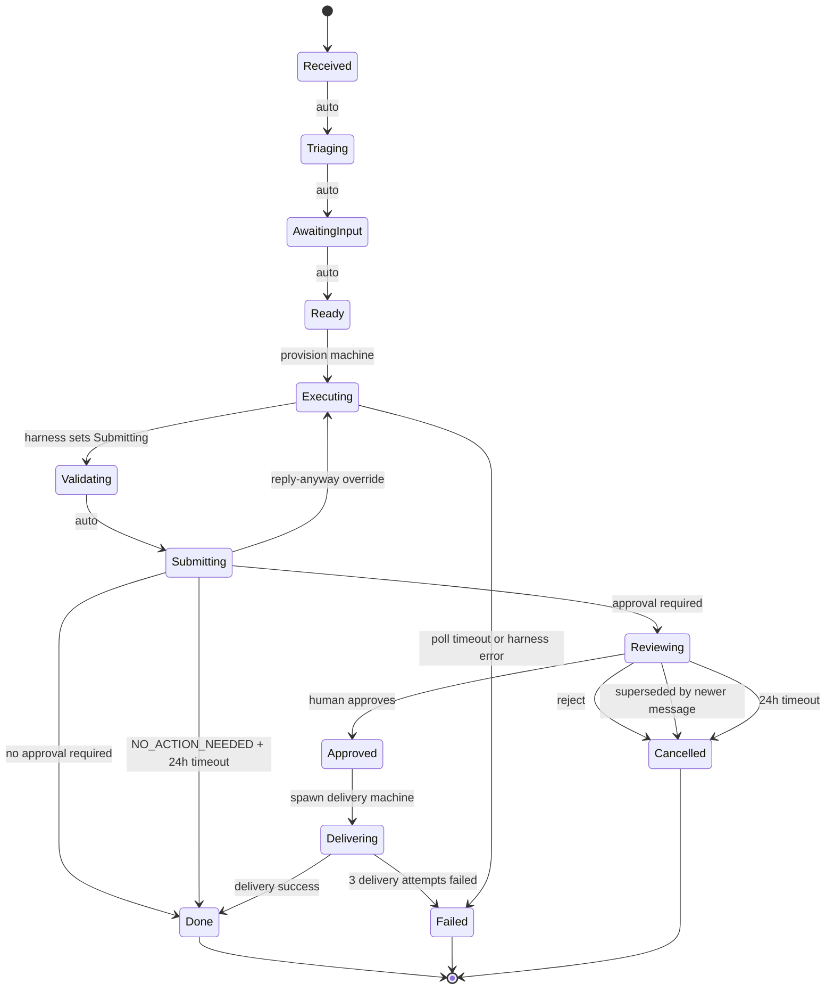

# Lifecycle States & Transitions — Verification Notepad

## Source Files Verified

- `src/inngest/employee-lifecycle.ts` (1070 lines) — full state machine implementation
- `prisma/schema.prisma:451-469` — `PendingApproval` model definition
- `docs/2026-04-24-1452-current-system-state.md:123-158` — old section for comparison

---

## Current State

### State Machine (Text)

```
Received → Triaging* → AwaitingInput* → Ready → Executing → [harness sets Submitting]
→ Validating* → Submitting → [classification check]
  ├─ NO_ACTION_NEEDED: hold at Submitting, wait for reply-anyway event
  │    ├─ timeout (24h): → Done
  │    └─ reply-anyway received: → Executing (re-draft) → Submitting → Reviewing
  └─ normal: → [supersede check] → Reviewing → [wait approval event]
       ├─ approve: → Approved → Delivering → Done (up to 3 delivery retries)
       ├─ reject: → Cancelled (+ posts feedback prompt in thread)
       ├─ superseded: → Cancelled
       └─ timeout (24h): → Cancelled
```

Short-circuit: `Submitting → Done` (when `risk_model.approval_required: false`)

`*` = auto-pass (transit immediately, no blocking)

### All Task Statuses Set by Lifecycle

Ordered by patchTask calls in the file:

| Status          | Line(s) | Transition From                                        |
| --------------- | ------- | ------------------------------------------------------ |
| `Triaging`      | 108     | `Received`                                             |
| `AwaitingInput` | 116     | `Triaging`                                             |
| `Ready`         | 123     | `AwaitingInput`                                        |
| `Executing`     | 130     | `Ready`                                                |
| `Failed`        | 300     | `Executing` (poll timeout)                             |
| `Validating`    | 318     | `Submitting` (set by harness)                          |
| `Submitting`    | 325     | `Validating`                                           |
| `Done`          | 333     | `Submitting` (no approval required)                    |
| `Done`          | 404     | `Submitting` (NO_ACTION_NEEDED + 24h timeout)          |
| `Executing`     | 419     | `Submitting` (reply-anyway override, re-draft)         |
| `Reviewing`     | 606     | `Submitting`                                           |
| `Cancelled`     | 693     | `Reviewing` (24h approval timeout)                     |
| `Approved`      | 711     | `Reviewing`                                            |
| `Delivering`    | 715     | `Approved`                                             |
| `Failed`        | 789     | `Delivering` (archetype missing delivery_instructions) |
| `Delivering`    | 868     | `Delivering` (retry on delivery failure)               |
| `Failed`        | 873     | `Delivering` (3 delivery attempts exhausted)           |
| `Cancelled`     | 925     | `Reviewing` (superseded)                               |
| `Cancelled`     | 1053    | `Reviewing` (rejected)                                 |

Note: `Done` (line 404) uses `logStatusTransition(..., 'Done', 'Submitting')` — logged as coming from Submitting even though task was held at Submitting during NO_ACTION_NEEDED wait.

### Terminal States

- **`Failed`**: (a) poll-completion timeout after 60 polls × 15s = 15 min of no `Submitting`/`Failed` from harness; (b) harness sets `Failed` directly (SIGTERM, OOM, unhandled error); (c) archetype missing `delivery_instructions`; (d) delivery machine failed all 3 attempts
- **`Cancelled`**: (a) human rejects approval; (b) 24-hour approval timeout (`waitForEvent` returns null); (c) superseded by a newer task for the same `conversation_ref`
- **`Done`**: (a) delivery machine marks `Done` after successful guest delivery; (b) `approval_required: false` short-circuit from `Submitting`; (c) `NO_ACTION_NEEDED` classification + 24h timeout (no reply-anyway received)

---

### Delivery Mechanism (PLAT-05 — implemented)

On approval (`action === 'approve'`):

1. Lifecycle sets `Approved` then immediately `Delivering`
2. Spawns a new Fly.io machine with `EMPLOYEE_PHASE: 'delivery'` env var (delivery harness)
3. Polls for `Done` or `Failed` (max 20 polls × 15s = 5 min per attempt)
4. Up to **3 retry attempts** on failure; between retries, resets status back to `Delivering`
5. After 3 failures: marks `Failed`, updates Slack message with error
6. On success: updates Slack message to "Sent to guest", clears `pending_approvals` row

This is **not inline Slack posting** — it is a dedicated delivery machine (PLAT-05 complete).

---

### Message Superseding (GM-11 — implemented)

After deciding approval is required (`skipApproval: false`), the `check-supersede` step runs:

1. Reads `deliverable.metadata.conversation_ref` (identifies the Hostfully guest conversation)
2. Calls `getPendingApproval(tenantId, conversationRef)` against `pending_approvals` table
3. If a previous task exists for that `conversation_ref`:
   - Checks if old task is still `Reviewing`
   - If yes: fires `employee/approval.received` with `action: 'superseded'` to unblock old lifecycle; old task transitions to `Cancelled`
   - Updates old task's Slack card to show "⏭️ Superseded" (via `buildSupersededBlocks()`)
   - If old task already acted on (not Reviewing): clears stale `pending_approvals` entry
4. New task then sets `Reviewing` and tracks itself in `pending_approvals`

**`pending_approvals` fields**: `id`, `tenant_id`, `thread_uid` (=conversation_ref), `task_id`, `slack_ts`, `channel_id`, `created_at`, `reminder_sent_at`, `urgency`, `guest_name`, `property_name`

The `@@unique([tenant_id, thread_uid])` constraint enforces one pending approval per conversation per tenant.

---

### Rejection Feedback Loop (GM-17 — implemented)

On `action !== 'approve'` and `action !== 'superseded'` (i.e., rejection):

1. If `rejectionReason` provided:
   - Stores in `task.metadata.rejectionReason`
   - Stores in `feedback` table as `feedback_type: 'rejection_reason'`
2. Sets `task.metadata.rejection_feedback_requested: true` and `rejection_user_id` — these flags let the interaction handler route subsequent thread replies as rejection feedback
3. Posts thread reply in approval message thread: _"Got it, @user. What should I have done differently? (Reply here — I'll learn from it.)"_
4. Updates Slack card to "❌ Rejected by @user"
5. Clears `pending_approvals` row
6. Sets status `Cancelled`

---

### Reply Anyway Flow (GM-16 — implemented)

Triggered when the classification check returns `NO_ACTION_NEEDED`:

1. Lifecycle destroys original machine, enters `wait-for-reply-anyway` step
2. Waits for `employee/reply-anyway.requested` event with `data.taskId` match, up to `timeoutHours`
3. **Timeout path**: marks `Done` (no action taken)
4. **Reply-anyway path**:
   - Sets `task.metadata.reply_anyway: true` (infinite loop guard)
   - Sets task status back to `Executing`
   - Spawns a re-draft machine with `REPLY_ANYWAY_CONTEXT` env var (parsed deliverable content: guestName, propertyName, originalMessage, etc.)
   - Polls for `Submitting` (max 60 polls × 15s)
   - On success: proceeds to `check-supersede` → `Reviewing` (classification skipped because `metadata.reply_anyway === true`)
   - On failure: logs error, task remains `Failed`

---

### NO_ACTION_NEEDED Auto-Complete

Happens **before** supersede check, between `Submitting` state and `Reviewing` state.

- Reads deliverable content, calls `parseClassifyResponse()`
- Retries up to 3 times with 1s delay (deliverable may not be committed yet when lifecycle polls)
- If `classification === 'NO_ACTION_NEEDED'` → `skipApproval: true`
- If `taskMeta.reply_anyway === true` → force `skipApproval: false` (prevent re-entry loop)

---

### Edited Content on Approval

If `approvalEvent.data.editedContent` is present (PM edited the draft before approving):

- Patches deliverable's `content.draftResponse` with the edited text
- Emits `employee/rule.extract-requested` with `feedback_type: 'edit_diff'` for automated rule extraction from the edit diff

---

### State Diagram (Mermaid)



**Notes on diagram:**

- `Executing` appears twice: initial execution and reply-anyway re-draft (same state, different entry context)
- `Submitting --> Done` has two guard conditions (no approval required, and NO_ACTION_NEEDED+timeout) — both transition to Done
- `Delivering` may loop back to `Delivering` on retry (up to 3 attempts) before settling to `Done` or `Failed` — omitted for diagram clarity
- The NO_ACTION_NEEDED + reply-anyway path: `Submitting → Executing → [harness] → Submitting → Reviewing`

---

## Changes from April 24 Doc

| Change                  | Old (April 24) | New (April 29)                                                             |
| ----------------------- | -------------- | -------------------------------------------------------------------------- |
| NO_ACTION_NEEDED branch | Not present    | New: `Submitting` can hold waiting for reply-anyway or auto-Done           |
| Reply Anyway flow       | Not present    | New: `Submitting → Executing` re-draft branch                              |
| Message superseding     | Not present    | New: `check-supersede` step before `Reviewing`                             |
| Rejection feedback      | Not present    | New: feedback prompt posted in thread, flags set in metadata               |
| Delivery mechanism      | Implied inline | Explicit: delivery machine with `EMPLOYEE_PHASE=delivery`, up to 3 retries |
| Cancelled by superseded | Not present    | New: `action === 'superseded'` → `Cancelled`                               |

## New Content (not in old doc)

- `NO_ACTION_NEEDED` classification auto-complete with reply-anyway override (GM-16)
- Rejection feedback prompt posted in thread + `rejection_feedback_requested` metadata flag (GM-17)
- Message superseding via `pending_approvals` table + `check-supersede` step (GM-11)
- Delivery machine spawning with `EMPLOYEE_PHASE=delivery` env var + 3-retry loop (PLAT-05)
- Learned rules context injected into worker via `LEARNED_RULES_CONTEXT` env var
- Feedback context still injected via `FEEDBACK_CONTEXT` env var (existing)
- Edited content handling: patches deliverable + emits rule extraction event
- `pending_approvals` table: unique `(tenant_id, thread_uid)` with reminder_sent_at, urgency, guest_name, property_name fields

## Unresolved

- None — all lifecycle branches fully verified from source code
