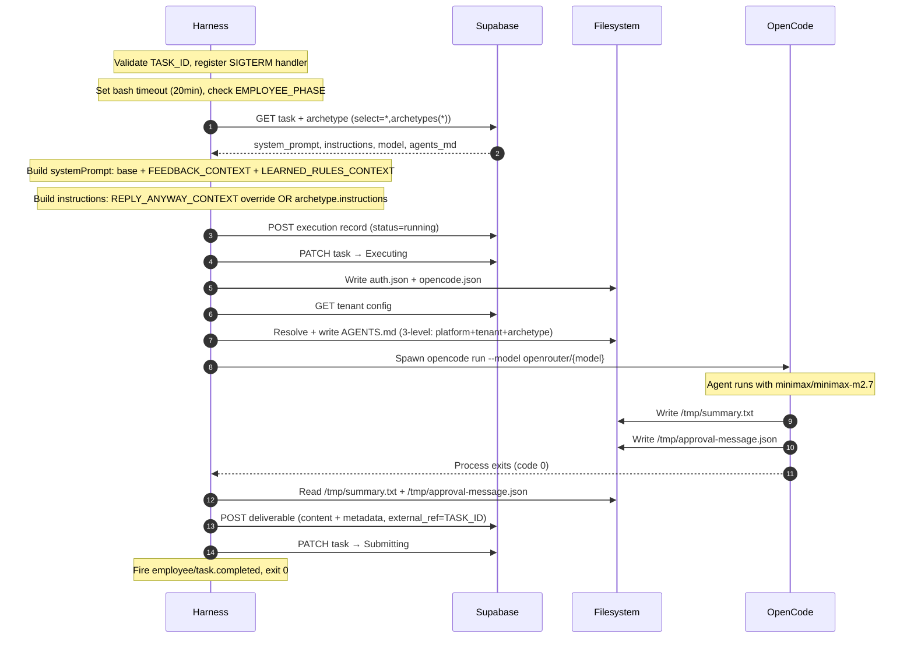

# OpenCode Harness — Verification Notepad

## Source Files Verified

- `src/workers/opencode-harness.mts:1-448` — harness implementation (complete)
- `src/workers/lib/agents-md-resolver.mts:1-23` — AGENTS.md 3-level concatenation logic
- `src/workers/config/agents.md:1-83` — static platform AGENTS.md (agent policy)
- `src/workers/lib/postgrest-client.ts:1-114` — PostgREST client (GET/POST/PATCH)
- `docs/2026-04-24-1452-current-system-state.md:161-223` — old harness section (baseline)

---

## Current State

### Harness Overview

`opencode-harness.mts` is the universal worker entrypoint for all active employees. It is compiled to `/app/dist/workers/opencode-harness.mjs` and launched by Fly.io machines via CMD override:

```
["node", "/app/dist/workers/opencode-harness.mjs"]
```

The harness handles two distinct phases controlled by the `EMPLOYEE_PHASE` env var:

- **Default (execution phase)**: Fetches archetype, builds system prompt with context injections, runs OpenCode, POSTs deliverable, transitions to `Submitting`.
- **Delivery phase** (`EMPLOYEE_PHASE=delivery`): Reads the approved deliverable, constructs delivery instructions, runs a second OpenCode session, transitions to `Done`.

### Step-by-Step Flow (Execution Phase — 17 steps)

| Step | What the harness does                                                                                                                             |
| ---- | ------------------------------------------------------------------------------------------------------------------------------------------------- |
| 1    | Validate `TASK_ID` env var — `process.exit(1)` if missing (IIFE at module top)                                                                    |
| 2    | Register `SIGTERM` handler — PATCHes task to `Failed` with reason `"Worker terminated"`, then `process.exit(1)`                                   |
| 3    | Set `OPENCODE_EXPERIMENTAL_BASH_DEFAULT_TIMEOUT_MS = 1200000` (20 min bash tool timeout) if not already set                                       |
| 4    | Fetch task + archetype: `GET /rest/v1/tasks?id=eq.{TASK_ID}&select=*,archetypes(*)`                                                               |
| 5    | Check `EMPLOYEE_PHASE === 'delivery'` — if true, branch to delivery phase (see below)                                                             |
| 6    | Build system prompt: start with `archetype.system_prompt`, optionally prepend `FEEDBACK_CONTEXT`, then append `LEARNED_RULES_CONTEXT`             |
| 7    | Build instructions: if `REPLY_ANYWAY_CONTEXT` is set, prepend the reply-anyway override preamble; otherwise use `archetype.instructions` verbatim |
| 8    | Validate that `instructions` is non-empty — `process.exit(1)` if missing                                                                          |
| 9    | Create execution record: `POST /rest/v1/executions` (`status: "running"`)                                                                         |
| 10   | PATCH task to `Executing`                                                                                                                         |
| 11   | Write OpenCode auth: `~/.local/share/opencode/auth.json` (OpenRouter API key)                                                                     |
| 12   | Write `.opencode/opencode.json` with `{ permission: { '*': 'allow', question: 'deny' } }`                                                         |
| 13   | Fetch tenant config: `GET /rest/v1/tenants?id=eq.{tenant_id}&select=config`                                                                       |
| 14   | Resolve + write AGENTS.md: read `/app/AGENTS.md` → call `resolveAgentsMd()` → overwrite `/app/AGENTS.md`                                          |
| 15   | Spawn `opencode run --model openrouter/{model} "{systemPrompt}\n\n{instructions}\n\nTask ID: {TASK_ID}"` subprocess                               |
| 16   | Wait for OpenCode to exit; capture stdout/stderr to logs                                                                                          |
| 17   | Read `/tmp/summary.txt` → deliverable content; read `/tmp/approval-message.json` → metadata. Throw if **both** absent                             |
| 18   | POST deliverable: `POST /rest/v1/deliverables` (`external_ref: TASK_ID`, `content`, `metadata`)                                                   |
| 19   | PATCH task to `Submitting`                                                                                                                        |
| 20   | Fire `employee/task.completed` Inngest event (`POST {INNGEST_BASE_URL}/e/{INNGEST_EVENT_KEY}`)                                                    |
| 21   | `process.exit(0)`                                                                                                                                 |

### Delivery Phase Flow (separate branch — 6 steps)

| Step | What the harness does                                                                                        |
| ---- | ------------------------------------------------------------------------------------------------------------ |
| D1   | Validate `archetype.delivery_instructions` — mark `Failed` and return if missing                             |
| D2   | Fetch latest deliverable: `GET /rest/v1/deliverables?external_ref=eq.{taskId}&order=created_at.desc&limit=1` |
| D3   | Mark `Failed` and return if no deliverable found                                                             |
| D4   | Build delivery instructions: `"APPROVED CONTENT TO DELIVER:\n{content}\n\n{delivery_instructions}"`          |
| D5   | Run second `opencode run` session with delivery instructions                                                 |
| D6   | PATCH task to `Done`, log status transition `Delivering → Done`                                              |

---

### Context Injections (NEW since April 24)

Three env var context injections are applied to the system prompt / instructions before the OpenCode session. All were added after the April 24 snapshot.

#### 1. `FEEDBACK_CONTEXT` (pre-existing — still present)

- **Env var**: `FEEDBACK_CONTEXT`
- **Source**: Injected by the lifecycle's `load-env` step from stored feedback records in the `feedback` table
- **Injection point**: System prompt — appended after `archetype.system_prompt`
- **Pattern**: `systemPrompt = feedbackContext ? \`${baseSystemPrompt}\n\n${feedbackContext}\` : baseSystemPrompt`
- **Line**: 331–333

#### 2. `LEARNED_RULES_CONTEXT` (NEW — GM-19)

- **Env var**: `LEARNED_RULES_CONTEXT`
- **Source**: Injected by lifecycle; contains the knowledge base digest written by the feedback-summarizer weekly cron (GM-19 feature)
- **Injection point**: System prompt — appended after FEEDBACK_CONTEXT (or base prompt)
- **Pattern**: `if (learnedRulesContext) { systemPrompt = \`${systemPrompt}\n\n${learnedRulesContext}\`; }`
- **Line**: 334–336

#### 3. `REPLY_ANYWAY_CONTEXT` (NEW — GM-16)

- **Env var**: `REPLY_ANYWAY_CONTEXT`
- **Source**: Injected by lifecycle when a PM clicks "Reply Anyway" on a NO_ACTION_NEEDED notification
- **Injection point**: Instructions — replaces normal `archetype.instructions`; prepends a full override preamble
- **Pattern**: Rewrites the instructions to: `OVERRIDE — REPLY ANYWAY TASK:\n{preamble}\n\nMessage context:\n{replyAnywayContext}\n\n---\nOriginal instructions (for reference, start from Step 3):\n{archetype.instructions}`
- **Line**: 337–340
- **Behavior**: Instructs OpenCode to skip Step 1 (message fetching), classify as NEEDS_APPROVAL, draft a response, continue from Step 5

> **Note**: No `CONVERSATION_HISTORY_CONTEXT` was found in the harness. The task brief mentioned GM-14 (conversation history context) as a possible addition, but the source code does not contain this injection as of April 29, 2026. Marked [UNVERIFIED — not present in harness].

---

### AGENTS.md Resolution (3-level fallback)

Implemented in `src/workers/lib/agents-md-resolver.mts`. The function `resolveAgentsMd(platformContent, tenantConfig, archetype)` concatenates all non-empty sections in order:

| Level        | Source                            | Section header            | Condition                          |
| ------------ | --------------------------------- | ------------------------- | ---------------------------------- |
| 1 (required) | `/app/AGENTS.md` read at runtime  | `# Platform Policy`       | Always included                    |
| 2 (optional) | `tenant.config.default_agents_md` | `# Tenant Conventions`    | Included if non-empty string       |
| 3 (optional) | `archetype.agents_md`             | `# Employee Instructions` | Included if non-null and non-empty |

The result is written back to `/app/AGENTS.md`, overwriting the static file. OpenCode reads `/app/AGENTS.md` automatically during session startup.

**Static platform AGENTS.md** (`src/workers/config/agents.md`) contains 6 policies:

1. **Source access**: Read any `/tools/*.ts` file when debugging tool behavior
2. **Patch permission**: Edit `/tools/` TypeScript files if broken (temporary, session-scoped only)
3. **Smoke test**: Run `--help` after any patch before real use (hard requirement)
4. **Mandatory issue reporting**: Report every tool issue before task ends via `report-issue.ts` tool
5. **Platform code off-limits**: Never modify `/app/dist/`, `/app/node_modules/`, or anything outside `/tools/`
6. **Database access only via tools**: Never use `psql`, PostgREST curl, raw SQL, or connection strings directly

---

### Output Contract

OpenCode is expected to write two files:

| File                         | Purpose                                                                | Mapped to                                                                                   |
| ---------------------------- | ---------------------------------------------------------------------- | ------------------------------------------------------------------------------------------- |
| `/tmp/summary.txt`           | Deliverable content (the actual output — summary text, analysis, etc.) | `deliverables.content`                                                                      |
| `/tmp/approval-message.json` | Slack message metadata (`ts`, `channel`, optional `conversationRef`)   | `deliverables.metadata` (keys: `approval_message_ts`, `target_channel`, `conversation_ref`) |

**Failure condition**: If **both** files are absent (empty content AND no metadata), the harness throws:

> `"Model did not produce content — /tmp/summary.txt and /tmp/approval-message.json were not written. This is a model reliability issue; retry the task."`

Writing **either** file alone is sufficient to proceed.

---

### SIGTERM Handling

SIGTERM handler registered at module top (line 45–56), before `main()` is called:

1. Logs: `"SIGTERM received — marking task Failed"`
2. PATCHes task: `status: 'Failed', failure_reason: 'Worker terminated'`
3. Calls `process.exit(1)` in `.finally()`

This explains why tasks show as `Failed` after Fly.io machine preemption (machines send SIGTERM before termination).

---

### PostgREST Client

`src/workers/lib/postgrest-client.ts` — thin fetch wrapper, no Prisma dependency:

- Reads `SUPABASE_URL` and `SUPABASE_SECRET_KEY` from env
- Falls back to no-op client (returns `null`) if either is missing
- Headers: `apikey`, `Authorization: Bearer`, `Content-Type: application/json`, `Prefer: return=representation`
- Methods: `get(table, query)`, `post(table, body)`, `patch(table, query, body)`

---

### Sequence Diagram (Mermaid)



---

## Changes from April 24 Doc

| Change                        | Details                                                                                                                                                                 |
| ----------------------------- | ----------------------------------------------------------------------------------------------------------------------------------------------------------------------- |
| `LEARNED_RULES_CONTEXT` added | New env var (GM-19); appended to system prompt after FEEDBACK_CONTEXT. Not in April 24 doc.                                                                             |
| `REPLY_ANYWAY_CONTEXT` added  | New env var (GM-16); replaces archetype instructions with reply-anyway override preamble. Not in April 24 doc.                                                          |
| Delivery phase branch added   | `EMPLOYEE_PHASE=delivery` triggers `runDeliveryPhase()` — fetches approved deliverable, runs second OpenCode session, transitions to `Done`. Confirms PLAT-05 complete. |
| Bash timeout env var          | `OPENCODE_EXPERIMENTAL_BASH_DEFAULT_TIMEOUT_MS = 1200000` set at harness startup. Not in April 24 doc.                                                                  |
| Step count                    | Old doc listed 15+1=16 steps; actual step count is 21 (execution) + 6 (delivery branch).                                                                                |

## New Content (not in old doc)

1. **Delivery phase** (`EMPLOYEE_PHASE=delivery`) — complete separate flow for post-approval content publishing
2. **LEARNED_RULES_CONTEXT** — GM-19: weekly knowledge base digest prepended to system prompt
3. **REPLY_ANYWAY_CONTEXT** — GM-16: PM-initiated "reply anyway" override for NO_ACTION_NEEDED decisions
4. **Bash timeout** — `OPENCODE_EXPERIMENTAL_BASH_DEFAULT_TIMEOUT_MS` set to 20 minutes to prevent tool timeouts

---

## Unresolved

- **[UNVERIFIED]** GM-14 (conversation history context): The task brief mentioned a `CONVERSATION_HISTORY_CONTEXT` injection, but no such env var or prepend logic was found in `opencode-harness.mts` (grep confirmed: only `FEEDBACK_CONTEXT`, `LEARNED_RULES_CONTEXT`, `REPLY_ANYWAY_CONTEXT`). GM-14 may have been implemented elsewhere or is pending.
