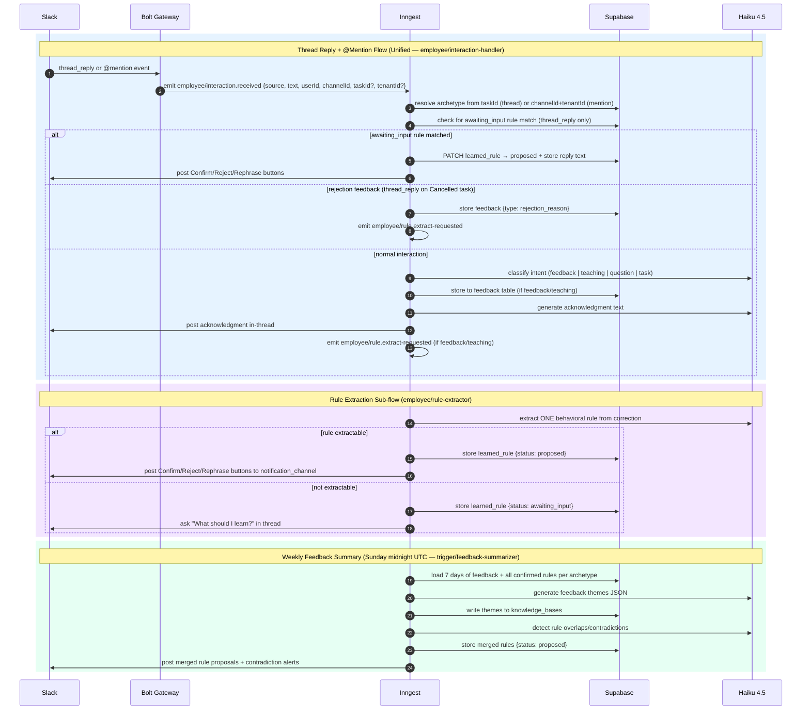

# Inngest Functions & Feedback Pipeline — Verification Notepad

## Source Files Verified

- `src/gateway/inngest/serve.ts` (62 lines) — function registrations, full handler array
- `src/inngest/interaction-handler.ts` (463 lines) — unified handler (PLAT-10)
- `src/inngest/employee-lifecycle.ts` (1070 lines, ID/trigger only) — universal lifecycle
- `src/inngest/rule-extractor.ts` (331 lines) — rule extraction function
- `src/inngest/triggers/summarizer-trigger.ts` (57 lines)
- `src/inngest/triggers/feedback-summarizer.ts` (369 lines)
- `src/inngest/triggers/guest-message-poller.ts` (91 lines)
- `src/inngest/triggers/unresponded-message-alert.ts` (188 lines)
- `src/inngest/triggers/learned-rules-expiry.ts` (55 lines)
- `src/inngest/lifecycle.ts`, `redispatch.ts`, `watchdog.ts` — deprecated, ID/trigger only

## Current State

### PLAT-10 Status

CONFIRMED COMPLETE.

`src/inngest/interaction-handler.ts` handles **both** `thread_reply` and `mention` sources through a single Inngest event `employee/interaction.received`. The `source` field in the payload discriminates between the two paths.

The separate `feedback-handler.ts` and `mention-handler.ts` files **no longer exist** in `src/inngest/`. Neither is imported or registered in `serve.ts`. The old events `employee/feedback.received` and `employee/mention.received` are gone — replaced by `employee/interaction.received`.

Old pipeline (April 24 doc): feedback-handler + feedback-responder + mention-handler (3 functions)
New pipeline (now): single interaction-handler (1 function)

---

### Inngest Functions — Active (8)

| #   | Variable               | Function ID                           | Trigger                                  | File                                                | Purpose                                                                                                                                                                                                                                                           |
| --- | ---------------------- | ------------------------------------- | ---------------------------------------- | --------------------------------------------------- | ----------------------------------------------------------------------------------------------------------------------------------------------------------------------------------------------------------------------------------------------------------------- |
| 1   | `employeeLifecycleFn`  | `employee/universal-lifecycle`        | event: `employee/task.dispatched`        | `src/inngest/employee-lifecycle.ts`                 | Universal durable lifecycle for all employee types (Received → Done), dispatches Fly.io machines, handles approval flow                                                                                                                                           |
| 2   | `summarizerTriggerFn`  | `trigger/daily-summarizer`            | cron: `0 8 * * 1-5` (8am UTC weekdays)   | `src/inngest/triggers/summarizer-trigger.ts`        | Discovers daily-summarizer archetypes and dispatches one summary task per tenant per day; dedupes via `summary-{YYYY-MM-DD}` external ID                                                                                                                          |
| 3   | `interactionHandlerFn` | `employee/interaction-handler`        | event: `employee/interaction.received`   | `src/inngest/interaction-handler.ts`                | **Unified handler (PLAT-10)** — classifies and routes both thread replies and @mentions; stores feedback, answers questions, sends Haiku acknowledgments, emits rule extraction events                                                                            |
| 4   | `feedbackSummarizerFn` | `trigger/feedback-summarizer`         | cron: `0 0 * * 0` (Sunday midnight UTC)  | `src/inngest/triggers/feedback-summarizer.ts`       | Reads 7 days of feedback, generates theme summaries via Haiku, writes to knowledge_bases; also synthesizes overlapping confirmed rules into merged proposals                                                                                                      |
| 5   | `guestMessagePollerFn` | `trigger/guest-message-poller`        | cron: `*/5 * * * *` (every 5 min)        | `src/inngest/triggers/guest-message-poller.ts`      | Discovers guest-messaging archetypes and dispatches guest message processing tasks; deduplication via time-slot-based external ID                                                                                                                                 |
| 6   | `unrespondedAlertFn`   | `trigger/unresponded-message-alerter` | cron: `*/5 * * * *` (every 5 min)        | `src/inngest/triggers/unresponded-message-alert.ts` | Checks pending_approvals for stale guest messages (configurable threshold, default 30 min); sends Slack reminder blocks respecting quiet hours config                                                                                                             |
| 7   | `ruleExtractorFn`      | `employee/rule-extractor`             | event: `employee/rule.extract-requested` | `src/inngest/rule-extractor.ts`                     | Extracts a concrete behavioral rule from feedback text using Haiku; if extractable, stores as `proposed` in learned_rules and posts Confirm/Reject/Rephrase buttons to Slack; if not extractable, creates `awaiting_input` rule and asks human to supply the rule |
| 8   | `learnedRulesExpiryFn` | `trigger/learned-rules-expiry`        | cron: `0 2 * * *` (daily 2am UTC)        | `src/inngest/triggers/learned-rules-expiry.ts`      | TTL-expires `proposed` learned rules older than 30 days with no confirmation by patching status to `expired`                                                                                                                                                      |

---

### Inngest Functions — Deprecated (3 — still registered in serve.ts)

| #   | Variable       | Function ID                   | Trigger                              | File                        | Notes                                                             |
| --- | -------------- | ----------------------------- | ------------------------------------ | --------------------------- | ----------------------------------------------------------------- |
| 1   | `lifecycleFn`  | `engineering/task-lifecycle`  | event: `engineering/task.received`   | `src/inngest/lifecycle.ts`  | Engineering employee lifecycle — on hold, do not modify           |
| 2   | `redispatchFn` | `engineering/task-redispatch` | event: `engineering/task.redispatch` | `src/inngest/redispatch.ts` | Paired with deprecated lifecycle — on hold                        |
| 3   | `watchdogFn`   | `engineering/watchdog-cron`   | cron: `*/10 * * * *`                 | `src/inngest/watchdog.ts`   | Detects stuck engineering tasks — still registered, do not modify |

---

### Feedback Pipeline (Unified — Post PLAT-10)

All Slack interactions (thread replies and @mentions) are now routed through a **single Inngest event** `employee/interaction.received`. The Bolt handlers fire this event with `source: 'thread_reply'` or `source: 'mention'`.

**Thread Reply Flow:**

1. User replies in a Slack thread on a task message
2. Bolt fires `employee/interaction.received` with `source: 'thread_reply'`, `taskId`, `threadTs`, `channelId`, `userId`, `text`
3. `interaction-handler` resolves archetype from `taskId`
4. **Special case — awaiting_input rule:** If the thread matches a `learned_rules` row with `status = 'awaiting_input'`, the reply text is captured as the rule, status set to `proposed`, and Confirm/Reject/Rephrase buttons posted — handler returns early
5. **Special case — rejection feedback:** If task is `Cancelled` and `metadata.rejection_feedback_requested = true` for this user, text is stored as `feedback_type: rejection_reason`, `employee/rule.extract-requested` is emitted — handler returns early
6. Otherwise: intent classified via `InteractionClassifier` (Haiku 4.5) → `feedback | teaching | question | task`
7. Route: `feedback`/`teaching` → stored to `feedback` table; `question` → KB lookup + Haiku answer; `task` → `employee/task.requested` emitted (stubbed)
8. Haiku generates acknowledgment and posts in-thread
9. If feedback/teaching: `employee/rule.extract-requested` emitted → `rule-extractor` processes async

**@Mention Flow:**

1. User @mentions the bot in any channel
2. Bolt fires `employee/interaction.received` with `source: 'mention'`, `tenantId`, `channelId`, `userId`, `text`
3. `interaction-handler` resolves archetype from `channelId` + `tenantId` (may be null)
4. Skips awaiting_input and rejection checks (thread_reply only)
5. Intent classified → same route-and-store → acknowledgment posted (not in a thread unless `threadTs` present)
6. If feedback/teaching: rule extraction emitted

**Rule Extraction Sub-flow (async, via `employee/rule-extractor`):**

1. `employee/rule.extract-requested` received
2. Haiku extracts ONE concrete behavioral rule from the correction text
3. If extractable: stored as `proposed` in `learned_rules` + Confirm/Reject/Rephrase buttons posted to `archetype.notification_channel`
4. If not extractable: `awaiting_input` rule created, "What should I learn from this change?" posted in thread → user reply captured by next interaction-handler invocation

**Weekly Feedback Summary (Sunday midnight UTC — `trigger/feedback-summarizer`):**

1. Reads all feedback from last 7 days
2. Haiku generates theme analysis → stored in `knowledge_bases`
3. Reads all `confirmed` learned rules per archetype
4. If ≥2 confirmed rules: Haiku detects overlaps/contradictions → merged rules proposed via Confirm/Reject/Rephrase buttons; contradictions posted as informational alerts

---

### Feedback Pipeline Diagram (Mermaid)

---

## Changes from April 24 Doc

| Change                       | Detail                                                                                                                                                                                                                |
| ---------------------------- | --------------------------------------------------------------------------------------------------------------------------------------------------------------------------------------------------------------------- |
| PLAT-10 complete             | `feedback-handler.ts` + `mention-handler.ts` + `feedback-responder` (3 functions) → single `interaction-handler` (1 function, 1 event)                                                                                |
| New unified event            | `employee/feedback.received` + `employee/mention.received` → `employee/interaction.received` with `source` discriminator                                                                                              |
| New functions (4)            | `ruleExtractorFn` (employee/rule-extractor), `learnedRulesExpiryFn` (trigger/learned-rules-expiry), `guestMessagePollerFn` (trigger/guest-message-poller), `unrespondedAlertFn` (trigger/unresponded-message-alerter) |
| Total count                  | 9 (old doc) → 11 (current) including 3 deprecated                                                                                                                                                                     |
| feedback-summarizer expanded | Now also synthesizes overlapping/contradicting confirmed rules into merged proposals                                                                                                                                  |
| Learned rules lifecycle      | New `awaiting_input` → `proposed` → `confirmed`/`rejected`/`expired` cycle                                                                                                                                            |
| rule-extractor model         | Uses `anthropic/claude-haiku-4-5` (approved)                                                                                                                                                                          |

## New Content (not in old doc)

- **`trigger/guest-message-poller`** (`*/5 * * * *`): Poll-based trigger for guest-messaging employee; discovers archetypes with `role_name = 'guest-messaging'` and dispatches tasks with time-slot deduplication
- **`trigger/unresponded-message-alerter`** (`*/5 * * * *`): Alerts for stale `pending_approvals` entries; respects configurable `quiet_hours` per tenant; uses `buildReminderBlocks` for structured Slack messages
- **`employee/rule-extractor`** (event-driven): LLM-powered behavioral rule extraction pipeline with Slack-based human review (Confirm/Reject/Rephrase); handles `edit_diff`, `rejection`, `feedback`, `teaching` feedback types
- **`trigger/learned-rules-expiry`** (daily 2am UTC): TTL janitor for stale `proposed` rules (>30 days unconfirmed)
- **`interaction-handler` awaiting_input path**: When rule extraction cannot extract a rule, it creates an `awaiting_input` record and prompts the human in-thread; the next thread reply is captured and promoted to `proposed`
- **`interaction-handler` rejection-feedback path**: Detects when a thread reply is responding to a summary rejection request and stores it as `rejection_reason` feedback

## Unresolved

- [UNVERIFIED] The `watchdog.ts` deprecated function still registers on `*/10 * * * *` — behavior when it finds no engineering tasks is unverified (assumed no-op)
- [UNVERIFIED] `feedback-summarizer`'s feedback query lacks `tenant_id` and `archetype_id` filters — pre-existing bug noted inline as `TODO(GM-19)`
- [UNVERIFIED] `interaction-handler` `task` intent path is stubbed (`log.info ... 'Task intent received — stubbed, not implemented'`) — emits `employee/task.requested` but nothing consumes it yet
