# Digital AI Employee Platform — Architecture

## Table of Contents

- [1. Platform Vision](#1-platform-vision)
- [2. Platform Architecture](#2-platform-architecture)
- [3. Employee Archetype Framework](#3-employee-archetype-framework)
- [4. Universal Task Lifecycle](#4-universal-task-lifecycle)
- [5. Cross-Department Workflow Orchestration](#5-cross-department-workflow-orchestration)
- [6. Department Archetypes — Detailed Specifications](#6-department-archetypes--detailed-specifications)
- [7. Architecture Review & Design Decisions (Engineering)](#7-architecture-review--design-decisions-engineering)
- [8. Engineering Department — System Context](#8-engineering-department--system-context)
- [9. Engineering Department — Phase Details](#9-engineering-department--phase-details)
- [10. Engineering Department — Orchestration and Scaling](#10-engineering-department--orchestration-and-scaling)
- [11. Engineering Department — Full Lifecycle Sequence](#11-engineering-department--full-lifecycle-sequence)
- [12. Knowledge Base Architecture](#12-knowledge-base-architecture)
- [13. Platform Data Model](#13-platform-data-model)
- [14. Platform Shared Infrastructure](#14-platform-shared-infrastructure)
- [15. Technology Stack](#15-technology-stack)
- [16. Implementation Roadmap](#16-implementation-roadmap)
- [17. Cost Estimation](#17-cost-estimation)
- [18. Risk Mitigation](#18-risk-mitigation)
- [19. Department Onboarding Checklist](#19-department-onboarding-checklist)
- [20. Success Metrics](#20-success-metrics)
- [21. Feedback Loops](#21-feedback-loops)
- [22. LLM Gateway Design](#22-llm-gateway-design)
- [23. Agent Versioning](#23-agent-versioning)
- [24. API Rate Limiting](#24-api-rate-limiting)
- [25. Security Model](#25-security-model)
- [26. Disaster Recovery](#26-disaster-recovery)
- [27. Operational Runbooks](#27-operational-runbooks)

---

## 1. Platform Vision

This document describes a **multi-department Digital AI Employee Platform** — a system for deploying autonomous AI agents ("digital employees") that monitor work queues, triage incoming tasks, execute domain-specific work, and submit results for review.

The platform is built by a **solo developer**, which shapes every design choice. Operational simplicity wins over theoretical scale. Self-hosted infrastructure is avoided where managed alternatives exist. The product model is **internal-first, SaaS-later**: built to run inside one company first, with multi-tenancy designed in from the start so the path to a commercial product doesn't require a rewrite.

**Engineering is the MVP department.** Paid Marketing is second, chosen specifically to validate that the archetype pattern generalizes beyond code. Every subsequent department should be addable in days, not months.

The core insight is that every department follows the same five-step workflow:

1. **Trigger** — An event arrives from an external system (Jira ticket, ad platform alert, invoice, lead form).
2. **Triage** — An AI agent analyzes the task, consults a domain knowledge base, and asks clarifying questions.
3. **Execute** — An AI agent performs the actual work using domain-specific tools.
4. **Review** — An AI agent validates the output against acceptance criteria and routes to approval or revision.
5. **Deliver** — The result is published, merged, sent, or filed, and stakeholders are notified.

What changes between departments is the **integrations** (which systems to watch), the **tools** (what the agent can do), the **knowledge base** (domain expertise), and the **approval gates** (risk thresholds). The orchestration layer, queue infrastructure, state management, and observability are shared.

The platform generalizes the proven **nexus-stack fly-worker pattern** — an existing AI-driven Fly.io dispatch system — into a reusable department runtime. **Slack** is the primary human interaction layer for approvals, questions, and status updates across all departments.

---

## 2. Platform Architecture

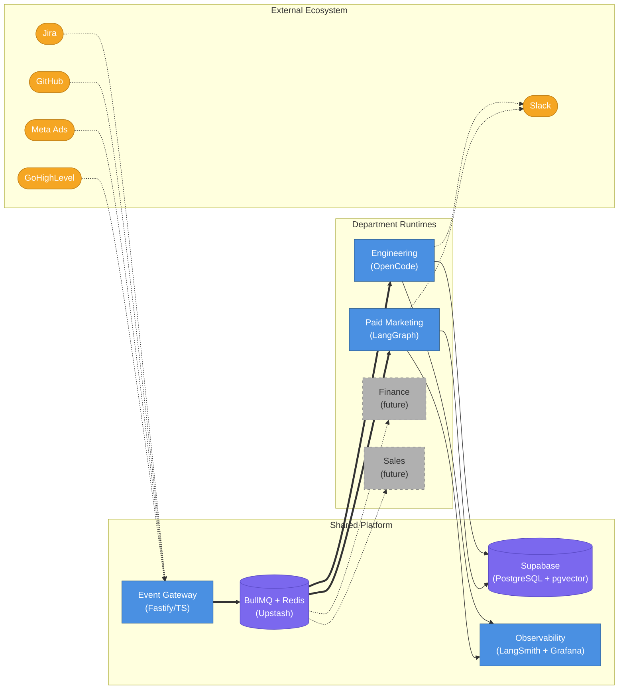

The diagram reflects four deliberate choices:

**Event Gateway** (Fastify/TypeScript) receives webhooks from all external systems, normalizes them into a universal task schema, and enqueues jobs to BullMQ. It's the only entry point — no department talks directly to an external system at ingest time.

**BullMQ + Upstash Redis** provides a durable job queue with per-department namespaces and configurable concurrency controls. Upstash is serverless Redis, which removes one more self-hosted service from the operational burden.

**Supabase (PostgreSQL + pgvector)** serves as the single database for both application state and vector search. It's already in the nexus-stack, so there's no new infrastructure to operate.

**Engineering (OpenCode)** uses the OpenCode CLI as its agent runtime, dispatching work to ephemeral Fly.io machines for full filesystem isolation. **Paid Marketing (LangGraph)** runs Python-based workflow orchestration in-process — appropriate for API-heavy tasks that don't need VM isolation. **Observability** combines LangSmith for agent trace visibility with Grafana for infrastructure metrics.

---

## 3. Employee Archetype Framework

An "archetype" is a declarative config object that describes everything a department's AI employee needs to operate. It's not code — it's configuration. The orchestrator reads an archetype and knows which webhooks to watch, which tools to provision, which knowledge base to query, how to assess risk, and which agent runtime to spin up. Adding a new department means writing a new archetype config, not writing new orchestration logic.

### 3.1 Archetype Schema

| Field | Purpose | Example (Engineering) | Example (Paid Marketing) |
|---|---|---|---|
| `department` | Logical grouping | `engineering` | `marketing.paid` |
| `trigger_sources` | Webhook endpoints to monitor | Jira, GitHub | Meta Ads, GoHighLevel |
| `triage_tools` | Tools during triage | Jira API, codebase search | Ad account API, campaign history |
| `execution_tools` | Tools during execution | Git, file editor, test runner | Meta Ads API, analytics query |
| `review_tools` | Tools during review | GitHub PR API, CI status | Performance dashboard, brand checker |
| `knowledge_base` | Domain knowledge sources | pgvector embeddings, task history | Campaign playbooks, brand docs |
| `delivery_target` | Where results go | GitHub PR | Ad platform draft |
| `risk_model` | Approval gate configuration | File-count + critical-path score | Spend threshold + audience size |
| `concurrency` | Max parallel tasks | 3 per project | 2 per ad account |
| `escalation_rules` | When to involve human | DB migrations, auth changes | Budget > $500/day, new audience |
| **`runtime`** | **Agent runtime to use** | **`opencode`** | **`langgraph`** |
| **`runtime_config`** | **Runtime-specific config** | **`{type: "fly-machine", vm_size: "performance-2x"}`** | **`{type: "in-process", module: "marketing_workflow"}`** |

#### runtime_config Examples

The `runtime_config` field carries the runtime-specific parameters the orchestrator passes when spinning up a worker. Each runtime interprets this differently.

```json
// Engineering Department — Fly.io machine execution
{
  "runtime": "opencode",
  "runtime_config": {
    "type": "fly-machine",
    "vm_size": "performance-2x",
    "image": "nexus-workers:latest",
    "max_duration_minutes": 90,
    "volume_id": "auto"
  }
}

// Paid Marketing Department — In-process Python worker
{
  "runtime": "langgraph",
  "runtime_config": {
    "type": "in-process",
    "workflow": "campaign_optimization",
    "checkpoint_backend": "supabase"
  }
}
```

Engineering tasks run in ephemeral Fly.io VMs — full filesystem isolation, git access, test execution. Marketing tasks run in-process as Python workers — appropriate for API-heavy workflows that don't need VM overhead.

### 3.2 Archetype Composition

The diagram below shows how an archetype config wires together into the platform and routes work to the correct runtime.

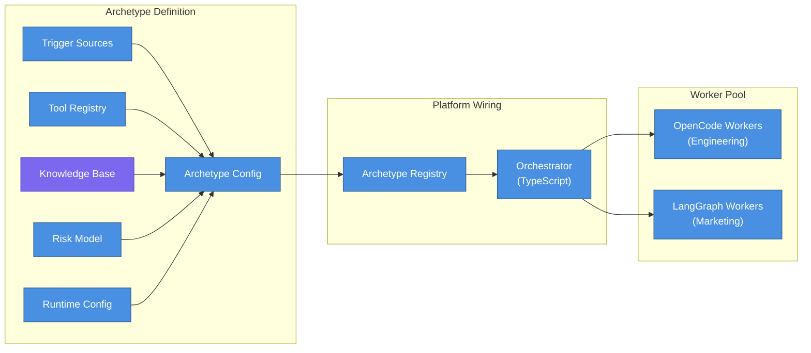

The Archetype Registry is a simple in-memory map at startup. The orchestrator loads all registered archetypes, subscribes to their trigger sources, and routes incoming tasks to the correct worker pool based on the `runtime` field. No dynamic dispatch logic — the archetype config is the dispatch table.

### 3.3 Why Archetypes Matter

The archetype pattern solves a real problem: every AI agent project starts with a custom orchestration layer that's tightly coupled to one domain. When you want to add a second department, you're not extending the system — you're building a second system. That's how you end up with 2 months of work instead of 2 weeks.

By separating the *what* (archetype config) from the *how* (orchestration engine), the platform can onboard a new department without touching the core. The orchestrator doesn't know anything about Jira or Meta Ads — it knows about trigger sources, tool registries, and risk models. The archetype fills in the domain-specific values.

This also makes cross-department workflows tractable. When an engineering task requires a marketing review (say, a landing page change that affects ad spend), the orchestrator can hand off between archetypes using the same task schema. Neither department's agent needs to know about the other's internals.

The hybrid runtime model extends this flexibility further. Engineering tasks demand a coding-specific agent with deep filesystem access, git tooling, and test execution — OpenCode is built for exactly this. Marketing tasks are API-heavy workflows that benefit from LangGraph's durable execution and graph-based state management. The archetype's `runtime` field makes this choice explicit and swappable: as better runtimes emerge, updating a department's agent technology requires changing one config field, not rewiring the entire pipeline.

---

## 4. Universal Task Lifecycle

Every department shares this state machine. The states are identical across all archetypes — only the transitions' internal behavior changes, defined by the archetype's runtime, tools, and knowledge base configuration. This universality is what makes it possible to onboard a new department without writing new orchestration logic: the state machine already exists; you only fill in what each state means for your domain.

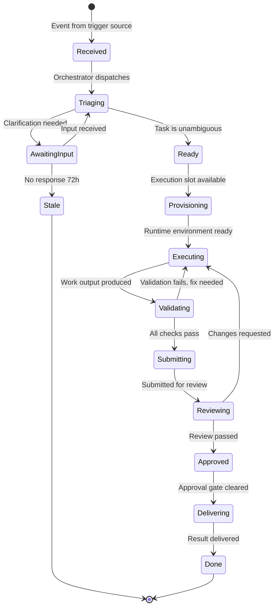

> **Note on Provisioning**: The `Provisioning` state applies only when the archetype's `runtime` is `opencode` (Fly.io machine spin-up). For `langgraph` or `in-process` runtimes, the transition goes directly from `Ready → Executing` — there is no machine to provision.

> **Note on fix loop**: When `Validating → Executing` (validation fails), the execution agent re-enters at the **failing validation stage**, not from the beginning of code generation. A TypeScript error re-enters at the TypeScript check; a lint error at the lint check. This prevents oscillation where fixing one stage inadvertently breaks a previously passing stage.

### 4.1 Department-Specific Interpretations

The table below shows how each state maps to concrete actions per department. Engineering and Paid Marketing are fully specified. Finance and Sales are abbreviated — they follow the same pattern once their archetypes are built.

| State | Engineering (OpenCode) | Paid Marketing (LangGraph) | Finance (future) | Sales (future) |
|---|---|---|---|---|
| Received | Jira ticket created | Ad performance alert | Invoice received | Lead form submitted |
| Triaging | Analyze requirements vs. codebase context | Analyze metrics vs. campaign goals | Classify expense, check budget | Qualify lead, check CRM history |
| AwaitingInput | Questions posted to Jira, awaiting reporter | Clarification on creative brief | Missing receipt or PO number | Missing company info |
| Executing | Write code on Fly.io machine, run tests | LangGraph workflow: call Meta/Google Ads APIs | Categorize, reconcile, draft entry | Research prospect, draft outreach |
| Validating | TypeScript → Lint → Unit → Integration → E2E | Brand compliance + budget limits check | Double-entry balance + policy check | Messaging tone + CRM completeness |
| Reviewing | AI code review + risk score → Slack approval | Human creative approval via Slack | Manager approval over threshold | Manager approval for enterprise |
| Delivering | PR merged via GitHub → Slack notification | Campaign draft published to Meta/Google | Journal entry posted, Slack alert | Email sequence sent via GoHighLevel |

---

## 5. Cross-Department Workflow Orchestration

Departments don't operate in isolation. A single business event can cascade through multiple departments: a deal closes in Sales, Engineering provisions the client environment, Finance generates the invoice, and Marketing drafts a case study. The orchestrator supports this workflow chaining through a standardized event contract that any department can emit and any other department can consume. Neither side needs to know the other's internals.

**This is a Phase 2+ feature.** Cross-department workflow chaining should only be built after Engineering and Paid Marketing are each independently operational and validated through the shadow, supervised, and autonomous progression. Wiring departments together before each one is stable compounds complexity in ways that are hard to debug.

### 5.1 Workflow Chain Example

The diagram below shows a Sales-to-Engineering-to-Finance-to-Marketing chain. Engineering and Sales nodes are active today. Finance and Marketing workflow chaining are future work.

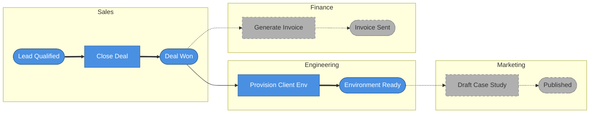

Solid arrows (`==>`) are active paths. Dashed arrows (`-.->`) are future connections that exist in the schema but aren't wired yet.

### 5.2 Cross-Department Event Contract

When a department completes work that should trigger another department, it emits a `cross_department_trigger` event. The schema is fixed — every department speaks the same language.

```json
{
  "event_type": "cross_department_trigger",
  "source_department": "sales",
  "source_task_id": "task_abc123",
  "target_department": "engineering",
  "target_archetype": "client_provisioning",
  "runtime_hint": "opencode",
  "payload": {
    "client_name": "Acme Corp",
    "plan_tier": "enterprise",
    "requirements": ["SSO", "custom domain", "dedicated DB"]
  },
  "priority": "high",
  "deadline": "2026-04-01T00:00:00Z"
}
```

The `runtime_hint` field tells the receiving department's orchestrator which agent runtime to use. When `"opencode"`, the engineering department spins up a Fly.io machine. When `"langgraph"`, the marketing department runs an in-process workflow. This avoids hard-coupling the event source to the implementation details of the target department. The source just says what it needs done and hints at how; the target decides whether to honor the hint or override it based on its own archetype config.

### 5.3 Phase 2+ Advisory

> **Phase 2+ Only**: Cross-department workflow chaining requires both source and target departments to be independently operational. Implement this after Engineering and Paid Marketing have each achieved autonomous operation through the shadow, supervised, and autonomous progression. Attempting to build workflow chaining before individual departments are stable will compound complexity.

---

## 6. Department Archetypes — Detailed Specifications

### 6.1 Engineering Department (Active — Primary Implementation)

The engineering department is the primary implementation and the pattern-setter for all other departments. It uses **OpenCode** (`opencode serve` + `@opencode-ai/sdk`) as its agent runtime, dispatching work to ephemeral Fly.io machines for full filesystem and environment isolation. The implementation builds directly on the **nexus-stack fly-worker pattern** — a proven Fly.io dispatch system with `dispatch.sh`, `orchestrate.mjs`, and `entrypoint.sh` scripts already running in production. The AI Employee Platform generalizes that pattern into a reusable department runtime rather than reinventing it.

**Trigger sources**: Jira Cloud webhooks (ticket created, comment added, status changed) and GitHub webhooks (PR created, review submitted, CI status). The Event Gateway normalizes both into the universal task schema before enqueuing.

**Agent runtime**: OpenCode CLI running via `opencode serve` on port 4096. The `@opencode-ai/sdk` TypeScript client (`createOpencodeClient()`) controls sessions programmatically — opening sessions, injecting task context, and monitoring progress. Wave-based orchestration runs via a generalized version of `orchestrate.mjs`, which today handles the nexus-stack monorepo and will be adapted to support any project repository registered in the platform.

**Execution environment**: Each task gets an ephemeral Fly.io `performance-2x` machine (8 GB RAM). The pre-built Docker image includes OpenCode CLI, GitHub CLI, pnpm, Docker-in-Docker (for Supabase local), and all project tooling. A volume-cached pnpm store and Docker layer cache keep warm-start time well under the target of 80 seconds, down from a ~157-second baseline in the original nexus-stack implementation. The boot lifecycle follows `entrypoint.sh`'s ten-step sequence: write auth tokens, clone repo, checkout or create branch, install dependencies, start Docker daemon, start local Supabase, extract credentials, apply schema, configure OpenCode, then dispatch the task.

**Knowledge base (2 layers)**:

- **Layer 1 — Semantic search (pgvector)**: Code chunks, docstrings, and README files are embedded and stored in Supabase. During triage, the agent queries this index to answer "which files are relevant to this ticket?" without reading the entire codebase.
- **Layer 2 — Task history (Supabase)**: Every completed task stores its inputs, outputs, file paths touched, and validation results. This is institutional memory — the agent can query "how was similar work done before?" to avoid re-solving solved problems.
- **Deferred — Layer 3 (Tree-sitter AST graph)** and **Layer 4 (living documentation)**: These improve triage precision but add operational complexity. They'll be added only when triage quality degrades in ways that Layer 1 and Layer 2 can't address.

**Unique challenge — concurrent file conflicts**: Two tasks running in parallel may modify overlapping files. The platform handles this with file-level conflict detection at task start (the orchestrator checks which files a new task intends to modify and blocks if a running task holds any of the same files) and a serialized PR merge queue that processes approvals in order, rebasing as needed.

---

### 6.2 Paid Marketing Department (Active — Second Department)

The paid marketing department validates that the archetype pattern generalizes beyond code. It uses **LangGraph** (Python) as its agent runtime — a graph-based workflow orchestrator with durable execution via PostgreSQL checkpointing in Supabase. Tasks run as in-process Python workers rather than isolated VMs, since ad optimization requires only API calls and doesn't need filesystem access or git tooling. This makes the marketing department significantly cheaper and faster to spin up than engineering: no machine provisioning, no Docker boot, no repo clone.

**V1 scope**: Campaign performance monitoring and optimization against Meta Ads API and Google Ads API. Creative generation (image and video assets) is a V2 feature — it requires multimodal models, creative approval workflows, and brand compliance tooling that don't belong in the first iteration.

**Trigger sources**: Meta Marketing API webhooks (spend alerts, performance thresholds), scheduled cron jobs (daily performance reviews), and GoHighLevel webhooks (campaign events and pipeline stage changes).

**Agent runtime**: Each campaign optimization task runs as a LangGraph graph. The node sequence is:

```
data_collection → analysis → decision → execution → reporting
```

Every node checkpoints its output to Supabase before proceeding. If a worker crashes mid-workflow, LangGraph resumes from the last checkpoint — no work is lost and no API call is repeated.

**Execution environment**: In-process Python worker managed by the department's BullMQ consumer. Multiple workers run concurrently, one per ad account. No VM isolation is needed because the work is read-API-call-heavy and write-side mutations go through the Meta/Google Ads APIs, not the local filesystem.

**Triage tools**: Campaign performance queries (CTR, CPC, ROAS, frequency), budget utilization check, and historical campaign comparison against the same period in prior weeks.

**Execution tools**: Meta Ads API (adjust budgets, pause and enable campaigns, update targeting) and Google Ads API (keyword bid adjustments, ad copy updates). Creative generation tools are deferred to V2.

**Risk model**:

| Factor | Weight | Escalation Trigger |
|---|---|---|
| Daily spend increase | 30% | Budget change > $500/day |
| New audience targeting | 25% | Targeting criteria not in approved list |
| New creative concept | 20% | First-time visual style or messaging angle |
| Platform policy risk | 15% | Claims, testimonials, or restricted categories |
| ROAS deviation | 10% | Projected ROAS < 70% of benchmark |

Any task with a composite risk score above threshold routes to a human via Slack before execution. The agent posts a summary of the proposed change, the risk breakdown, and one-click approve/reject buttons. Approved actions execute immediately; rejected actions close the task and log the reason.

---

### 6.3 Organic Content / Content Marketing Department (Planned)

The organic content department monitors content calendars and generates blog posts, social media content, and SEO-optimized articles from briefs and keyword targets. It triggers from content calendar events and SEO alert tools (Ahrefs or SEMrush rank changes) and uses LangGraph with a writing-focused tool set: long-form generation, social formatting, SEO metadata, and image prompt generation. Delivery targets include CMS drafts (WordPress, Webflow), social scheduling tools, and email platforms. No detailed spec is written until Engineering and Paid Marketing reach autonomous operation.

---

### 6.4 Finance Department (Planned)

The finance department processes incoming invoices, categorizes expenses, reconciles accounts, and flags anomalies for review. Triggers come from QuickBooks Online webhooks and bank feed imports via Plaid, and the department uses LangGraph workflows for multi-step reconciliation with human approval gates for all journal entries above a configurable threshold. The knowledge base includes the chart of accounts, vendor master list, expense policies, and historical categorization patterns. Detailed specification is deferred until the first two departments are independently stable.

---

### 6.5 Sales Department (Planned)

The sales department qualifies inbound leads, enriches CRM records, drafts personalized outreach sequences, and follows up on stale opportunities. It triggers from GoHighLevel webhooks (form submissions, pipeline stage changes) and CRM scheduled tasks, with LangGraph handling the workflow and GoHighLevel API handling execution. Manager approval is required for any opportunity above $25,000 or any enterprise prospect. Full specification is deferred to a later phase.

---

## 7. Architecture Review & Design Decisions (Engineering)

This section documents the key design decisions made during architecture review, the alternatives considered, and the reasoning behind each choice. These aren't obvious calls — each one has a real tradeoff worth understanding.

---

### 7.1 Polling vs. Event-Driven (Jira Monitoring)

The original concept described an AI agent "constantly monitoring" Jira for new tickets. Polling Jira's REST API is fragile at scale — you'll hit rate limits across multiple projects, burn compute on empty polls, and introduce latency between ticket creation and triage. Jira supports webhooks natively. A webhook listener that pushes events into a durable queue is dramatically more efficient, reliable, and scalable. The agent should react to events, not poll for them.

**Recommendation:** Jira Webhooks → Event Gateway → BullMQ → Triage Agent. This pattern generalizes: every department uses webhooks or scheduled triggers through the same Event Gateway.

---

### 7.2 Hybrid Agent Runtime: OpenCode + LangGraph

**The question**: Should we use one agent runtime for all departments, or choose the best tool per use case?

**The answer**: Hybrid. OpenCode for engineering, LangGraph for everything else.

**Why OpenCode for engineering**: OpenCode (`opencode serve` + `@opencode-ai/sdk`) is purpose-built for AI coding workflows. It has deep integration with file editing, git operations, test execution, LSP diagnostics, and MCP tools. The nexus-stack already uses it in production. For a task that requires cloning a repo, modifying TypeScript files, running tests, and creating PRs — OpenCode is the right tool. There's no point building custom file editing and git integrations when a production-grade implementation already exists.

**Why LangGraph for non-engineering**: LangGraph provides durable execution via PostgreSQL checkpointing, graph-based state management, and human-in-the-loop interrupts. For tasks that are primarily API calls (Meta Ads, GoHighLevel, QuickBooks), OpenCode's coding tools are irrelevant overhead. LangGraph's structured workflow model maps cleanly to multi-step business processes: collect data, analyze, decide, execute, report. Each node checkpoints before proceeding, so a crashed worker resumes from the last successful step.

**Why not one runtime for all**: Using OpenCode for marketing tasks would mean loading a coding-specific runtime, initializing git tooling, and spinning up file editing infrastructure for tasks that only need API calls. Using LangGraph for engineering tasks would mean building custom file editing and git integrations from scratch — work that OpenCode already does well. Each tool is genuinely better in its domain. Forcing one runtime everywhere trades simplicity for the wrong kind of simplicity.

**The boundary**: The archetype's `runtime` field makes the choice declarative. Switching runtimes requires changing one config value. As better runtimes emerge, updating a department's agent technology doesn't require rewiring the pipeline.

---

### 7.3 Fly.io Machine Lifecycle

The nexus-stack fly-worker provides measured boot time data that directly informs the platform's performance targets.

**Warm vs. cold boot**: The nexus-stack fly-worker has measured boot times of ~7.8 minutes (467s) cold and ~2.6 minutes (157s) warm. The platform targets <80s warm boot — achievable through three levers: pre-built Docker images, shallow git clones (`--depth=2`), and volume-cached pnpm store.

**Pre-built images**: Docker images are rebuilt nightly and on every merge to `main`. The image includes the repo, installed `node_modules`, Docker-in-Docker for Supabase local, and all tooling. With a warm image already pulled, spin-up time drops to ~5-10 seconds for the container itself. The remaining time is repo checkout, dependency verification, and service startup.

**Volume persistence**: Each Fly.io machine gets a persistent volume for the pnpm store and Docker image cache. This is critical for warm boot performance. Without volume persistence, every boot re-downloads gigabytes of dependencies. With it, the pnpm store is already populated and Docker layers are already cached.

**Cost**: ~$0.05/GB-hour for `performance-2x` (2 shared CPU, 8GB RAM). A typical engineering task runs 20-60 minutes, putting per-task cost at roughly $0.50-$2.00 including machine time and storage.

**Teardown**: Machines auto-destroy on exit via `--auto-destroy`. Hard timeout is 90 minutes — any task still running at that point is killed and re-dispatched. The orchestrator also detects stale machines: if a machine hasn't sent a heartbeat in 10 minutes, it's presumed dead and the task is re-queued. This handles the case where a machine crashes without triggering the normal exit path.

---

### 7.4 AI-Only PR Merge is Risky

Fully autonomous PR merges — where an AI agent creates a PR and merges it without any human review — are appropriate for some changes and dangerous for others. The risk isn't that the AI will write bad code (though it might). The risk is that certain categories of change have consequences that are hard to reverse: database migrations, authentication changes, security-sensitive code paths, and new external dependencies.

A blanket "always require human review" policy defeats the purpose of autonomous operation. A blanket "always auto-merge" policy is reckless. The right answer is a risk-based merge gate.

**Risk score 0-100** based on:

- Files changed (count and which files)
- Lines modified (net diff size)
- Critical paths touched (auth, DB migrations, payment processing, security config)
- New dependencies introduced (new `package.json` entries)

**Low risk** (docs, config, small patches, test additions): auto-merge after AI review passes. No human needed.

**High risk** (DB migrations, auth changes, security-sensitive code, new external dependencies): require human approval via Slack. The agent posts the PR summary, risk breakdown, and one-click approve/reject. Approved PRs merge immediately; rejected PRs close with the reason logged.

The threshold between low and high risk is configurable per project. A startup moving fast sets a higher auto-merge threshold. A regulated business sets a lower one.

---

### 7.5 Knowledge Base Strategy

The platform uses a 2-layer knowledge base. Two additional layers are designed but deferred — they add operational complexity that isn't justified until the first two layers prove insufficient.

**Layer 1 — Vector embeddings (pgvector in Supabase)**: Code chunks, docstrings, and README files are embedded and stored in Supabase's pgvector extension. During triage, the agent queries this index to identify which files and functions are relevant to a ticket — without reading the entire codebase. For marketing, this layer stores campaign playbooks, brand guidelines, and performance benchmarks. The same infrastructure serves both departments; only the content differs.

**Layer 2 — Task history (Supabase PostgreSQL)**: Every completed task stores its inputs, outputs, file paths touched, and validation results, indexed per project. This is institutional memory. The agent can query "how was similar work done before?" to avoid re-solving solved problems and to reuse patterns that have already been validated. For marketing, this is past campaign optimizations and their ROAS outcomes — the agent learns which levers actually moved performance.

**Deferred — Layer 3 (Tree-sitter AST structural index)**: A structural index of the codebase built from AST parsing. This improves triage precision for large codebases where semantic search alone misses structural relationships (e.g., "which functions call this interface?"). Add Layer 3 when triage quality degrades in ways that Layer 1 can't address.

**Deferred — Layer 4 (Living documentation)**: ADRs, API specs, and architectural decision records kept in sync with the codebase. Add Layer 4 when architectural compliance issues emerge — agents making changes that violate documented decisions. Both deferred layers run in pgvector once added. No new infrastructure is needed; only new ingestion pipelines.

The 2-layer approach is the right V1 target. It covers the core use cases, runs entirely in existing Supabase infrastructure, and leaves a clear upgrade path.

---

### 7.6 Concurrent Task Conflicts

When two engineering tasks run in parallel, they may modify overlapping files. Without conflict detection, both tasks complete successfully in their isolated VMs, both create PRs, and the second merge fails with a conflict — or worse, silently overwrites the first task's changes.

The platform handles this at two points:

**At task start**: The orchestrator checks which files a new task intends to modify (based on triage output) and blocks dispatch if a running task holds any of the same files. The new task waits in the queue until the conflicting task completes. This is a file-level lock, not a project-level lock — two tasks modifying different files in the same project can run in parallel.

**At merge time**: A serialized PR merge queue processes approvals in order, rebasing each PR against the current `main` before merging. This handles the case where two tasks modify different files but one task's changes affect the other's context (e.g., a shared type definition).

This pattern generalizes across departments. Finance has account-level locks: two agents shouldn't post journal entries to the same account simultaneously. Sales has contact-level locks: two agents shouldn't email the same prospect from different workflows. The locking mechanism is the same; only the lock key changes (file path vs. account ID vs. contact ID).

---

## 8. Engineering Department — System Context

The diagram below shows how the engineering department's components connect. External systems push events in; the shared platform queues and routes them; the OpenCode agent pool does the work; Fly.io and Supabase are the two primary infrastructure dependencies.

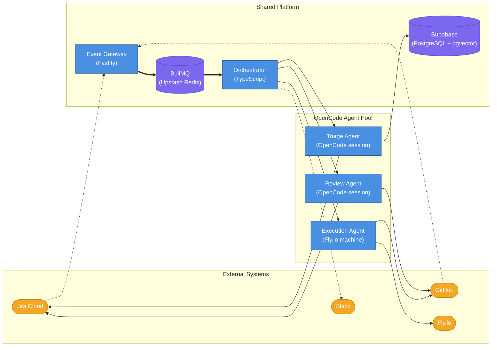

A few things worth noting in this diagram:

**Jira and GitHub are both inputs and outputs.** Jira sends webhooks in (ticket created, comment added) and receives comments back from the triage agent (clarifying questions, status updates). GitHub sends webhooks in (PR events, CI status) and receives PRs and review comments from the execution and review agents.

**Slack is async-only.** The orchestrator sends Slack notifications for escalations, approvals, and status updates, but Slack never triggers a task directly. All task entry points go through the Event Gateway.

**Supabase is shared across all three agents.** The triage agent reads and writes pgvector embeddings and task history. The execution agent reads task context written by triage. The review agent reads acceptance criteria and task metadata. One database, three consumers.

**The execution agent is the only one that touches Fly.io.** Triage and review run as lightweight OpenCode sessions on the orchestrator host. Only execution needs a full isolated VM — because it needs to clone the repo, run tests, and execute arbitrary code.

---

## 9. Engineering Department — Phase Details

The engineering department's work splits across three agents: triage, execution, and review. Each agent has a distinct responsibility boundary. They don't call each other directly — they communicate through the task state stored in Supabase and the events emitted to BullMQ.

### 9.1 Triage Agent

The triage agent runs when a Jira ticket enters the queue. Its job is to decide whether a ticket is ready to execute — and if not, to ask the right questions before any code is written.

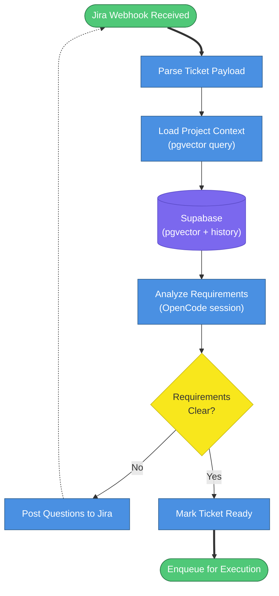

**Triage Agent Responsibilities**:

1. **Requirement extraction** — Parse ticket title, description, and acceptance criteria into a structured requirements object
2. **Codebase mapping** — Query pgvector embeddings to identify which files, modules, and functions are likely affected
3. **Historical context** — Search task history for similar past tickets and their resolutions
4. **Ambiguity detection** — Flag vague, contradictory, or missing requirements; compare against past rework patterns
5. **Scope estimation** — Classify as small (<1h), medium (1-4h), or large (4+h). Large tickets flag for human decomposition
6. **Conflict detection** — Check if in-progress tickets overlap with the same files; alert orchestrator
7. **Question generation** — Generate specific, actionable questions and post as Jira comments tagged to the reporter

The triage agent runs as an OpenCode session with MCP tools for Jira API access (read ticket, post comment) and Supabase queries. It doesn't write any code — its only output is a structured task context object written to Supabase and a status update on the Jira ticket.

---

### 9.2 Execution Agent

The execution agent does the actual coding work. It's the most complex agent in the system and the one with the most infrastructure dependencies. Every execution task runs on a dedicated Fly.io machine — full filesystem isolation, its own Docker daemon, its own local Supabase instance.

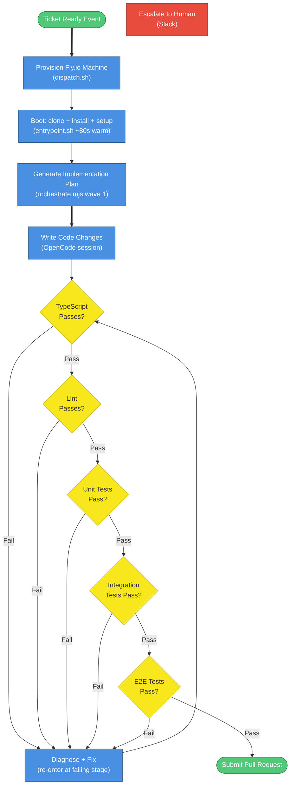

**Provisioning strategy**: `dispatch.sh` launches a `performance-2x` Fly.io machine (8GB RAM). Pre-built Docker images include the full repo, installed `node_modules`, and all tooling. The target warm boot is under 80 seconds, achieved through the `entrypoint.sh` boot lifecycle: write auth tokens, shallow clone the repo (`--depth=2`), checkout or create the branch, install dependencies against the volume-cached pnpm store, start the Docker daemon, start local Supabase, extract credentials, apply schema, configure OpenCode, then dispatch the task. Parallelized setup steps keep the total well under the target.

**Fix loop**: When a stage fails, the agent diagnoses the specific error and re-enters the pipeline at the failing stage, not from code generation. A TypeScript error goes to `FIX → TYPECHECK`. A lint failure goes to `FIX → LINT`. This stage-targeted fix approach prevents oscillation where fixing one stage breaks a previously passing stage. Maximum 3 fix iterations per stage before escalating to human.

**Escalation**: After 3 failed fix iterations on any stage, the agent escalates to Slack with the failing stage name, the full error output, the diff attempted, and a request for human guidance. The task moves to `AwaitingInput` state and waits.

**Execution Environment**:

- Isolated PostgreSQL + Supabase local instance (Docker-in-Docker)
- Redis instance for caching
- Mock external services via MSW configured from project test fixtures
- Playwright browsers for E2E testing
- Direct API testing via `supertest`

---

### 9.3 Review Agent

The review agent runs after the execution agent submits a PR. It validates the work against the original acceptance criteria, runs a code quality check, waits for CI, computes a risk score, and either auto-merges or routes to a human.

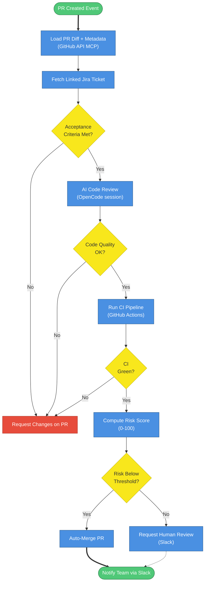

**Review Agent Responsibilities**:

1. **Acceptance criteria validation** — Map each criterion from the Jira ticket to code changes in the PR
2. **Code review** — Check for unused imports, missing error handling, hardcoded values, missing types, test coverage gaps, security anti-patterns
3. **Architectural compliance** — Verify folder structure, naming, API patterns, state management conventions
4. **Risk scoring** — 0-100 score based on: files changed, lines modified, critical paths touched (auth, payments, DB migrations), new dependencies added
5. **Merge queue management** — When multiple PRs target the same branch, respect merge order and rebase subsequent PRs

The review agent runs as an OpenCode session with GitHub PR API and Jira API MCP tools. Human approval requests are sent via Slack with rich formatting: ticket link, PR link, risk score, and test results. Approved PRs merge immediately; rejected PRs close with the reason logged to the task history in Supabase.

---

## 10. Engineering Department — Orchestration and Scaling

The diagram below shows how events flow from external webhooks through BullMQ queues into the TypeScript orchestrator, and how the orchestrator dispatches work to the three worker types. The orchestrator is the only component that reads task state and makes scheduling decisions.

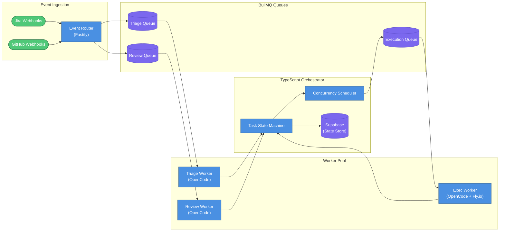

### Scaling Strategy

**Concurrency model**: Each Jira project gets a configurable concurrency limit (default: 3 concurrent executions). The scheduler enforces this via BullMQ per-queue rate limiting backed by Upstash Redis. This prevents resource exhaustion and reduces merge conflicts between parallel tasks working in the same codebase.

**Worker scaling** (solo developer starting point):

- Triage workers: 1-2 (lightweight, API calls + LLM inference). Scale when triage queue depth exceeds 10 jobs.
- Execution workers: 1-2 (heavyweight, Fly.io machines). Scale conservatively — each machine costs roughly $0.50-$2.00 per task.
- Review workers: 1 (medium-weight). Scale when the PR queue backs up.

**Multi-project isolation**: Each project gets its own BullMQ queue namespace, Supabase knowledge base partition, and concurrency budget. A high-volume project cannot starve others.

**The orchestrator is a generalized TypeScript service** — not a third-party workflow engine. It reads task state from Supabase, applies concurrency rules via BullMQ, and dispatches OpenCode sessions. It's a direct evolution of the nexus-stack `orchestrate.mjs` pattern, extracted into a multi-project service that any department archetype can use.

---

## 11. Engineering Department — Full Lifecycle Sequence

The sequence below traces a single ticket from customer creation through to Slack notification. Every participant is a real system component. The diagram shows the handoffs between BullMQ, the TypeScript orchestrator, OpenCode agents, Fly.io machines, and Supabase at each stage of the lifecycle.

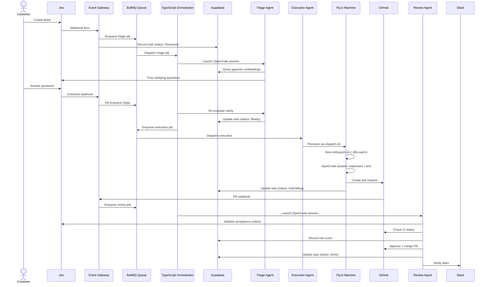

A few things worth noting in this sequence:

**BullMQ is the handoff point between every phase.** The Event Gateway never calls the orchestrator directly — it enqueues a job and returns. The orchestrator picks up jobs from BullMQ, which means the gateway is never blocked waiting for agent work to complete. Each phase transition (triage complete, execution complete, review complete) goes back through BullMQ rather than chaining function calls.

**Supabase is the source of truth throughout.** Every status change is written to Supabase before the next step proceeds. If the orchestrator crashes between phases, it can reconstruct task state from Supabase on restart and re-dispatch from the last known status.

**The triage loop can repeat.** If the customer's answers raise new questions, the triage agent re-evaluates and can post follow-up questions. The loop exits only when the agent marks the task `Ready`. The orchestrator doesn't advance to execution until that status is set.

**Fly.io machine boot is inside the execution phase.** The `~80s warm` boot is part of the execution agent's work, not a separate orchestration step. From the orchestrator's perspective, it dispatches an execution job and waits for a `Submitting` status update. What happens inside the Fly.io machine is the execution agent's concern.

---

## 12. Knowledge Base Architecture

The knowledge base infrastructure is shared across all departments. Layer 1 is vector embeddings stored in pgvector (a Supabase extension) for semantic search. Layer 2 is task history — also in Supabase — for institutional memory. Both live in the same database, so there's no additional service to spin up or maintain. Layers 3 and 4 (structural AST index and living documentation) are architecturally planned but deferred until the 2-layer approach proves insufficient.

### Layer 1 — Vector Embeddings (pgvector)

Content flows from its source through chunking and embedding into pgvector.

**Content sources by department:**

- **Engineering**: Code chunks (~500 tokens each), docstrings, README sections
- **Marketing**: Campaign playbook entries, brand guideline sections, performance benchmark records

**Indexing process:**

1. On every merge to `main` (triggered via GitHub webhook), re-index changed files
2. Nightly full reindex for departments with external content (campaign data, market benchmarks)
3. Embeddings generated via OpenRouter (`text-embedding-3-small` or equivalent)
4. Stored in Supabase `knowledge_embeddings` table with: `department`, `project_id`, `source_type`, `content_chunk`, `embedding` (vector), `metadata` (jsonb), `tenant_id`

**Query interface:**

```sql
SELECT content_chunk
FROM knowledge_embeddings
WHERE department = $1
ORDER BY embedding <=> $2
LIMIT 10
```

### Layer 2 — Task History

Supabase tables already used for platform operation serve as institutional memory. No separate database needed.

- `tasks` table: all past tasks with status, requirements, affected files, scope estimate
- `deliverables` table: PR URLs, ad campaign IDs, journal entry references
- `reviews` table: review outcomes, comments, risk scores
- `feedback` table: human corrections (from Section 21)

The triage agent queries this history with: "find past tasks with similar requirements to this ticket" — combining vector similarity (Layer 1) with SQL filters on the task history (Layer 2).

### Layers 3-4 (Deferred)

> **Layer 3 — Structural Index** (Deferred): Tree-sitter AST parsing to build a dependency graph for the engineering codebase. Enables navigation from a feature area to exact files and functions. Add when triage quality needs improvement — specifically when triage agents frequently identify the wrong files.
>
> **Layer 4 — Living Documentation** (Deferred): Architecture decision records (ADRs), API specs, and style guides. Can be folded into Layer 1 (as text chunks for vector search) when needed. Add when architectural compliance issues emerge in review.

### Pipeline Diagram

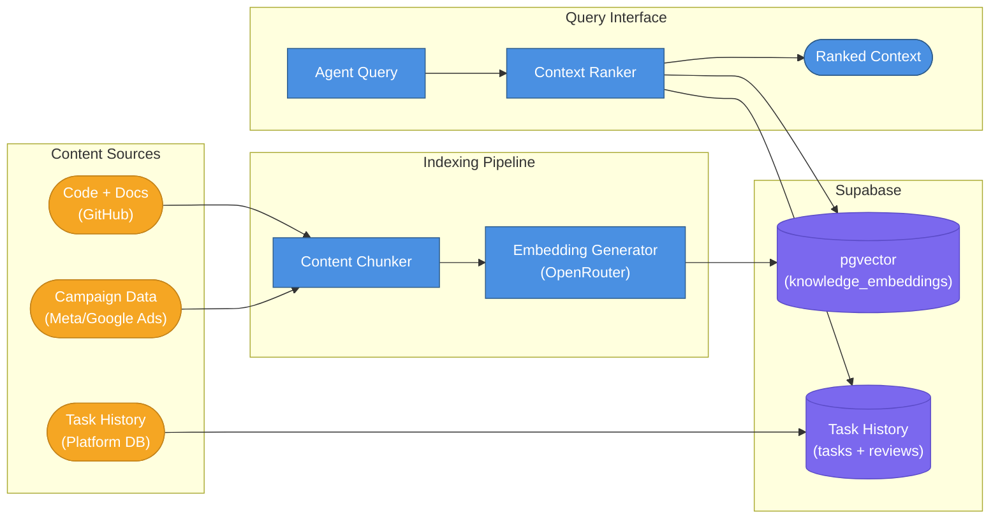

### Per-Department Content

| Layer | Engineering | Paid Marketing | Finance (future) | Sales (future) |
|---|---|---|---|---|
| Vector Embeddings (L1) | Code chunks, docstrings, README | Campaign playbooks, brand guides | Chart of accounts, expense policies | Sales playbook, email templates |
| Task History (L2) | Past tickets, PRs, resolutions | Past campaign optimizations, ROAS data | Past categorizations, reconciliations | Past deals, outreach sequences |
| Structural Index (L3, deferred) | Tree-sitter AST dependency graph | Campaign hierarchy structure | — | — |
| Living Docs (L4, deferred) | ADRs, API specs, style guides | Brand guidelines, platform policies | Tax rules, approval hierarchies | ICP definitions, pricing matrix |

### Migration Path

> **Scale consideration**: pgvector handles tens of millions of vectors efficiently. If vector query performance becomes a bottleneck (typically beyond 5M vectors with a sub-100ms p99 latency requirement), migrate to Qdrant — a dedicated vector database with HNSW indexing optimized for high-throughput similarity search. The migration requires re-embedding and reindexing, but no application logic changes if the query interface is abstracted behind a repository pattern.

---

## 13. Platform Data Model

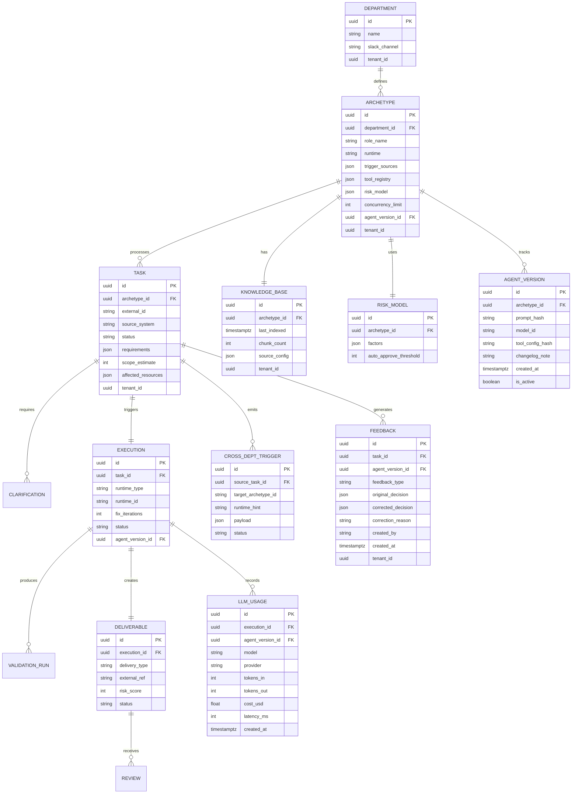

`tenant_id` appears on every entity that will need multi-tenant isolation when the platform goes SaaS. V1 has only one tenant, so application logic doesn't enforce it yet. The schema supports it from day one. Supabase Row-Level Security policies can be added at any time to enforce per-tenant isolation without touching the schema or application code.

---

## 14. Platform Shared Infrastructure

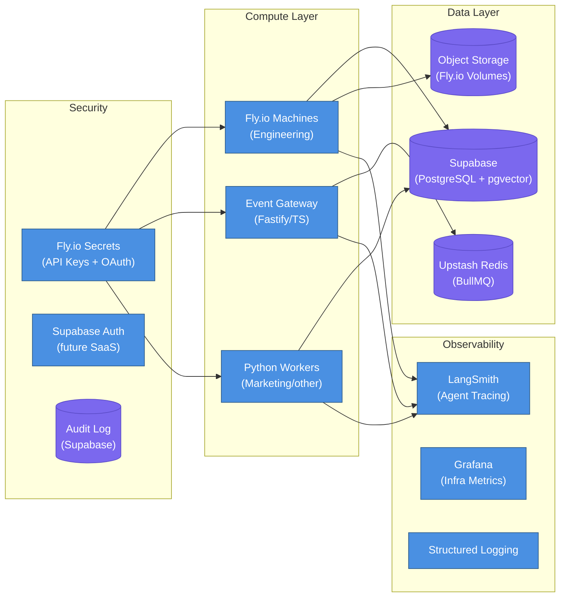

### Runtime Selection

| Runtime Type | Use When | Departments | Cost Profile |
|---|---|---|---|
| **Fly.io Machine** | Full OS isolation, long-running processes, filesystem access | Engineering | ~$0.50-$2.00/task |
| **In-Process Python Worker** | API-heavy work, no filesystem needed, fast turnaround | Marketing (optimization), Finance, Sales | ~$0.01-$0.05/task |
| **Event Gateway Worker** | Simple API calls, notifications, webhooks | Cross-platform routing | Negligible |

The tiered approach keeps costs in check. Running 20 engineering tickets/day on Fly.io machines costs ~$10-$40/day. Running 50 marketing optimization tasks in-process costs less than $3/day. The architecture supports both without structural changes. The archetype's `runtime_config` determines which tier gets provisioned at execution time.

---

## 15. Technology Stack

The table below covers every component in the stack. The "Alternative" column shows what was considered and why it wasn't chosen — or what to migrate to if the recommended choice stops working.

| Component | Recommended | Why | Alternative |
|---|---|---|---|
| **Platform Layer** | Fastify (TypeScript) | Fast, lightweight, OpenAPI plugin, type safety | Express |
| **Eng Agent Runtime** | OpenCode (`opencode serve` + `@opencode-ai/sdk`) | Purpose-built for AI coding workflows. Proven in nexus-stack. Handles file editing, git, tests, LSP. | — |
| **Non-Eng Agent Runtime** | LangGraph (Python) | Durable execution via PostgreSQL checkpointing, graph-based state, human-in-the-loop interrupts | CrewAI |
| **Orchestration (Eng)** | Custom TypeScript (generalized `orchestrate.mjs`) | Already proven. Wave-based execution, session management, SSE monitoring. | — |
| **Orchestration (Non-Eng)** | LangGraph workflows | Built-in checkpointing; crash-safe; human interrupts | Inngest, Trigger.dev |
| **Job Queue** | BullMQ + Upstash Redis | Battle-tested, official Python client (1.7M+ downloads/mo), per-queue concurrency | SQS |
| **Database + Vectors** | Supabase (PostgreSQL + pgvector) | MCP server, AI toolkit, Edge Functions, Auth, already in nexus-stack | Neon |
| **LLM Access** | OpenRouter | Unified API for 100+ models, eliminates custom routing, provider-cost pricing | Direct provider APIs |
| **LLM Optimization** | Claude Max 20x subscription | Reduces LLM costs to ~$0 for Claude models when under rate limits | — |
| **Execution Compute (Eng)** | Fly.io Machines API | Proven in nexus-stack, pay-per-second, full isolation, volume persistence | Modal |
| **Execution Compute (Non-Eng)** | In-process Python workers | No isolation needed for API-only tasks; lowest cost | — |
| **Code Gen LLM** | Claude Opus/Sonnet (via OpenRouter) | Best code quality, long context window | GPT-4.1 |
| **General Task LLM** | Claude Sonnet (via OpenRouter) | Speed + quality balance for non-coding tasks | GPT-4o-mini |
| **Notifications** | Slack API | Already in use, rich formatting, approval workflows | — |
| **Human Interaction** | Slack-first | Approvals, questions, escalations all in Slack | — |
| **Knowledge Base** | pgvector in Supabase | No extra service, shared with application DB | Qdrant (at scale) |
| **E2E Testing** | Playwright | Multi-browser, proven in nexus-stack | Cypress |
| **CI Integration** | GitHub Actions | Native to GitHub | — |
| **CRM Integration** | GoHighLevel API | Already in stack for sales + marketing | HubSpot |
| **Ad Platform** | Meta Marketing API | Primary paid channel | Google Ads API |
| **Accounting** | QuickBooks Online API | Standard for SMB finance automation | Xero |
| **Agent Observability** | LangSmith | Native LangGraph integration, agent trace visualization | — |
| **Infra Observability** | Grafana + structured logging | Open source, flexible, free to self-host | Datadog |

### Key Changes from the Original Architecture Document

Four decisions changed significantly from the first draft of this document. Each change reduces operational complexity without sacrificing capability.

**OpenCode for the engineering agent runtime**: The original document referenced a general-purpose assistant framework. OpenCode is the coding-specific agent runtime already running in the nexus-stack. It handles file editing, git operations, test execution, and LSP diagnostics out of the box. There's no reason to build those integrations from scratch.

**Custom TypeScript orchestrator instead of a dedicated workflow engine**: A dedicated workflow engine (Temporal-style) adds significant operational complexity for a solo developer — a separate server, worker registration, workflow versioning, and a new mental model for every contributor. The generalized `orchestrate.mjs` pattern gives 80% of the value at 10% of the ops cost. A dedicated workflow engine remains a valid migration path if the platform grows to a team and the orchestrator becomes a bottleneck.

**pgvector in Supabase instead of a dedicated vector database**: Supabase eliminates a separate vector database service. pgvector handles tens of millions of vectors efficiently. A dedicated vector database (such as Qdrant) remains a future migration path if pgvector query performance becomes a bottleneck at scale.

**OpenRouter instead of a custom LLM router**: Building a custom router that handles provider fallback, model selection, and cost tracking is weeks of work. OpenRouter does all of this out of the box with a single API key. The platform's "LLM Gateway" is a thin wrapper on top of OpenRouter, not a custom-built router.

---

## 16. Implementation Roadmap

This roadmap assumes one developer. Milestones are sequential — do not begin a milestone until the previous one is fully validated in production (shadow mode, then supervised, then autonomous). Timeline estimates are approximate; quality gates matter more than dates.

| Milestone | Focus | Weeks | Gate |
|---|---|---|---|
| M1 | Platform Foundation | 1-3 | BullMQ queues processing events end-to-end |
| M2 | Engineering Triage Agent | 4-6 | Agent posting accurate questions on real Jira tickets |
| M3 | Engineering Execution Agent | 7-10 | Agent creating compilable PRs for simple tickets |
| M4 | Engineering Review Agent | 11-13 | Auto-merge working for low-risk PRs |
| M5 | Engineering Multi-Project | 14-15 | 2-3 projects onboarded with per-project isolation |
| M6 | Paid Marketing Department | 16-20 | LangGraph campaign optimization running on real ad accounts |

### M1 — Platform Foundation (Weeks 1-3)

The foundation everything else runs on. No agents yet — just the infrastructure that agents will use.

- Event Gateway (Fastify/TypeScript) with Jira and GitHub webhook handlers
- BullMQ + Upstash Redis for job queuing with per-department namespaces
- Supabase schema: `tasks`, `archetypes`, `executions`, `feedback`, `llm_usage` tables
- Archetype Registry with the engineering archetype config
- Basic Grafana dashboard for queue health and job throughput

**Gate**: A Jira webhook fires, the Event Gateway normalizes it, BullMQ enqueues the job, and the job appears in the Grafana dashboard. No agent work yet — just the plumbing.

### M2 — Engineering Triage Agent (Weeks 4-6)

The first agent. Triage is the right starting point because it's read-only — the agent can't break anything.

- Knowledge base indexing pipeline: pgvector embeddings for one pilot project
- Triage agent in OpenCode with Jira MCP tools (read ticket, post comment)
- Shadow mode: agent triages but a human reviews all AI outputs before anything is posted
- Feedback table populated with first corrections

**Gate**: Agent posts accurate, specific clarifying questions on real Jira tickets. Human reviewer agrees the questions are relevant at least 75% of the time.

### M3 — Engineering Execution Agent (Weeks 7-10)

The hardest milestone. This is where the Fly.io machine lifecycle, the fix loop, and the OpenCode session management all come together.

- Generalize the nexus-stack fly-worker for multiple projects (not just nexus-stack)
- Execution agent with stage-targeted fix loop (TypeScript, lint, unit, integration, E2E)
- Fix iteration budget (3 per stage) with Slack escalation on budget exhaustion
- Supervised mode: human approves all PRs before merge

**Gate**: Agent creates compilable PRs for simple, well-scoped tickets. Human reviewer can approve without requesting changes at least 60% of the time.

### M4 — Engineering Review Agent (Weeks 11-13)

Closes the loop. The review agent is what makes autonomous operation possible — without it, every PR needs a human.

- Review agent with GitHub PR API MCP tools
- Risk scoring model (files changed, critical paths, new dependencies)
- Auto-merge for low-risk PRs; Slack approval request for high-risk
- Merge queue with rebase-on-merge for concurrent PRs

**Gate**: Auto-merge working correctly for low-risk PRs. No regressions introduced by auto-merged PRs in the first two weeks of operation.

### M5 — Engineering Multi-Project (Weeks 14-15)

Validates that the platform generalizes beyond the pilot project.

- Per-project concurrency scheduler (configurable limit per project)
- File-level conflict detection at dispatch
- Onboard 2-3 additional projects with their own knowledge bases
- Full autonomous operation with monitoring

**Gate**: Two or more projects running autonomously without cross-project interference. Escalation rate below 25%.

### M6 — Paid Marketing Department (Weeks 16-20)

The second department. This validates that the archetype pattern generalizes beyond engineering.

- LangGraph Python workers with BullMQ consumer
- Meta Ads API and Google Ads API integration
- Campaign optimization triage, execution, and review agents
- In-process Python execution (no Fly.io needed for marketing tasks)
- Shadow mode, then supervised, then autonomous progression

**Gate**: LangGraph campaign optimization running on real ad accounts in supervised mode. Agent recommendations match human judgment at least 70% of the time.

### Future Milestones (No Timeline)

These are architecturally planned but not scheduled. Each requires the previous departments to be independently stable before starting.

- **Finance Department**: Invoice processing, expense categorization, reconciliation
- **Sales Department**: Lead qualification, CRM enrichment, outreach sequences
- **Organic Content Department**: Blog posts, social content, SEO articles
- **Cross-Department Workflows**: Sales-to-Engineering-to-Finance chains (Section 5)
- **SaaS Multi-Tenancy**: Row-Level Security enforcement, tenant onboarding
- **LLM A/B Testing**: Route N% of tasks to new model versions, compare metrics
- **Self-Service Onboarding**: UI for adding new departments without developer involvement

---

## 17. Cost Estimation

All pricing is approximate and based on current service rates at time of writing. Check each provider's pricing page before budgeting. LLM pricing in particular changes frequently — see openrouter.ai/pricing for current rates.

### Infrastructure Fixed Costs (Monthly)

These costs are constant regardless of task volume.

| Service | Plan | Cost/Month |
|---|---|---|
| Supabase | Pro | ~$25 |
| Upstash Redis | Pay-as-you-go | ~$5-15 |
| LangSmith | Plus | ~$39 |
| Fly.io (persistent services) | 2-3 always-on apps | ~$15-30 |
| **Total fixed** | | **~$84-109/month** |

### Variable Costs — Engineering Tasks

Each engineering task incurs LLM costs and Fly.io machine time. The range reflects ticket complexity.

| Component | Cost Range | Notes |
|---|---|---|
| Triage LLM (Claude Sonnet via OpenRouter) | ~$0.05-$0.15 | Depends on ticket complexity |
| Execution LLM (Claude Opus via OpenRouter) | ~$0.50-$3.00 | Depends on code complexity |
| Fly.io machine (`performance-2x`) | ~$0.50-$2.00 | ~30-90 min per task |
| Review LLM (Claude Sonnet via OpenRouter) | ~$0.10-$0.40 | Depends on PR size |
| **Total per engineering task** | **~$1.15-$5.55** | Without Claude Max |
| **With Claude Max 20x** | **~$0.50-$2.00** | LLM costs ~$0; compute unchanged |

Claude Max 20x reduces LLM costs to near zero for Claude models when under rate limits. The Fly.io machine cost is unchanged — that's compute, not inference.

### Variable Costs — Marketing Tasks

Marketing tasks run in-process (no Fly.io machine), so costs are almost entirely LLM inference.

| Component | Cost Range |
|---|---|
| LangGraph workflow LLM (Claude Sonnet via OpenRouter) | ~$0.05-$0.20 |
| In-process compute | ~$0.01-$0.03 |
| **Total per marketing task** | **~$0.06-$0.23** |

### Monthly Projection at Steady State

| Scenario | Volume | Monthly Variable Cost |
|---|---|---|
| Engineering only (without Claude Max) | 20 tasks/day | ~$690-$3,330 |
| Engineering only (with Claude Max) | 20 tasks/day | ~$300-$1,200 |
| Engineering + Marketing | 20 eng + 30 mkt/day | ~$750-$3,700 |

These projections don't include fixed infrastructure costs (~$84-109/month).

### Honest Framing

The platform accelerates a solo developer's output by 3-5x — it doesn't replace headcount. Human oversight, maintenance, escalation handling, and prompt refinement are still required. The cost model makes sense when the value of the accelerated output exceeds the infrastructure and LLM costs. For engineering, that threshold is low: one complex ticket automated per day at $5 cost is worth it if that ticket would have taken 2-4 hours of developer time.

---

## 18. Risk Mitigation

### Platform-Level Risks

These risks apply across all departments.

| Risk | Mitigation |
|---|---|
| Claude Max subscription ToS (automated usage) | Always maintain OpenRouter as fallback. Monitor Anthropic policy updates. Never architect the system to depend on Max being available. |
| Cross-language (TypeScript + Python) deployment complexity | Separate Dockerfiles per language. Clear API contract via BullMQ. Documented local dev setup for both runtimes. |
| Solo developer unavailability | Alert fatigue is real. Tune escalation thresholds so non-critical tasks wait in queue rather than spam Slack. |
| LLM provider outage | LLM Gateway fallback chain: Claude (Max) → Claude (OpenRouter) → GPT-4o → GPT-4o-mini. |
| Cost runaway | Per-department daily budget caps enforced in BullMQ; Slack alert at 80% of monthly ceiling. |
| Knowledge base staleness | Per-project reindex on every merge to `main`; nightly full reindex for external content; drift detection via embedding distance score. |
| Unauthorized autonomous actions | Risk-model-driven gates per department; full audit trail in Supabase `audit_log` table. |

### Engineering-Specific Risks

These risks are specific to the engineering department's code execution model.

| Risk | Mitigation |
|---|---|
| AI generates buggy code that passes tests | 3-iteration fix budget per stage + human review gate for high-risk changes. |
| Fix loop oscillation (fixing one stage breaks another) | Stage-targeted fix loop: re-enter at the failing stage, not at code generation. |
| Webhook delivery failures | BullMQ retries with exponential backoff + hourly Jira reconciliation poll as safety net. |
| Fly.io machine hangs | 90-minute hard timeout + 10-minute stale machine detection (no heartbeat). |
| Merge conflicts between concurrent PRs | File-level conflict detection at dispatch; serialized merge queue with rebase-on-merge. |

---

## 19. Department Onboarding Checklist

Use this checklist when adding a new department to the platform. Steps are sequential — each one depends on the previous. Don't skip shadow mode.

1. **Define the archetype** — Identify trigger sources, tools, knowledge base content, risk model, delivery targets, and `runtime` type (`opencode` / `langgraph` / `in-process`). Write the archetype config object and register it in the Archetype Registry.

2. **Register webhook endpoints** — Extend the Event Gateway with handlers for the department's trigger sources. Normalize incoming events to the universal task schema. Test with real webhook payloads before proceeding.

3. **Configure the LLM Gateway** — Select appropriate models per task type in the archetype config (triage, execution, review). Set token budget limits per task type. Verify the fallback chain works for this department's task profile.

4. **Build the knowledge base** — Index domain content into pgvector with department-scoped namespacing. Set up the indexing pipeline (trigger on source changes) and refresh schedule (nightly for external content). Verify query results are relevant before wiring to agents.

5. **Implement the triage agent** — OpenCode session or LangGraph workflow with department-specific tools. Tools for reading source data and generating clarifying questions. Test against a sample of real historical tasks before going live.

6. **Implement the execution agent** — OpenCode + Fly.io machine (engineering) or LangGraph in-process (marketing and other departments). Execution tools, fix loop, escalation path. Test against simple, well-scoped tasks first.

7. **Implement the review agent** — OpenCode session or LangGraph workflow with validation tools and risk scoring. Define what "acceptable output" means for this department before writing the review logic.

8. **Configure the risk model** — Define factors, weights, and thresholds. Start conservative (low auto-approve threshold, high escalation rate). Loosen as confidence grows. Document the initial weights so you have a baseline to compare against.

9. **Shadow mode** (2-4 weeks) — Run the full pipeline on live tasks but suppress all external actions. The agent triages, executes, and reviews, but nothing is posted, merged, or published. A human reviews all AI output and populates the feedback table with corrections.

10. **Supervised mode** — Enable external actions but require human approval for every delivery. Gradually increase the auto-approval threshold as the feedback table shows consistent accuracy. Don't rush this step.

11. **Autonomous mode** — Full autonomous operation with human escalation only for high-risk tasks. Monitor via Grafana (queue health, escalation rate) and LangSmith (agent traces, error patterns). Run the weekly prompt refinement ritual from Section 21.

---

## 20. Success Metrics

These metrics are appropriate for a solo developer starting point. V1 targets are aspirational — you're building the measurement infrastructure alongside the capability. Measure accuracy from Day 1 via the feedback table, even before you have optimization levers to pull.

### Platform Health (V1 Targets)

| Metric | V1 Target | Alert Threshold |
|---|---|---|
| Task throughput | > 10 engineering tasks/day | < 5 tasks/day |
| Queue wait time (p95) | < 10 minutes | > 30 minutes |
| Escalation rate | < 25% (loosens over time) | > 50% |
| LLM cost per task | Track baseline, trend down | > 2x baseline |
| Agent prompt refinement rate | Weekly review + update cycle | No updates in 30 days |

The escalation rate target of < 25% is intentionally loose for V1. Starting at 50-60% escalation is normal and expected. The goal is a downward trend over weeks, not hitting 25% on day one.

### Per-Department Quality (Aspirational V1 Targets)

| Metric | Engineering | Paid Marketing |
|---|---|---|
| Triage accuracy (questions relevant) | > 75% | > 70% |
| Execution success (no human rework) | > 60% | > 70% |
| Review catch rate (bad output blocked) | > 90% | > 85% |
| Time to PR (vs. human baseline) | 40% faster | 60% faster |

Marketing targets are slightly more aggressive than engineering because marketing tasks are more structured (API calls with defined inputs and outputs) and less open-ended than code changes.

### How to Measure

- **Triage accuracy**: Track via the `feedback` table. Every time a human overrides a triage decision, that's a miss. Accuracy = (total triage decisions - overrides) / total triage decisions.
- **Execution success**: Track via PR review outcomes. A PR that requires changes after human review counts as a partial failure. A PR that merges without changes counts as a success.
- **Review catch rate**: Track via post-merge regressions. If a merged PR introduces a bug that a human reviewer would have caught, that's a miss.
- **Time to PR**: Compare `task.created_at` to `deliverable.created_at` against the historical average for similar tickets.

### What Not to Measure in V1

Don't track "tasks completed per day" as a primary metric in V1 — it incentivizes rushing through shadow mode and supervised mode. Quality gates matter more than throughput until the system is proven. Throughput becomes the primary metric in V2, once quality is established.

---

## 21. Feedback Loops

Feedback loops are built into V1 from the start, not bolted on later. Every time a human overrides an AI decision, that correction becomes a training signal. Without a feedback mechanism, the platform is static: it makes the same mistakes indefinitely. With feedback, it improves over time. The mechanism is intentionally simple. Capture corrections, aggregate weekly, apply to prompts and risk weights. No ML pipelines, no automated retraining. Just a structured record of where the AI was wrong and a weekly ritual to act on it.

### 21.1 Correction Capture

When a human overrides an AI decision, the system captures the full context of that correction. This is the raw material for all downstream improvement.

**What gets captured:**

- The task ID and agent version that produced the original decision
- The original decision (e.g., "auto-merged", "triaged as small scope", "risk score: 30")
- The human correction (e.g., "requested changes", "decomposed into 3 tickets", "risk score: 70")
- The correction reason (free text, optional but encouraged)
- Timestamp and which human made the correction

**Storage:** `feedback` table in Supabase.

```sql
CREATE TABLE feedback (
  id                uuid DEFAULT gen_random_uuid(),
  task_id           uuid REFERENCES tasks(id),
  agent_version_id  uuid,
  feedback_type     text NOT NULL,  -- 'triage_override', 'merge_override', 'risk_score_adjustment', 'pr_rejection'
  original_decision jsonb,
  corrected_decision jsonb,
  correction_reason text,
  created_by        text,
  created_at        timestamptz DEFAULT now(),
  tenant_id         uuid  -- future SaaS isolation
);
```

The `feedback_type` field drives aggregation. Triage overrides cluster differently from merge overrides, and each type informs a different part of the system. The `original_decision` and `corrected_decision` columns are JSONB so the schema stays flexible as agent behavior evolves.

### 21.2 Prompt Refinement Queue

Raw corrections don't improve the system on their own. The Prompt Refinement Queue is the weekly process that turns captured corrections into better agent behavior.

**Weekly aggregation process:**

1. Query all feedback entries from the past 7 days, grouped by `feedback_type`
2. For each type, identify patterns: are triage overrides concentrated in a specific project? Are risk scores consistently underestimated for migration tickets?
3. Draft prompt adjustments targeting those patterns
4. Review and apply the prompt changes (update the archetype's agent version record)
5. Log the change: what was the pattern, what was changed, when

This is a **weekly ritual** for the solo developer, not an automated process in V1. It takes 15-30 minutes. The Monitoring Runbook (Section 27) includes this in the weekly checklist.

The goal isn't perfection. It's directional improvement. If triage overrides drop from 8 per week to 3 per week over a month, the feedback loop is working.

### 21.3 Risk Model Tuning

Risk weights drift out of calibration over time. A factor that was correctly weighted at launch may be over- or under-weighted after a few months of real usage. Risk Model Tuning corrects this.

**After each human escalation or missed escalation:**

- If a task was auto-merged but a human later identified a regression, increase the weight of the relevant risk factor
- If a task was escalated for human review but the human approved immediately, decrease the weight of the triggering factor
- Log the adjustment: factor, old weight, new weight, reason

Risk weights are stored in the archetype's `risk_model` configuration in Supabase. Changes require updating the ARCHETYPE record, which automatically applies to subsequent tasks. No code deployment needed.

### 21.4 Feedback Flow

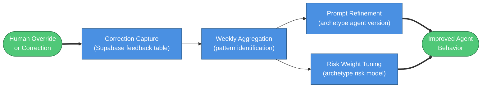

> **This is a V1 feature.** The feedback table schema and correction capture hooks must be implemented alongside the first triage agent, not added in a later milestone. The data model is simple; the cost is low; the value compounds over time. Deferring feedback infrastructure means operating blind for months.

---

## 22. LLM Gateway Design

All agent code calls the LLM Gateway. No agent ever calls a provider directly. The gateway owns model selection, provider routing, fallback logic, and cost tracking. This means swapping models or providers is a config change, not a code change. Agents don't know or care whether they're talking to Claude, GPT-4o, or an open-source model. They send a request to the gateway and get a response back.

The gateway is not a custom-built router. OpenRouter (openrouter.ai) serves as the primary interface, handling routing across 100+ models through a single API endpoint. The platform's "gateway" is a thin wrapper that adds cost tracking, fallback orchestration, and the optional Claude Max optimization layer on top of OpenRouter.

### Primary Interface: OpenRouter

OpenRouter is a unified API that proxies to Anthropic Claude, OpenAI GPT-4o, Google Gemini, Meta Llama, and hundreds of other models. It's compatible with the OpenAI API format, so integration is minimal. Pricing is pay-per-token at rates equal to or below direct provider pricing. See openrouter.ai/pricing for current rates.

Key benefits for this platform:

- **Single API key** for all LLM access. No managing separate Anthropic, OpenAI, and Google credentials.
- **No custom router needed.** OpenRouter handles model routing, so the platform doesn't build one.
- **Automatic fallback** at the provider level if a model is unavailable.
- **Model switching** via config. Upgrading from Claude Sonnet to Opus is a one-line change.

### Cost Optimization: Claude Max Subscription

Claude Max 20x provides high-volume Claude access at a flat monthly rate. When available, the gateway routes Claude requests through the Max subscription to avoid per-token costs. This is an optimization layer, not a dependency.

The `@ex-machina/opencode-anthropic-auth` plugin in the nexus-stack already implements the OAuth token pattern for this. The same mechanism applies here.

**Important caveat:** Automated API usage under a Max subscription may require verification against Anthropic's terms of service. Always maintain OpenRouter as the fallback. Never architect the system to depend on Max being available.

### Fallback Chain

```
Primary: Claude (via Max subscription, if available)
    ↓ (if rate limited or unavailable)
Fallback 1: Claude (via OpenRouter, pay-per-token)
    ↓ (if Claude is down)
Fallback 2: GPT-4o (via OpenRouter)
    ↓ (if all premium models unavailable)
Fallback 3: GPT-4o-mini or open-source model (via OpenRouter)
```

The gateway checks Max availability on each request. If the Max token is expired, rate-limited, or returns an error, it falls through to Fallback 1 immediately. Fallback 2 and 3 only trigger on provider-level failures, not on individual request errors.

### Cost Tracking

Every LLM request is logged to the Supabase `llm_usage` table before the response is returned to the caller. This is synchronous to ensure no requests are missed.

| Column | Type | Description |
|---|---|---|
| `task_id` | uuid | Links to the task that triggered this request |
| `department` | text | `engineering`, `marketing`, etc. |
| `agent_version_id` | uuid | Which agent version made the call |
| `model` | text | Exact model used (e.g., `claude-3-5-sonnet-20241022`) |
| `provider` | text | `anthropic-max`, `openrouter`, etc. |
| `tokens_in` | int | Input token count |
| `tokens_out` | int | Output token count |
| `latency_ms` | int | Time from request to first token |
| `cost_usd` | numeric | Calculated cost at time of request |

This data feeds the cost estimation dashboards described in Section 17.

### Model Selection by Task Type

| Task Type | Recommended Model | Rationale |
|---|---|---|
| Engineering triage | Claude Sonnet (via OpenRouter) | Fast, sufficient reasoning for codebase analysis |
| Engineering execution (code gen) | Claude Opus (via OpenRouter or Max) | Best code quality, handles complex TypeScript |
| Engineering review | Claude Sonnet | Fast enough for review, cost-effective |
| Marketing triage | Claude Sonnet | API analysis, not code |
| Marketing execution | Claude Sonnet | Sufficient for campaign optimization decisions |
| High-volume simple tasks | GPT-4o-mini | Cost-efficient for bulk operations |

Model assignments live in agent config, not in code. Changing the model for a task type is a config update that takes effect on the next deployment.

### Architecture Diagram

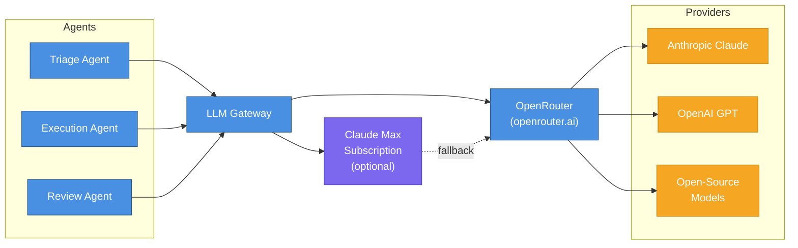

---

## 23. Agent Versioning

Every agent that runs in this platform is versioned. This isn't optional — it's what makes the system debuggable and improvable over time.

### Version Schema

Each agent version is a row in the Supabase `agent_versions` table with these fields:

- `prompt_hash` — SHA256 of the prompt template. Changes when the prompt changes, even if the model doesn't.
- `model_id` — The LLM model used (e.g., `anthropic/claude-opus-4-5`). Changes when you switch models.
- `tool_config_hash` — SHA256 of the tool configuration JSON. Changes when tools are added, removed, or reconfigured.
- `changelog_note` — Human-readable description of what changed and why.
- `is_active` — Whether this version is currently live for new tasks.

The combination of `prompt_hash + model_id + tool_config_hash` uniquely identifies a version. If any of the three change, a new version row is created.

### Linking Versions to Executions

Every `EXECUTION` record includes `agent_version_id`. This enables forensic queries: "which version of the triage agent caused this misclassification?" Every `FEEDBACK` record also includes `agent_version_id`, linking human corrections to the exact version that made the error. Over time, this builds a per-version performance profile.

### Rollback

If a new prompt version underperforms, update the ARCHETYPE record's `agent_version_id` to the previous version's ID. The change takes effect immediately for all subsequent tasks. Old tasks retain their original version ID for audit purposes — you never lose the historical record of what ran.

### Changelog Discipline

Each version update requires a changelog entry: date, what changed, why, and the performance delta observed (e.g., "triage accuracy: 78% to 84%, 15-task sample"). This keeps the version history human-readable, not just a hash log.

### A/B Testing (Future)

Route N% of tasks to the new version while keeping the proven version as default. Compare metrics after a statistically significant sample. Not in V1 — the single-version rollback mechanism is sufficient for now.

---

## 24. API Rate Limiting

### The Problem

Multiple concurrent tasks hitting Jira, GitHub, and Meta Ads from the same account can exceed per-account rate limits. Without platform-level management, individual tasks get throttled, retries pile up, and you get cascading delays or outright failures during busy periods.

### Solution: Centralized Token Bucket

A centralized rate limiter runs as middleware in the Event Gateway (TypeScript). It uses Upstash Redis as the distributed token bucket backend. Each external API gets a configured limit, and the bucket is shared across all concurrent workers. No single worker can starve the others, and no API account gets hammered.

### Backpressure

When a rate limit bucket drops below 20% capacity, the orchestrator delays task dispatch rather than failing. Tasks queue in BullMQ with a calculated delay based on the refill rate. They retry transparently from the caller's perspective. This prevents the thundering herd problem when multiple tasks start simultaneously after a quiet period.

### Per-API Configuration

| External API | Platform Rate Limit | Recommended Budget | Bucket Refill |
|---|---|---|---|
| Jira REST API | 1,000 req/minute (Cloud) | 200 req/minute | Per minute |
| GitHub REST API | 5,000 req/hour (authenticated) | 1,000 req/hour | Per hour |
| GitHub GraphQL | 5,000 points/hour | 1,000 points/hour | Per hour |
| Meta Marketing API | Varies by endpoint | 30% of limit | Per window |
| GoHighLevel API | 400 req/minute | 100 req/minute | Per minute |

The "Recommended Budget" column is conservative by design. It leaves headroom for manual API calls from developers and other tooling that shares the same credentials.

### Monitoring

Rate limit utilization per API per department is tracked in Supabase. A Slack alert fires at 80% utilization so you can investigate before hitting the ceiling. LangSmith traces include rate limit wait times, making it easy to spot which tasks are spending time in the backpressure queue versus actually doing work.

---

## 25. Security Model

### Secret Storage

All credentials live in Fly.io Secrets. Never in `.env` files, never in code, never in version control. Secrets are injected as environment variables at machine startup. Rotating a credential means updating it in Fly.io and redeploying — no code changes required.

### OAuth Token Lifecycle

The nexus-stack's `sync-token.sh` pattern manages OAuth tokens that expire on short cycles (Claude Max subscription tokens expire every 24-48 hours). The sync script refreshes them and updates Fly.io Secrets automatically. Any OAuth-based integration added to this platform (Meta Ads API, GoHighLevel, etc.) must follow the same pattern. Manual token management doesn't scale.

### Per-Department Credential Scoping

Each department's agent workers receive only the credentials they need:

- **Engineering agents**: `GITHUB_TOKEN`, `JIRA_TOKEN`
- **Marketing agents**: `META_ADS_TOKEN`, `GOOGLE_ADS_TOKEN`, `GOHIGHLEVEL_TOKEN`

No agent receives cross-department credentials. A marketing agent cannot touch GitHub. An engineering agent cannot touch Meta Ads. This is enforced at the Fly.io machine level, not just in application code.

### Least Privilege

Agents get minimum permissions within their credential scope:

- **Engineering**: Create PRs, post Jira comments, read repos. Cannot merge to `main` without a human review gate.
- **Marketing**: Create campaign drafts. Cannot publish without an approval gate.
- **All agents**: Read access to the Supabase knowledge base. Write access only to their own task records.

### Audit Trail

Every external API call is logged to the Supabase `audit_log` table: `timestamp`, `agent_version_id`, `task_id`, `api_endpoint`, `http_method`, `response_status`. This supports both debugging ("what did the agent actually call?") and compliance ("show me all actions taken on this account in the last 30 days").

### Future Multi-Tenant Isolation

When the platform goes multi-tenant, each tenant's credentials get Fly.io Secrets with tenant-scoped namespacing. Supabase Row-Level Security enforces data isolation at the database layer. Cross-tenant credential access isn't just prevented by policy — it's architecturally impossible.

---

## 26. Disaster Recovery

### Philosophy

The platform relies entirely on managed services with built-in redundancy. The DR strategy is: managed services handle infrastructure failures; the platform handles retries. Custom DR infrastructure isn't cost-justified for a solo developer. Every service choice in this architecture was made partly because it handles its own availability.

### Failure Modes and Recovery

| Failure | Detection | Recovery | Auto/Manual |
|---|---|---|---|
| Supabase outage | BullMQ job fails with DB connection error | BullMQ retries with exponential backoff; Supabase PITR recovers data to last checkpoint | Auto |
| Upstash Redis outage | Event Gateway cannot enqueue jobs | Exponential backoff on webhook receipt; jobs re-enqueue when Redis recovers | Auto |
| Fly.io machine crash | No heartbeat for 10 minutes | Orchestrator marks task as failed; re-dispatches to a new machine | Auto |
| LLM provider outage | OpenRouter returns 5xx or timeout | LLM Gateway fallback chain: Claude primary to GPT-4o to GPT-4o-mini | Auto |
| Webhook delivery failure | Jira/GitHub built-in retry exhausted | Event Gateway is idempotent (deduplication by webhook ID); hourly reconciliation poll catches strays | Auto |

### Manual Intervention Required

Some failures need a human:

- **Supabase credentials compromised**: Rotate via Supabase dashboard, update Fly.io Secrets, redeploy.
- **GitHub token expired**: Re-authenticate via GitHub OAuth, update Fly.io Secrets.
- **Meta Ads API access revoked**: Re-authorize OAuth, run the `sync-token` pattern to push the new token.

These are credential lifecycle events, not infrastructure failures. They can't be automated without introducing credential storage risks.

### The Reconciliation Job

A scheduled cron job runs every hour and polls Jira for all open tickets not yet reflected in the platform state store. This is the safety net for missed webhooks, not the primary path. When webhook delivery fails and retries are exhausted, the reconciliation job catches the gap within an hour. Tasks created this way are indistinguishable from webhook-triggered tasks once they enter the queue.

---

## 27. Operational Runbooks

These runbooks are for a solo developer operating the platform. Each is designed to take less than 15 minutes for routine operations. They link to service dashboards rather than repeating documentation that changes over time. When in doubt, check the dashboard first.

---

### Deployment Runbook

**Initial setup** (one-time, ~2 hours):

1. Create Fly.io account and apps: `ai-employee-gateway` (Fastify/TS), `ai-employee-workers` (Python), `nexus-workers` (OpenCode execution)
2. Create Supabase project, enable pgvector extension, run schema migrations
3. Create Upstash Redis instance, copy connection URL to Fly.io Secrets
4. Set Fly.io Secrets: `DATABASE_URL`, `SUPABASE_URL`, `SUPABASE_SECRET_KEY`, `GITHUB_TOKEN`, `JIRA_TOKEN`, `OPENROUTER_API_KEY`
5. Configure Jira webhook pointing to the Event Gateway URL for each project
6. Configure GitHub webhook pointing to the Event Gateway URL for each repo
7. Build and deploy: `fly deploy --app ai-employee-gateway`

**Ongoing deployments** (< 5 minutes):

- `fly deploy --app ai-employee-gateway` for gateway changes
- `fly deploy --app ai-employee-workers` for Python worker changes
- OpenCode execution images: `fly deploy --app nexus-workers` after `docker build`

Dashboards: [Fly.io Apps](https://fly.io/apps) | [Supabase Projects](https://supabase.com/dashboard) | [Upstash Console](https://console.upstash.com)

---

### Monitoring Runbook

**Daily (< 5 minutes)**:

- Check BullMQ queue depth in [Upstash dashboard](https://console.upstash.com) — any queue with > 20 jobs warrants investigation
- Review [LangSmith traces](https://smith.langchain.com) for failed runs — check error patterns
- Check [OpenRouter dashboard](https://openrouter.ai) for cost spike vs. yesterday baseline
- Check Fly.io app health: `fly status --app ai-employee-gateway`

**Weekly (< 15 minutes)**:

- Review `feedback` table in Supabase: what corrections were made? Any patterns?
- Check knowledge base freshness: when was the last reindex? Any drift?
- Review escalation reasons in Slack: are the same types of issues recurring?
- Update agent versions if prompt improvements are ready

Dashboards: [LangSmith](https://smith.langchain.com) | [OpenRouter](https://openrouter.ai/activity) | [Fly.io Metrics](https://fly.io/apps)

---

### Incident Runbook

Common failure modes and immediate actions:

| Symptom | First Check | Fix |
|---|---|---|
| Task stuck in "Executing" for > 90 min | `fly logs --app nexus-workers` | Machine likely hung — `fly machine stop <id>` + redispatch |
| Triage agent posting wrong questions | LangSmith traces for the task | Check which prompt version ran, compare to expected behavior |
| LLM API errors | [OpenRouter status page](https://status.openrouter.ai) | Likely transient — BullMQ will retry. Check fallback chain is active |
| Jira webhook not firing | Jira Admin > Webhooks > Last delivery | Check webhook URL, re-test delivery |
| Supabase connection errors | [Supabase dashboard](https://supabase.com/dashboard) > Database > Metrics | Check connection pool exhaustion; may need to increase pool size |

Dashboards: [Fly.io Logs](https://fly.io/apps) | [LangSmith](https://smith.langchain.com) | [OpenRouter Status](https://status.openrouter.ai)

---

### Maintenance Runbook

**Weekly**:

- Review feedback table (10 min):

  ```sql
  SELECT feedback_type, COUNT(*)
  FROM feedback
  WHERE created_at > NOW() - INTERVAL '7 days'
  GROUP BY feedback_type;
  ```

- If corrections > 5 for any type: draft and apply prompt update
- Create new `AGENT_VERSION` record with `changelog_note`

**Monthly**:

- Reindex knowledge base for all active projects (manual trigger or verify cron ran)
- Review cost trends in Supabase `llm_usage` table:

  ```sql
  SELECT model, SUM(cost_usd), COUNT(*)
  FROM llm_usage
  WHERE created_at > NOW() - INTERVAL '30 days'
  GROUP BY model;
  ```

- Update Fly.io base images if OpenCode CLI version changed

**Quarterly**:

- Review risk model weights per department: are auto-approval thresholds still appropriate?
- Assess department expansion: is Marketing ready? Should Finance begin?
- Review escalation patterns: what percentage of tasks required human intervention?

Dashboards: [Supabase Table Editor](https://supabase.com/dashboard) | [Fly.io Apps](https://fly.io/apps)

---

### Debugging Runbook

When a task produces unexpected results, trace it end-to-end:

1. **Find the task**: `SELECT id, status, created_at FROM tasks WHERE external_id = '<jira-ticket-id>'`
2. **Find the execution**: `SELECT * FROM executions WHERE task_id = '<task-id>'`
3. **Find the agent version**: `SELECT * FROM agent_versions WHERE id = '<agent_version_id>'` — check `prompt_hash` vs. current prompt
4. **View LLM traces**: Open [LangSmith](https://smith.langchain.com), search by `task_id` in metadata
5. **Check Fly.io logs** (engineering only): `fly logs --app nexus-workers --instance <machine-id>`
6. **Check feedback**: `SELECT * FROM feedback WHERE task_id = '<task-id>'` — any corrections made?
7. **Cross-reference**: Does the feedback correction + agent version combo explain the behavior?

Dashboards: [LangSmith](https://smith.langchain.com) | [Supabase Table Editor](https://supabase.com/dashboard) | [Fly.io Logs](https://fly.io/apps)

---
