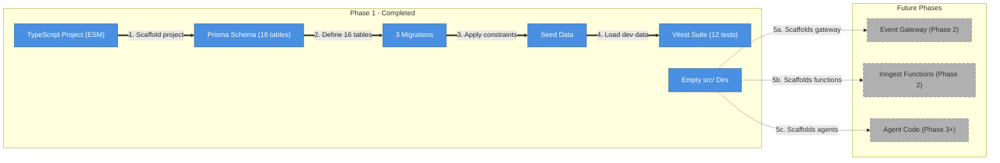
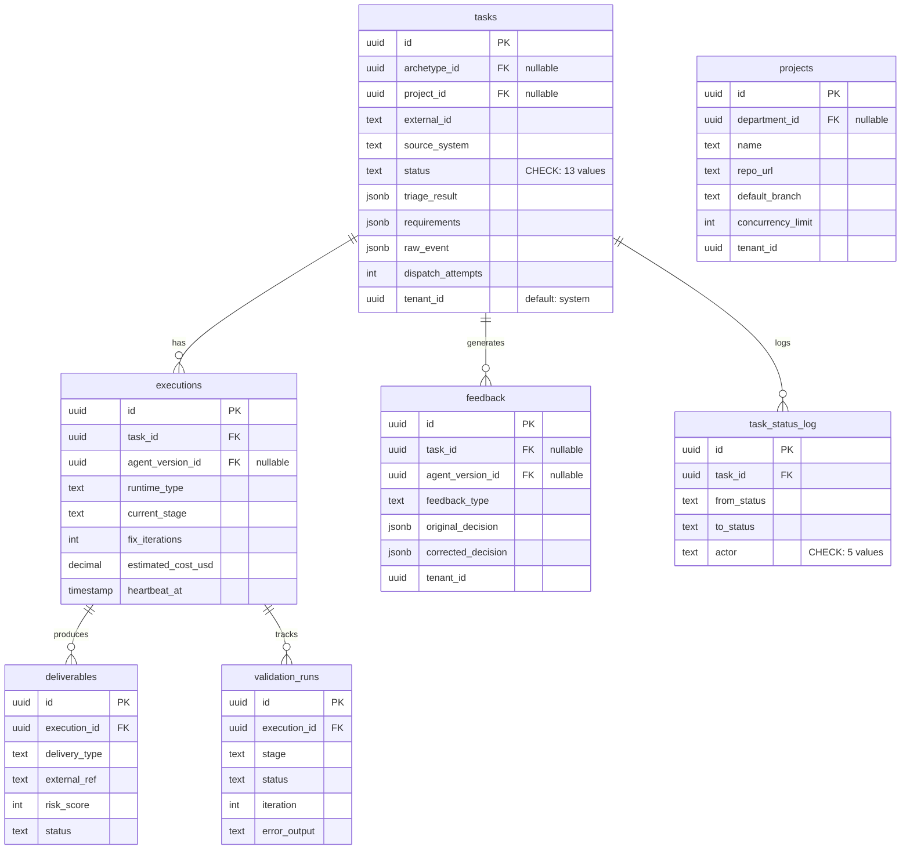
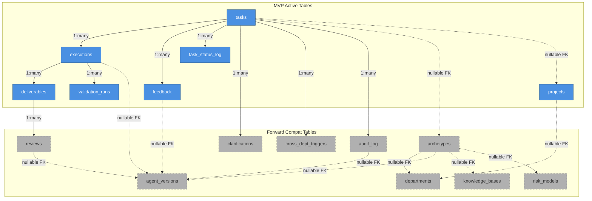
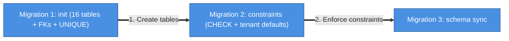
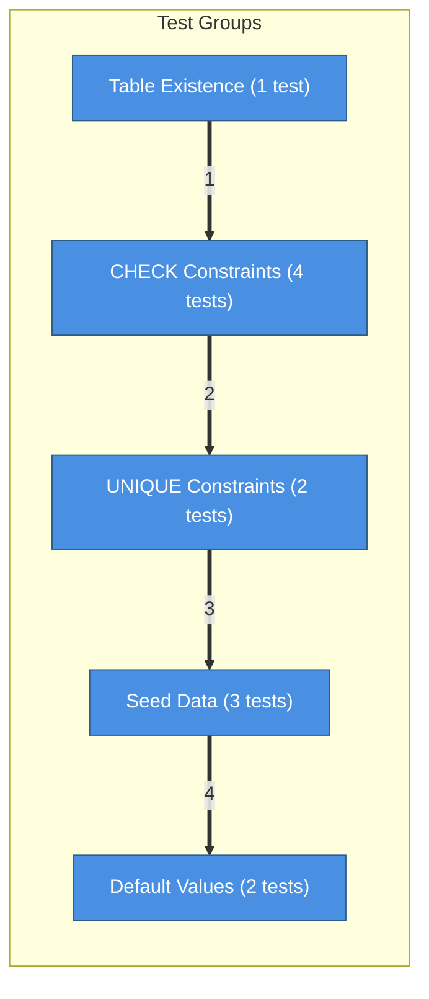
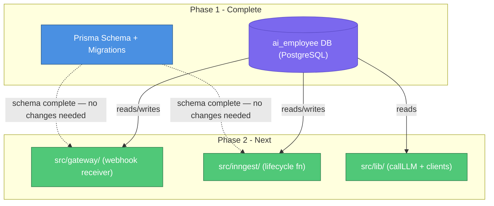

# Phase 1: Foundation — Architecture & Implementation

## What This Document Is

This document describes everything built during Phase 1 of the AI Employee Platform: the TypeScript project scaffold, the full Prisma database schema, the migration strategy, constraints, seed data, and test suite. Phase 1 produces no runtime behavior — no HTTP server, no queue worker, no agent. It exists to give every subsequent phase a stable, well-constrained foundation to build on.

---

## What Was Built



| #     | What happens         | Details                                                                                                                                                    |
| ----- | -------------------- | ---------------------------------------------------------------------------------------------------------------------------------------------------------- |
| 1     | Scaffold project     | `package.json`, `tsconfig.json`, `eslint.config.mjs`, `.prettierrc`, pnpm workspace — the compiler and linter configured before any other file is written. |
| 2     | Define 16 tables     | `prisma/schema.prisma` — 7 MVP-active tables and 9 forward-compat tables. All FK relationships, nullable constraints, and default values declared here.    |
| 3     | Apply constraints    | 3 migration files run sequentially: create all tables, add CHECK constraints via raw SQL, sync schema. Database is now the enforcer of valid states.       |
| 4     | Load dev data        | `prisma/seed.ts` upserts 1 project and 1 agent_version with fixed UUIDs. Idempotent — safe to run on every local reset.                                    |
| 5     | Run 12 Vitest tests  | Schema validation suite confirms all 16 tables exist, constraints reject bad data, seed data is correct, and defaults are applied.                         |
| 5a–5c | Scaffold future dirs | `src/gateway/`, `src/inngest/`, `src/workers/` exist as empty directories. Future phases drop files here without restructuring.                            |

---

## Project Structure

```
ai-employee/
├── prisma/
│   ├── schema.prisma          # 16 table models — source of truth
│   ├── seed.ts                # Idempotent upserts for dev baseline data
│   └── migrations/
│       ├── 20260326135305_init/          # All 16 tables + FKs + UNIQUE
│       ├── 20260326135326_add_check_constraints/  # CHECK constraints (raw SQL)
│       └── 20260326135742_sync_schema/   # tenant_id default sync
├── src/
│   ├── gateway/               # Empty — Event Gateway (Phase 2)
│   ├── inngest/               # Empty — Inngest functions (Phase 2)
│   ├── lib/                   # Empty — Shared utilities (Phase 2)
│   └── workers/               # Empty — Fly.io worker code (Phase 3)
├── tests/
│   └── schema.test.ts         # 12 Vitest tests: tables, constraints, seed, defaults
├── .env                       # DATABASE_URL → ai_employee DB on local Supabase
├── .env.example               # Template (committed, no secrets)
├── package.json               # pnpm, ESM, Node ≥20
├── tsconfig.json              # Strict TypeScript
└── eslint.config.mjs          # Flat ESLint config
```

The `src/` subdirectories exist but are intentionally empty — they establish the final directory layout so future phases drop files into the right place without any restructuring. No runtime code was written in Phase 1.

---

## Toolchain

| Tool       | Version | Role                                   |
| ---------- | ------- | -------------------------------------- |
| Node.js    | ≥ 20    | Runtime (ESM modules)                  |
| pnpm       | latest  | Package manager                        |
| TypeScript | ^5.0    | Language (strict mode)                 |
| Prisma     | ^6.0    | ORM + migration runner                 |
| Vitest     | ^2.0    | Test runner                            |
| ESLint     | ^9.0    | Linter (flat config)                   |
| Prettier   | ^3.0    | Formatter                              |
| tsx        | ^4.0    | TypeScript script runner (seed, tests) |

**Why Prisma 6, not 7**: Prisma 7 introduced breaking changes to the seed config in `package.json`. Pinning to `^6.0.0` avoids that for now. The migration to a `prisma.config.ts` file is deferred.

**Why ESM (`"type": "module"`)**: The platform will use Inngest's TypeScript SDK and other modern packages that ship ESM-first. Setting `"type": "module"` from the start avoids a painful retrofit later.

---

## Database Architecture

The database is PostgreSQL running via local Supabase (`localhost:54322`), using a dedicated database named `ai_employee` (not the shared `postgres` default — see AGENTS.md for why this matters across local projects).

### The 7 MVP-Active Tables

These tables are written to and read from starting in Phase 2. Every runtime component of the platform touches at least one of them.



### The 9 Forward-Compatibility Tables

These tables exist in the schema now but are empty — they'll be populated as later milestones are built. They're defined in Phase 1 so that foreign keys referencing them can be established from day one, and so no future migration needs to add columns to existing tables.

| Table                 | First Used In          | Purpose                                                  |
| --------------------- | ---------------------- | -------------------------------------------------------- |
| `agent_versions`      | Phase 2 (Triage Agent) | Track prompt + model + tool config per agent             |
| `archetypes`          | Phase 2                | Department archetype config (runtime, tools, risk model) |
| `departments`         | Phase 2                | Department grouping (engineering, marketing)             |
| `knowledge_bases`     | Phase 5 (pgvector)     | Track KB indexing state per archetype                    |
| `risk_models`         | Phase 3 (Review Agent) | Risk scoring config per archetype                        |
| `cross_dept_triggers` | Phase 7+               | Cross-department workflow chaining events                |
| `clarifications`      | Phase 2                | Triage agent's clarifying questions + answers            |
| `reviews`             | Phase 3                | Review agent verdicts per deliverable                    |
| `audit_log`           | Phase 2                | Every external API call logged for compliance            |

**Why define them now**: If these tables were added later, existing tables would need `ALTER TABLE` statements to add FK columns — or worse, nullable FK columns would be missing entirely during development, causing data integrity gaps. Defining all 16 tables upfront means the schema is complete and every FK is in place from day one, even if the referenced rows are empty.

**FK nullability**: All foreign keys pointing to forward-compat tables are nullable (`?` in Prisma, `ON DELETE SET NULL` in SQL). This means rows in MVP tables can exist without a matching archetype or department record during early development. The constraint becomes meaningful once those tables are populated.

### Full Relationship Map



Solid arrows = FK enforced with active data. Dashed arrows = FK defined, nullable, referenced table currently empty.

---

## Migration Strategy

Three migrations run in sequence. Each has a distinct purpose.



| #   | Migration                              | What it does                                                                                                                                                                                                  |
| --- | -------------------------------------- | ------------------------------------------------------------------------------------------------------------------------------------------------------------------------------------------------------------- |
| 1   | `20260326135305_init`                  | Creates all 16 tables, establishes every FK relationship, and creates the UNIQUE index on `tasks(external_id, source_system, tenant_id)` for webhook idempotency.                                             |
| 2   | `20260326135326_add_check_constraints` | Adds the `tasks.status` CHECK (13 valid values) and `task_status_log.actor` CHECK (5 valid values) via raw SQL — Prisma cannot generate these natively. Also locks in `tenant_id` defaults across all tables. |
| —   | `20260326135742_sync_schema`           | Syncs the Prisma-generated schema definition to match the raw SQL constraints added in migration 2. No new database changes — purely a schema file alignment.                                                 |

**Why CHECK constraints are in a separate migration (M2)**: Prisma's schema language has no native `CHECK` constraint support. They must be written in raw SQL via `prisma migrate --create-only`. M1 creates the tables with Prisma's generated SQL. M2 adds the CHECK constraints as a separate raw SQL migration. This two-step approach keeps Prisma as the authoritative schema source while still enforcing database-level constraints.

### What Each Constraint Enforces

**`tasks.status` CHECK — 13 valid values**:

```
Received → Triaging → AwaitingInput → Ready → Executing →
Validating → Submitting → Reviewing → Approved → Delivering → Done
                                                              Cancelled
                                                              Stale
```

These are the exact states from the Universal Task Lifecycle (Section 4 of the architecture doc). The database enforces that no task can enter an invalid state, even if application code has a bug.

**`task_status_log.actor` CHECK — 5 valid values**:

```
gateway | lifecycle_fn | watchdog | machine | manual
```

Every state transition is attributed to one of these actors. `machine` was included preemptively — it's used by the Fly.io execution worker in Phase 6, not Phase 1, but adding it now avoids a future constraint-altering migration.

**`tasks(external_id, source_system, tenant_id)` UNIQUE**:
The composite unique index enforces webhook idempotency at the database level. If Jira delivers the same webhook twice (which it will — Jira retries failed deliveries), the second insert fails with a unique constraint violation rather than creating a duplicate task. This is the foundation of the Event Gateway's "idempotent by webhook ID" guarantee described in Section 26 of the architecture doc.

---

## Seed Data

The seed script (`prisma/seed.ts`) uses idempotent `upsert` operations inside a single transaction. Running it twice produces the same result — safe to run during development resets.

**What gets seeded**:

| Record           | Fixed UUID          | Purpose                                                                            |
| ---------------- | ------------------- | ---------------------------------------------------------------------------------- |
| `agent_versions` | `00000000-...-0002` | Baseline agent version (`claude-sonnet-4-6`, `initial-v1`) for development testing |
| `projects`       | `00000000-...-0003` | Placeholder project pointing to `your-org/your-test-repo` — update before Phase 5  |

**What's not seeded**: Department records, archetype configs, and other forward-compat table data. Those are populated as each milestone is built. The seed only establishes the minimum data needed to create a `Task` row with a valid FK chain during development.

---

## Test Suite

12 tests across 5 groups, all in `tests/schema.test.ts`. They run against the live `ai_employee` database on local Supabase — no mocking.



| #   | Group              | What it verifies                                                                                                                                                                         |
| --- | ------------------ | ---------------------------------------------------------------------------------------------------------------------------------------------------------------------------------------- |
| 1   | Table Existence    | All 16 application tables exist in the `public` schema. Excludes `_prisma_migrations`. Fails fast if any migration didn't apply.                                                         |
| 2   | CHECK Constraints  | Invalid `tasks.status` is rejected. All 13 valid statuses are accepted. Invalid `task_status_log.actor` is rejected. All 5 valid actors (including `machine`) are accepted.              |
| 3   | UNIQUE Constraints | Duplicate `(external_id, source_system, tenant_id)` triplet is rejected — the webhook idempotency guarantee. Different `external_id` with the same `source_system` is correctly allowed. |
| 4   | Seed Data          | Project seed row has correct `repo_url`, `default_branch`, and `tenant_id`. Agent version seed row has correct `model_id` and `is_active = true`.                                        |
| 5   | Default Values     | `tasks.dispatch_attempts` defaults to `0`. `tasks.status` defaults to `'Received'` when omitted from INSERT.                                                                             |

Each test cleans up its own data via `afterEach` — no test leaves rows that could interfere with another.

---

## Key Design Decisions

### tenant_id on Every Table

Every table that will need multi-tenant isolation carries a `tenant_id UUID` column with a default of `00000000-0000-0000-0000-000000000001` (the "system" tenant). V1 has one tenant, so no application code enforces isolation yet. But the column is there from day one so that Supabase Row-Level Security policies can be added later without any schema migration. Multi-tenancy is a schema commitment, not an afterthought.

> **Note (April 2026)**: The Platform tenant has been removed. All entities now belong to real organization tenants.

### JSONB for Flexible Payloads

`raw_event`, `requirements`, `triage_result`, `affected_resources`, and several config fields use `JSONB`. This deliberately avoids over-specifying these shapes before the application behavior is proven. The webhook payload from Jira looks different than from GitHub; the triage agent's output format will evolve. JSONB absorbs that evolution without migrations.

### Decimal for Cost Tracking

`executions.estimated_cost_usd` uses `DECIMAL(10, 4)` — 4 decimal places for sub-cent precision. LLM costs for lightweight tasks can be $0.0012 per call. Storing as `FLOAT` would accumulate rounding error across aggregated reports. `DECIMAL` is exact.

### `triage_result` as Interface Contract

The `tasks.triage_result JSONB` column is the interface between the Event Gateway and the Execution Agent. In MVP, the Event Gateway writes the raw Jira webhook here. When the Triage Agent is built later, it overwrites this column with enriched analysis. The Execution Agent always reads from `triage_result` — it never queries Jira directly. This design means adding the Triage Agent is purely additive: one new Inngest function, zero changes to the Execution Agent.

---

## What Phase 2 Builds On Top of This

Phase 2 (Event Gateway + Inngest foundation) will:

1. Add code to `src/gateway/` — the Fastify HTTP server that receives Jira and GitHub webhooks and writes `tasks` rows using the Prisma client
2. Add code to `src/inngest/` — the Inngest lifecycle function that reads from `tasks` and orchestrates the agent phases
3. Add code to `src/lib/` — the `callLLM()` wrapper, the `jiraClient`, the `githubClient`

None of that requires touching the schema. The 16 tables, the constraints, the FK relationships — all of it is already in place. Phase 2 is purely application code on top of a complete database.


