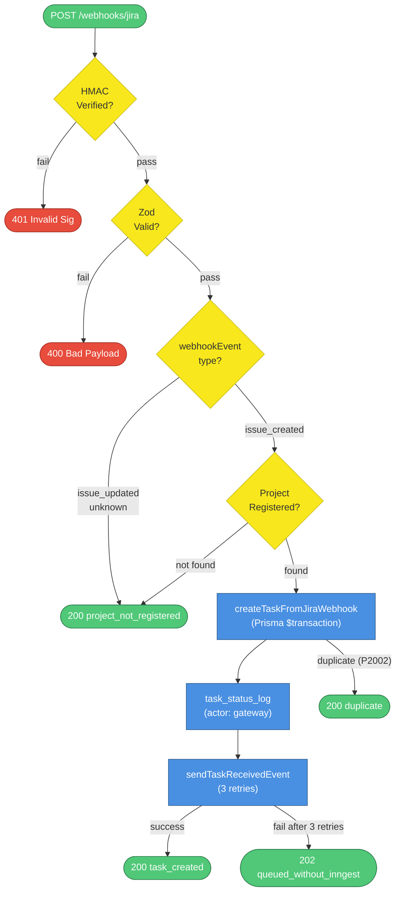
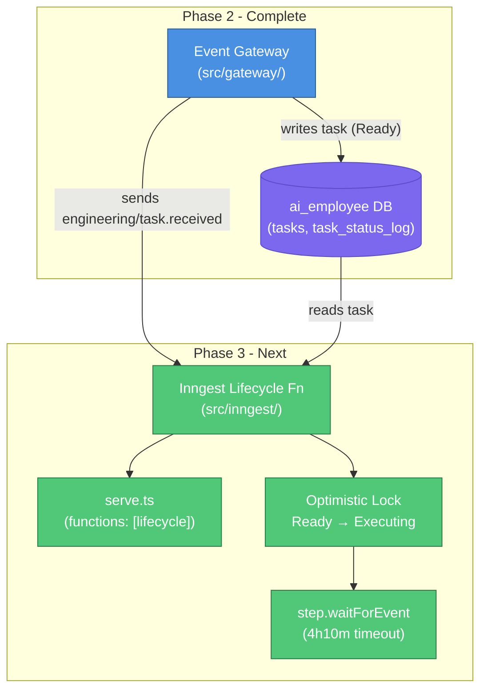

# Phase 2: Event Gateway — Architecture & Implementation

## What This Document Is

This document describes everything built during Phase 2 of the AI Employee Platform: the Fastify HTTP server that receives Jira webhooks, validates them, writes task records to the database, and fires Inngest events. Phase 2 is the first phase with runtime behavior — it's the entry point through which external systems create work for the AI Employee. It builds directly on the database schema and constraints established in Phase 1.

---

## What Was Built

```mermaid
flowchart LR
    subgraph Phase 2 - Completed
        GW["Fastify Gateway (buildApp)"]:::service
        SIG["HMAC Signature Verification"]:::service
        ZOD["Zod Schema Validation"]:::service
        ROUTE["Webhook Event Router"]:::service
        PROJ["Project Lookup Service"]:::service
        CREATE["Task Creation Service\n(Prisma $transaction)"]:::service
        INNGEST["Inngest Event Sender\n(3 retries)"]:::service
        TESTS["Vitest Suite (76 tests)"]:::service
    end

    subgraph Future Phases
        LIFECYCLE["Inngest Lifecycle Fn (Phase 3)"]:::future
        TRIAGE["Triage Agent (Phase 4)"]:::future
    end

    GW ==>|"1. Receive POST"| SIG
    SIG ==>|"2. Verify HMAC"| ZOD
    ZOD ==>|"3. Parse payload"| ROUTE
    ROUTE ==>|"4. Route by event type"| PROJ
    PROJ ==>|"5. Resolve project"| CREATE
    CREATE ==>|"6. Write task + log"| INNGEST
    INNGEST -.->|"7. Triggers"| LIFECYCLE
    LIFECYCLE -.->|"8. Dispatches"| TRIAGE

    classDef service fill:#4A90E2,stroke:#2E5C8A,color:#fff
    classDef future fill:#B0B0B0,stroke:#808080,color:#333,stroke-dasharray:5
```



| #   | What happens        | Details                                                                                                                                                                                                                |
| --- | ------------------- | ---------------------------------------------------------------------------------------------------------------------------------------------------------------------------------------------------------------------- |
| 1   | Receive POST        | `POST /webhooks/jira` — Fastify receives the raw HTTP request with `fastify-raw-body` preserving the original bytes for HMAC verification.                                                                             |
| 2   | Verify HMAC         | `verifyJiraSignature()` computes `HMAC-SHA256(rawBody, secret)` and compares using `crypto.timingSafeEqual` to prevent timing attacks. Returns 401 on failure.                                                         |
| 3   | Parse payload       | `parseJiraWebhook()` runs the Zod schema against the parsed JSON body. Returns 400 with Zod issue details on failure.                                                                                                  |
| 4   | Route by event type | `webhookEvent` field determines the path: `issue_created` creates a task, `issue_updated` is ignored per §4.2, `issue_deleted` cancels the task, unknown events are logged and ignored.                                |
| 5   | Resolve project     | `lookupProjectByJiraKey()` queries `projects` by `jira_project_key` and `tenant_id`. Returns 200 `project_not_registered` if no match.                                                                                 |
| 6   | Write task + log    | `createTaskFromJiraWebhook()` runs a `$transaction` that atomically creates the `tasks` row (status `Ready`) and a `task_status_log` entry (actor `gateway`). Handles P2002 duplicate constraint as idempotent return. |
| 7   | Send Inngest event  | `sendTaskReceivedEvent()` fires `engineering/task.received` with 3 retries and exponential backoff (1s, 2s, 4s). Returns 202 if all retries fail — task is preserved in DB for manual recovery.                        |

---

## Project Structure

```
ai-employee/
├── src/
│   └── gateway/
│       ├── server.ts                  # buildApp() factory — Fastify + plugin registration
│       ├── routes/
│       │   ├── health.ts              # GET /health
│       │   ├── jira.ts                # POST /webhooks/jira — full pipeline
│       │   └── github.ts              # POST /webhooks/github — stub for Phase 4
│       ├── validation/
│       │   ├── signature.ts           # verifyJiraSignature(), verifyGitHubSignature()
│       │   └── schemas.ts             # Zod schemas: JiraWebhookSchema, JiraIssueDeletedSchema
│       ├── services/
│       │   ├── project-lookup.ts      # lookupProjectByJiraKey()
│       │   └── task-creation.ts       # createTaskFromJiraWebhook(), cancelTaskByExternalId()
│       └── inngest/
│           ├── client.ts              # Real Inngest SDK client (production)
│           ├── send.ts                # sendTaskReceivedEvent() with retry logic
│           └── serve.ts               # GET+POST /api/inngest — Inngest serve handler
├── tests/
│   └── gateway/
│       ├── health.test.ts             # /health endpoint responses
│       ├── signature.test.ts          # HMAC verification, timing-safe comparison, edge cases
│       ├── schemas.test.ts            # Zod schema validation, required fields, passthrough
│       ├── project-lookup.test.ts     # Project lookup by jira key and tenant
│       ├── task-creation.test.ts      # Transactional creation, idempotency (P2002), cancellation
│       ├── inngest-send.test.ts       # Retry logic, event shape, failure handling
│       ├── jira-webhook.test.ts       # Full pipeline integration tests
│       ├── github-stub.test.ts        # GitHub stub endpoint
│       ├── inngest-serve.test.ts      # /api/inngest endpoint exists
│       ├── migration.test.ts          # jira_project_key column existence and nullability
│       └── fixtures.test.ts           # JSON fixture validity and required fields
├── test-payloads/
│   ├── jira-issue-created.json        # Valid issue_created payload
│   ├── jira-issue-created-invalid.json        # Missing required fields
│   ├── jira-issue-created-unknown-project.json  # Valid payload, unregistered project key
│   └── jira-issue-deleted.json        # Valid issue_deleted payload
└── prisma/
    └── migrations/
        └── [migration adding jira_project_key to projects]
```

The `src/inngest/` directory remains empty — it's reserved for the Inngest lifecycle function handler in Phase 3. The gateway's `inngest/serve.ts` registers the serve endpoint with `functions: []` as a placeholder.

---

## Runtime Dependencies

| Package          | Version | Role                           |
| ---------------- | ------- | ------------------------------ |
| Node.js          | ≥ 20    | Runtime (ESM modules)          |
| pnpm             | latest  | Package manager                |
| TypeScript       | ^5.0    | Language (strict mode)         |
| Prisma           | ^6.0    | ORM + database client          |
| Vitest           | ^2.0    | Test runner                    |
| ESLint           | ^9.0    | Linter (flat config)           |
| Prettier         | ^3.0    | Formatter                      |
| tsx              | ^4.0    | TypeScript script runner       |
| fastify          | ^5.0    | HTTP server framework          |
| fastify-raw-body | ^5.0    | Raw body preservation for HMAC |
| zod              | ^3.0    | Runtime schema validation      |
| inngest          | ^3.0    | Event queue SDK                |

**Why Fastify over Express**: Fastify's plugin system and TypeScript support are first-class. The `fastify-raw-body` plugin integrates cleanly with Fastify's lifecycle hooks, which is critical for HMAC verification — the raw bytes must be captured before any body parsing occurs.

**Why `fastify-raw-body` with `global: false`**: Raw body capture has a performance cost. Setting `global: false` and opting in per route (`config: { rawBody: true }`) means only the webhook routes pay that cost. The health endpoint and Inngest serve endpoint don't need it.

---

## Gateway Architecture



**Flow Walkthrough**

| Step | Node                         | What happens                                                                                                                                                                 |
| ---- | ---------------------------- | ---------------------------------------------------------------------------------------------------------------------------------------------------------------------------- |
| 1    | `POST /webhooks/jira`        | Fastify receives the request. `fastify-raw-body` has already captured the raw bytes before JSON parsing.                                                                     |
| 2    | `HMAC Verified?`             | `verifyJiraSignature()` computes the expected HMAC and compares with `crypto.timingSafeEqual`. Any mismatch or missing header returns 401.                                   |
| 3    | `Zod Valid?`                 | `parseJiraWebhook()` runs the Zod schema. Missing `webhookEvent`, missing `issue.key`, or missing `issue.fields.summary` all return 400.                                     |
| 4    | `webhookEvent type?`         | The router branches on the `webhookEvent` string. `issue_updated` and unknown events return 200 immediately without touching the database.                                   |
| 5    | `Project Registered?`        | `lookupProjectByJiraKey()` queries `projects.jira_project_key`. If no row matches, returns 200 `project_not_registered` — not an error, just an unregistered project.        |
| 6    | `createTaskFromJiraWebhook`  | Opens a Prisma `$transaction`. Creates the `tasks` row with status `Ready` and stores the full webhook payload in `raw_event` and a structured summary in `triage_result`.   |
| 7    | `task_status_log`            | Inside the same transaction, creates a `task_status_log` row: `from_status: null`, `to_status: Ready`, `actor: gateway`. Both rows commit atomically.                        |
| 8    | `duplicate (P2002)`          | If the unique constraint on `(external_id, source_system, tenant_id)` fires, the transaction rolls back. The service fetches the existing task and returns `created: false`. |
| 9    | `sendTaskReceivedEvent`      | Fires `engineering/task.received` with `{ taskId, projectId }`. Retries up to 3 times with 1s/2s/4s backoff.                                                                 |
| 10   | `200 task_created`           | Inngest accepted the event. The task is in the database and the lifecycle function will pick it up.                                                                          |
| 11   | `202 queued_without_inngest` | All 3 Inngest retries failed. The task exists in the database with status `Ready`. Manual recovery is possible by re-sending the event.                                      |

---

## Webhook Event Routing

| Jira Event           | MVP Action                                                                   |
| -------------------- | ---------------------------------------------------------------------------- |
| `jira:issue_created` | Create task (status `Ready`), send `engineering/task.received` Inngest event |
| `jira:issue_updated` | Ignore per §4.2 — updates handled by the agent, not the gateway              |
| `jira:issue_deleted` | Set task status to `Cancelled` via `cancelTaskByExternalId()`                |
| Unknown events       | Log and return 200 `ignored` — forward-compatible with new Jira event types  |

---

## Error Handling Contract

| Failure                       | HTTP | Behavior                                                                 |
| ----------------------------- | ---- | ------------------------------------------------------------------------ |
| Invalid signature             | 401  | Log warning, no database write, Jira will not retry (401 is terminal)    |
| Zod validation fails          | 400  | Log warning with Zod issue details, no database write                    |
| Unknown project               | 200  | Log info, no database write — not an error, just an unregistered project |
| Duplicate webhook             | 200  | Return existing task ID — idempotent, no second task created             |
| Inngest fails after 3 retries | 202  | Task exists in DB with status `Ready`, manual recovery via re-send       |
| DB write fails                | 500  | Unhandled — Fastify returns 500, Jira retries the delivery               |

---

## Key Design Decisions

### Why `buildApp()` factory (not a singleton)

`server.ts` exports `buildApp()` rather than a module-level Fastify instance. Every test that needs the full HTTP stack calls `buildApp()` to get a fresh instance with no shared state between tests. A singleton would require careful teardown between tests and would make parallel test runs impossible. The factory pattern also makes it trivial to inject a mock `inngestClient` — the real Inngest SDK is only wired in production.

### Why manual Zod (not Fastify's type provider)

Fastify has a JSON Schema type provider that can validate request bodies automatically. The gateway doesn't use it because the Jira route needs `rawBody: true` — the raw bytes must be captured before any body parsing for HMAC verification. Fastify's type provider runs validation after parsing, which means the raw body is already gone by the time validation runs. Manual Zod validation after signature verification is the only approach that works with both HMAC and schema validation in the same request lifecycle.

### Why `jira_project_key` column (not matching on `name`)

The gateway resolves which project a webhook belongs to by looking up `projects.jira_project_key`. Jira uses uppercase project keys like `PROJ` or `ENG` as the stable identifier for a project — not the display name. Display names can change; project keys are immutable once set. Matching on `name` would break if a project was renamed in Jira. The `jira_project_key` column was added in a Phase 2 migration to the `projects` table.

### Why 202 on Inngest failure (not 500)

If `sendTaskReceivedEvent()` fails after all 3 retries, the gateway returns 202 instead of 500. A 500 would cause Jira to retry the webhook delivery, which would hit the unique constraint and return a duplicate response anyway — the task already exists. The 202 signals "received and stored, but not yet queued" and avoids a retry loop. The task sits in the database with status `Ready` and can be manually recovered by re-sending the Inngest event.

### Why transaction for task + status log

`createTaskFromJiraWebhook()` wraps both the `tasks` insert and the `task_status_log` insert in a single `$transaction`. If the status log insert fails for any reason, the task row is also rolled back. This guarantees that every task in the database has at least one status log entry — the audit trail is never incomplete. The `task_status_log` table is the source of truth for state transitions, so a task without a log entry would be invisible to any monitoring or debugging tooling.

### Why `InngestLike` interface (not the real Inngest SDK)

`server.ts` defines an `InngestLike` interface with a single `send()` method. The `jiraRoutes` plugin accepts `inngestClient?: InngestLike` rather than importing the Inngest SDK directly. Tests pass a simple mock object that implements the interface. This decouples the route logic from the Inngest SDK entirely — the route doesn't care whether it's talking to the real Inngest cloud or a test double. The real SDK client is only instantiated in `src/gateway/inngest/client.ts` and injected at startup.

---

## Test Suite

| Test file                | Tests  | What it covers                                                                          |
| ------------------------ | ------ | --------------------------------------------------------------------------------------- |
| `migration.test.ts`      | 3      | `jira_project_key` column existence and nullability on the `projects` table             |
| `fixtures.test.ts`       | 7      | JSON fixture file validity and presence of required fields                              |
| `health.test.ts`         | 4      | `/health` endpoint responses and status codes                                           |
| `signature.test.ts`      | 11     | HMAC verification, timing-safe comparison, missing header, malformed header, empty body |
| `schemas.test.ts`        | 11     | Zod schema validation, required field enforcement, `.passthrough()` behavior            |
| `project-lookup.test.ts` | 4      | Project lookup by Jira key and tenant ID, missing project, wrong tenant                 |
| `task-creation.test.ts`  | 10     | Transactional creation, idempotency on P2002, cancellation, terminal state guard        |
| `inngest-send.test.ts`   | 7      | Retry logic, exponential backoff, event shape, failure after 3 retries                  |
| `jira-webhook.test.ts`   | 13     | Full pipeline integration: all response codes, all routing branches                     |
| `github-stub.test.ts`    | 4      | GitHub stub endpoint returns expected shape                                             |
| `inngest-serve.test.ts`  | 2      | `/api/inngest` endpoint exists and responds                                             |
| **Total**                | **76** |                                                                                         |

The integration tests in `jira-webhook.test.ts` cover all 11 scenarios from the manual QA checklist: valid creation, duplicate delivery, unknown project, invalid signature, bad payload, `issue_updated` ignore, `issue_deleted` cancel, Inngest failure fallback, and unknown event type.

---

## What Phase 3 Builds On Top

Phase 3 (Inngest Core) will:

1. Add `src/inngest/engineering-task-lifecycle.ts` — the Inngest function handler that listens for `engineering/task.received`. This is the function the gateway already calls with `inngest.send('engineering/task.received')`.
2. Register this function in `src/gateway/inngest/serve.ts` (currently `functions: []`). Once registered, Inngest will route incoming events to the handler.
3. Implement the first status transition: `Ready → Executing` with an optimistic lock to prevent double-execution if two Inngest workers pick up the same event.
4. Add `step.waitForEvent('engineering/task.completed', { timeout: '4h10m' })` — the lifecycle loop that suspends the function while the agent works and resumes when the agent signals completion.


