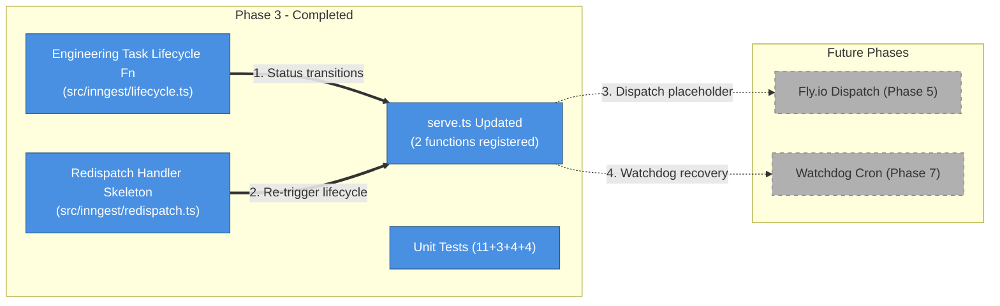
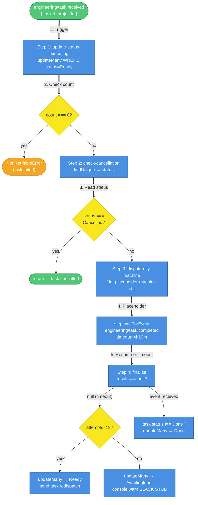
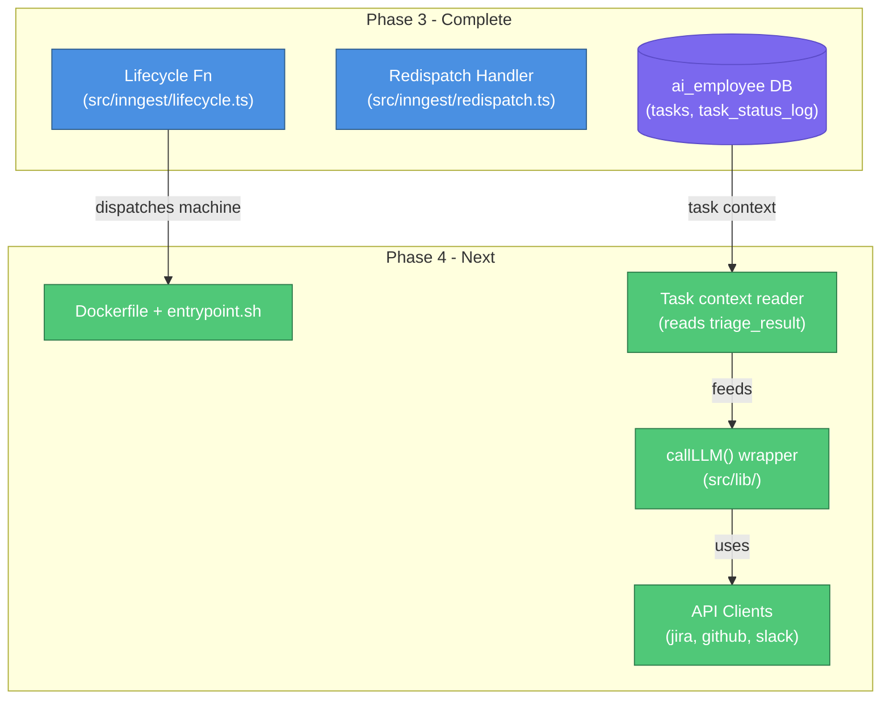

# Phase 3: Inngest Core — Events, Lifecycle Function, and Status Transitions

## What This Document Is

This document describes everything built during Phase 3 of the AI Employee Platform: the Inngest lifecycle function that transitions tasks from `Ready` to `Executing`, the re-dispatch handler skeleton, and the updated `serve.ts` that registers both functions. Phase 3 is the first phase where the platform can receive a task from the gateway and drive it through a state machine — it builds directly on the event infrastructure established in Phase 2.

---

## What Was Built



| #   | What happens         | Details                                                                                                                                                            |
| --- | -------------------- | ------------------------------------------------------------------------------------------------------------------------------------------------------------------ |
| 1   | Status transitions   | `createLifecycleFunction()` implements the `Ready → Executing` transition with optimistic locking via `updateMany`. Logs every transition to `task_status_log`.    |
| 2   | Re-trigger lifecycle | `createRedispatchFunction()` listens for `engineering/task.redispatch` and re-sends `engineering/task.received` to restart the lifecycle loop for timed-out tasks. |
| 3   | Dispatch placeholder | Step 3 in the lifecycle returns `{ id: 'placeholder-machine-id' }`. Real Fly.io dispatch is wired in Phase 5.                                                      |
| 4   | Watchdog recovery    | Timeout exhaustion path stubs a Slack notification via `console.warn`. Real Slack client and watchdog cron are Phase 7.                                            |

---

## Project Structure

```
ai-employee/
├── src/
│   ├── gateway/
│   │   └── inngest/
│   │       ├── client.ts              # Inngest SDK client factory
│   │       ├── send.ts                # sendTaskReceivedEvent() with retry logic
│   │       └── serve.ts               # GET+POST /api/inngest — now registers 2 functions
│   ├── inngest/
│   │   ├── lifecycle.ts               # createLifecycleFunction() — 130 lines
│   │   └── redispatch.ts              # createRedispatchFunction() — 27 lines
│   └── lib/                           # Empty — shared utilities (Phase 4)
├── tests/
│   ├── gateway/
│   │   └── inngest-serve.test.ts      # Extended: +4 tests for function registration
│   └── inngest/
│       ├── lifecycle.test.ts          # 11 tests: locking, cancellation, dispatch, finalize
│       ├── redispatch.test.ts         # 3 tests: function ID, sendEvent, event data
│       └── integration.test.ts        # 4 tests (skipped without INNGEST_DEV_URL)
├── prisma/
│   └── schema.prisma                  # Unchanged from Phase 2
└── package.json                       # @inngest/test added as devDependency
```

The `src/lib/` directory remains empty — it's reserved for the `callLLM()` wrapper and API clients in Phase 4. No schema changes were needed in Phase 3.

---

## Runtime Dependencies

| Package       | Version | Role                                           |
| ------------- | ------- | ---------------------------------------------- |
| Node.js       | ≥ 20    | Runtime (ESM modules)                          |
| pnpm          | latest  | Package manager                                |
| TypeScript    | ^5.0    | Language (strict mode)                         |
| Prisma        | ^6.0    | ORM + database client                          |
| Vitest        | ^2.0    | Test runner                                    |
| ESLint        | ^9.0    | Linter (flat config)                           |
| Prettier      | ^3.0    | Formatter                                      |
| tsx           | ^4.0    | TypeScript script runner                       |
| fastify       | ^5.0    | HTTP server framework                          |
| inngest       | ^3.0    | Event queue SDK                                |
| @inngest/test | ^0.x    | Inngest function test harness (new in Phase 3) |

**Why `@inngest/test`**: The lifecycle function uses `step.waitForEvent()` which suspends execution for up to 4h10m. Testing this in a real Inngest environment is impractical. `@inngest/test` provides `InngestTestEngine` with a `transformCtx` hook that replaces `step.waitForEvent` with a synchronous stub while keeping all database steps real. This lets the test suite cover both the timeout path and the success path without any real waiting.

---

## Lifecycle Function Architecture



**Flow Walkthrough**

| Step | Node                              | What happens                                                                                                                                           |
| ---- | --------------------------------- | ------------------------------------------------------------------------------------------------------------------------------------------------------ |
| 1    | `engineering/task.received`       | Inngest routes the event to the lifecycle function. `event.data.taskId` is the primary key of the task to process.                                     |
| 2    | `update-status-executing`         | `prisma.task.updateMany({ where: { id: taskId, status: 'Ready' } })` — the optimistic lock. If another worker already claimed this task, `count` is 0. |
| 3    | `count === 0?`                    | If the lock fails, `NonRetriableError` is thrown. Inngest will not retry the step — the function terminates cleanly.                                   |
| 4    | `check-cancellation`              | Reads the current task status. If the task was cancelled between the lock and this step, the function returns early without dispatching.               |
| 5    | `dispatch-fly-machine`            | Returns `{ id: 'placeholder-machine-id' }`. Phase 5 replaces this with a real `flyApi.createMachine()` call.                                           |
| 6    | `step.waitForEvent`               | Suspends the Inngest function for up to 4h10m. Resumes when `engineering/task.completed` arrives with a matching `taskId`, or when the timeout fires.  |
| 7    | `finalize (timeout path)`         | `result === null` means the timeout fired. Reads `dispatch_attempts` and decides: re-dispatch (< 3) or exhaust (≥ 3).                                  |
| 8    | `updateMany → Ready + redispatch` | Resets status to `Ready`, increments `dispatch_attempts`, sends `engineering/task.redispatch` to trigger the re-dispatch handler.                      |
| 9    | `updateMany → AwaitingInput`      | After 3 failed attempts, marks the task `AwaitingInput` and stubs a Slack alert. Manual intervention required.                                         |
| 10   | `finalize (success path)`         | `result` is the completion event. If the machine hasn't already set status to `Done`, the lifecycle function sets it.                                  |

---

## Status Transition Map

| Transition                   | `from_status`              | `to_status`     | `actor`        |
| ---------------------------- | -------------------------- | --------------- | -------------- |
| Step 1: Ready → Executing    | `Ready`                    | `Executing`     | `lifecycle_fn` |
| Finalize timeout re-dispatch | `Executing`                | `Ready`         | `lifecycle_fn` |
| Finalize timeout exhausted   | `Executing`                | `AwaitingInput` | `lifecycle_fn` |
| Finalize success             | (machine already set Done) | —               | —              |

Every transition is written to `task_status_log` atomically within the same step. The `actor` value `lifecycle_fn` is one of the 5 valid values enforced by the CHECK constraint added in Phase 1.

---

## Optimistic Locking Pattern

The lifecycle function uses `updateMany` instead of `update` to implement a compare-and-swap lock:

```typescript
const result = await prisma.task.updateMany({
  where: { id: taskId, status: 'Ready' },
  data: { status: 'Executing', updated_at: new Date() },
});
if (result.count === 0) {
  throw new NonRetriableError(`Task ${taskId} optimistic lock failed: ...`);
}
```

**Why `updateMany` instead of `update`**: Prisma's `update()` throws a `P2025` error if no row matches the `where` clause. That error would cause Inngest to retry the step, which is wrong — if the lock failed, retrying will fail again. `updateMany()` returns `{ count: N }` instead of throwing, so the application can distinguish "task doesn't exist" from "task exists but is in the wrong state" and handle both as non-retriable failures.

**Why `NonRetriableError`**: A regular `Error` thrown inside an Inngest step causes the step to be retried with exponential backoff. `NonRetriableError` (imported from the `inngest` package) signals to the Inngest runtime that this failure is permanent — no retry should be attempted. This is the correct behavior for a lock failure: if another worker already claimed the task, retrying will never succeed.

---

## Re-dispatch Handler

`createRedispatchFunction()` in `src/inngest/redispatch.ts` is a 27-line skeleton that listens for `engineering/task.redispatch` and re-sends `engineering/task.received`:

```typescript
await step.sendEvent('restart-lifecycle', {
  name: 'engineering/task.received',
  data: { taskId, attempt },
});
```

This re-triggers the full lifecycle function for the same task. The lifecycle function will re-acquire the optimistic lock (the task is back in `Ready` status after the timeout path reset it) and dispatch a new machine.

The handler currently skips the elapsed-time budget check (`// TODO Phase 5: Implement elapsed time check using task.created_at (6-hour total budget)`). Phase 5 will add a guard that prevents re-dispatch if the task has been running for more than 6 hours total.

---

## Known Limitations

| #   | Limitation                                           | Phase   | Mitigation                                                                            |
| --- | ---------------------------------------------------- | ------- | ------------------------------------------------------------------------------------- |
| KL1 | `dispatch_attempts` increment not atomic             | Phase 7 | Two simultaneous timeouts could both read 0 and both increment to 1. Tracked as TODO. |
| KL2 | `waitForEvent` race condition (Inngest #1433)        | Phase 7 | Mitigation deferred to `waitforevent_race_fix` checkpoint in Phase 7.                 |
| KL3 | Slack notification stubbed                           | Phase 7 | `console.warn('[SLACK STUB] ...')` placeholder. Real Slack client in Phase 7.         |
| KL4 | Fly.io dispatch is placeholder                       | Phase 5 | Step 2 returns `{ id: 'placeholder-machine-id' }`. Real dispatch in Phase 5.          |
| KL5 | `engineering/task.completed` event payload undefined | Phase 6 | Finalize success path is dead code until Phase 6 machines send completion events.     |

---

## Test Suite

| Test file                                        | Tests                               | What it covers                                                         |
| ------------------------------------------------ | ----------------------------------- | ---------------------------------------------------------------------- |
| `tests/inngest/lifecycle.test.ts`                | 11                                  | Optimistic locking, cancellation, dispatch placeholder, finalize paths |
| `tests/inngest/redispatch.test.ts`               | 3                                   | Function ID, step.sendEvent emission, event data                       |
| `tests/gateway/inngest-serve.test.ts` (extended) | +4                                  | Function registration in /api/inngest response                         |
| `tests/inngest/integration.test.ts`              | 4 (skipped when no INNGEST_DEV_URL) | Full Gateway→Inngest→Lifecycle→DB flow                                 |
| **Total Phase 3**                                | **22**                              |                                                                        |

The `lifecycle.test.ts` suite uses `@inngest/test`'s `InngestTestEngine` with `transformCtx` to replace `step.waitForEvent` with a synchronous stub. This lets the test suite exercise both the timeout path (`result === null`) and the success path (`result = { data: { taskId } }`) without waiting 4 hours. All database steps run against the real `ai_employee` database on local Supabase.

---

## Key Design Decisions

### Factory pattern

`createLifecycleFunction(inngest, prisma)` mirrors the `buildApp()` factory from the gateway. Both accept their dependencies as arguments rather than importing singletons. Tests call the factory with a real Prisma client and a real Inngest client configured to point at the local Inngest dev server. This makes the function fully testable without any mocking of the database layer.

### Prisma over Supabase client

The architecture spec references `supabase.from()` for database operations. The implementation uses `prisma.task.updateMany()` instead. Prisma provides full TypeScript type safety on the `where` clause and `data` fields — a typo in a column name is a compile error, not a runtime failure. The Supabase JS client uses string-based column names with no type checking. For a state machine where incorrect column names could silently corrupt task status, type safety is non-negotiable.

### `updateMany` for optimistic locking

`prisma.task.update()` throws `P2025` when no row matches. That exception propagates as a retriable error in Inngest. `prisma.task.updateMany()` returns `{ count: 0 }` instead of throwing, giving the application control over whether to retry or terminate. The lifecycle function uses this to implement a clean non-retriable lock failure path.

### `NonRetriableError`

Inngest retries any step that throws a regular `Error`. For lock failures, retrying is wrong — the task is already claimed. `NonRetriableError` (from the `inngest` package) tells the Inngest runtime to terminate the function run immediately without scheduling a retry. This is also used in the cancellation check: if a task is cancelled, there's no point retrying.

### Inngest v4 API discovery

The architecture spec uses the 3-argument `createFunction(config, trigger, handler)` API. Inngest v4 changed this to a 2-argument form: `createFunction({ id, triggers: [...] }, handler)`. The `triggers` array replaces the separate trigger argument. This was discovered during implementation and the code uses the v4 API throughout.

### `@inngest/test` with `transformCtx`

`InngestTestEngine.execute()` accepts a `transformCtx` option that intercepts the `step` object before the function runs. The test suite uses this to replace `step.waitForEvent` with a function that immediately returns either `null` (simulating timeout) or a mock completion event (simulating success). All other steps — `step.run`, `step.sendEvent` — execute normally against the real database.

---

## What Phase 4 Builds On Top of This

Phase 4 adds the first real agent behavior on top of the lifecycle scaffolding Phase 3 established:

1. **`callLLM()` wrapper** in `src/lib/` — a thin wrapper around the Anthropic SDK that handles retries, token counting, and cost logging to the `audit_log` table
2. **Thin API wrappers** (`jiraClient`, `githubClient`, `slackClient`) in `src/lib/` — typed clients for the external services the agent needs to read from and write to
3. **Docker image** (`Dockerfile`) for the worker container — the image that Fly.io will run when Phase 5 wires up real machine dispatch
4. **`entrypoint.sh` boot script** — the container startup script that reads task context from Supabase and invokes the agent
5. **Real task context reading** from Supabase inside the container — the agent reads `tasks.triage_result` and `tasks.requirements` to understand what work to do

None of this requires changes to the lifecycle function or the status transition map. Phase 3's `dispatch-fly-machine` step already returns a machine ID — Phase 4 just makes that step real by building the image the machine will run.


