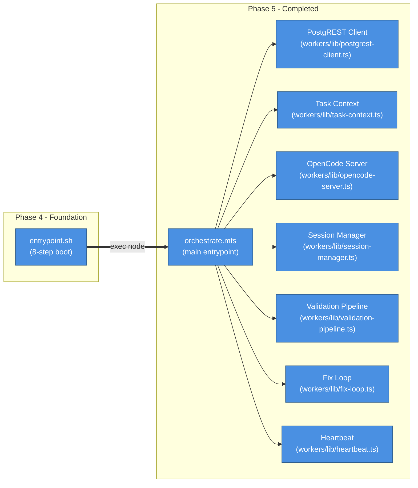
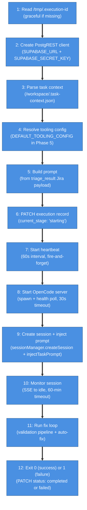
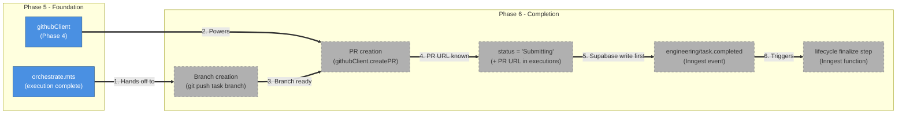

# Phase 5: Execution Agent — Architecture & Implementation

## What This Document Is

This document describes everything built during Phase 5 of the AI Employee Platform: the orchestration script (`orchestrate.mts`) and the seven supporting modules that run inside the Fly.io container to manage end-to-end task execution. Phase 5 builds directly on Phase 4's boot infrastructure — `entrypoint.sh` Step 8 hands off to `orchestrate.mts`, which wires together OpenCode session management, a 5-stage validation pipeline, an automatic fix loop, and a 60-second heartbeat. Phase 5 produces no new HTTP endpoints and no new Inngest functions — it is the execution layer that runs inside the worker container.

---

## What Was Built



| #   | What happens        | Details                                                                                                                                                                         |
| --- | ------------------- | ------------------------------------------------------------------------------------------------------------------------------------------------------------------------------- |
| 1   | Boot hands off      | `entrypoint.sh` Step 8 runs `exec node /app/dist/workers/orchestrate.mjs`. The `exec` replaces the shell process — orchestrate becomes PID 1 in the container.                  |
| 2   | PostgREST client    | Thin `fetch`-only client for Supabase PostgREST. Workers have no direct DB connection — all reads and writes go through `${SUPABASE_URL}/rest/v1/...`.                          |
| 3   | Task context        | Reads `/workspace/.task-context.json` (written by Step 6 of boot), extracts the task row, builds a structured markdown prompt from the Jira webhook payload in `triage_result`. |
| 4   | OpenCode server     | Spawns `opencode serve --port 4096` as a child process, health-polls `GET /global/health` every 1s until `{ healthy: true }`, then returns a handle with a `kill()` method.     |
| 5   | Session manager     | Creates an OpenCode session, injects the task prompt, and monitors for completion via SSE (`session.idle` event). Falls back to polling every 10s if SSE disconnects.           |
| 6   | Validation pipeline | Runs 5 stages in order: TypeScript → Lint → Unit → Integration → E2E. Each stage result is recorded to `validation_runs` via PostgREST. Stops on first failure.                 |
| 7   | Fix loop            | On validation failure, sends the error output back to OpenCode as a fix prompt, waits for the session to go idle, then re-runs the pipeline from the failing stage forward.     |
| 8   | Heartbeat           | PATCHes `executions.heartbeat_at` every 60 seconds. Failures are logged but never crash the orchestrator.                                                                       |

---

## Project Structure

```
ai-employee/
├── src/
│   └── workers/
│       ├── orchestrate.mts                    # Main entrypoint — 12-step main() function
│       └── lib/
│           ├── postgrest-client.ts            # createPostgRESTClient() — get, post, patch
│           ├── task-context.ts                # parseTaskContext, buildPrompt, resolveToolingConfig, DEFAULT_TOOLING_CONFIG
│           ├── opencode-server.ts             # startOpencodeServer, stopOpencodeServer, OpencodeServerHandle
│           ├── session-manager.ts             # createSessionManager() — create, inject, monitor, abort, sendFixPrompt
│           ├── validation-pipeline.ts         # runValidationPipeline, runSingleStage, STAGE_ORDER, ValidationStage
│           ├── fix-loop.ts                    # runWithFixLoop — per-stage(3)/global(10) limits
│           └── heartbeat.ts                   # startHeartbeat, escalate
└── tests/
    └── workers/
        ├── orchestrate.test.ts                # 11 tests — main() integration scenarios
        ├── integration.test.ts                # 7 tests — gated behind OPENCODE_TEST_URL
        └── lib/
            ├── postgrest-client.test.ts       # 19 tests
            ├── task-context.test.ts           # 19 tests
            ├── opencode-server.test.ts        # 14 tests
            ├── session-manager.test.ts        # 25 tests
            ├── validation-pipeline.test.ts    # 23 tests
            ├── fix-loop.test.ts               # 13 tests
            └── heartbeat.test.ts              # 17 tests
```

---

## Module Architecture

### PostgREST Client (`src/workers/lib/postgrest-client.ts`)

Thin `fetch`-based HTTP client for Supabase PostgREST. Workers run in Docker containers without a direct database connection — all DB access goes through the PostgREST REST API.

**Interface**

```typescript
export interface PostgRESTClient {
  get(table: string, query: string): Promise<unknown[] | null>;
  post(table: string, body: Record<string, unknown>): Promise<unknown | null>;
  patch(table: string, query: string, body: Record<string, unknown>): Promise<unknown | null>;
}

export function createPostgRESTClient(): PostgRESTClient;
```

**Behavior**

All three methods use native `fetch` with `apikey`, `Authorization: Bearer`, `Content-Type: application/json`, and `Prefer: return=representation` headers. If `SUPABASE_URL` or `SUPABASE_SECRET_KEY` are missing at construction time, the factory logs a warning and returns a no-op client that returns `null` for every call — the orchestrator continues without crashing.

`post()` returns the first element of the PostgREST array response (PostgREST wraps created rows in an array). `get()` returns the full array. `patch()` returns the raw response body. All methods catch network errors and return `null` rather than throwing.

---

### Task Context (`src/workers/lib/task-context.ts`)

Reads the task row written by `entrypoint.sh` Step 6 and builds the prompt that is injected into the OpenCode session.

**Exports**

```typescript
export interface ToolingConfig {
  typescript?: string;
  lint?: string;
  unit?: string;
  integration?: string;
  e2e?: string;
}

export const DEFAULT_TOOLING_CONFIG: ToolingConfig;

export interface TaskRow { id, external_id, status, triage_result, requirements, project_id, ... }
export interface ProjectRow { id, tooling_config, name, repo_url, ... }

export function parseTaskContext(filePath: string): TaskRow | null;
export function buildPrompt(task: TaskRow): string;
export function resolveToolingConfig(projectRow: ProjectRow | null): ToolingConfig;
```

**`DEFAULT_TOOLING_CONFIG`**

| Stage         | Default command           |
| ------------- | ------------------------- |
| `typescript`  | `pnpm tsc --noEmit`       |
| `lint`        | `pnpm lint`               |
| `unit`        | `pnpm test -- --run`      |
| `integration` | _(none — skip if absent)_ |
| `e2e`         | _(none — skip if absent)_ |

**`parseTaskContext`** reads the file at `filePath`, parses it as JSON, and returns the first element of the PostgREST array response. Returns `null` if the file is missing, malformed, or the array is empty.

**`buildPrompt`** extracts the Jira issue key, summary, description (handling both plain strings and Atlassian Document Format), and project key from `task.triage_result`. Falls back to a generic prompt if `triage_result` is missing or invalid.

**`resolveToolingConfig`** merges `projectRow.tooling_config` with `DEFAULT_TOOLING_CONFIG`, with the project config taking precedence. Returns defaults if `projectRow` is `null` or has no `tooling_config`.

---

### OpenCode Server (`src/workers/lib/opencode-server.ts`)

Manages the lifecycle of the `opencode serve` child process.

**Interface**

```typescript
export interface OpencodeServerHandle {
  process: ChildProcess;
  url: string;
  kill: () => Promise<void>;
}

export interface StartOpencodeServerOptions {
  port?: number; // default: 4096
  cwd?: string; // default: '/workspace'
  healthTimeoutMs?: number; // default: 30000
}

export async function startOpencodeServer(
  options?: StartOpencodeServerOptions,
): Promise<OpencodeServerHandle | null>;

export async function stopOpencodeServer(handle: OpencodeServerHandle): Promise<void>;
```

**Startup sequence**

1. `spawn('opencode', ['serve', '--port', String(port)], { cwd, stdio: ['ignore', 'pipe', 'pipe'] })`
2. Poll `GET http://localhost:{port}/global/health` every 1s
3. Resolve with `OpencodeServerHandle` when `{ healthy: true }` is returned
4. Resolve with `null` if the process emits an `error` event or the health check times out after `healthTimeoutMs`

**Shutdown** (`stopOpencodeServer`) sends SIGTERM, waits up to 5 seconds for the process to exit, then sends SIGKILL. Never throws — cleanup must always succeed.

**Process cleanup** registers `process.on('exit')` and `process.on('SIGTERM')` handlers at spawn time so the child process is always killed when the parent exits, regardless of how the parent exits.

---

### Session Manager (`src/workers/lib/session-manager.ts`)

Wraps `@opencode-ai/sdk` to manage OpenCode sessions.

**Interface**

```typescript
export interface SessionManager {
  createSession(title: string): Promise<string | null>;
  injectTaskPrompt(sessionId: string, prompt: string): Promise<boolean>;
  monitorSession(sessionId: string, options?: MonitorOptions): Promise<SessionMonitorResult>;
  abortSession(sessionId: string): Promise<void>;
  sendFixPrompt(sessionId: string, failedStage: string, errorOutput: string): Promise<boolean>;
}

export interface MonitorOptions {
  timeoutMs?: number; // default: 60 * 60 * 1000 (60 minutes)
  minElapsedMs?: number; // default: 30000 (30 seconds minimum before marking complete)
}

export interface SessionMonitorResult {
  completed: boolean;
  reason?: 'idle' | 'timeout' | 'error';
}

export function createSessionManager(baseUrl: string): SessionManager;
```

**`monitorSession` strategy**

Primary: subscribe to the SSE event stream via `client.event.subscribe()` and listen for `session.idle` or `session.status` events matching the session ID. The session is considered complete only after `minElapsedMs` has elapsed since monitoring started (prevents false positives from pre-existing idle state).

Fallback: if SSE disconnects, attempt one reconnect. If the reconnect also fails, fall back to polling `client.session.status()` every 10 seconds.

Timeout: a `setTimeout` fires after `timeoutMs` and resolves with `{ completed: false, reason: 'timeout' }`.

**`sendFixPrompt`** truncates `errorOutput` to 4000 characters before embedding it in the fix prompt, to stay within prompt size limits.

---

### Validation Pipeline (`src/workers/lib/validation-pipeline.ts`)

Runs the 5-stage validation suite and records each result to `validation_runs` via PostgREST.

**Interface**

```typescript
export type ValidationStage = 'typescript' | 'lint' | 'unit' | 'integration' | 'e2e';

export const STAGE_ORDER: ValidationStage[];

export interface StageResult {
  stage: ValidationStage;
  passed: boolean;
  stdout: string;
  stderr: string;
  durationMs: number;
  skipped?: boolean;
}

export interface PipelineResult {
  passed: boolean;
  failedStage?: ValidationStage;
  errorOutput?: string;
  stageResults: StageResult[];
}

export interface RunPipelineOptions {
  executionId: string | null;
  toolingConfig: ToolingConfig;
  postgrestClient: PostgRESTClient;
  fromStage?: ValidationStage;
  iteration?: number;
}

export async function runValidationPipeline(options: RunPipelineOptions): Promise<PipelineResult>;
export async function runSingleStage(
  stage: ValidationStage,
  command: string,
  cwd?: string,
): Promise<{ passed: boolean; stdout: string; stderr: string; durationMs: number }>;
```

**Stage execution**

Each stage command is split on spaces and passed to `execFile` (not `exec`) to prevent shell injection from user-supplied `tooling_config` values. The working directory is always `/workspace`. Each stage has a 5-minute timeout (`STAGE_TIMEOUT_MS = 300_000`).

If a stage has no command in `toolingConfig`, it is skipped (recorded as `passed: true, skipped: true`) and the pipeline continues.

**`fromStage` re-entry** — the `fromStage` parameter lets the fix loop re-enter the pipeline at the failing stage rather than restarting from `typescript`. `STAGE_ORDER.indexOf(fromStage)` determines the slice start.

**PostgREST recording** — after each stage, a `validation_runs` row is written: `{ execution_id, stage, status, iteration, error_output, duration_ms }`. `error_output` is truncated to 10,000 characters. If `executionId` is `null`, the write is skipped with a warning.

**Failure behavior** — the pipeline stops at the first failing stage and returns `{ passed: false, failedStage, errorOutput }`. `errorOutput` is truncated to 4,000 characters for use in fix prompts.

---

### Fix Loop (`src/workers/lib/fix-loop.ts`)

Orchestrates the retry cycle: run validation, send fix prompt, wait for OpenCode, re-run from failing stage.

**Interface**

```typescript
export interface FixLoopOptions {
  sessionId: string;
  sessionManager: SessionManager;
  executionId: string | null;
  toolingConfig: ToolingConfig;
  postgrestClient: PostgRESTClient;
  heartbeat: HeartbeatHandle;
  taskId: string;
}

export interface FixLoopResult {
  success: boolean;
  reason?: string;
  failedStage?: ValidationStage;
  totalIterations: number;
}

export async function runWithFixLoop(options: FixLoopOptions): Promise<FixLoopResult>;
```

**Limits**

| Limit     | Value | Behavior when exceeded                                                       |
| --------- | ----- | ---------------------------------------------------------------------------- |
| Per-stage | 3     | `escalate()` called, returns `{ success: false, reason: 'per_stage_limit' }` |
| Global    | 10    | `escalate()` called, returns `{ success: false, reason: 'global_limit' }`    |

**Iteration tracking** — `fix_iterations` is PATCHed to the `executions` row after every fix attempt, so the count is durable across any unexpected process restart.

**Fix session timeout** — each fix prompt waits up to 30 minutes for the session to go idle (half the initial 60-minute code generation timeout).

---

### Heartbeat (`src/workers/lib/heartbeat.ts`)

Keeps the execution record alive and handles escalation to human review.

**Interface**

```typescript
export interface HeartbeatOptions {
  executionId: string | null;
  postgrestClient: PostgRESTClient;
  intervalMs?: number; // default: 60000
  currentStage?: string; // initial stage name
}

export interface HeartbeatHandle {
  stop: () => void;
  updateStage: (stage: string) => void;
}

export interface EscalateOptions {
  executionId: string | null;
  taskId: string;
  reason: string;
  failedStage?: string;
  errorOutput?: string;
  postgrestClient: PostgRESTClient;
}

export function startHeartbeat(options: HeartbeatOptions): HeartbeatHandle;
export async function escalate(options: EscalateOptions): Promise<void>;
```

**`startHeartbeat`** starts a `setInterval` that PATCHes `{ heartbeat_at, current_stage }` to the `executions` row every `intervalMs` milliseconds. The interval is fire-and-forget: failures are logged with `console.warn` but never thrown. `updateStage(stage)` updates the in-memory `currentStage` variable so the next heartbeat tick reflects the current execution phase. `stop()` calls `clearInterval`.

**`escalate`** runs four steps, each wrapped in try/catch so a failure in one step does not prevent the others:

1. Log the escalation reason to stdout
2. PATCH `tasks` row: `{ status: 'AwaitingInput', failure_reason: reason }`
3. POST `task_status_log` row: `{ task_id, from_status: 'Executing', to_status: 'AwaitingInput', actor: 'machine' }`
4. POST to `SLACK_WEBHOOK_URL` with a plain-text message (simple webhook, not the `slackClient` from `src/lib/`)

---

### `orchestrate.mts` — Main Entrypoint

The file that `entrypoint.sh` Step 8 hands off to via `exec node /app/dist/workers/orchestrate.mjs`. It wires all seven modules together in a 12-step `main()` function.

The `.mts` extension is required: with `NodeNext` module resolution, `.mts` source files compile to `.mjs` output. `entrypoint.sh` references `orchestrate.mjs` explicitly — a `.ts` source would compile to `.js`, which would not be found at runtime.

Two module-level globals (`serverHandleGlobal`, `heartbeatGlobal`) are set after construction so that `process.on('exit')` and `process.on('SIGTERM')` signal handlers can reach them for cleanup.

---

## Execution Flow



| Step | Name                    | Failure behavior                                                                                                   |
| ---- | ----------------------- | ------------------------------------------------------------------------------------------------------------------ |
| 1    | Read execution ID       | Continues with `executionId = null` — heartbeat and DB writes are skipped but execution proceeds                   |
| 2    | Create PostgREST client | Always succeeds — returns no-op client if env vars are missing                                                     |
| 3    | Parse task context      | `process.exit(1)` — cannot proceed without a task to execute                                                       |
| 4    | Resolve tooling config  | Always succeeds — falls back to `DEFAULT_TOOLING_CONFIG`                                                           |
| 5    | Build prompt            | Always succeeds — falls back to a generic prompt if `triage_result` is missing                                     |
| 6    | PATCH execution record  | Logged and swallowed — non-fatal                                                                                   |
| 7    | Start heartbeat         | Always succeeds — heartbeat failures are non-fatal by design                                                       |
| 8    | Start OpenCode server   | `process.exit(1)` — cannot run sessions without the server                                                         |
| 9    | Create session          | `process.exit(1)` — cannot inject prompt without a session                                                         |
| 10   | Monitor session         | `process.exit(1)` on timeout — code generation did not complete within 60 minutes                                  |
| 11   | Run fix loop            | Returns `{ success: false }` on escalation — `escalate()` already called inside fix-loop                           |
| 12   | Handle result           | `exit(0)` on success (PATCHes `status: 'completed'`); `exit(1)` on failure (escalation already handled in step 11) |

---

## Validation Pipeline

The pipeline runs stages in a fixed order. Each stage is skipped if its command is not configured in `toolingConfig`.

| Stage         | Default command      | Skip behavior                                    |
| ------------- | -------------------- | ------------------------------------------------ |
| `typescript`  | `pnpm tsc --noEmit`  | Skipped if `toolingConfig.typescript` is absent  |
| `lint`        | `pnpm lint`          | Skipped if `toolingConfig.lint` is absent        |
| `unit`        | `pnpm test -- --run` | Skipped if `toolingConfig.unit` is absent        |
| `integration` | _(none)_             | Always skipped unless project provides a command |
| `e2e`         | _(none)_             | Always skipped unless project provides a command |

Skipped stages are recorded to `validation_runs` with `status: 'passed'` and `duration_ms: 0` so the audit trail is complete.

The pipeline stops at the first failing stage. Subsequent stages are not run — the fix loop re-enters at the failing stage after the fix is applied, running all stages from that point forward.

---

## Fix Loop

The fix loop wraps the validation pipeline with automatic retry logic. It tracks two counters: a per-stage failure count (in memory) and a global iteration count (persisted to Supabase).

**Iteration logic**

```
while true:
  result = runValidationPipeline(fromStage)
  if result.passed → return { success: true }

  increment fix_iterations (PATCH executions)
  increment per-stage count for result.failedStage

  if per-stage count > 3 → escalate, return { success: false }
  if fix_iterations >= 10 → escalate, return { success: false }

  heartbeat.updateStage('fixing')
  sessionManager.sendFixPrompt(sessionId, failedStage, errorOutput)
  sessionManager.monitorSession(sessionId, { timeoutMs: 30min })

  fromStage = result.failedStage  // re-enter at failing stage
```

**Re-entry example**

If `typescript` fails on iteration 1, the fix is applied and the pipeline re-runs from `typescript` — all five stages run again. If `lint` fails on iteration 2, the fix is applied and the pipeline re-runs from `lint` — TypeScript is not re-run (it already passed). This ensures that a fix for a later stage cannot silently break an earlier stage.

| Iteration | Failed stage | Re-entry point | Stages re-run                                |
| --------- | ------------ | -------------- | -------------------------------------------- |
| 1         | `typescript` | `typescript`   | typescript → lint → unit → integration → e2e |
| 2         | `lint`       | `lint`         | lint → unit → integration → e2e              |
| 3         | `unit`       | `unit`         | unit → integration → e2e                     |

---

## Known Limitations

**Token tracking** — `prompt_tokens`, `completion_tokens`, `estimated_cost_usd`, and `primary_model_id` on the `executions` row remain at their database defaults. The `@opencode-ai/sdk` does not expose token counts from session responses. Token tracking is deferred to Phase 7.

**Completion event** — Phase 5 does NOT send the `engineering/task.completed` Inngest event. The lifecycle function's `finalize` step is not triggered. Sending the completion event is Phase 6 scope.

**Branch and PR creation** — Phase 5 does not create a task branch or open a pull request. The `githubClient` from Phase 4 is available but not called. Branch creation and PR creation are Phase 6 scope.

**`tooling_config` from database** — Phase 5 always calls `resolveToolingConfig(null)`, which returns `DEFAULT_TOOLING_CONFIG`. The project row is not fetched from the database. Fetching the project's `tooling_config` and merging it with defaults is Phase 6 scope.

---

## Test Suite

| Test file                                       | Tests | What it covers                                                                                                                                                                                       |
| ----------------------------------------------- | ----- | ---------------------------------------------------------------------------------------------------------------------------------------------------------------------------------------------------- |
| `tests/workers/lib/postgrest-client.test.ts`    | 19    | `get`, `post`, `patch` success paths; HTTP error responses; network errors; missing env vars → no-op client                                                                                          |
| `tests/workers/lib/task-context.test.ts`        | 19    | `parseTaskContext` file parsing; `buildPrompt` with full/partial/missing triage_result; `resolveToolingConfig` merge logic; `DEFAULT_TOOLING_CONFIG` shape                                           |
| `tests/workers/lib/opencode-server.test.ts`     | 14    | Spawn + health poll success; health timeout → null; spawn error → null; `stopOpencodeServer` SIGTERM/SIGKILL; process cleanup handlers                                                               |
| `tests/workers/lib/session-manager.test.ts`     | 25    | `createSession`; `injectTaskPrompt`; `monitorSession` SSE idle detection; SSE disconnect → polling fallback; timeout; `sendFixPrompt` truncation; `abortSession`                                     |
| `tests/workers/lib/validation-pipeline.test.ts` | 23    | All stages pass; first stage fails; middle stage fails; `fromStage` re-entry; skipped stages; `validation_runs` PostgREST writes; `execFile` cwd verification                                        |
| `tests/workers/lib/fix-loop.test.ts`            | 13    | All pass first run; one fix iteration; per-stage limit (3); global limit (10); `fix_iterations` PATCH on every iteration; re-entry at failing stage                                                  |
| `tests/workers/lib/heartbeat.test.ts`           | 17    | 60s interval fires PATCH; `updateStage` changes next tick; `stop` clears interval; fetch failure → logged not thrown; `escalate` task PATCH; status log write; Slack webhook; Slack failure graceful |
| `tests/workers/orchestrate.test.ts`             | 11    | Full `main()` happy path; missing task context → exit 1; OpenCode server failure → exit 1; session creation failure → exit 1; session timeout → exit 1; fix loop failure → exit 1                    |
| `tests/workers/integration.test.ts`             | 7     | Gated behind `OPENCODE_TEST_URL` — real OpenCode server session create, prompt inject, monitor, abort                                                                                                |

**Total new tests: 148** (19 + 19 + 14 + 25 + 23 + 13 + 17 + 11 + 7)

**Total suite: 338 tests** (148 new + 190 pre-existing from Phases 1–4)

```bash
pnpm test -- --run
```

Integration tests are skipped automatically when `OPENCODE_TEST_URL` is not set.

---

## Key Design Decisions

1. **`.mts` extension for `orchestrate`** — With `NodeNext` module resolution, `.mts` source files compile to `.mjs` output. `entrypoint.sh` Step 8 references `orchestrate.mjs` explicitly. Using `.ts` would produce `orchestrate.js`, which would not be found at runtime. The `.mts` extension makes the output format unambiguous.

2. **PostgREST-only, no Prisma** — Workers run in Docker containers that have no direct database connection. Prisma requires a connection string to a PostgreSQL server, which is not available inside the Fly.io worker VM. All DB access goes through Supabase's PostgREST HTTP API, which is accessible via `SUPABASE_URL`.

3. **SSE-first with polling fallback** — SSE provides real-time completion detection without polling overhead. However, SSE connections can drop on network hiccups. The session manager attempts one SSE reconnect before falling back to polling every 10 seconds. This keeps the common case fast while making the system resilient to transient disconnects.

4. **`execFile` not `exec` for validation** — `toolingConfig` commands come from the database and could contain shell metacharacters. `exec` passes the command string to `/bin/sh`, which would interpret those characters. `execFile` takes the executable and arguments separately, bypassing the shell entirely. This prevents shell injection from a malicious or malformed `tooling_config`.

5. **Fire-and-forget heartbeats** — A heartbeat failure (e.g., Supabase is temporarily unreachable) must not crash the execution. The task is running correctly — losing a heartbeat tick is acceptable. Making heartbeat failures fatal would cause tasks to abort for reasons unrelated to the actual work being done.

6. **`escalate` never throws** — Each of the four escalation steps (log, PATCH task, POST status log, Slack webhook) is wrapped in its own try/catch. If the Slack webhook is down, the task status is still updated. If the PostgREST PATCH fails, the status log is still attempted. Escalation is a best-effort notification — partial success is better than no escalation.

7. **`resolveToolingConfig(null)` in Phase 5** — Fetching the project row from the database requires knowing the `project_id`, which requires parsing the task context first. Rather than adding a DB round-trip in Phase 5, the orchestrator always uses `DEFAULT_TOOLING_CONFIG`. Phase 6 will add the project fetch and pass the real `tooling_config`.

8. **30-second minimum elapsed before idle** — The session manager requires at least 30 seconds to have elapsed before treating a `session.idle` event as a genuine completion. This prevents a race condition where the session is briefly idle between the `createSession` call and the `injectTaskPrompt` call from being misinterpreted as task completion.

---

## What Phase 6 Builds On Top

Phase 5 ends with the execution record marked `status: 'completed'` and the process exiting 0. Phase 6 adds the steps that close the loop with the rest of the platform.



| #   | What Phase 6 adds                                                                                                                                                                                   |
| --- | --------------------------------------------------------------------------------------------------------------------------------------------------------------------------------------------------- |
| 1   | Task branch push — the worker commits any uncommitted changes and pushes the task branch to the remote repository before creating a PR.                                                             |
| 2   | PR creation — `githubClient.createPR()` from Phase 4 opens a pull request from the task branch to the default branch.                                                                               |
| 3   | Supabase-first write — `executions.status` is set to `'Submitting'` and the PR URL is written before the Inngest event is sent. This ensures the DB is consistent even if the event delivery fails. |
| 4   | `engineering/task.completed` Inngest event — sent from the worker after the Supabase write succeeds. Carries `taskId`, `executionId`, and `prUrl`.                                                  |
| 5   | Lifecycle `finalize` step — the Inngest lifecycle function receives the completion event and handles downstream notifications (Jira transition, Slack message, etc.).                               |
| 6   | Project `tooling_config` fetch — Phase 6 fetches the project row from the database and passes the real `tooling_config` to `resolveToolingConfig()`, replacing the Phase 5 default.                 |
