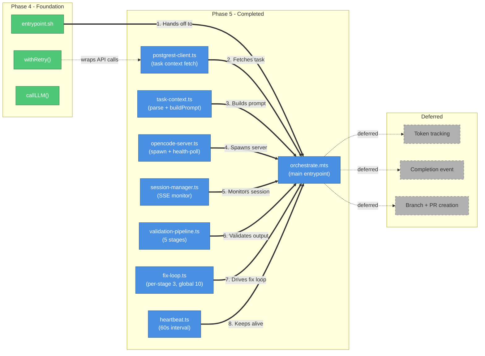
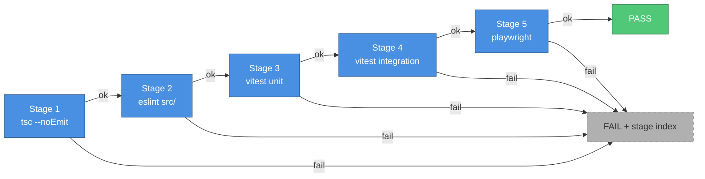
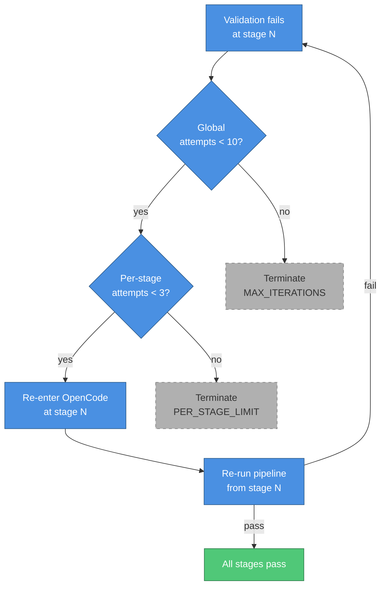

# Phase 5: Execution Agent — Architecture & Implementation

## What This Document Is

This document describes everything built during Phase 5 of the AI Employee Platform: the orchestration script, worker library modules, validation pipeline, and fix loop that form the execution agent running inside the Fly.io worker container. Phase 5 builds directly on Phase 4's infrastructure (retry, error types, LLM gateway, API clients, Docker image, boot sequence) and delivers the core behavior: spawn an OpenCode session, monitor it, validate its output, and iterate until the code passes or limits are hit.

---

## What Was Built



| #   | What happens            | Details                                                                                                                                                      |
| --- | ----------------------- | ------------------------------------------------------------------------------------------------------------------------------------------------------------ |
| 1   | Boot hands off          | `entrypoint.sh` (Phase 4) ends with `exec node dist/workers/orchestrate.mjs` — no clean exit, process replaces the shell.                                    |
| 2   | Task context fetched    | `postgrest-client.ts` calls the Supabase PostgREST API directly via `fetch`. No Supabase SDK. Returns the raw task row.                                      |
| 3   | Prompt built            | `task-context.ts` parses the task row, resolves tooling config, and assembles the full prompt string passed to OpenCode.                                     |
| 4   | OpenCode server spawned | `opencode-server.ts` spawns the OpenCode process, polls the health endpoint until ready, and holds a reference for clean shutdown.                           |
| 5   | Session monitored       | `session-manager.ts` subscribes to the OpenCode SSE stream. Waits for a completion event or the 60-minute timeout, whichever comes first.                    |
| 6   | Output validated        | `validation-pipeline.ts` runs 5 stages in sequence: TypeScript type-check, lint, unit tests, integration tests, E2E tests. Each uses `execFile`, not `exec`. |
| 7   | Fix loop iterates       | `fix-loop.ts` re-enters at the failing stage. Per-stage limit is 3 attempts; global limit is 10. Exceeding either terminates with a failure status.          |
| 8   | Heartbeat keeps alive   | `heartbeat.ts` fires every 60 seconds via `setInterval`, calling `escalate()` if the session appears stalled.                                                |

---

## Project Structure

```
ai-employee/
├── src/
│   └── workers/
│       ├── orchestrate.mts            # Main entrypoint — 183 lines, 12-step main()
│       └── lib/
│           ├── postgrest-client.ts    # get(), post(), patch() via fetch — no SDK
│           ├── task-context.ts        # parseTaskContext(), buildPrompt(), resolveToolingConfig()
│           ├── opencode-server.ts     # spawn(), healthPoll(), shutdown()
│           ├── session-manager.ts     # SSE monitoring, 60-minute timeout
│           ├── validation-pipeline.ts # runPipeline() — 5 stages, execFile, cwd=/workspace
│           ├── fix-loop.ts            # runFixLoop() — per-stage(3), global(10), re-entry
│           └── heartbeat.ts          # startHeartbeat() — 60s setInterval, escalate()
├── dist/
│   └── workers/
│       ├── orchestrate.mjs            # Compiled output (NodeNext module resolution)
│       └── lib/
│           └── *.mjs                  # Compiled worker lib modules
├── tests/
│   └── workers/
│       ├── orchestrate.test.ts        # 1 integration smoke test
│       ├── lib/
│           ├── postgrest-client.test.ts   # 19 tests
│           ├── task-context.test.ts       # 19 tests
│           ├── opencode-server.test.ts    # 14 tests
│           ├── session-manager.test.ts    # 25 tests
│           ├── validation-pipeline.test.ts # 23 tests
│           ├── fix-loop.test.ts           # 13 tests
│           └── heartbeat.test.ts          # 17 tests
```

---

## Foundation Utilities

### Module System: `.mts` and NodeNext

The worker files use the `.mts` extension rather than `.ts`. This is a TypeScript requirement when targeting NodeNext module resolution: TypeScript only emits `.mjs` output (which Node.js requires for ES modules) when the source file carries the `.mts` extension. Using `.ts` with `"module": "NodeNext"` would produce `.js` files that Node.js treats as CommonJS, breaking `import`/`export` at runtime.

`entrypoint.sh` calls `exec node dist/workers/orchestrate.mjs` — the `.mjs` extension is explicit and required.

---

### PostgREST Client (`src/workers/lib/postgrest-client.ts`)

Three thin wrappers around `fetch` for reading and updating task rows via the Supabase PostgREST API. No Supabase client SDK is used anywhere in the worker.

| Function  | Method | Purpose                                     |
| --------- | ------ | ------------------------------------------- |
| `get()`   | GET    | Fetch a task row by ID                      |
| `post()`  | POST   | Insert a new row (used for status events)   |
| `patch()` | PATCH  | Update task status, result, or error fields |

All three accept a `PostgRESTConfig` object (base URL + service role key) and return typed responses. Errors surface as `ExternalApiError` from Phase 4's error types, making them compatible with `withRetry()`.

---

### Task Context (`src/workers/lib/task-context.ts`)

Three functions that transform a raw task database row into the inputs `orchestrate.mts` needs.

| Function                 | Input         | Output                                                        |
| ------------------------ | ------------- | ------------------------------------------------------------- |
| `parseTaskContext()`     | Raw task row  | Typed `TaskContext` object with validated fields              |
| `buildPrompt()`          | `TaskContext` | Full prompt string passed to the OpenCode session             |
| `resolveToolingConfig()` | `TaskContext` | Which validation stages to run (e.g. skip E2E for some tasks) |

`buildPrompt()` injects the Jira issue description, acceptance criteria, repo context, and any tooling constraints into a structured prompt. `resolveToolingConfig()` reads the task's `tooling` field to decide whether to skip expensive stages like E2E tests.

---

### OpenCode Server (`src/workers/lib/opencode-server.ts`)

Manages the lifecycle of the OpenCode process running inside the container.

| Function       | What it does                                                                                   |
| -------------- | ---------------------------------------------------------------------------------------------- |
| `spawn()`      | Starts the OpenCode process with the correct flags and environment variables                   |
| `healthPoll()` | Polls the OpenCode HTTP health endpoint in a loop until it returns 200 or a timeout is reached |
| `shutdown()`   | Sends SIGTERM to the OpenCode process and waits for it to exit cleanly                         |

`healthPoll()` uses a configurable interval and max-attempts rather than a fixed sleep, so the orchestrator doesn't waste time waiting when OpenCode starts quickly.

---

### Session Manager (`src/workers/lib/session-manager.ts`)

Subscribes to the OpenCode SSE (Server-Sent Events) stream and waits for the session to finish.

The 60-minute timeout is the hard wall. If OpenCode hasn't emitted a completion event within that window, `session-manager.ts` treats the session as stalled, calls `escalate()`, and returns a failure result. The SSE-first design means the orchestrator doesn't poll — it reacts to events as they arrive.

Key behaviors:

- Reconnects automatically on SSE stream drops (up to a configurable limit)
- Captures the final session ID for use by the validation pipeline
- Emits structured log events at each state transition

---

### Validation Pipeline (`src/workers/lib/validation-pipeline.ts`)

Runs up to 5 validation stages in sequence after the OpenCode session completes. Each stage calls a subprocess via `execFile` (not `exec`) with `cwd` set to `/workspace` — the directory where OpenCode wrote its changes.

| Stage | Name              | Command                            | Skippable |
| ----- | ----------------- | ---------------------------------- | --------- |
| 1     | TypeScript        | `tsc --noEmit`                     | No        |
| 2     | Lint              | `eslint src/`                      | No        |
| 3     | Unit tests        | `vitest run --reporter=json`       | No        |
| 4     | Integration tests | `vitest run --project=integration` | Yes       |
| 5     | E2E tests         | `playwright test`                  | Yes       |

`execFile` is used instead of `exec` because it avoids shell injection — the command and arguments are passed as separate values, never concatenated into a shell string. This matters because some arguments (file paths, test names) come from task context data.

`runPipeline()` returns a `PipelineResult` that includes the first failing stage (if any), its exit code, and its stdout/stderr. The fix loop uses the failing stage index to decide where to re-enter.

---

### Fix Loop (`src/workers/lib/fix-loop.ts`)

Drives the iteration between OpenCode sessions and validation runs.

**Limits**

| Limit type | Value | Behavior when exceeded                             |
| ---------- | ----- | -------------------------------------------------- |
| Per-stage  | 3     | Move to next stage or terminate if on last stage   |
| Global     | 10    | Terminate immediately with `MAX_ITERATIONS` status |

**Re-entry logic**: when a validation stage fails, the fix loop re-enters the OpenCode session at the failing stage rather than restarting from stage 1. This avoids re-running passing stages and keeps iteration fast. The failing stage index and its error output are injected into the follow-up prompt so OpenCode has the context it needs to fix the specific failure.

---

### Heartbeat (`src/workers/lib/heartbeat.ts`)

Keeps the Fly.io machine alive and signals progress to the Inngest function.

`startHeartbeat()` sets a `setInterval` at 60 seconds. Each tick calls `patch()` on the task row to update a `last_heartbeat_at` timestamp. If the session appears stalled (no SSE events in the last N seconds), the tick also calls `escalate()` — which posts a Slack alert and updates the task status to `stalled`.

`stopHeartbeat()` clears the interval. It's called in the `finally` block of `main()` so the interval never leaks, even on error paths.

---

## Execution Flow

`orchestrate.mts` exports a single `main()` function with 12 sequential steps.

| Step | Action                        | Module called                               |
| ---- | ----------------------------- | ------------------------------------------- |
| 1    | Parse environment variables   | (inline)                                    |
| 2    | Connect to PostgREST          | `postgrest-client.ts`                       |
| 3    | Fetch task row                | `postgrest-client.ts`                       |
| 4    | Parse task context            | `task-context.ts`                           |
| 5    | Build prompt                  | `task-context.ts`                           |
| 6    | Start heartbeat               | `heartbeat.ts`                              |
| 7    | Spawn OpenCode server         | `opencode-server.ts`                        |
| 8    | Poll until OpenCode is ready  | `opencode-server.ts`                        |
| 9    | Start session + monitor SSE   | `session-manager.ts`                        |
| 10   | Run validation pipeline       | `validation-pipeline.ts`                    |
| 11   | Run fix loop if needed        | `fix-loop.ts`                               |
| 12   | Update task status + shutdown | `postgrest-client.ts`, `opencode-server.ts` |

Steps 10 and 11 repeat until validation passes or limits are hit. Step 12 always runs — it's in the `finally` block so the task row is never left in a running state after the process exits.

---

## Validation Pipeline Detail

The five stages run in order. A stage failure stops the pipeline and returns the failing stage index to the fix loop.



---

## Fix Loop Detail



---

## Known Limitations

Three features were scoped out of Phase 5 and deferred to a later phase.

| Feature              | Status   | Reason deferred                                                                                                                             |
| -------------------- | -------- | ------------------------------------------------------------------------------------------------------------------------------------------- |
| Token tracking       | Deferred | OpenCode doesn't expose per-session token counts via SSE. Requires a separate accounting pass.                                              |
| Completion event     | Deferred | The Inngest function currently polls task status. A push-based completion event needs a new endpoint.                                       |
| Branch + PR creation | Deferred | `github-client.ts` (Phase 4) has `createPR()` but the orchestrator doesn't call it yet. Requires branch naming conventions to be finalized. |

None of these affect correctness of the current implementation. The task row is updated with the final status regardless, so the Inngest poller can detect completion.

---

## Test Suite

| File                                            | Tests | What it covers                                                           |
| ----------------------------------------------- | ----- | ------------------------------------------------------------------------ |
| `tests/workers/lib/postgrest-client.test.ts`    | 19    | get/post/patch happy paths, auth headers, error mapping                  |
| `tests/workers/lib/task-context.test.ts`        | 19    | parseTaskContext validation, buildPrompt output, resolveToolingConfig    |
| `tests/workers/lib/opencode-server.test.ts`     | 14    | spawn args, healthPoll retry logic, shutdown SIGTERM handling            |
| `tests/workers/lib/session-manager.test.ts`     | 25    | SSE event parsing, 60-min timeout, reconnect logic, stall detection      |
| `tests/workers/lib/validation-pipeline.test.ts` | 23    | execFile calls, stage ordering, skippable stages, PipelineResult shape   |
| `tests/workers/lib/fix-loop.test.ts`            | 13    | per-stage limit, global limit, re-entry index, termination conditions    |
| `tests/workers/lib/heartbeat.test.ts`           | 17    | setInterval timing, patch calls, escalate trigger, stopHeartbeat cleanup |
| `tests/workers/orchestrate.test.ts`             | 1     | Integration smoke test — full main() with mocked modules                 |

Total: 131 worker tests across 8 files. Combined with Phase 4's 146 tests, the suite covers the full execution stack.

---

## Key Design Decisions

**`.mts` extension for worker files.** TypeScript's NodeNext module resolution only emits `.mjs` output when the source file uses `.mts`. Using `.ts` would produce `.js` files that Node.js treats as CommonJS, breaking ES module imports at runtime. Every file in `src/workers/` uses `.mts`.

**PostgREST-only, no Supabase SDK.** The worker runs in a minimal Docker container. Adding the Supabase client SDK would increase image size and introduce a dependency that isn't needed — PostgREST's REST API covers everything the worker needs (read one row, update one row). Three `fetch` wrappers replace the entire SDK.

**SSE-first session monitoring.** The session manager subscribes to OpenCode's SSE stream rather than polling a status endpoint. This means the orchestrator reacts to events as they happen instead of sleeping between polls. The 60-minute timeout is a safety net, not the primary completion signal.

**`execFile` not `exec` for validation stages.** `exec` concatenates command and arguments into a shell string, which opens injection vectors when arguments contain user-controlled data (file paths, test names from task context). `execFile` takes the command and arguments separately and never invokes a shell. All five validation stages use `execFile`.

**5 production commits.** Phase 5 was delivered across 5 commits: postgrest-client + task-context, opencode-server + session-manager, validation-pipeline, fix-loop + heartbeat, orchestrate.mts integration.
