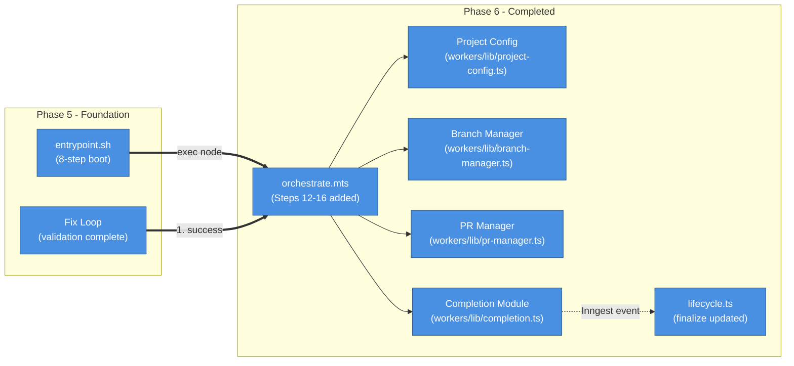
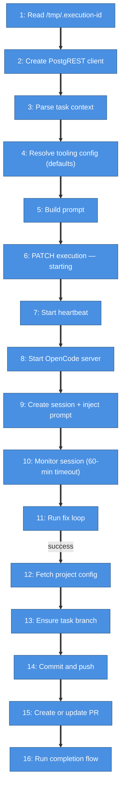
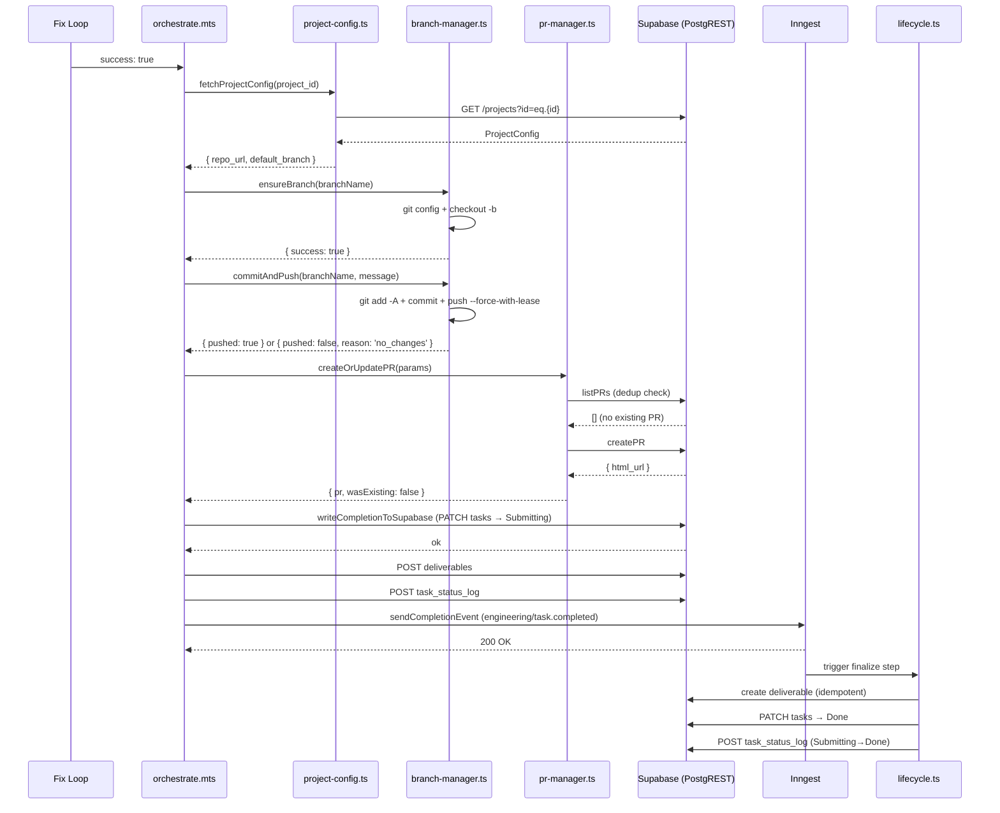
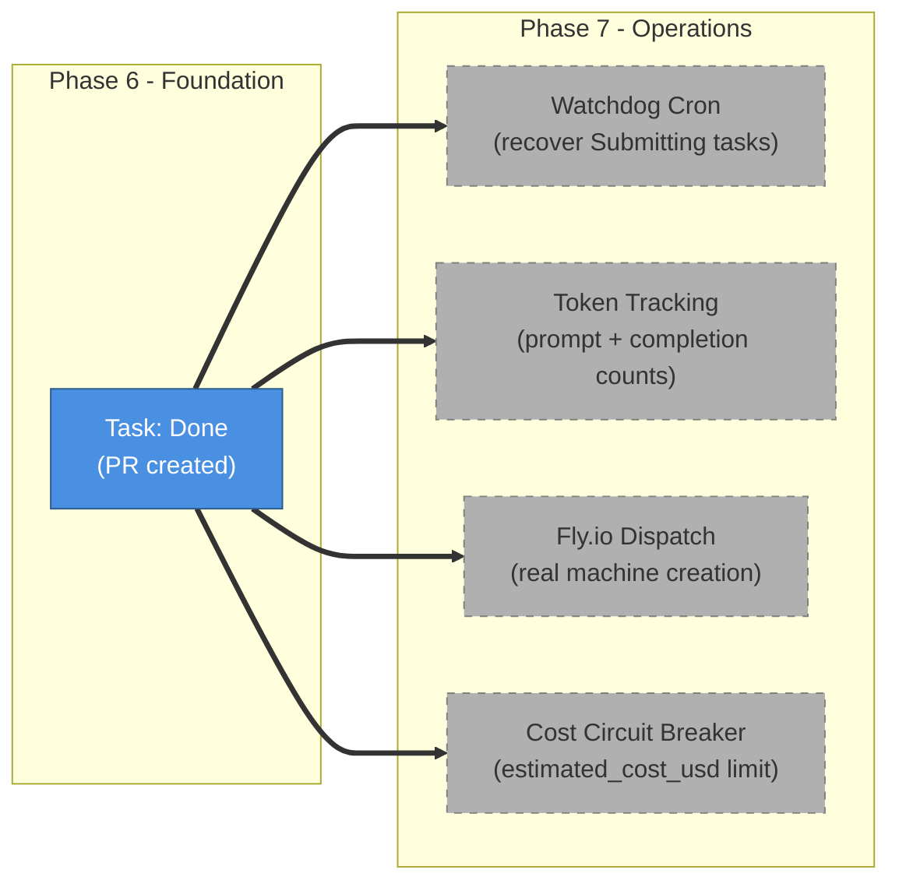

# Phase 6: Completion & Delivery — Architecture & Implementation

## What This Document Is

This document describes everything built during Phase 6 of the AI Employee Platform: the four new library modules (`branch-manager.ts`, `pr-manager.ts`, `completion.ts`, `project-config.ts`), the updated `orchestrate.mts` (Steps 12-16 added), the updated `lifecycle.ts` finalize step, and the git identity addition to `entrypoint.sh`. Phase 6 builds directly on Phase 5's fix loop — when validation passes, the orchestrator now commits the work to a task branch, opens a GitHub PR, writes completion state to Supabase, and fires the `engineering/task.completed` Inngest event that triggers the lifecycle function's finalize step. Phase 6 closes the loop from code generation to a reviewable pull request.

---

## What Was Built



| #   | What happens         | Details                                                                                                                                                                                                    |
| --- | -------------------- | ---------------------------------------------------------------------------------------------------------------------------------------------------------------------------------------------------------- |
| 1   | Fix loop succeeds    | `runWithFixLoop` returns `{ success: true }`. Orchestrator enters the Phase 6 completion path.                                                                                                             |
| 2   | Fetch project config | `fetchProjectConfig(task.project_id)` retrieves `repo_url`, `default_branch`, and `tooling_config` from the `projects` table via PostgREST.                                                                |
| 3   | Build branch name    | `buildBranchName(ticketId, summary)` produces `ai/{ticketId}-{kebab-title}`, truncated to 60 characters.                                                                                                   |
| 4   | Ensure task branch   | `ensureBranch(branchName)` sets git identity, checks `origin` for an existing branch, and runs `git checkout -b` (tracking remote if it exists).                                                           |
| 5   | Commit and push      | `commitAndPush(branchName, message)` stages all changes, checks for a non-empty diff, commits, and pushes with `--force-with-lease`. Returns `{ pushed: false, reason: 'no_changes' }` if nothing changed. |
| 6   | Create or update PR  | `createOrUpdatePR` calls `listPRs` first to detect an existing open PR on the same head branch. Creates a new PR only if none exists.                                                                      |
| 7   | Write Supabase first | `writeCompletionToSupabase` PATCHes `tasks.status = 'Submitting'`, POSTs a `deliverables` row, and POSTs a `task_status_log` row — in that order.                                                          |
| 8   | Send Inngest event   | `sendCompletionEvent` POSTs `engineering/task.completed` with a deterministic event ID. Retries up to 3 times with exponential backoff.                                                                    |
| 9   | Lifecycle finalize   | The Inngest lifecycle function receives the event, creates a `deliverable` row (idempotent), and transitions the task from `Submitting` to `Done`.                                                         |

---

## Project Structure

```
ai-employee/
├── src/
│   ├── inngest/
│   │   └── lifecycle.ts                       # Updated: finalize step creates deliverable, Submitting→Done
│   └── workers/
│       ├── orchestrate.mts                    # Updated: 16-step main() (Steps 12-16 are Phase 6)
│       └── lib/
│           ├── project-config.ts              # fetchProjectConfig, parseRepoOwnerAndName
│           ├── branch-manager.ts              # buildBranchName, ensureBranch, commitAndPush
│           ├── pr-manager.ts                  # checkExistingPR, createOrUpdatePR, buildPRBody
│           └── completion.ts                  # writeCompletionToSupabase, sendCompletionEvent, runCompletionFlow
└── tests/
    ├── inngest/
    │   └── lifecycle.test.ts                  # Updated: ~18 tests covering finalize path
    └── workers/
        ├── orchestrate.test.ts                # Updated: ~21 tests covering Phase 6 completion flow
        └── lib/
            ├── project-config.test.ts         # 17 tests
            ├── branch-manager.test.ts         # 24 tests
            ├── pr-manager.test.ts             # 19 tests
            └── completion.test.ts             # 27 tests
```

---

## Module Architecture

### Project Config (`src/workers/lib/project-config.ts`)

Fetches project metadata from the database and parses the repository URL into owner/repo components.

**Interface**

```typescript
export interface ProjectConfig extends ProjectRow {
  id: string;
  name: string;
  repo_url: string;
  default_branch: string;
}

export async function fetchProjectConfig(
  projectId: string,
  postgrestClient: PostgRESTClient,
): Promise<ProjectConfig | null>;

export function parseRepoOwnerAndName(repoUrl: string): { owner: string; repo: string };
```

**Behavior**

`fetchProjectConfig` queries `projects` via PostgREST with `select=id,name,repo_url,default_branch,tooling_config`. Returns `null` on network error, empty result, or missing `projectId`. Failures are logged with `console.warn` and never thrown — the orchestrator falls back to empty owner/repo strings and `'main'` as the default branch.

`parseRepoOwnerAndName` matches HTTPS GitHub URLs (`https://github.com/owner/repo[.git]`) using a regex. Throws an `Error` for unrecognized formats — the orchestrator catches this and falls back to empty strings rather than crashing.

---

### Branch Manager (`src/workers/lib/branch-manager.ts`)

Handles git identity, branch creation, and pushing changes to the remote repository.

**Interface**

```typescript
export interface BranchResult {
  success: boolean;
  existed: boolean;
  error?: string;
}

export interface PushResult {
  pushed: boolean;
  reason?: string;
  error?: string;
}

export function buildBranchName(ticketId: string, title: string): string;

export async function ensureBranch(branchName: string, cwd?: string): Promise<BranchResult>;

export async function commitAndPush(
  branchName: string,
  message: string,
  cwd?: string,
): Promise<PushResult>;
```

**`buildBranchName`**

Lowercases the title, replaces non-alphanumeric runs with `-`, strips leading/trailing dashes, prepends `{ticketId}-`, truncates to 60 characters, and prefixes with `ai/`. Example: `ai/PROJ-42-add-user-authentication`.

**`ensureBranch`**

Sets `user.email` and `user.name` git config before touching the branch (required in containers where no global git identity exists). Runs `git ls-remote --heads origin {branchName}` to check for an existing remote branch. If found, checks out with `git checkout -b {name} origin/{name}` to track the remote. If not found, creates a fresh local branch. All git commands use `execFile` with a 60-second timeout.

**`commitAndPush`**

Stages all changes with `git add -A`, then checks for a non-empty diff using `git diff --cached --quiet` (exit code 1 means changes exist). If no changes are staged, returns `{ pushed: false, reason: 'no_changes' }` without committing. Otherwise commits and pushes with `git push --force-with-lease origin {branchName}`. Returns `{ pushed: false, error }` on any git failure.

---

### PR Manager (`src/workers/lib/pr-manager.ts`)

Checks for existing pull requests and creates new ones via the GitHub client.

**Interface**

```typescript
export interface CreateOrUpdatePRParams {
  owner: string;
  repo: string;
  headBranch: string;
  base: string;
  ticketId: string;
  summary: string;
  task: TaskRow;
  executionId: string | null;
}

export interface PRResult {
  pr: GitHubPR;
  wasExisting: boolean;
}

export async function checkExistingPR(
  owner: string,
  repo: string,
  headBranch: string,
  githubClient: GitHubClient,
): Promise<GitHubPR | null>;

export function buildPRBody(task: TaskRow, executionId: string | null): string;

export async function createOrUpdatePR(
  params: CreateOrUpdatePRParams,
  githubClient: GitHubClient,
): Promise<PRResult>;
```

**Behavior**

`checkExistingPR` calls `githubClient.listPRs({ state: 'open', head: '{owner}:{headBranch}' })` and returns the first result or `null`. This is the deduplication guard — if a PR already exists for the branch, `createOrUpdatePR` returns it immediately with `wasExisting: true` and skips the `createPR` call.

`buildPRBody` extracts `summary` and `description` from `task.triage_result.issue.fields`. Description is truncated to 500 characters. The body includes the ticket ID, summary, truncated description, execution ID, and a footer noting the PR was created automatically.

PR titles follow the format `[AI] {ticketId}: {summary}`.

---

### Completion Module (`src/workers/lib/completion.ts`)

Orchestrates the final write sequence: Supabase state update followed by the Inngest event.

**Interface**

```typescript
export interface CompletionParams {
  taskId: string;
  executionId: string;
  prUrl: string | null;
}

export interface CompletionResult {
  supabaseWritten: boolean;
  inngestSent: boolean;
}

export async function writeCompletionToSupabase(
  params: CompletionParams,
  postgrestClient: PostgRESTClient,
): Promise<boolean>;

export async function sendCompletionEvent(params: CompletionEventParams): Promise<boolean>;

export async function runCompletionFlow(
  params: FullCompletionParams,
  postgrestClient: PostgRESTClient,
): Promise<CompletionResult>;
```

**`writeCompletionToSupabase`**

Runs three sequential steps. Step 1 (critical): PATCH `tasks` to `status: 'Submitting'`. If this returns `null`, the function returns `false` immediately — the Inngest event is not sent. Steps 2 and 3 are non-critical: POST a `deliverables` row (`delivery_type: 'pull_request'` or `'no_changes'`) and POST a `task_status_log` row. Failures in steps 2 and 3 are logged but do not change the return value.

**`sendCompletionEvent`**

POSTs to `${INNGEST_BASE_URL}/e/${INNGEST_EVENT_KEY}` with event name `engineering/task.completed`. The event ID is `task-{taskId}-completion-{executionId}` — deterministic, no timestamp. Retries up to 3 times with delays of 1s, 2s, 4s. Returns `false` after all attempts fail; never throws.

**`runCompletionFlow`**

Calls `writeCompletionToSupabase` first. If it returns `false`, returns `{ supabaseWritten: false, inngestSent: false }` without attempting the event. Only calls `sendCompletionEvent` after a confirmed Supabase write.

---

## Execution Flow



| Step | Name                 | Failure behavior                                                                                      |
| ---- | -------------------- | ----------------------------------------------------------------------------------------------------- |
| 1-11 | Phase 5 steps        | See Phase 5 architecture doc                                                                          |
| 12   | Fetch project config | Falls back to empty owner/repo and `'main'` branch — PR creation is skipped but completion still runs |
| 13   | Ensure task branch   | `process.exit(1)` — cannot push without a branch                                                      |
| 14   | Commit and push      | `process.exit(1)` on git error; `no_changes` path continues with `prUrl = null`                       |
| 15   | Create or update PR  | Non-fatal — PR failure is caught and logged; `prUrl` stays `null`; completion still runs              |
| 16   | Run completion flow  | `process.exit(1)` if Supabase write fails; Inngest failure is logged as a warning (watchdog recovers) |

---

## Completion Flow



| Step | What happens                                                                                         |
| ---- | ---------------------------------------------------------------------------------------------------- |
| 1    | Fix loop returns success — orchestrator enters the Phase 6 completion path                           |
| 2    | Project config fetched — `repo_url` and `default_branch` extracted                                   |
| 3    | Branch ensured — git identity set, branch created or checked out from remote                         |
| 4    | Changes committed and pushed with `--force-with-lease`                                               |
| 5    | PR dedup check via `listPRs` — creates new PR only if none exists for the head branch                |
| 6    | Supabase written first — `tasks.status = 'Submitting'`, `deliverables` row, `task_status_log` row    |
| 7    | Inngest event sent — `engineering/task.completed` with deterministic event ID                        |
| 8    | Lifecycle finalize triggered — creates deliverable (idempotent `.catch`), transitions task to `Done` |

---

## Known Limitations

**Token tracking** — `prompt_tokens`, `completion_tokens`, `estimated_cost_usd`, and `primary_model_id` on the `executions` row remain at database defaults. Token tracking is deferred to Phase 7.

**Watchdog cron** — There is no background job to recover tasks stuck in `Submitting` when the Inngest event fails all 3 delivery attempts. The `inngestSent: false` warning is logged, but recovery requires manual intervention until Phase 7 adds the watchdog cron.

**Fly.io machine dispatch** — The `dispatch-fly-machine` step in `lifecycle.ts` still returns `{ id: 'placeholder-machine-id' }`. Real machine dispatch via `flyApi.createMachine()` is Phase 7 scope.

**Review agent** — PR review and Jira transition after the PR is merged are post-MVP scope. The lifecycle `finalize` step marks the task `Done` immediately on PR creation, not on merge.

**`tooling_config` re-entry** — Phase 6 fetches the project config after the fix loop completes (Step 12), not before. The fix loop still runs with `DEFAULT_TOOLING_CONFIG`. Passing the real `tooling_config` to the fix loop is a Phase 7 cleanup item.

---

## Test Suite

| Test file                                  | Tests | What it covers                                                                                                                                                                                   |
| ------------------------------------------ | ----- | ------------------------------------------------------------------------------------------------------------------------------------------------------------------------------------------------ |
| `tests/workers/lib/project-config.test.ts` | 17    | `fetchProjectConfig` success, empty result, null response, network error; `parseRepoOwnerAndName` HTTPS with/without `.git`, SSH rejection, invalid format                                       |
| `tests/workers/lib/branch-manager.test.ts` | 24    | `buildBranchName` truncation, kebab conversion, prefix; `ensureBranch` new branch, existing remote branch, git error; `commitAndPush` no changes, push success, push error                       |
| `tests/workers/lib/pr-manager.test.ts`     | 19    | `checkExistingPR` found/not found; `createOrUpdatePR` creates new, returns existing; `buildPRBody` with full/partial/missing triage_result, with/without executionId                             |
| `tests/workers/lib/completion.test.ts`     | 27    | `writeCompletionToSupabase` critical step failure, non-critical step failures, full success; `sendCompletionEvent` retry logic, backoff, all-attempts failure; `runCompletionFlow` SPOF ordering |
| `tests/workers/orchestrate.test.ts`        | ~21   | Updated: Phase 6 completion flow integration — project config fetch, branch ensure failure, push failure, PR creation, completion flow, Supabase write failure                                   |
| `tests/inngest/lifecycle.test.ts`          | ~18   | Updated: finalize step deliverable creation (idempotent), `Submitting→Done` transition, already-Done guard, already-Cancelled guard, timeout re-dispatch path                                    |

**Total tests: 435** (104 new + 331 Phase 5 baseline)

```bash
pnpm test -- --run
```

1 pre-existing container-boot failure (infrastructure, unrelated to Phase 6). 10 skipped (integration tests requiring a live OpenCode server).

---

## Key Design Decisions

1. **Supabase-first SPOF mitigation** — `runCompletionFlow` writes to Supabase before sending the Inngest event. If the event delivery fails after all 3 retries, the task is already in `Submitting` state. A future watchdog cron can query for tasks stuck in `Submitting` and re-send the event without losing any work.

2. **Deterministic event ID** — The Inngest event ID is `task-{taskId}-completion-{executionId}`, not `task-{taskId}-completion-{Date.now()}`. Inngest deduplicates events by ID within a time window. A deterministic ID means a watchdog retry or a re-dispatched container sends the exact same event ID — Inngest drops the duplicate instead of triggering a second finalize run.

3. **`--force-with-lease` for git push** — `--force` would overwrite any commits pushed to the remote since the container cloned the repo. `--force-with-lease` fails if the remote ref has moved, which surfaces the conflict rather than silently discarding it. On re-dispatch, the container checks out the existing remote branch (`ensureBranch` with `existed: true`) before committing, so `--force-with-lease` succeeds cleanly.

4. **Empty diff handling** — `commitAndPush` returns `{ pushed: false, reason: 'no_changes' }` when `git diff --cached --quiet` exits 0. The orchestrator treats this as a valid outcome: `prUrl` stays `null`, the completion flow runs with `delivery_type: 'no_changes'`, and the task still transitions to `Done`. No changes is not a failure.

5. **PR deduplication** — `createOrUpdatePR` calls `checkExistingPR` (via `listPRs`) before calling `createPR`. On re-dispatch, the same branch is pushed again and the same PR check runs — the existing PR is returned with `wasExisting: true` and no duplicate is created.

6. **Idempotent finalize** — The lifecycle `finalize` step checks `task.status` before writing. If the task is already `Done` or `Cancelled`, it returns early. The `deliverable.create` call uses `.catch(() => {})` to swallow unique-constraint errors on re-delivery. The `task.updateMany` with `where: { status: 'Submitting' }` is a soft optimistic lock — if it matches 0 rows (task already `Done`), a fallback `updateMany` without the status filter ensures the transition still completes.

---

## What Phase 7 Builds On Top

Phase 6 ends with the task in `Done` state and a PR open for review. Phase 7 adds the operational layer that makes the platform production-ready.



| Phase 7 addition        | What it does                                                                                                                                 |
| ----------------------- | -------------------------------------------------------------------------------------------------------------------------------------------- |
| Watchdog cron           | Queries for tasks stuck in `Submitting` longer than N minutes and re-sends the `engineering/task.completed` event using the deterministic ID |
| Token tracking          | Reads token counts from the OpenCode session response and writes `prompt_tokens`, `completion_tokens`, `estimated_cost_usd` to `executions`  |
| Fly.io machine dispatch | Replaces the `{ id: 'placeholder-machine-id' }` stub in `lifecycle.ts` with a real `flyApi.createMachine()` call                             |
| Cost circuit breaker    | Checks `estimated_cost_usd` against a per-project limit before dispatching; escalates to `AwaitingInput` if the limit would be exceeded      |
