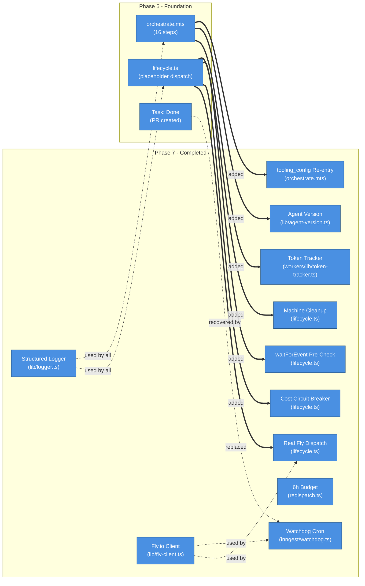
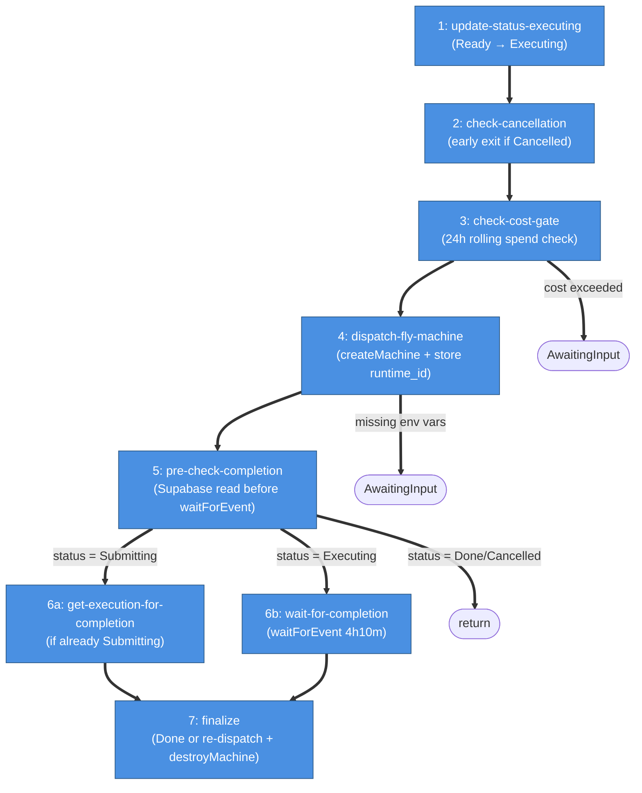
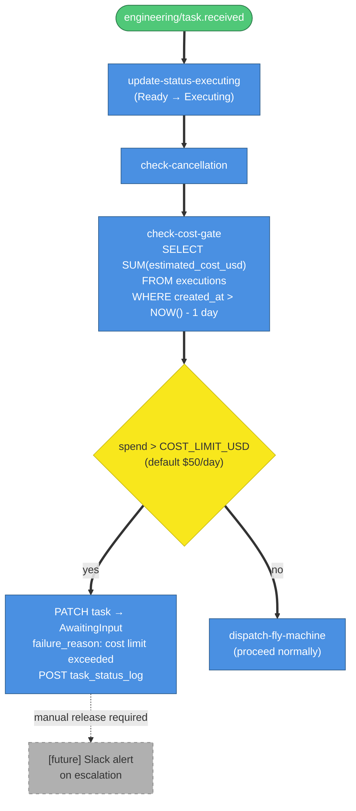
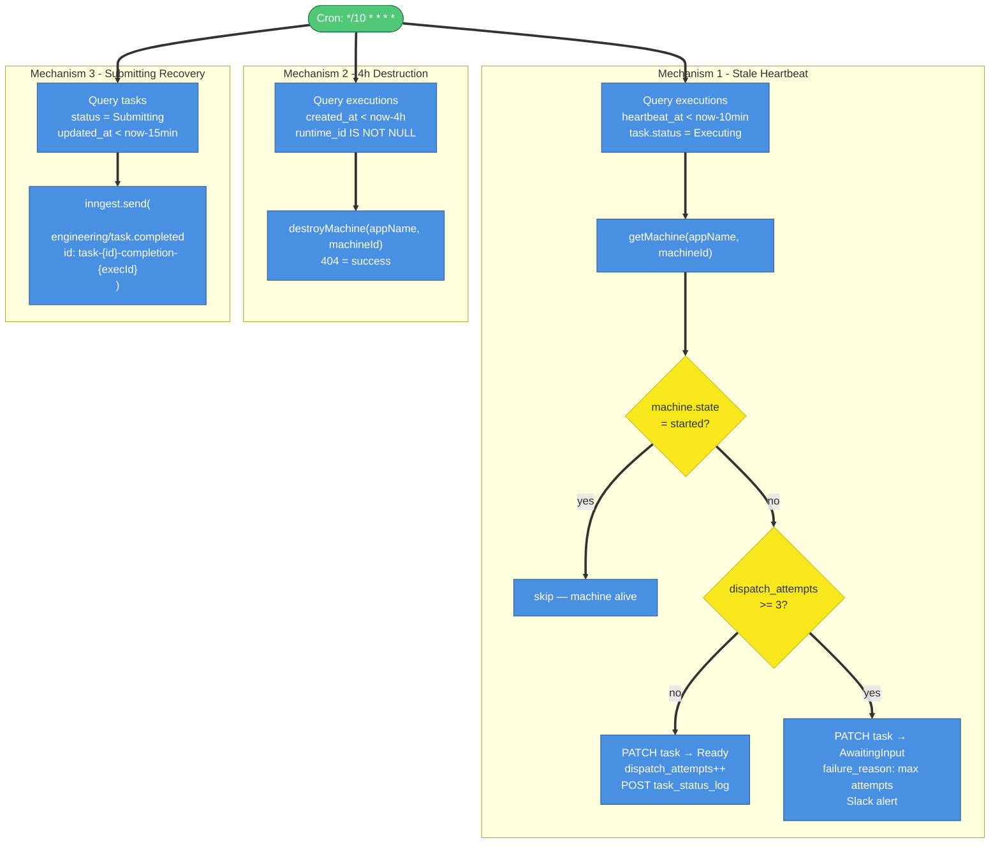
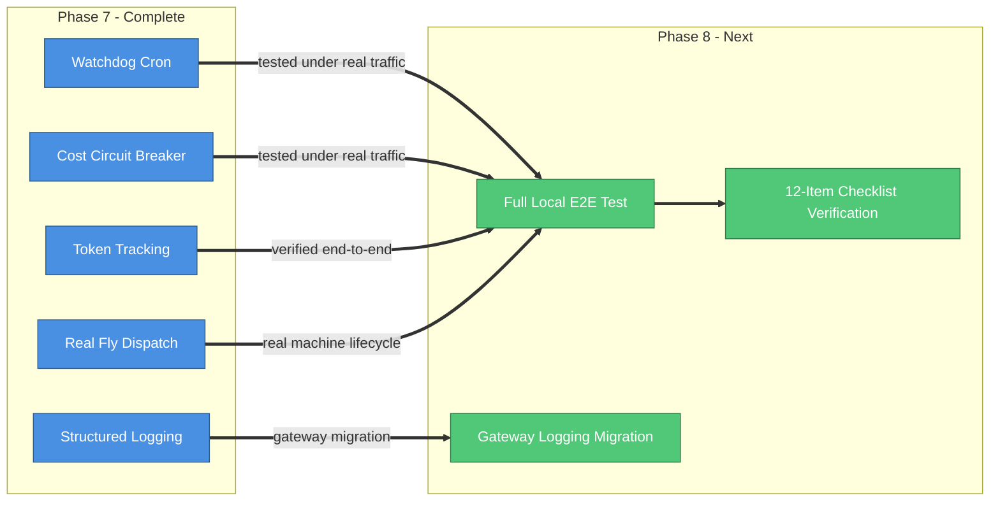

# Phase 7: Resilience & Monitoring — Architecture & Implementation

## What This Document Is

This document describes everything built during Phase 7 of the AI Employee Platform: structured JSON logging (pino), the Fly.io Machines API client, agent version tracking, token tracking, cost circuit breaker upgrades, a waitForEvent race condition fix, redispatch budget enforcement, real Fly.io machine dispatch, machine cleanup on finalize, tooling_config re-entry, and the watchdog cron. Phase 7 converts the working MVP from Phases 1-6 into a production-ready system. Every execution is now linked to a versioned agent record, LLM costs are persisted to the database, stale machines are automatically recovered, and all workers emit structured JSON logs that can be ingested by any log aggregator.

---

## What Was Built



| #   | What happens                  | Details                                                                                                                                                                                                                           |
| --- | ----------------------------- | --------------------------------------------------------------------------------------------------------------------------------------------------------------------------------------------------------------------------------- |
| 1   | Structured JSON logging       | `src/lib/logger.ts` wraps pino. `createLogger(component)` returns a child logger with `component` bound. `taskLogger(component, taskId)` adds `taskId`. All workers and Inngest functions now emit structured JSON.               |
| 2   | Fly.io Machines API client    | `src/lib/fly-client.ts` implements `createMachine`, `destroyMachine`, and `getMachine` against `https://api.machines.dev/v1`. Retries on 429 (rate limit) via `withRetry`. Treats 404 on destroy as success.                      |
| 3   | Agent version tracking        | `src/lib/agent-version.ts` computes SHA-256 hashes of prompt template, model ID, and tool config. `ensureAgentVersion` upserts the record — finds existing by hash triplet or creates new. Prevents duplicate records on restart. |
| 4   | Token tracking                | `src/workers/lib/token-tracker.ts` — `TokenTracker` class accumulates `promptTokens`, `completionTokens`, `estimatedCostUsd` across LLM calls. Uses `Math.round(...* 10_000) / 10_000` to avoid floating-point drift.             |
| 5   | Cost circuit breaker upgrades | `lifecycle.ts` `check-cost-gate` step queries 24h rolling spend from `executions`. If spend exceeds `COST_LIMIT_USD_PER_DEPT_PER_DAY`, task moves to `AwaitingInput` with a descriptive `failure_reason`.                         |
| 6   | waitForEvent race fix         | `lifecycle.ts` `pre-check-completion` step reads task status from Supabase before calling `waitForEvent`. If status is already `Submitting`, synthesizes the completion result and skips the wait. Mitigates Inngest #1433.       |
| 7   | Redispatch 6h budget          | `redispatch.ts` enforces a 6-hour total timeout across all re-dispatch attempts. Tasks that exceed the budget move to `AwaitingInput` rather than looping indefinitely.                                                           |
| 8   | Real Fly.io machine dispatch  | `lifecycle.ts` `dispatch-fly-machine` step calls `createMachine(flyWorkerApp, config)` with `performance-2x` VM size, `auto_destroy: true`, and all required env vars injected. Stores `flyMachine.id` on the execution.          |
| 9   | Machine cleanup               | `lifecycle.ts` `finalize` step calls `destroyMachine(flyWorkerApp, machine.id)` on both the success path and the timeout path. 404 is treated as success (machine already self-destructed).                                       |
| 10  | tooling_config re-entry       | `orchestrate.mts` now passes the project's `tooling_config` from `fetchProjectConfig` into the fix loop, replacing `DEFAULT_TOOLING_CONFIG`. The real config is available from the start of execution.                            |
| 11  | Watchdog cron                 | `src/inngest/watchdog.ts` runs every 10 minutes. Three recovery mechanisms: stale heartbeat detection + re-queue/escalate, 4h+ machine destruction, and `Submitting` task recovery via deterministic event re-send.               |

---

## Project Structure

```
ai-employee/
├── src/
│   ├── inngest/
│   │   ├── lifecycle.ts                       # Updated: real dispatch, cost gate, pre-check, cleanup
│   │   └── watchdog.ts                        # New: 10-min cron, 3 recovery mechanisms
│   ├── lib/
│   │   ├── logger.ts                          # New: pino wrapper, createLogger, taskLogger
│   │   ├── fly-client.ts                      # New: createMachine, destroyMachine, getMachine
│   │   └── agent-version.ts                   # New: computeVersionHash, ensureAgentVersion
│   └── workers/
│       ├── orchestrate.mts                    # Updated: token tracking, agent version, tooling_config
│       └── lib/
│           └── token-tracker.ts               # New: TokenTracker class
└── tests/
    ├── inngest/
    │   ├── lifecycle.test.ts                  # Updated: ~29 tests (cost gate, pre-check, real dispatch)
    │   ├── watchdog.test.ts                   # New: 7 tests
    │   └── redispatch.test.ts                 # Updated: 8 tests (6h budget)
    ├── lib/
    │   ├── logger.test.ts                     # New: 11 tests
    │   ├── fly-client.test.ts                 # New: 14 tests
    │   └── agent-version.test.ts              # New: 10 tests
    └── workers/
        ├── orchestrate.test.ts                # Updated: ~30 tests (token tracking, agent version)
        └── lib/
            └── token-tracker.test.ts          # New: 10 tests
```

---

## Module Architecture

### Logger (`src/lib/logger.ts`)

Thin wrapper around pino that binds a `component` field to every log line.

**Interface**

```typescript
export type Logger = pino.Logger;

export function createLogger(component: string): pino.Logger;

export function taskLogger(component: string, taskId: string): pino.Logger;
```

**Behavior**

`createLogger` configures pino with ISO timestamps (`pino.stdTimeFunctions.isoTime`), `pino.stdSerializers.err` for error objects, and a redact list that censors any field ending in `_TOKEN`, `_SECRET`, `_KEY`, or `_PASSWORD`. Returns a child logger with `{ component }` bound. Every log line is a JSON object with `time`, `level`, `component`, and the caller's fields.

`taskLogger` calls `createLogger(component).child({ taskId })` — a convenience for worker code where every log line should carry the task ID.

---

### Fly.io Client (`src/lib/fly-client.ts`)

Typed HTTP client for the Fly.io Machines API v1.

**Interface**

```typescript
export interface FlyMachineConfig {
  image: string;
  vm_size?: string;
  env?: Record<string, string>;
  auto_destroy?: boolean;
}

export interface FlyMachine {
  id: string;
  state: string;
  name?: string;
  image_ref?: { digest: string };
}

export async function createMachine(appName: string, config: FlyMachineConfig): Promise<FlyMachine>;

export async function destroyMachine(appName: string, machineId: string): Promise<void>;

export async function getMachine(appName: string, machineId: string): Promise<FlyMachine | null>;
```

**Behavior**

All three functions call `makeRequestWithRetry`, which wraps `makeRequest` with `withRetry` configured to retry on `RateLimitExceededError` (HTTP 429) up to 3 times with 1-second base delay.

`createMachine` POSTs to `/apps/{appName}/machines` and throws `ExternalApiError` on any non-2xx response.

`destroyMachine` DELETEs `/apps/{appName}/machines/{machineId}?force=true`. Treats both 204 (success) and 404 (already gone) as success. Throws `ExternalApiError` on any other status.

`getMachine` GETs `/apps/{appName}/machines/{machineId}`. Returns `null` on 404. Returns the `FlyMachine` object on 200. Throws `ExternalApiError` on any other status.

---

### Agent Version (`src/lib/agent-version.ts`)

Hash-based deduplication for agent version records.

**Interface**

```typescript
export interface VersionInput {
  promptTemplate: string;
  modelId: string;
  toolConfig: Record<string, unknown>;
}

export function computeVersionHash(input: VersionInput): {
  promptHash: string;
  modelId: string;
  toolConfigHash: string;
};

export async function ensureAgentVersion(
  prisma: PrismaClient,
  params: { promptHash: string; modelId: string; toolConfigHash: string; changelogNote?: string },
): Promise<string>;
```

**Behavior**

`computeVersionHash` computes SHA-256 of the prompt template string and SHA-256 of the tool config using deterministic JSON serialization (keys sorted before stringify). This ensures `{ b: 1, a: 2 }` and `{ a: 2, b: 1 }` produce the same hash.

`ensureAgentVersion` first queries `agent_versions` for an existing record matching all three hashes. If found, returns its UUID immediately. If not found, creates a new record with `is_active: true`. This upsert pattern means restarting the orchestrator with the same prompt and model never creates duplicate version records.

---

### Token Tracker (`src/workers/lib/token-tracker.ts`)

Stateful accumulator for LLM token usage across a single execution.

**Interface**

```typescript
export interface TokenUsage {
  promptTokens: number;
  completionTokens: number;
  estimatedCostUsd: number;
  model: string;
}

export interface AccumulatedUsage {
  promptTokens: number;
  completionTokens: number;
  estimatedCostUsd: number;
  primaryModelId: string;
}

export class TokenTracker {
  addUsage(usage: TokenUsage): void;
  getAccumulated(): AccumulatedUsage;
  reset(): void;
}
```

**Behavior**

`addUsage` accumulates token counts and cost. Cost is rounded to 4 decimal places after each addition (`Math.round(... * 10_000) / 10_000`) to prevent floating-point drift across many small LLM calls. The `primaryModelId` is set from the first `addUsage` call and never overwritten — it captures the model used for the main generation step.

`getAccumulated` returns a snapshot. `reset` zeroes all fields for re-use across test cases.

---

### Watchdog Cron (`src/inngest/watchdog.ts`)

10-minute Inngest cron function with three independent recovery mechanisms.

**Interface**

```typescript
export interface WatchdogResult {
  staleMachinesDetected: number;
  submittingRecovered: number;
  escalated: number;
}

export async function runWatchdog(
  prisma: PrismaClient,
  flyClient: FlyClient,
  inngest: Pick<Inngest, 'send'>,
  slackClient: SlackClient,
): Promise<WatchdogResult>;

export function createWatchdogFunction(
  inngest: Inngest,
  prisma: PrismaClient,
  flyClient: FlyClient,
  slackClient: SlackClient,
): InngestFunction.Any;
```

**Behavior**

`runWatchdog` is a pure exported function (not a closure) so it can be unit-tested without an Inngest instance. `createWatchdogFunction` wraps it in an Inngest cron trigger (`*/10 * * * *`).

The three recovery mechanisms run sequentially in each cron tick:

1. **Stale heartbeat detection**: Queries `executions` where `heartbeat_at < now - 10min` and `task.status = 'Executing'`. For each stale execution, calls `getMachine` to verify the machine is actually gone. If the machine is still `started`, skips it. If gone (null or non-started state): increments `dispatch_attempts`. If attempts < 3, moves task to `Ready` and logs. If attempts >= 3, moves to `AwaitingInput` with `failure_reason`, posts a Slack alert, and increments `escalated`.

2. **4h+ machine destruction**: Queries `executions` where `created_at < now - 4h` and `runtime_id IS NOT NULL`. Calls `destroyMachine` for each. Failures are logged as warnings but don't stop the loop.

3. **Submitting recovery**: Queries `tasks` where `status = 'Submitting'` and `updated_at < now - 15min`. For each, re-sends `engineering/task.completed` using the deterministic event ID `task-{taskId}-completion-{executionId}`. Inngest deduplicates the event if the lifecycle function already processed it.

---

## Lifecycle Step Sequence (Phase 7 Final State)



| Step | Name                         | Added In                         |
| ---- | ---------------------------- | -------------------------------- |
| 1    | update-status-executing      | Phase 2                          |
| 2    | check-cancellation           | Phase 4                          |
| 3    | check-cost-gate              | Phase 7                          |
| 4    | dispatch-fly-machine         | Phase 7 (real; stub was Phase 3) |
| 5    | pre-check-completion         | Phase 7                          |
| 6a   | get-execution-for-completion | Phase 7                          |
| 6b   | wait-for-completion          | Phase 3                          |
| 7    | finalize                     | Phase 6 (cleanup added Phase 7)  |

---

## Cost Circuit Breaker Flow



| Step | What happens                                                                                                         |
| ---- | -------------------------------------------------------------------------------------------------------------------- |
| 1    | Lifecycle function receives `engineering/task.received` and transitions task to `Executing`                          |
| 2    | Cancellation check — exits early if task was cancelled while queued                                                  |
| 3    | Queries rolling 24h spend from `executions.estimated_cost_usd` using a raw SQL aggregate                             |
| 4    | If spend exceeds the limit, task moves to `AwaitingInput` with a descriptive failure reason and the function returns |
| 5    | If spend is within limit, dispatch proceeds normally                                                                 |

---

## Watchdog Recovery Cycle



| Mechanism           | Trigger condition                                    | Recovery action                                                               |
| ------------------- | ---------------------------------------------------- | ----------------------------------------------------------------------------- |
| Stale heartbeat     | `heartbeat_at < now - 10min` AND machine is gone     | Re-queue to `Ready` (up to 3 attempts) or escalate to `AwaitingInput` + Slack |
| 4h+ destruction     | `created_at < now - 4h` AND `runtime_id IS NOT NULL` | `destroyMachine` — prevents zombie machines accumulating on Fly.io            |
| Submitting recovery | `status = Submitting` AND `updated_at < now - 15min` | Re-send `engineering/task.completed` with deterministic event ID              |

---

## Test Suite

| Test file                                 | Tests | What it covers                                                                                                                                                                                    |
| ----------------------------------------- | ----- | ------------------------------------------------------------------------------------------------------------------------------------------------------------------------------------------------- |
| `tests/lib/logger.test.ts`                | 11    | `createLogger` output shape, component binding, redaction of `_TOKEN`/`_SECRET`/`_KEY`/`_PASSWORD` fields; `taskLogger` taskId binding                                                            |
| `tests/lib/fly-client.test.ts`            | 14    | `createMachine` success and API error; `destroyMachine` 204 success, 404 as success, error on other status; `getMachine` 200 success, 404 returns null, error on other status; 429 retry behavior |
| `tests/lib/agent-version.test.ts`         | 10    | `computeVersionHash` determinism, key-order independence; `ensureAgentVersion` returns existing ID, creates new record, hash uniqueness                                                           |
| `tests/workers/lib/token-tracker.test.ts` | 10    | `addUsage` accumulation, floating-point precision, primaryModelId first-write semantics; `getAccumulated` snapshot; `reset` zeroes all fields                                                     |
| `tests/inngest/watchdog.test.ts`          | 7     | Stale heartbeat re-queue, escalation at 3 attempts, Slack alert on escalation, 4h machine destruction, Submitting recovery event re-send, machine-alive skip                                      |
| `tests/inngest/redispatch.test.ts`        | 8     | 6h budget enforcement, re-dispatch within budget, budget exceeded moves to AwaitingInput                                                                                                          |
| `tests/inngest/lifecycle.test.ts`         | 29    | Updated: cost gate pass/fail, pre-check Submitting path, pre-check Done/Cancelled early exit, real dispatch step, machine cleanup on finalize and timeout paths                                   |
| `tests/workers/orchestrate.test.ts`       | 30    | Updated: token tracking accumulation, agent version upsert, tooling_config passed to fix loop                                                                                                     |

**Total: ~503 tests** (up from 435 baseline at end of Phase 6)

```bash
pnpm test -- --run
```

1 pre-existing container-boot failure (infrastructure, unrelated to Phase 7). 10 skipped (integration tests requiring a live OpenCode server).

---

## Key Design Decisions

### 1. Token Tracking Is a Prerequisite for Circuit Breaker

The cost circuit breaker in `lifecycle.ts` queries `executions.estimated_cost_usd` to compute rolling 24h spend. That column is only meaningful if the orchestrator writes token costs back to the execution row after each LLM call. `TokenTracker` accumulates costs during the session and `orchestrate.mts` writes the final totals to Supabase before sending the completion event. Without this write, the circuit breaker would always see $0 spend and never trigger.

### 2. pino for Structured Logging

pino was chosen over a custom `console.log` wrapper for three reasons: it emits newline-delimited JSON by default (compatible with Datadog, Loki, and CloudWatch without a parser), it has built-in redaction so secrets never appear in logs even if accidentally passed as context, and it's the fastest Node.js logger by benchmark. The `createLogger(component)` API keeps call sites simple while ensuring every log line carries enough context to be useful in production.

### 3. Watchdog as Pure Exported Function

`runWatchdog` is exported separately from `createWatchdogFunction`. The Inngest function wrapper is a thin shell that calls `runWatchdog` and logs the result. This separation means the watchdog logic can be unit-tested by passing mock Prisma, FlyClient, Inngest, and SlackClient instances directly — no Inngest test harness required. All 7 watchdog tests use this pattern.

### 4. Agent Version Upsert Semantics

`ensureAgentVersion` does a find-first before creating. This is intentionally not a database-level upsert (`createOrUpdate`) because the hash triplet is not a unique constraint in the schema — it's a logical uniqueness enforced by the application. The find-first approach is safe for the single-writer pattern (one orchestrator per execution) and avoids a migration to add a composite unique index. On restart with the same prompt and model, the orchestrator gets back the same UUID it used before.

### 5. waitForEvent Pre-Check Is Best-Effort

The `pre-check-completion` step reads task status from Supabase before calling `waitForEvent`. If the machine completed and wrote `Submitting` status before the lifecycle function reached the wait step, the pre-check catches it and synthesizes the completion result. This eliminates the most common race window. However, a TOCTOU gap still exists: the machine could complete between the pre-check read and the `waitForEvent` setup. Inngest's upcoming "event lookback" feature is the correct long-term fix. The pre-check is documented as best-effort in the code comment.

---

## Known Limitations

1. **TOCTOU in waitForEvent pre-check**: A race window still exists between the Supabase read in `pre-check-completion` and the `waitForEvent` setup. If the machine completes in that window, the event is missed and the lifecycle function waits the full 4h10m timeout before re-dispatching. Inngest's upcoming "event lookback" is the proper fix.

2. **Cost circuit breaker auto-release**: Tasks held in `AwaitingInput` due to cost limits require manual release. There is no auto-release when the 24h window resets. An operator must manually transition the task back to `Ready` or increase `COST_LIMIT_USD_PER_DEPT_PER_DAY`.

3. **Token tracking approximation**: The orchestrator accumulates tokens from OpenCode session responses, not from direct `callLLM()` calls. The exact source of token counts depends on how OpenCode exposes usage data in its session response format. Counts may undercount if OpenCode batches or omits usage metadata.

---

## What Phase 8 Builds On Top of This

Phase 8 (Full Local E2E) will:

1. Run the complete flow from Jira webhook to PR creation locally, end-to-end
2. Verify all 12 checklist items from the implementation phases doc under real conditions
3. Exercise the watchdog, circuit breaker, and structured logging as part of the live test
4. Migrate gateway `console.log` calls to the structured logger
5. All Phase 7 resilience mechanisms are tested under real traffic for the first time


