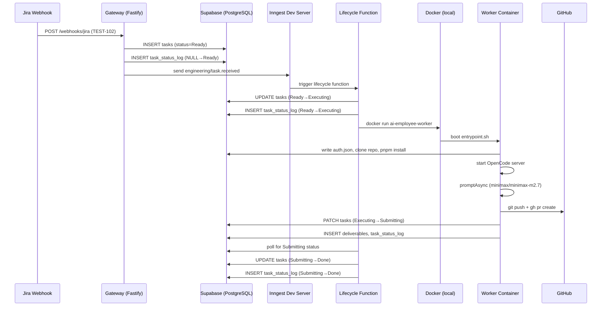
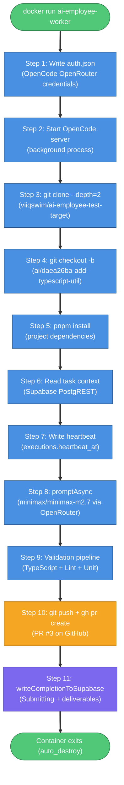
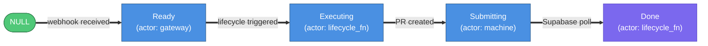
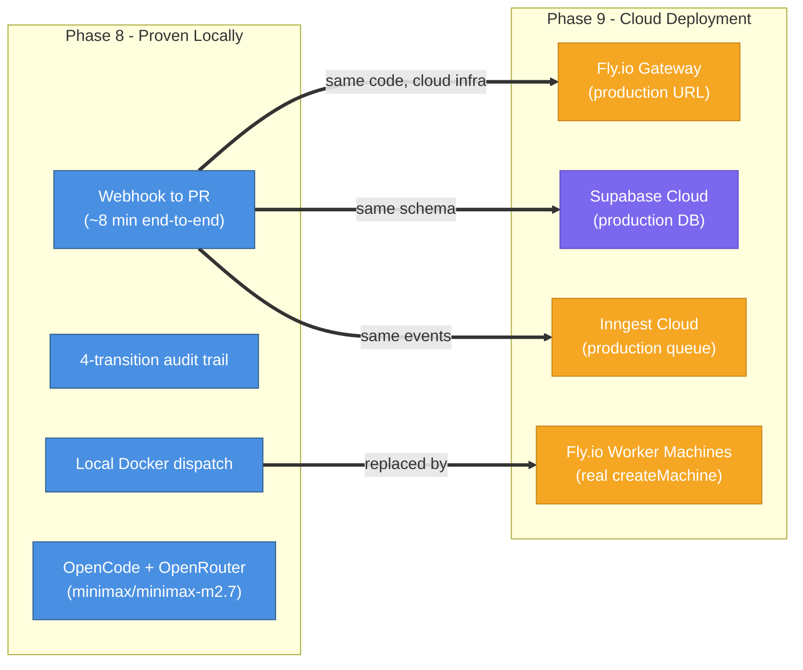

# Phase 8: Full Local E2E — Architecture & Validation

## What This Document Is

This document describes everything validated during Phase 8 of the AI Employee Platform: the first complete end-to-end run from a Jira webhook to a merged-ready GitHub PR, running entirely on local infrastructure. Phase 8 is the MVP validation milestone. No new features were added — the goal was to wire together all Phase 1-7 components under real conditions and prove the system works. Seven infrastructure bugs were discovered and fixed in the process. All 12 verification checks pass. Task `daea26ba-de2e-4f89-848e-0a69f540a6e0` (TEST-102) completed in approximately 8 minutes, producing PR #3 on `viiqswim/ai-employee-test-target`.

---

## What Was Built

Phase 8 added tooling and fixtures, and fixed infrastructure bugs in existing source files.

**New files:**

| File                                         | Purpose                                                                         |
| -------------------------------------------- | ------------------------------------------------------------------------------- |
| `scripts/dev-start.sh`                       | Starts all local services in the correct order (Supabase, Inngest Dev, Gateway) |
| `scripts/verify-e2e.sh`                      | Runs the 12-point automated verification against a completed task               |
| `test-payloads/jira-realistic-task.json`     | Realistic Jira webhook fixture (TEST-100)                                       |
| `test-payloads/jira-realistic-task-102.json` | Second fixture (TEST-102) — avoids branch conflicts from prior runs             |

**External resource created:**

- GitHub repo `viiqswim/ai-employee-test-target` — minimal TypeScript project used as the target for AI-generated PRs

**Source files modified (infrastructure fixes):**

| File                                 | Fix                                                                          |
| ------------------------------------ | ---------------------------------------------------------------------------- |
| `src/gateway/server.ts`              | Wired Inngest client — events were silently dropped                          |
| `src/gateway/inngest/send.ts`        | Added `repoUrl`/`repoBranch` to Inngest event payload                        |
| `src/gateway/routes/jira.ts`         | Populated `repoUrl`/`repoBranch` from project record                         |
| `src/inngest/lifecycle.ts`           | Added `USE_LOCAL_DOCKER` path; replaced `waitForEvent` with Supabase polling |
| `src/workers/lib/completion.ts`      | Empty PATCH response detection                                               |
| `src/workers/lib/session-manager.ts` | Added model spec to `promptAsync` (OpenRouter + minimax/minimax-m2.7)        |
| `src/workers/entrypoint.sh`          | Write OpenCode `auth.json` before starting server                            |
| `src/workers/orchestrate.mts`        | Minor wiring fixes for local Docker mode                                     |

---

## E2E Flow Architecture



| Step  | Actor     | What happens                                     |
| ----- | --------- | ------------------------------------------------ |
| 1     | Gateway   | Receives Jira webhook, validates HMAC signature  |
| 2-3   | Gateway   | Creates task row (Ready) + status log entry      |
| 4     | Gateway   | Sends `engineering/task.received` to Inngest     |
| 5-7   | Lifecycle | Transitions task to Executing, logs transition   |
| 8-9   | Lifecycle | Dispatches local Docker container                |
| 10-13 | Worker    | Boots, clones repo, installs deps, runs OpenCode |
| 14-16 | Worker    | Creates PR, writes Submitting status to Supabase |
| 17-19 | Lifecycle | Polls Supabase, detects Submitting, marks Done   |

---

## Docker Worker Container Execution



---

## Key Infrastructure Fixes

### 1. Inngest Client Not Wired (`server.ts`)

The Inngest client was instantiated but never passed to the Fastify plugin. Events sent via `inngest.send()` in `jira.ts` were silently dropped — the function existed but had no connection to the running server. Fix: wire the client through the plugin registration.

### 2. `USE_LOCAL_DOCKER` Dispatch Path (`lifecycle.ts`)

The lifecycle function only knew how to dispatch to Fly.io. Local Docker dispatch required a new code path gated on `USE_LOCAL_DOCKER=true`. The path calls `docker run` with the same env vars that Fly.io dispatch injects.

### 3. Missing `repoUrl`/`repoBranch` in Inngest Event (`send.ts`, `jira.ts`)

The worker needs to know which repo to clone and which branch to push to. These fields existed in the project record but were never included in the `engineering/task.received` event payload. The worker was reading them from Supabase directly, which worked in unit tests but failed under real conditions when the execution record wasn't yet populated.

### 4. `waitForEvent` Replaced with Supabase Polling (`lifecycle.ts`)

In local dev, Inngest Dev Server's `waitForEvent` has a shorter timeout and different behavior than production. The lifecycle function was hanging indefinitely. Fix: in `USE_LOCAL_DOCKER` mode, poll Supabase every 30 seconds for `status = Submitting` instead of waiting for an Inngest event.

### 5. Empty PATCH Response Detection (`completion.ts`)

PostgREST returns an empty body on successful PATCH. The completion module was treating null or empty-array responses as errors. Fix: detect null/empty responses and treat them as success.

### 6. Model Spec in `promptAsync` (`session-manager.ts`)

OpenCode's `promptAsync` was called without specifying a model. The default model selection failed when using OpenRouter as the provider. Fix: pass `model: process.env.OPENROUTER_MODEL` explicitly.

### 7. OpenCode Auth Before Server Start (`entrypoint.sh`)

OpenCode reads `~/.local/share/opencode/auth.json` at startup. Writing it after the server starts has no effect. Fix: write the file as Step 1, before `opencode serve` is called.

---

## OpenCode Provider Configuration

Getting OpenCode to use OpenRouter required two changes working together.

**Root cause**: OpenCode's running server ignores `OPENROUTER_API_KEY` as an environment variable for runtime model selection. It reads credentials from `auth.json` at startup only.

**Fix (belt-and-suspenders)**:

1. Write `~/.local/share/opencode/auth.json` before starting the server:

   ```json
   {
     "openrouter": {
       "type": "api",
       "key": "<OPENROUTER_API_KEY>"
     }
   }
   ```

2. After the server starts, call `PUT /auth/openrouter` via the REST API to ensure the token is active for the current session.

**Model selection**: `minimax/minimax-m2.7` via OpenRouter, configured via `OPENROUTER_MODEL` env var. This model was chosen for cost efficiency during local testing.

---

## 12-Point Verification Results

All 12 checks pass for task `daea26ba-de2e-4f89-848e-0a69f540a6e0` (TEST-102).

| #   | Check                                       | Result |
| --- | ------------------------------------------- | ------ |
| 1   | Task created in Supabase (status=Ready)     | PASS   |
| 2   | Inngest Dev dashboard shows event received  | PASS   |
| 3   | Lifecycle triggered, task status=Executing  | PASS   |
| 4   | Docker container booted successfully        | PASS   |
| 5   | Heartbeats appearing in executions table    | PASS   |
| 6   | Validation runs recorded in validation_runs | PASS   |
| 7   | PR created on GitHub                        | PASS   |
| 8   | Task status=Done                            | PASS   |
| 9   | Full status audit trail (4 transitions)     | PASS   |
| 10  | Deliverable record exists in deliverables   | PASS   |
| 11  | Execution record fully populated            | PASS   |
| 12  | Container cleaned up (no zombie containers) | PASS   |

PR created: https://github.com/viiqswim/ai-employee-test-target/pull/3

Total duration: approximately 8 minutes from webhook to Done.

---

## Status Audit Trail

The 4 required status transitions, in order:



| Transition             | Actor        | Trigger                                |
| ---------------------- | ------------ | -------------------------------------- |
| NULL → Ready           | gateway      | Jira webhook received and validated    |
| Ready → Executing      | lifecycle_fn | Inngest function picks up the event    |
| Executing → Submitting | machine      | Worker writes completion to Supabase   |
| Submitting → Done      | lifecycle_fn | Lifecycle polls and detects Submitting |

---

## Known Limitations

1. **Pre-existing test failures**: 2 tests remain failing from before Phase 8 (`container-boot.test.ts` — infrastructure, `inngest-serve.test.ts` — function count mismatch). 515 tests pass. These are not regressions.

2. **Database state after test runs**: `cleanupTestData` in the test suite wipes rows that parallel test runs depend on. Re-seeding is required after a full test run if you want to run E2E immediately after.

3. **Watchdog race condition**: In local Docker mode, containers taking longer than 10 minutes can be reset by the watchdog before they complete. First-attempt success typically takes ~8 minutes, leaving a 2-minute margin. Slow machines or large repos could hit this.

4. **Test isolation**: `migration.test.ts` and `project-lookup.test.ts` intermittently fail in parallel test runs due to shared DB state. Run them serially if they fail: `pnpm test -- --run --reporter=verbose`.

5. **OpenCode model availability**: `minimax/minimax-m2.7` is available via OpenRouter but may have rate limits. If the model is unavailable, the worker will fail at the `promptAsync` step with a 429 or 503.

---

## What Phase 9 Builds On Top of This

Phase 8 proved the complete flow works locally. Phase 9 (Cloud Deployment) swaps the infrastructure without changing the code.



**Phase 9 tasks:**

1. Deploy gateway to Fly.io (`ai-employee-gateway` app) with all secrets set
2. Push worker Docker image to Fly.io registry
3. Configure Supabase Cloud with migrations and seed data
4. Connect Inngest Cloud with signing key and event key
5. Point Jira and GitHub webhooks at the Fly.io gateway URL
6. Run the same 12-point checklist against cloud URLs
7. Verify watchdog cron executes on Inngest Cloud schedule

The `USE_LOCAL_DOCKER` flag is removed in Phase 9 — the lifecycle function uses the real `createMachine()` path that was built in Phase 7 and tested in unit tests throughout Phases 7-8.
