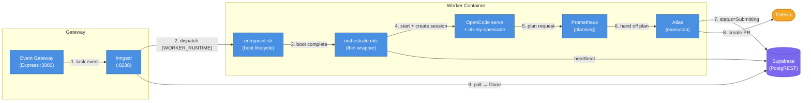

# Worker System — Post-Redesign Overview

## What This Document Is

A brief overview of what the worker system looks like **after** the worker-agent-delegation redesign is complete. This is the target state, not the current state. For the current state, see [`2026-04-07-1732-hybrid-mode-current-state.md`](./2026-04-07-1732-hybrid-mode-current-state.md). For the full redesign plan, see [`.sisyphus/plans/worker-agent-delegation-redesign.md`](../.sisyphus/plans/worker-agent-delegation-redesign.md).

---

## TL;DR

The worker container no longer runs custom TypeScript orchestration (phases, waves, sessions, fix loops, validation pipelines). A thin ~100-line wrapper starts OpenCode with the oh-my-opencode plugin and delegates everything to **Prometheus** (planning) and **Atlas** (execution). The agent owns its own completion signaling, progress tracking, and restart recovery via the plan file.

### Before / After

| Aspect            | Before (Current)                                              | After (Post-Redesign)                                                                 |
| ----------------- | ------------------------------------------------------------- | ------------------------------------------------------------------------------------- |
| Orchestration     | ~600-line `orchestrate.mts` — custom phases, waves, fix loops | ~100-line thin wrapper → Prometheus + Atlas                                           |
| Sessions          | New session per wave                                          | Single session with native auto-compact                                               |
| Dispatch modes    | Two booleans: `USE_LOCAL_DOCKER`, `USE_FLY_HYBRID`            | Single enum: `WORKER_RUNTIME=docker\|hybrid\|fly`                                     |
| Tunnel            | ngrok + Cloudflare                                            | Cloudflare only                                                                       |
| Escalation        | Iteration counts (3/stage, 10 global)                         | Cost-based (`TASK_COST_LIMIT_USD`)                                                    |
| Timeout           | Fixed 30-minute monitor                                       | Heartbeat-based (configurable)                                                        |
| Plan file         | Locked read-only (`chmod 0o444`)                              | Writable — Atlas checks off tasks as it goes                                          |
| Plan verifier     | Disabled by default                                           | Always-on                                                                             |
| Docker image      | Node.js only                                                  | Node + Python + Go + Rust                                                             |
| Project awareness | None                                                          | Project profiles persisted in Supabase                                                |
| Completion signal | Custom TypeScript code                                        | Agent writes `status=Submitting` via PostgREST (instruction baked into system prompt) |

---

## Architecture



**Flow Walkthrough**

| Step | What Happens                                                                                        |
| ---- | --------------------------------------------------------------------------------------------------- |
| 1    | Gateway receives Jira webhook, creates task row, sends event to Inngest                             |
| 2    | Lifecycle function reads `WORKER_RUNTIME`, spawns worker (Docker, hybrid, or Fly.io)                |
| 3    | `entrypoint.sh` boots: clone repo, install deps, read task context, sync plan from Supabase         |
| 4    | Thin wrapper starts `opencode serve`, creates a single session with `agent: "prometheus"`           |
| 5    | Prometheus receives the task context + worker system prompt, generates an implementation plan       |
| 6    | Plan verifier (Haiku) validates the plan, then Prometheus hands off to Atlas for execution          |
| 7    | Atlas executes the plan, checks off tasks, and writes `status=Submitting` to Supabase via PostgREST |
| 8    | Atlas creates the PR on GitHub                                                                      |
| 9    | Lifecycle function polls Supabase, detects `Submitting`, marks task `Done`, destroys machine        |

---

## What the Thin Wrapper Does

The new `orchestrate.mts` (~100 lines) does exactly this:

1. **Parse context** — read `TASK_ID`, `EXECUTION_ID`, repo info, credentials from env
2. **Load project profile** — fetch from Supabase (or `null` on first run for a project)
3. **Pre-flight** — install deps, start heartbeat, start `opencode serve`, auth with OpenRouter
4. **Branch setup** — create or checkout `ai/{ticketId}-{slug}`
5. **Create session** — single OpenCode session, `agent: "prometheus"`, inject worker context template
6. **Monitor** — SSE event loop:
   - `session.idle` → check Supabase for completion, sync plan
   - `session.compacted` → log + continue (context window was full, not an error)
   - `session.error` → escalate
7. **Guard rails** — cost check (`TASK_COST_LIMIT_USD`), heartbeat staleness check (`HEARTBEAT_TIMEOUT_MINS`)
8. **Finalize** — write final status if agent didn't, cleanup

Everything else — what code to write, how to validate it, how to fix failures, when to commit — is the agent's problem.

---

## What the Agent Gets Told

The worker context template (`worker-context-template.ts`) injects these instructions into Prometheus's first prompt:

| Instruction              | Why                                                                                                  |
| ------------------------ | ---------------------------------------------------------------------------------------------------- |
| **Completion signaling** | Exact PostgREST `curl` command to write `status=Submitting` — mandatory final task in every plan     |
| **Progress milestones**  | Heartbeat update after every 3-4 tasks so the platform knows the agent is alive                      |
| **Dynamic tooling**      | "Discover what's available — read `package.json`, `Makefile`, `Cargo.toml`, etc. Don't assume pnpm." |
| **Plan format**          | `.sisyphus/plans/{TICKET-KEY}.md` with `## Wave N` sections and `- [ ] N. Task` items                |
| **Profile update**       | Save discovered project info (language, package manager, test framework) to Supabase on completion   |
| **Restart resilience**   | "If the plan is partially checked off when you start, continue from the first unchecked task."       |

---

## Dispatch Modes

Single env var replaces two boolean flags:

| `WORKER_RUNTIME` | What Runs Where                                     | Cleanup                         |
| ---------------- | --------------------------------------------------- | ------------------------------- |
| `docker`         | Local Docker container                              | `docker stop` in `finally`      |
| `hybrid`         | Fly.io machine + local Supabase + Cloudflare Tunnel | `destroyMachine()` in `finally` |
| `fly` (default)  | Full cloud Fly.io                                   | `destroyMachine()` in `finally` |

All three modes now have guaranteed `try/finally` cleanup. The `auto_destroy` bug from the old default Fly path is gone. The silent no-op when both old flags were set is gone — `WORKER_RUNTIME` is a single enum.

---

## New & Removed Environment Variables

### Added

| Var                      | Default | Purpose                                                    |
| ------------------------ | ------- | ---------------------------------------------------------- |
| `WORKER_RUNTIME`         | `fly`   | Dispatch mode: `docker`, `hybrid`, or `fly`                |
| `TASK_COST_LIMIT_USD`    | `20`    | Per-task cost ceiling before escalation                    |
| `HEARTBEAT_TIMEOUT_MINS` | `15`    | Inactivity threshold before stuck-agent escalation         |
| `PLAN_VERIFIER_ENABLED`  | `true`  | Set `false` to disable plan judge gate                     |
| `INNGEST_TUNNEL_URL`     | unset   | If set, hybrid mode uses `waitForEvent` instead of polling |

### Removed

| Var                | Replaced By             |
| ------------------ | ----------------------- |
| `USE_LOCAL_DOCKER` | `WORKER_RUNTIME=docker` |
| `USE_FLY_HYBRID`   | `WORKER_RUNTIME=hybrid` |
| `NGROK_AGENT_URL`  | Removed entirely        |

---

## Files Added & Removed

### Added

| File                                         | Purpose                                                                            |
| -------------------------------------------- | ---------------------------------------------------------------------------------- |
| `src/workers/lib/worker-context-template.ts` | Builds the Prometheus system prompt (completion signal, milestones, tooling, etc.) |
| `src/workers/lib/session-monitor.ts`         | Lean SSE-based session monitoring (4 functions: create, prompt, monitor, abort)    |
| `src/workers/lib/project-profile.ts`         | Load/save project profiles via PostgREST                                           |

### Removed

| File                         | Why                                                  |
| ---------------------------- | ---------------------------------------------------- |
| `fix-loop.ts`                | Agent handles its own fix iterations                 |
| `validation-pipeline.ts`     | Agent runs validation directly                       |
| `between-wave-push.ts`       | No wave pattern                                      |
| `continuation-dispatcher.ts` | No continuation logic                                |
| `cost-breaker.ts`            | Replaced by cost-based escalation in session-monitor |
| `planning-orchestrator.ts`   | Prometheus handles planning natively                 |
| `wave-executor.ts`           | No wave execution                                    |
| `completion-detector.ts`     | Agent signals completion via PostgREST               |
| `session-manager.ts`         | Replaced by lean session-monitor.ts                  |

---

## Docker Image Changes

| Component       | Before            | After                                          |
| --------------- | ----------------- | ---------------------------------------------- |
| Languages       | Node.js only      | Node.js + Python 3 + Go + Rust                 |
| Agent plugin    | None              | oh-my-opencode (provides Prometheus + Atlas)   |
| OpenCode config | Basic permissions | Plugin loaded: `"plugins": ["oh-my-opencode"]` |

The agent discovers what tools each project needs and installs missing dependencies dynamically. No assumption that every project uses Node/pnpm.

---

## Project Profiles

First-run discovery results are persisted to a new `project_profile` JSONB column on the `projects` table:

```json
{
  "language": ["typescript"],
  "packageManager": "pnpm",
  "testFramework": "vitest",
  "buildCommands": ["pnpm build"],
  "installedTools": ["gh"],
  "lastUpdated": "2026-04-14T00:00:00Z"
}
```

On subsequent runs, the profile is loaded and passed to Prometheus so it doesn't re-discover the project from scratch.

---

## What Didn't Change

- **entrypoint.sh** — same boot sequence (clone, branch, read task, heartbeat, exec orchestrate.mts)
- **Event Gateway** — same Express routes, webhook handling, Inngest function registration
- **Lifecycle function** — same structure (dispatch → poll/wait → finalize), simplified mode selection
- **PR creation** — same `pr-manager.ts`, same `[AI] {TICKET}: {summary}` template, same idempotency guard
- **Supabase schema** — same tables, plus `project_profile` column on `projects`
- **pollForCompletion** — still the fallback for hybrid mode without `INNGEST_TUNNEL_URL`
