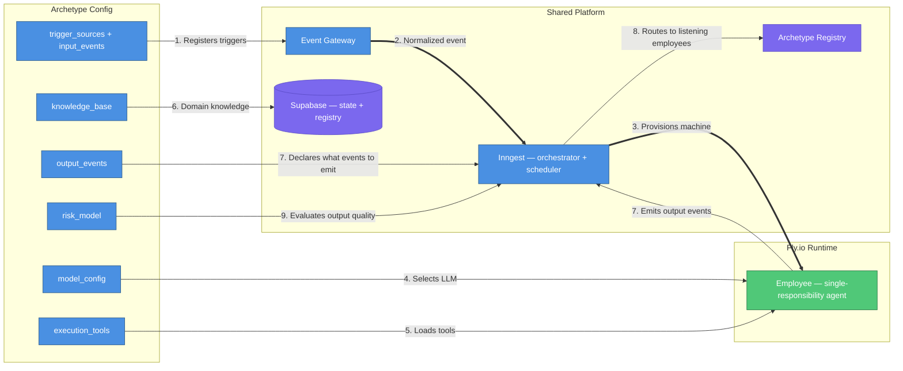
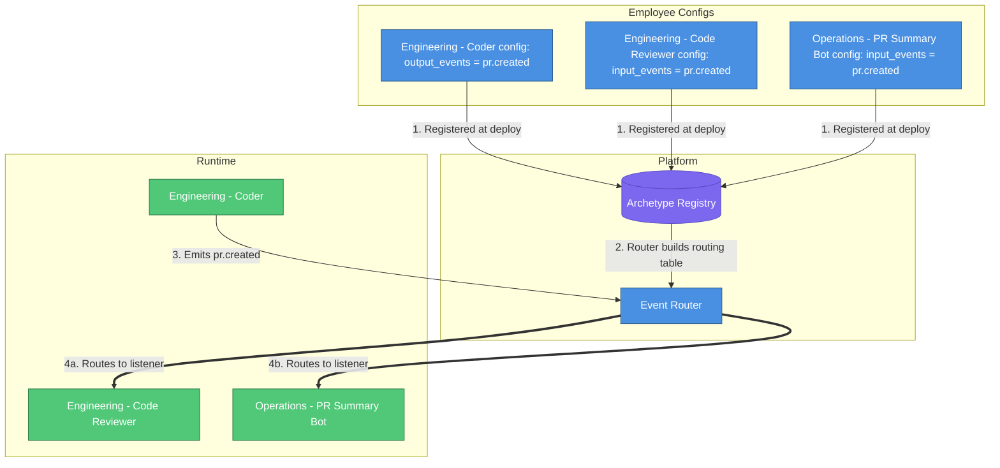
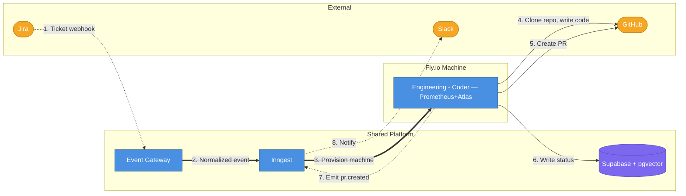

# AI Employee Platform — Full System Vision

## What This Document Is

A consolidated view of the complete AI Employee Platform — what it looks like when fully built, informed by everything we've learned building the Engineering MVP.

**Read this when you need to answer**: "Where is this whole thing going, and how do we get there?"

---

## Core Concept: Single-Responsibility Employees

The platform deploys **AI employees** — autonomous agents, each with a single responsibility. Every employee follows the same lifecycle, uses the same infrastructure, and runs on the same runtime (Fly.io). What changes per employee is the config.

**Mental model**: An AI employee is to the platform what a microservice is to a backend — independently deployable, single-purpose, communicates via events.

**Departments** are organizational groupings, not architectural concepts. "Engineering - Coder" and "Engineering - Code Reviewer" share a department tag but are independent employees with independent archetypes, triggers, and scaling.

### The Archetype (Employee Definition)

Every employee is defined by a declarative **archetype config**. The platform reads this config and knows: what triggers the employee, what tools it needs, what model to use, what events it emits, and how to evaluate its output.



| #   | What happens        | Details                                                                          |
| --- | ------------------- | -------------------------------------------------------------------------------- |
| 1   | Registers triggers  | `trigger_sources` tells the Gateway which webhooks/crons to watch                |
| 2   | Normalized event    | Gateway validates payload, normalizes to universal task schema, emits to Inngest |
| 3   | Provisions machine  | Inngest lifecycle function provisions a Fly.io machine for this employee         |
| 4   | Selects LLM         | `model_config` determines which model(s) the employee uses                       |
| 5   | Loads tools         | `execution_tools` provisions the tools available inside the machine              |
| 6   | Domain knowledge    | Employee queries Supabase for past runs, embeddings, domain docs                 |
| 7   | Emits output events | Employee emits declared `output_events` when work is done                        |
| 8   | Routes to listeners | Platform reads the Archetype Registry to find who listens for those events       |
| 9   | Evaluates output    | `risk_model` determines auto-approve vs. human escalation                        |

### Full Archetype Config Schema

| Field              | Purpose                          | Engineering - Coder                             | Operations - Slack Summarizer                 |
| ------------------ | -------------------------------- | ----------------------------------------------- | --------------------------------------------- |
| `department`       | Organizational grouping          | `engineering`                                   | `operations`                                  |
| `role_name`        | What this employee does          | `coder`                                         | `slack-summarizer`                            |
| `trigger_sources`  | What starts this employee        | Jira webhook (issue_created)                    | Cron (daily 9am CT)                           |
| `input_events`     | Events from other employees      | `review.changes_requested`                      | (none)                                        |
| `output_events`    | Events this employee emits       | `pr.created`, `execution.complete`              | `summary.posted`                              |
| `execution_tools`  | Tools available during execution | Git, file editor, test runner, GitHub CLI       | Slack API                                     |
| `knowledge_base`   | Domain knowledge sources         | pgvector embeddings, task history               | Channel history, past summaries               |
| `delivery_target`  | Where results go                 | GitHub PR                                       | Slack message                                 |
| `risk_model`       | Approval gate configuration      | File-count + critical-path score                | (none — always auto-deliver)                  |
| `escalation_rules` | When to involve a human          | DB migrations, auth changes                     | (none)                                        |
| `model_config`     | LLM selection                    | `{planner: "opus-4", executor: "sonnet-4"}`     | `{primary: "haiku-4.5"}`                      |
| `runtime_config`   | Fly.io machine settings          | `{vm_size: "performance-2x", max_duration: 90}` | `{vm_size: "shared-cpu-1x", max_duration: 5}` |

### Why Fly.io for Everything

Every employee runs on a Fly.io machine. No exceptions.

- **Consistency** — one deployment model, one container image, one monitoring approach
- **Workspace** — every employee gets a dedicated filesystem for files, code, data
- **Flexibility** — even "simple" employees can write code, analyze data, use git if needed
- **Scalability** — Fly.io machines are provisioned on demand and destroyed after use

Inngest is the **orchestrator and scheduler** (manages event routing, cron schedules, retries, durable execution). It is NOT a runtime — no employee logic runs inside Inngest functions.

---

## Universal Task Lifecycle

All employees share this state machine. The states and transitions are identical — only what happens _inside_ each state changes per employee.


| #   | What happens          | Details                                                                                   |
| --- | --------------------- | ----------------------------------------------------------------------------------------- |
| 1   | Event arrives         | External system fires webhook, cron triggers, or another employee emits an event          |
| 2   | Dispatch to triage    | Lifecycle function sends task to triage (or skips directly to Ready for simple employees) |
| 3   | Clarification needed  | Employee determines input is ambiguous; posts questions back to source system             |
| 4   | Task is unambiguous   | Input is clear; task marked Ready for execution                                           |
| 5   | Input received        | Source system provides clarification; triage re-evaluates                                 |
| 6   | No response 72h       | Clarification never received; task goes Stale (can be manually revived)                   |
| 7   | Slot available        | Execution slot opens; Fly.io machine provisioned                                          |
| 8   | Work output produced  | Employee produces deliverable; validation begins                                          |
| 9   | Validation fails      | Check fails; employee re-enters execution to fix                                          |
| 10  | All checks pass       | All validation stages pass; deliverable ready for submission                              |
| 11  | Submitted for review  | Deliverable submitted to review (human or another employee)                               |
| 12  | Review passed         | Approved; risk score below auto-approve threshold                                         |
| 13  | Changes requested     | Reviewer finds issues; task re-enters execution with feedback                             |
| 14  | Approval gate cleared | Human or auto-approval complete; ready to deliver                                         |
| 15  | Result delivered      | Output published; stakeholders notified                                                   |

**Simple employees skip states**: A Slack Summarizer goes `Received → Ready → Executing → Submitting → Done` — no triage, no review. The lifecycle function knows which states to skip based on the archetype config.

### What Each State Means Per Employee

| State         | Engineering - Coder               | Engineering - Code Reviewer         | Operations - Slack Summarizer   |
| ------------- | --------------------------------- | ----------------------------------- | ------------------------------- |
| Received      | Jira ticket created               | PR opened on GitHub                 | Cron fired at 9am               |
| Triaging      | Analyze requirements vs. codebase | Check PR size, assess complexity    | (skipped)                       |
| AwaitingInput | Questions posted to Jira          | Request more context from author    | (skipped)                       |
| Executing     | Write code, run tests on Fly.io   | Review diff, validate criteria      | Read channels, generate summary |
| Validating    | Lint → Unit → Integration → E2E   | CI passes, no merge conflicts       | Summary length/quality check    |
| Reviewing     | (output goes to Code Reviewer)    | Risk score → auto-merge or escalate | (skipped — auto-deliver)        |
| Delivering    | PR created on GitHub              | PR merged or escalated to Slack     | Summary posted to Slack         |

---

## Trigger Types

Every employee is started by a trigger. The platform supports five trigger types, all managed by Inngest.

| Type               | What fires it                           | Who manages it       | Example                                    |
| ------------------ | --------------------------------------- | -------------------- | ------------------------------------------ |
| **Webhook**        | External system sends HTTP event        | Event Gateway        | Jira ticket created, GitHub PR opened      |
| **Cron**           | Recurring schedule                      | Inngest scheduler    | Daily at 9am, weekly Monday, every 4 hours |
| **Employee event** | Another employee emits an output event  | Inngest event router | `pr.created` → triggers Code Reviewer      |
| **Manual**         | Human triggers via Slack or admin API   | Event Gateway        | `/trigger-review ENG-123` in Slack         |
| **Polling**        | Cron + API check (no webhook available) | Inngest scheduler    | Check vendor API hourly for new invoices   |

### How Inngest Manages Crons

When the gateway (Fastify) starts, it registers all Inngest functions. Functions can have a cron trigger:

```typescript
inngest.createFunction(
  { id: 'operations/slack-daily-digest' },
  { cron: '0 9 * * 1-5' }, // 9am weekdays
  async ({ step }) => {
    /* provision Fly.io machine, run employee */
  },
);
```

- **Locally**: Inngest Dev Server (port 8288) holds the schedule
- **Production**: Inngest Cloud (SaaS) manages the schedule

The employee itself doesn't know it's on a schedule. It gets provisioned, does its job, and shuts down.

### Trigger Definitions Per Employee

**Engineering - Coder**:

```json
{
  "trigger_sources": [
    { "type": "webhook", "source": "jira", "events": ["issue_created", "issue_updated"] }
  ],
  "input_events": ["review.changes_requested"],
  "output_events": ["pr.created", "execution.complete"]
}
```

**Engineering - Code Reviewer**:

```json
{
  "trigger_sources": [{ "type": "webhook", "source": "github", "events": ["pull_request.opened"] }],
  "input_events": ["pr.created"],
  "output_events": ["pr.merged", "review.changes_requested", "review.escalated"]
}
```

**Operations - Slack Daily Digest**:

```json
{
  "trigger_sources": [{ "type": "cron", "schedule": "0 9 * * 1-5", "timezone": "America/Chicago" }],
  "input_events": [],
  "output_events": ["summary.posted"]
}
```

**Operations - Jira Daily Status**:

```json
{
  "trigger_sources": [{ "type": "cron", "schedule": "0 9 * * 1-5", "timezone": "America/Chicago" }],
  "input_events": [],
  "output_events": ["report.posted"]
}
```

**Operations - PR Summary Bot**:

```json
{
  "trigger_sources": [{ "type": "webhook", "source": "github", "events": ["pull_request.opened"] }],
  "input_events": ["pr.created"],
  "output_events": ["summary.posted"]
}
```

**Operations - Repo Health Checker**:

```json
{
  "trigger_sources": [{ "type": "cron", "schedule": "0 9 * * 1", "timezone": "America/Chicago" }],
  "input_events": [],
  "output_events": ["report.posted", "alert.detected"]
}
```

---

## Employee Capabilities

Every employee gets these capabilities from the platform — no per-employee setup required.

| Capability              | What it is                                       | How the platform provides it               |
| ----------------------- | ------------------------------------------------ | ------------------------------------------ |
| **Workspace**           | Dedicated directory for files, code, data        | Fly.io machine filesystem                  |
| **LLM access**          | Call AI models for reasoning and generation      | OpenRouter / direct API via `model_config` |
| **Tool use**            | Execute code, call APIs, read/write files        | Agent runtime (OpenCode) on Fly.io         |
| **State persistence**   | Read/write task state and historical data        | Supabase (PostgREST)                       |
| **Communication**       | Post to Slack, comment on Jira, emit events      | Platform integrations + event system       |
| **Cost tracking**       | Track and limit spending per task                | `TASK_COST_LIMIT_USD` per archetype        |
| **Human escalation**    | Pause and ask a human when uncertain             | Slack + AwaitingInput state                |
| **Knowledge base**      | Query past runs and domain docs                  | Supabase + pgvector                        |
| **Colleague discovery** | Know what other employees exist and what they do | Archetype Registry (auto-populated)        |

### Plan Quality Requirements (Haiku Verification)

For employees that generate execution plans (e.g., Engineering - Coder), Haiku verifies the plan before execution starts. The plan verifier must reject plans that don't include:

- **Periodic validation checkpoints** — lint, test, type check after every N tasks (not just at the end)
- **Periodic commit and push** — save work to the remote repository so no work is lost, and if any is lost, it is minimal
- **Clear success criteria** — each task must define what "done" looks like

This is a plan quality check, not runtime behavior. The agent (Atlas) already knows how to run tests and commit; the plan just needs to tell it to do so at regular intervals.

---

## Employee Collaboration & Discovery

### The Problem

When Engineering - Coder creates a PR, how does Code Reviewer know about it? When Slack Summarizer posts a digest, how could a future employee react to it? And critically: **how do you add a new employee without manually updating every existing employee's configuration?**

### The Solution: Event-Based Pub/Sub + Auto-Discovery

Employees communicate through **events**, not direct connections. The platform handles all routing automatically.



| #   | What happens                 | Details                                                                                   |
| --- | ---------------------------- | ----------------------------------------------------------------------------------------- |
| 1   | Configs registered           | Each employee's archetype (with `input_events` and `output_events`) is stored in Supabase |
| 2   | Router builds routing table  | Platform reads all archetypes: `event_name → [list of employees that listen for it]`      |
| 3   | Employee emits event         | Engineering - Coder finishes and emits `pr.created`                                       |
| 4   | Platform routes to listeners | Router checks the table, creates tasks for Code Reviewer AND PR Summary Bot               |

### How Auto-Discovery Works

**Adding a new employee requires zero changes to existing employees.** Here's why:

1. You create a new archetype with `input_events: ["pr.created"]`
2. The platform's event router reads ALL archetypes and rebuilds the routing map
3. Next time any employee emits `pr.created`, the new employee automatically receives it
4. Existing employees don't need to be redeployed or reconfigured

**Colleague awareness at runtime**: When a Fly.io machine is provisioned for an employee, the platform queries the Archetype Registry and injects a **colleague manifest** into the employee's context:

```
Your colleagues:
- Engineering - Code Reviewer: Reviews PRs. Listens for: pr.created. Emits: pr.merged, review.changes_requested
- Operations - PR Summary Bot: Summarizes PRs. Listens for: pr.created. Emits: summary.posted
- Operations - Slack Daily Digest: Daily channel summary. Triggered by: cron 9am. Emits: summary.posted
```

The employee can use this to decide what events to emit. It doesn't need to hardcode knowledge of other employees — the manifest is auto-generated from the registry.

### Event Taxonomy

Events follow the pattern `{noun}.{past_tense_verb}`:

| Event                      | Emitted by          | Consumed by                      |
| -------------------------- | ------------------- | -------------------------------- |
| `pr.created`               | Engineering - Coder | Code Reviewer, PR Summary Bot    |
| `pr.merged`                | Code Reviewer       | (future: deploy employee)        |
| `review.changes_requested` | Code Reviewer       | Engineering - Coder (re-execute) |
| `review.escalated`         | Code Reviewer       | (Slack notification, human)      |
| `summary.posted`           | Slack Summarizer    | (future: analytics employee)     |
| `report.posted`            | Jira Reporter       | (future: analytics employee)     |
| `alert.detected`           | Repo Health Checker | (future: remediation employee)   |
| `execution.complete`       | Any employee        | (platform — marks task Done)     |

The taxonomy is extensible — employees can define custom events. The only rule: event names must be `{noun}.{past_tense_verb}` for consistency.

---

## Engineering Employees

### Engineering - Coder (Active — Being Redesigned)

The first employee built. Receives Jira tickets, writes code, opens PRs.

#### Architecture



| #   | What happens           | Details                                                                     |
| --- | ---------------------- | --------------------------------------------------------------------------- |
| 1   | Ticket webhook         | Customer creates Jira ticket; webhook fires to Gateway                      |
| 2   | Normalized event       | Gateway validates, normalizes, emits `engineering/task.received` to Inngest |
| 3   | Provision machine      | Lifecycle function provisions Fly.io machine with OpenCode                  |
| 4   | Clone repo, write code | Prometheus plans, Atlas implements, runs validation, iterates on failures   |
| 5   | Create PR              | Agent pushes branch and opens PR on GitHub                                  |
| 6   | Write status           | Updates task state in Supabase throughout lifecycle                         |
| 7   | Emit pr.created        | Platform routes event to Code Reviewer and PR Summary Bot                   |
| 8   | Notify                 | Slack notification that PR is ready                                         |

**Post-redesign flow** (see [worker post-redesign overview](./2026-04-14-0057-worker-post-redesign-overview.md)): Thin `orchestrate.mts` wrapper, single session with auto-compact, cost-based escalation (`TASK_COST_LIMIT_USD`), plan file checkpoint for restart recovery, multi-language Docker image.

#### Risk Model

Risk score 0-100 based on: files changed, lines modified, critical paths touched (auth, DB migrations, payment, security), new dependencies introduced.

- **Low risk** (docs, config, small patches, tests): auto-merge after AI review. No human needed.
- **High risk** (DB migrations, auth, security, new external deps): human approval via Slack.
- Threshold configurable per project.

### Engineering - Code Reviewer (Not Yet Built)

Evaluates PRs against acceptance criteria. Runs on Fly.io (filesystem access for merge conflict resolution via rebase).

**Triggered by**: `pr.created` event from Engineering - Coder, or GitHub `pull_request.opened` webhook.
**Emits**: `pr.merged`, `review.changes_requested`, `review.escalated`.
**Capabilities**: Acceptance criteria validation, code quality review with full codebase context, CI wait, merge conflict resolution (rebase), risk scoring (0-100), auto-merge low-risk / Slack escalation high-risk.
**When to build**: When Engineering - Coder output quality is proven and manual review becomes the bottleneck.

### Knowledge Base (Not Yet Built)

Shared across Engineering employees.

**Layer 1 — pgvector embeddings**: Code chunks, docstrings, READMEs indexed in Supabase. Re-indexed on merge to `main`.
**Layer 2 — Task history**: `tasks`, `executions`, `deliverables`, `feedback` tables (already exist).
**When to build**: Layer 1 alongside the first triage implementation.

---

## Next Employees Roadmap

These employees are ordered by simplicity and proof value. Each validates a different aspect of the platform's generality.

### Operations - Slack Daily Digest (Recommended Next)

**What it does**: Reads all messages from specified Slack channels for the past 24 hours, generates a concise summary, posts it to a digest channel.

**Why this one first**:

- We already have Slack integration built
- Proves cron triggers work
- Proves non-engineering employees work
- Proves the archetype pattern generalizes beyond code
- Zero external system dependencies beyond Slack
- Immediately useful
- Estimated effort: 1-2 days including platform changes

| Field      | Value                                               |
| ---------- | --------------------------------------------------- |
| Department | `operations`                                        |
| Role       | `slack-summarizer`                                  |
| Trigger    | Cron: `0 9 * * 1-5` (9am weekdays CT)               |
| Tools      | Slack API (read channels, post messages)            |
| Model      | Haiku 4.5 (fast, cheap, good instruction following) |
| Delivery   | Slack message to `#daily-digest`                    |
| Risk model | None (always auto-deliver)                          |
| Machine    | `shared-cpu-1x`, max 5 minutes                      |

### Operations - Jira Daily Status

**What it does**: Pulls all Jira ticket updates from the past 24 hours, summarizes by project and status, posts to Slack.

**Why**: Uses existing Jira integration, proves platform handles multiple data sources, useful for standups.

**Trigger**: Cron daily 9am. **Model**: Haiku 4.5. **Delivery**: Slack message. **Effort**: 1-2 days.

### Operations - PR Summary Bot

**What it does**: When a PR is opened on a monitored repo, reads the diff, generates a human-readable summary, posts as a PR comment and to Slack.

**Why**: Proves webhook triggers for non-Jira sources, useful for code review, can run alongside Engineering - Coder.

**Trigger**: GitHub `pull_request.opened` webhook + `pr.created` employee event. **Model**: Sonnet 4 (needs code understanding). **Delivery**: GitHub PR comment + Slack. **Effort**: 1-2 days.

### Operations - Repo Health Checker

**What it does**: Weekly audit — checks for outdated dependencies, stale branches, failing CI, missing tests. Posts report to Slack.

**Why**: Proves weekly cron, proves employees can analyze codebases without modifying them, useful for maintenance.

**Trigger**: Cron weekly Monday 9am. **Model**: Sonnet 4 (needs code analysis). **Delivery**: Slack report. **Effort**: 2-3 days.

### Marketing Employees (Future)

After Engineering and Operations employees are stable:

- **Marketing - Campaign Optimizer**: Monitors ad spend, adjusts bids/budgets via Meta/Google Ads APIs
- **Marketing - Performance Reporter**: Daily campaign performance digest to Slack
- **Marketing - Creative Analyzer**: Evaluates ad creative performance, suggests optimizations

All run on Fly.io machines. Build after the archetype pattern is proven with simpler employees.

---

## LLM Evaluation & Model Selection

### Evaluation Dimensions

Different employees need different LLM qualities. These are the dimensions that matter for the platform:

| Dimension                       | What it measures                                     | Which employees need it                         | Key benchmarks             |
| ------------------------------- | ---------------------------------------------------- | ----------------------------------------------- | -------------------------- |
| **Reasoning**                   | Problem-solving, logic, debugging, math              | Coder, Code Reviewer                            | MMLU-Pro, GPQA, AIME, MATH |
| **Instruction following**       | Adherence to structured criteria and format rules    | Plan Verifier, Summarizer, Reporter             | IFEval, IFBench, MT-Bench  |
| **Agentic capability**          | Self-correction, multi-step execution, tool chaining | Coder, Repo Health Checker                      | SWE-bench, Terminal-Bench  |
| **Context window**              | How much information it can process at once          | Summarizer (long channels), Coder (large repos) | RULER, MRCR, LongBench     |
| **Long-context faithfulness**   | Uses info deep in context, not just recent tokens    | Code Reviewer, Summarizer                       | Needle-in-a-Haystack, MRCR |
| **Tool use / function calling** | Reliable API interaction and structured output       | All agentic employees                           | TAU-bench, Toolathon       |
| **Speed (tokens/sec)**          | Response latency and throughput                      | High-volume employees, real-time UX             | TTFT, tokens/sec           |
| **Cost ($/token)**              | Budget impact at scale                               | All (multiplied by task volume)                 | Input/output per 1M tokens |
| **Factuality**                  | Accuracy of factual claims, low hallucination        | Any employee making factual assertions          | SimpleQA, TruthfulQA       |
| **Structured output**           | JSON/schema reliability                              | Plan Verifier, data processors                  | (provider-specific)        |

### Model Selection Guide

| Employee Role                | Recommended Model | Rationale                                                              |
| ---------------------------- | ----------------- | ---------------------------------------------------------------------- |
| Code execution (agentic)     | Sonnet 4 / Opus 4 | Strong reasoning + agentic (SWE-bench 80%+); cost-performance tradeoff |
| Plan verification            | Haiku 4.5         | Fast, cheap, good instruction following; validates plan structure      |
| Summarization                | Haiku 4.5         | Instruction following + speed; summaries are structured output tasks   |
| Code review                  | Sonnet 4          | Reasoning + instruction following balance; needs code understanding    |
| Complex reasoning (fallback) | Opus 4            | GPQA 90%, AIME 95.6%; for genuinely hard problems                      |
| Budget-sensitive high-volume | MiniMax M2.5      | SWE-bench 80.2% at 10x lower cost than Opus; IFEval 88%                |
| Long-context analysis        | MiniMax M1        | 1M context window; MRCR champion (73.4% at 128k vs Opus 4's 48.9%)     |

### Benchmark Deep Dive: MiniMax vs Claude

| Dimension             | MiniMax M2.7 | MiniMax M2.5            | MiniMax M1       | Haiku 4.5       | Sonnet 4     | Opus 4       |
| --------------------- | ------------ | ----------------------- | ---------------- | --------------- | ------------ | ------------ |
| Instruction following | Weak (#53)   | **Strong** (IFEval 88%) | Unknown          | Good (~70%)     | Moderate     | Weak (#68)   |
| Reasoning (GPQA)      | ~85%         | 85.2%                   | 70.0%            | ~73%            | 83.0%        | **90.0%**    |
| Agentic (SWE-bench)   | SWE-Pro 56%  | **80.2%**               | 56.0%            | N/A             | 77.2%        | 80.8%        |
| Context window        | 200K         | 1M                      | **1M**           | 200K            | 200K         | 200K         |
| Speed                 | 45 t/s       | 100 t/s                 | 42 t/s           | **120-180 t/s** | 80-120 t/s   | 40-70 t/s    |
| Cost (in/out per 1M)  | $0.30/$1.20  | **$0.15/$1.20**         | $0.40/$2.20      | $1.00/$5.00     | $3.00/$15.00 | $5.00/$25.00 |
| Factuality (SimpleQA) | Unknown      | Unknown                 | **18.5% (weak)** | ~50%+           | ~55%+        | ~60%+        |

**Key takeaway**: No single model wins on every dimension. The platform's `model_config` field lets each employee use the right model for its job.

**Factuality warning**: MiniMax M1's SimpleQA is 18.5% — use Claude for any role requiring accurate factual recall.

### Where to Track Benchmarks

| Site                                 | URL                                                                                            | Best for                                                            |
| ------------------------------------ | ---------------------------------------------------------------------------------------------- | ------------------------------------------------------------------- |
| **Artificial Analysis**              | [artificialanalysis.ai/leaderboards/models](https://artificialanalysis.ai/leaderboards/models) | Intelligence index, speed, cost, latency — most comprehensive       |
| **LMSYS Chatbot Arena**              | [lmarena.ai](https://lmarena.ai)                                                               | Human preference Elo across categories (coding, math, IF, creative) |
| **BenchLM**                          | [benchlm.ai](https://benchlm.ai)                                                               | Weighted multi-category scores, instruction following leaderboard   |
| **SWE-bench**                        | [swebench.com](https://swebench.com)                                                           | Definitive agentic coding benchmark                                 |
| **HuggingFace Open LLM Leaderboard** | [huggingface.co/open-llm-leaderboard](https://huggingface.co/open-llm-leaderboard)             | Open-weight models only                                             |
| **OpenRouter**                       | [openrouter.ai/models](https://openrouter.ai/models)                                           | Per-model benchmark pages, pricing                                  |

---

## Adding a New Employee

To add an employee, follow this checklist. The shared platform handles orchestration — you only build the employee-specific pieces.

### Onboarding Checklist

1. **Define the archetype** — Fill in all config fields: department, role, triggers, input/output events, tools, knowledge base, delivery target, risk model, model config, runtime config
2. **Register in the Archetype Registry** — Insert archetype row in Supabase; event router auto-rebuilds routing
3. **Register triggers** — Add webhook handlers in Event Gateway and/or cron functions in Inngest
4. **Build the employee logic** — The code that runs inside the Fly.io machine; uses OpenCode for complex tasks or direct LLM calls for simple ones
5. **Configure the LLM** — Select model(s) via `model_config` based on the dimensions the employee needs
6. **Build the knowledge base** (if needed) — Index domain content into pgvector; set up re-indexing pipeline
7. **Configure the risk model** (if needed) — Start conservative, loosen as confidence grows
8. **Shadow mode** (2-4 weeks) — Full pipeline runs but external actions suppressed; human reviews all output
9. **Supervised mode** — Enable external actions but require human approval for every delivery
10. **Autonomous mode** — Full autonomous operation with human escalation only for high-risk tasks

### What You Reuse vs. What You Build

| Reused (shared platform)            | Built (per employee)                         |
| ----------------------------------- | -------------------------------------------- |
| Event Gateway (Fastify)             | Webhook handler for this employee's triggers |
| Inngest orchestration + scheduling  | Lifecycle function (or reuse generic one)    |
| Fly.io machine provisioning         | Employee logic (what it actually does)       |
| Supabase state management           | Employee-specific tables/columns (if needed) |
| Universal task lifecycle states     | What happens inside each state               |
| Event routing (auto from registry)  | output_events and input_events declarations  |
| Colleague discovery (auto-injected) | (nothing — comes free from platform)         |
| Slack notifications                 | Escalation rules for the domain              |
| Cost tracking infrastructure        | Per-employee cost limits                     |

---

## Cross-Department Workflows

When a deal closes in Sales, Engineering provisions the environment, Finance generates the invoice, Marketing drafts the case study. This is just the event system at scale — employees in different departments emit and consume events through the same routing mechanism.

### Event Contract

```json
{
  "event_type": "cross_department_trigger",
  "source_department": "sales",
  "source_employee": "deal-closer",
  "source_task_id": "task_abc123",
  "target_department": "engineering",
  "target_employee": "environment-provisioner",
  "payload": {
    "client_name": "Acme Corp",
    "plan_tier": "enterprise",
    "requirements": ["SSO", "custom domain", "dedicated DB"]
  },
  "priority": "high",
  "deadline": "2026-04-01T00:00:00Z"
}
```

In practice, cross-department workflows are just multi-employee event chains. The `cross_dept_triggers` table already exists in the schema. The routing mechanism is the same as intra-department — the event router doesn't care about department boundaries.

**When to build**: After 2+ departments have independently operational employees.

---

## What's Built vs. What's Designed

| Concept                    | Database Schema           | Application Code          | API         |
| -------------------------- | ------------------------- | ------------------------- | ----------- |
| Employee (Archetype) model | Table exists, empty       | Never written to          | Not exposed |
| Department model           | Table exists, empty       | Never written to          | Not exposed |
| KnowledgeBase model        | Table exists, empty       | Never written to          | Not exposed |
| RiskModel model            | Table exists, empty       | Never written to          | Not exposed |
| CrossDeptTrigger model     | Table exists, empty       | Never written to          | Not exposed |
| AgentVersion model         | Table exists, empty       | Never written to          | Not exposed |
| Multi-tenant routing       | `tenant_id` on all tables | Single hardcoded UUID     | Not exposed |
| Event routing              | N/A                       | All events `engineering/` | N/A         |
| Per-employee cost limits   | N/A                       | Single global limit       | N/A         |
| Cron triggers              | N/A                       | Only watchdog cron exists | N/A         |
| Colleague discovery        | N/A                       | Not implemented           | N/A         |

**To activate multi-employee support**:

1. Seed `departments` and `archetypes` rows
2. Expose `department_id` and `archetype_id` in admin API
3. Parameterize Inngest event names by employee (e.g., `operations/slack-digest.received`)
4. Build the event router (read archetypes, build routing map from `input_events`/`output_events`)
5. Build colleague manifest injection (query registry at machine provision time)
6. Add per-employee cost tracking

---

## What We've Learned (Revisions to Original Design)

### 1. Agent delegation beats custom orchestration

The original `orchestrate.mts` managed phases, waves, sessions, fix loops in ~600 lines. The redesign replaces this with ~100 lines: start OpenCode, hand the task to Prometheus, monitor for completion.

### 2. Supabase CLI doesn't support custom database names

The CLI hardcodes `Database: "postgres"` in Go source. Fix: Docker Compose with `${POSTGRES_DB}=ai_employee`.

### 3. Single session with auto-compact, not session-per-wave

OpenCode natively supports `EventSessionCompacted`. One session per task is correct.

### 4. Cost-based escalation, not iteration counts

A $20 cost ceiling per task is more meaningful than arbitrary retry limits.

### 5. The agent should discover tooling, not be told

Multi-language Docker image. Agent reads package.json, Makefile, Cargo.toml and installs what it needs.

### 6. ngrok free tier doesn't work with Fly.io

Cloudflare Tunnel is the permanent solution for hybrid mode.

### 7. Plan file is the checkpoint, not the branch alone

Plan file syncs to Supabase. Restarted machine continues from the first unchecked task.

### 8. Fly.io for all employees, not mixed runtimes

The original design used Inngest workflows as runtime for non-engineering employees. Every employee gets a Fly.io machine — consistency and flexibility outweigh the compute cost difference at MVP scale.

### 9. Single-responsibility employees, not multi-agent departments

Reframing to single-responsibility employees — each independently deployable, scalable, and testable — is simpler to reason about, build, and maintain.

---

## Remaining Milestones (Priority Order)

| #   | Milestone                                | What It Unlocks                                        | Effort | Dependencies                      |
| --- | ---------------------------------------- | ------------------------------------------------------ | ------ | --------------------------------- |
| 1   | **Worker redesign**                      | Simpler worker, multi-language support, cost controls  | XL     | None (in progress)                |
| 2   | **Cloud deployment**                     | Real Jira tickets trigger the flow end-to-end          | M      | Worker redesign complete          |
| 3   | **Slack Daily Digest employee**          | Proves platform generalization, cron triggers, pub/sub | S      | Event router built                |
| 4   | **Event router + colleague discovery**   | Employees can trigger each other, auto-discovery       | M      | Archetype registry seeded         |
| 5   | **Production integration**               | Shadow mode → supervised mode on real tickets          | S      | Cloud deployment                  |
| 6   | **Knowledge base (pgvector)**            | Semantic search across codebase and task history       | M      | Supabase Cloud running            |
| 7   | **Engineering - Code Reviewer employee** | Auto-merge low-risk PRs, risk-based escalation         | L      | Coder output quality proven       |
| 8   | **Marketing employees**                  | Validates archetype generalization to non-engineering  | L      | Platform proven with 3+ employees |
| 9   | **Cross-department workflows**           | End-to-end business process automation                 | M      | 2+ departments operational        |

---

## Risk & Open Questions

| Risk                                     | Mitigation                                                                           | Status                   |
| ---------------------------------------- | ------------------------------------------------------------------------------------ | ------------------------ |
| Agent quality too low for autonomous PRs | Shadow → supervised → autonomous progression. ≥60% approval rate gate.               | Mitigated by design      |
| Cost runaway on complex tasks            | `TASK_COST_LIMIT_USD` ceiling + per-employee cost tracking                           | Being built (redesign)   |
| pgvector scale limits                    | Stay in Postgres until bottleneck proven. pgvectorscale or Qdrant as escape hatches. | Designed, not needed yet |
| Inngest `waitForEvent` race condition    | Supabase-first writes + pre-check before all `waitForEvent` calls                    | Implemented              |
| Fly.io `auto_destroy` bug                | Explicit `destroyMachine()` in `finally` blocks                                      | Fixed in hybrid mode     |
| Event routing complexity at scale        | Start with simple routing map; add filtering/priority only when needed               | Design phase             |

### Open Questions

1. **Event router implementation**: Should the routing map be rebuilt on every event (simple, always current) or cached and rebuilt on archetype changes (faster, eventually consistent)?

2. **Colleague manifest size**: As employees grow, the injected manifest could become large. Should it be filtered to only relevant colleagues (same department + direct event connections)?

3. **Multi-tenancy timing**: The schema has `tenant_id` everywhere, but multi-tenancy is designed for later. When does the SaaS path activate?

4. **Model cost optimization**: Should the platform track per-model cost per task and recommend model downgrades for employees that don't need expensive models?

---

## Reference Documents

| Document                                                                                                        | What It Covers                                                                                       | When to Read                                   |
| --------------------------------------------------------------------------------------------------------------- | ---------------------------------------------------------------------------------------------------- | ---------------------------------------------- |
| [`2026-03-22-2317-ai-employee-architecture.md`](./2026-03-22-2317-ai-employee-architecture.md)                  | Full original architecture (2800+ lines) — archetypes, data model, security, scaling, cost estimates | Deep dives into specific subsystems            |
| [`2026-03-25-1901-mvp-implementation-phases.md`](./2026-03-25-1901-mvp-implementation-phases.md)                | Original 10-phase MVP build plan with verification criteria                                          | Understanding what was built and in what order |
| [`2026-04-07-1732-hybrid-mode-current-state.md`](./2026-04-07-1732-hybrid-mode-current-state.md)                | Current worker system state (pre-redesign) with exact code references                                | Debugging or understanding the current worker  |
| [`2026-04-14-0057-worker-post-redesign-overview.md`](./2026-04-14-0057-worker-post-redesign-overview.md)        | Target worker state after redesign (before/after, files added/removed)                               | Understanding the redesign scope               |
| [`.sisyphus/plans/worker-agent-delegation-redesign.md`](../.sisyphus/plans/worker-agent-delegation-redesign.md) | Detailed redesign plan with 14 tasks across 4 waves                                                  | Executing the redesign                         |
| [`AGENTS.md`](../AGENTS.md)                                                                                     | Agent onboarding guide (commands, conventions, env vars)                                             | Working in the codebase day-to-day             |
