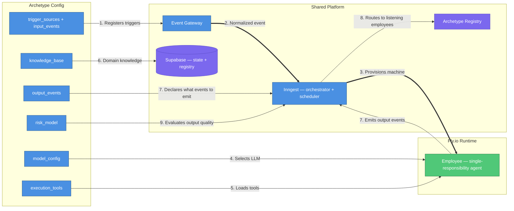
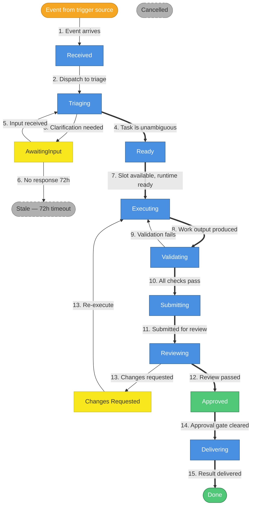
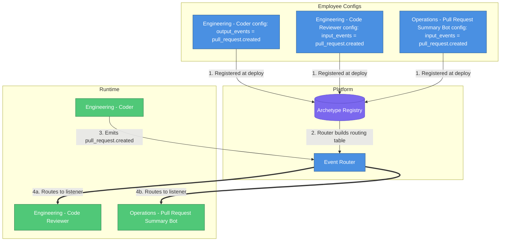
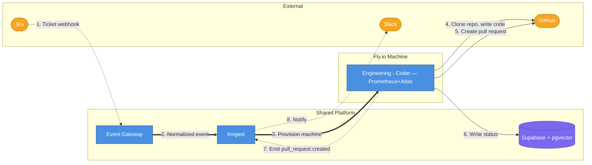

# AI Employee Platform — Full System Vision

## What This Document Is

A consolidated view of the complete AI Employee Platform — what it looks like when fully built, informed by everything we've learned building the Engineering MVP.

**Read this when you need to answer**: "Where is this whole thing going, and how do we get there?"

---

## Core Concept: Single-Responsibility Employees

The platform deploys **AI employees** — autonomous agents, each with a single responsibility. Every employee follows the same lifecycle, uses the same infrastructure, and runs on the same runtime (Fly.io). What changes per employee is the config.

**Mental model**: An AI employee is to the platform what a microservice is to a backend — independently deployable, single-purpose, communicates via events.

**Departments** are organizational groupings, not architectural concepts. "Engineering - Coder" and "Engineering - Code Reviewer" share a department tag but are independent employees with independent archetypes, triggers, and scaling.

### Multi-Tenancy

Every data structure in the platform is tenant-scoped. Archetypes, events, routing tables, colleague manifests, knowledge bases, cost tracking — all filtered by `tenant_id`. One tenant's employees never see or interact with another tenant's employees or events.

**Design rule**: Any new table, registry, catalog, or query must include `tenant_id`. If you're adding a feature and it touches shared data, ask: "Is this tenant-isolated?" If not, it's a bug.

**Current state**: The Prisma schema has `tenant_id` on core tables (Task, Project, Feedback, Department, Archetype, KnowledgeBase) with a default system tenant (`00000000-0000-0000-0000-000000000001`). All gateway queries already filter by `tenant_id`. Child tables (Execution, Deliverable, ValidationRun, etc.) inherit tenant scope through their parent Task/Project. Multi-tenancy is designed into the schema but not yet activated — a single hardcoded UUID is used everywhere.

### The Archetype (Employee Definition)

Every employee is defined by a declarative **archetype config**. The platform reads this config and knows: what triggers the employee, what tools it needs, what model to use, what events it emits, and how to evaluate its output.



| #   | What happens        | Details                                                                                                                       |
| --- | ------------------- | ----------------------------------------------------------------------------------------------------------------------------- |
| 1   | Registers triggers  | `trigger_sources` tells the Gateway which webhooks/crons to watch                                                             |
| 2   | Normalized event    | Gateway validates payload, normalizes to universal task schema, emits to Inngest                                              |
| 3   | Provisions machine  | Inngest lifecycle function provisions a Fly.io machine for this employee                                                      |
| 4   | Selects LLM         | `model_config` determines which model(s) the employee uses                                                                    |
| 5   | Loads tools         | `execution_tools` are pre-provisioned inside the machine; the employee can also install additional tools at runtime as needed |
| 6   | Domain knowledge    | Employee queries Supabase for past runs, embeddings, domain docs                                                              |
| 7   | Emits output events | Employee emits declared `output_events` when work is done                                                                     |
| 8   | Routes to listeners | Platform reads the Archetype Registry to find who listens for those events                                                    |
| 9   | Evaluates output    | `risk_model` computes a score used to prioritize human review order — does not gate delivery                                  |

### Full Archetype Config Schema

| Field                  | Purpose                                                                       | Engineering - Coder                                           | Operations - Slack Summarizer                                 |
| ---------------------- | ----------------------------------------------------------------------------- | ------------------------------------------------------------- | ------------------------------------------------------------- |
| `department`           | Organizational grouping                                                       | `engineering`                                                 | `operations`                                                  |
| `role_name`            | What this employee does                                                       | `coder`                                                       | `slack-summarizer`                                            |
| `trigger_sources`      | What starts this employee                                                     | Jira webhook (issue_created)                                  | Cron (daily 9am CT)                                           |
| `input_events`         | Events from other employees                                                   | `review.changes_requested`                                    | (none)                                                        |
| `output_events`        | Events this employee emits                                                    | `pull_request.created`, `execution.complete`                  | `summary.posted`                                              |
| `execution_tools`      | Pre-provisioned tools (not exhaustive — employee can install more at runtime) | Git, file editor, test runner, GitHub CLI                     | Slack API                                                     |
| `knowledge_base`       | Domain knowledge sources                                                      | pgvector embeddings, task history                             | Channel history, past summaries                               |
| `delivery_target`      | Where results go                                                              | GitHub pull request                                           | Slack message                                                 |
| `risk_model`           | Score used to prioritize human review order                                   | File-count + critical-path score                              | (none — low-stakes, but still reviewed in supervised mode)    |
| `escalation_rules`     | When to involve a human                                                       | database migrations, auth changes                             | (none)                                                        |
| `model_config`         | LLM selection                                                                 | `{primary: "minimax-m2.7", verifier: "haiku-4.5"}`            | `{primary: "minimax-m2.7"}`                                   |
| `runtime_config`       | Fly.io machine settings                                                       | `{vm_size: "performance-2x", max_duration: 90}`               | `{vm_size: "shared-cpu-1x", max_duration: 5}`                 |
| `operating_mode`       | Current mode: `supervised` or `autonomous`                                    | `supervised`                                                  | `supervised`                                                  |
| `confidence_threshold` | Score (0-1) below which autonomous mode escalates to Slack for human approval | `0.8` (high — code changes are risky)                         | `0.5` (low — digest is low-stakes)                            |
| `promotion_criteria`   | Metrics thresholds for supervised → autonomous graduation                     | `{min_approval_rate: 0.9, min_consecutive: 10, min_weeks: 4}` | `{min_approval_rate: 0.85, min_consecutive: 5, min_weeks: 2}` |
| `slack_channel`        | Where deliverables, notifications, approvals, and feedback happen             | `#engineering-ai`                                             | `#daily-digest`                                               |

### Why Fly.io for Everything

Every employee runs on a Fly.io machine. No exceptions.

- **Consistency** — one deployment model, one container image, one monitoring approach
- **Workspace** — every employee gets a dedicated filesystem for files, code, data
- **Self-sufficiency** — each employee has full root access to its machine and can install any tools it needs on the fly (`apt-get`, `pip`, `npm`, `cargo`, etc.) to complete its job or do it more efficiently — no human has to pre-configure toolchains
- **Flexibility** — even "simple" employees can write code, analyze data, use git if needed
- **Scalability** — Fly.io machines are provisioned on demand and destroyed after use — any tools installed during execution are ephemeral and don't pollute other runs

Inngest is the **orchestrator and scheduler** (manages event routing, cron schedules, retries, durable execution). It is NOT a runtime — no employee logic runs inside Inngest functions.

---

## Universal Task Lifecycle

All employees share this state machine. The states and transitions are identical — only what happens _inside_ each state changes per employee.



| #   | What happens          | Details                                                                                       |
| --- | --------------------- | --------------------------------------------------------------------------------------------- |
| 1   | Event arrives         | External system fires webhook, cron triggers, or another employee emits an event              |
| 2   | Dispatch to triage    | Lifecycle function sends task to triage — every employee goes through every state             |
| 3   | Clarification needed  | Employee determines input is ambiguous; posts questions back to source system                 |
| 4   | Task is unambiguous   | Input is clear; task marked Ready for execution                                               |
| 5   | Input received        | Source system provides clarification; triage re-evaluates                                     |
| 6   | No response 72h       | Clarification never received; task goes Stale (can be manually revived)                       |
| 7   | Slot available        | Execution slot opens; Fly.io machine provisioned                                              |
| 8   | Work output produced  | Employee produces deliverable; validation begins                                              |
| 9   | Validation fails      | Check fails; employee re-enters execution to fix                                              |
| 10  | All checks pass       | All validation stages pass; deliverable ready for submission                                  |
| 11  | Submitted for review  | Deliverable submitted to review (human or another employee)                                   |
| 12  | Review passed         | Approved; human approved via Slack (supervised) or confidence above threshold (autonomous)    |
| 13  | Changes requested     | Reviewer finds issues; task re-enters execution with feedback                                 |
| 14  | Approval gate cleared | Human approval complete (supervised) or confidence gate passed (autonomous); ready to deliver |
| 15  | Result delivered      | Output published; stakeholders notified                                                       |

**Every employee goes through every state.** There are no "simple" shortcuts — the lifecycle function runs the same state machine for all employees. For employees where a state has nothing to do (e.g., triage for a Slack Summarizer with unambiguous cron input), the state auto-passes without blocking. This means one code path, one lifecycle function, one set of tests — no branching logic per employee type.

### What Each State Means Per Employee

| State         | Engineering - Coder               | Engineering - Code Reviewer                       | Operations - Slack Summarizer           |
| ------------- | --------------------------------- | ------------------------------------------------- | --------------------------------------- |
| Received      | Jira ticket created               | Pull request opened on GitHub                     | Cron fired at 9am                       |
| Triaging      | Analyze requirements vs. codebase | Check pull request size, assess complexity        | Auto-passes (cron input is unambiguous) |
| AwaitingInput | Questions posted to Jira          | Request more context from author                  | Auto-passes (no clarification needed)   |
| Executing     | Write code, run tests on Fly.io   | Review diff, validate criteria                    | Read channels, generate summary         |
| Validating    | Lint → Unit → Integration → E2E   | Continuous integration passes, no merge conflicts | Summary length/quality check            |
| Reviewing     | Human approval via Slack          | Human approval via Slack                          | Human approval via Slack                |
| Delivering    | Pull request created on GitHub    | Pull request merged or escalated to Slack         | Summary posted to Slack                 |

---

## Trigger Types

Every employee is started by a trigger. The platform supports five trigger types, all managed by Inngest.

| Type               | What fires it                           | Who manages it       | Example                                         |
| ------------------ | --------------------------------------- | -------------------- | ----------------------------------------------- |
| **Webhook**        | External system sends HTTP event        | Event Gateway        | Jira ticket created, GitHub pull request opened |
| **Cron**           | Recurring schedule                      | Inngest scheduler    | Daily at 9am, weekly Monday, every 4 hours      |
| **Employee event** | Another employee emits an output event  | Inngest event router | `pull_request.created` → triggers Code Reviewer |
| **Manual**         | Human triggers via Slack or admin API   | Event Gateway        | `/trigger-review ENG-123` in Slack              |
| **Polling**        | Cron + API check (no webhook available) | Inngest scheduler    | Check vendor API hourly for new invoices        |

### How Inngest Manages Crons

When the gateway (Fastify) starts, it registers all Inngest functions. Functions can have a cron trigger:

```typescript
inngest.createFunction(
  { id: 'operations/slack-daily-digest' },
  { cron: '0 9 * * 1-5' }, // 9am weekdays
  async ({ step }) => {
    /* provision Fly.io machine, run employee */
  },
);
```

- **Locally**: Inngest Dev Server (port 8288) holds the schedule
- **Production**: Inngest Cloud (SaaS) manages the schedule

The employee itself doesn't know it's on a schedule. It gets provisioned, does its job, and shuts down.

### Trigger Definitions Per Employee

**Engineering - Coder**:

```json
{
  "trigger_sources": [
    { "type": "webhook", "source": "jira", "events": ["issue_created", "issue_updated"] }
  ],
  "input_events": ["review.changes_requested"],
  "output_events": ["pull_request.created", "execution.complete"]
}
```

**Engineering - Code Reviewer**:

```json
{
  "trigger_sources": [{ "type": "webhook", "source": "github", "events": ["pull_request.opened"] }],
  "input_events": ["pull_request.created"],
  "output_events": ["pull_request.merged", "review.changes_requested", "review.escalated"]
}
```

**Operations - Slack Daily Digest**:

```json
{
  "trigger_sources": [{ "type": "cron", "schedule": "0 9 * * 1-5", "timezone": "America/Chicago" }],
  "input_events": [],
  "output_events": ["summary.posted"]
}
```

**Operations - Jira Daily Status**:

```json
{
  "trigger_sources": [{ "type": "cron", "schedule": "0 9 * * 1-5", "timezone": "America/Chicago" }],
  "input_events": [],
  "output_events": ["report.posted"]
}
```

**Operations - Pull Request Summary Bot**:

```json
{
  "trigger_sources": [{ "type": "webhook", "source": "github", "events": ["pull_request.opened"] }],
  "input_events": ["pull_request.created"],
  "output_events": ["summary.posted"]
}
```

**Operations - Repo Health Checker**:

```json
{
  "trigger_sources": [{ "type": "cron", "schedule": "0 9 * * 1", "timezone": "America/Chicago" }],
  "input_events": [],
  "output_events": ["report.posted", "alert.detected"]
}
```

---

## Integration Map (External Systems)

The platform integrates with external systems for receiving work, delivering results, and supporting execution. When adding a new employee, check this map first — if the integration already exists, you reuse it.

| System     | Direction      | Mechanism              | Used By                                            | What Flows                                                         |
| ---------- | -------------- | ---------------------- | -------------------------------------------------- | ------------------------------------------------------------------ |
| Jira       | Input          | Webhook                | Engineering - Coder                                | Ticket payloads (created, updated)                                 |
| GitHub     | Input + Output | Webhook + REST API     | Coder, Code Reviewer, Pull Request Summary Bot     | Webhooks in (pull request events); pull requests + comments out    |
| Slack      | Input + Output | Events API + Web API   | All employees                                      | Feedback, @mentions, approvals in; deliverables, notifications out |
| OpenRouter | Output         | REST API               | All employees                                      | LLM inference requests                                             |
| Supabase   | Internal       | PostgREST              | All employees                                      | Task state, execution history, feedback, knowledge base            |
| Fly.io     | Internal       | Machines API           | Platform (provisions on behalf of all employees)   | Machine lifecycle (create, monitor, destroy)                       |
| Inngest    | Internal       | Event-driven functions | Platform (orchestrates on behalf of all employees) | Event routing, cron scheduling, durable execution                  |

**Bidirectional systems** (Slack, GitHub) serve as both input sources and output sinks. A single integration handles both directions — no separate "read" and "write" configurations.

### Tool Access Model (How Employees Use Integrations)

Employees interact with external systems via **shell commands** — either existing third-party CLIs or simple platform-built scripts. All tools are pre-installed in the base Docker image so every employee has them available. Credentials are injected as environment variables at machine provisioning time.

**Why shell commands, not MCP servers**: MCP (Model Context Protocol) servers inject full tool schemas into the LLM context window on every turn. A typical setup (GitHub + Slack + Jira MCP servers) consumes ~55,000 tokens — 27% of a 200K context window — before the agent reads a single line of code. Shell commands consume ~0 tokens of context. The agent calls a command, gets text output on stdout. Benchmarks show MCP uses 4-32x more tokens per task than equivalent shell operations.

**Decision framework for adding a new integration**:

1. **Check if a mature CLI exists** (official or well-maintained community tool). If yes → pre-install it in the Docker image. Done.
2. **If no suitable CLI exists** → build simple scripts under `src/worker-tools/{service}/`. One script per operation — no CLI frameworks, no subcommand routing. Each script imports from the platform's existing shared client (`src/lib/`), reads arguments, calls the API, prints the result to stdout, and exits.

**Current integration tool map**:

| Integration | Tool                          | Type             | Rationale                                                                        |
| ----------- | ----------------------------- | ---------------- | -------------------------------------------------------------------------------- |
| GitHub      | `gh`                          | Existing CLI     | Official GitHub CLI — full API coverage, excellent documentation, battle-tested  |
| Jira        | `src/worker-tools/jira/*.ts`  | Platform scripts | No official Atlassian CLI — thin scripts wrapping the platform's Jira client     |
| Slack       | `src/worker-tools/slack/*.ts` | Platform scripts | No general-purpose Slack CLI — thin scripts wrapping the platform's Slack client |
| Supabase    | PostgREST via REST            | Direct API calls | Workers already use `curl`/`fetch` against PostgREST — no scripts needed         |

```bash
# Existing CLI — use directly
gh pr create --title "Fix auth bug" --body "..."
gh issue list --state open --json number,title

# Platform scripts — one per operation, minimal code
node /tools/slack/post-message.js --channel "#engineering-ai" --text "Pull request ready for review"
node /tools/slack/read-channels.js --channels "#general,#engineering" --since "24h"
node /tools/jira/get-ticket.js --key "ENG-123"
node /tools/jira/add-comment.js --key "ENG-123" --body "Pull request opened: [link]"
```

The directory structure is the discovery mechanism — the agent can list `/tools/slack/` to see available operations. Each script is a few dozen lines importing from the platform's shared client libraries.

```
src/worker-tools/
├── slack/
│   ├── post-message.ts
│   └── read-channels.ts
├── jira/
│   ├── get-ticket.ts
│   └── add-comment.ts
```

Scripts are compiled during Docker image build and copied to `/tools/` inside the container. The platform maintains the integration code once; employees consume it as shell commands.

### Credentials & Multi-Tenancy

Credentials for external systems (API tokens, OAuth tokens) are managed as **environment variables per tenant**. At machine provisioning time, the lifecycle function looks up the tenant and injects the correct set of credentials into the Fly.io machine.

| What                     | MVP (1-2 known tenants)                                           | Scale Path (self-serve tenants)                                                                           |
| ------------------------ | ----------------------------------------------------------------- | --------------------------------------------------------------------------------------------------------- |
| **Storage**              | Environment variable sets per tenant (config, not infrastructure) | `tenant_integrations` table with application-level encryption, or a managed integration layer (see below) |
| **Injection**            | All available credentials injected into every employee's machine  | Filtered by `execution_tools` — employee only gets what it needs                                          |
| **Management**           | Direct config                                                     | `POST /admin/integrations` API or managed layer                                                           |
| **Employee code change** | None — reads environment variables                                | None — still reads environment variables                                                                  |

The employee never knows where credentials came from. It reads `GITHUB_TOKEN`, `SLACK_BOT_TOKEN`, `JIRA_API_TOKEN` from its environment and calls commands. The provisioning layer handles everything.

**Scale path — managed integration layers**: When the number of tenants or integrations makes self-managed OAuth untenable (tenants self-serve, connect their own Slack workspaces and GitHub organizations), the platform can adopt a managed integration layer such as [Composio](https://composio.dev) or [Nango](https://nango.dev) (open-source, self-hostable). These handle credential lifecycle (OAuth flows, token refresh, per-tenant isolation) while the employee-side interface stays the same — scripts reading environment variables. The swap happens in the provisioning layer only.

---

## Employee Capabilities

Every employee gets these capabilities from the platform — no per-employee setup required.

| Capability              | What it is                                                              | How the platform provides it                                                           |
| ----------------------- | ----------------------------------------------------------------------- | -------------------------------------------------------------------------------------- |
| **Workspace**           | Dedicated directory for files, code, data                               | Fly.io machine filesystem                                                              |
| **LLM access**          | Call AI models for reasoning and generation                             | OpenRouter / direct API via `model_config`                                             |
| **Tool use**            | Execute code, call APIs, read/write files, install any tools on the fly | Full root access on Fly.io machine — agent discovers and installs what it needs        |
| **State persistence**   | Read/write task state and historical data                               | Supabase (PostgREST)                                                                   |
| **Communication**       | Post to Slack, comment on Jira, emit events                             | Platform integrations + event system                                                   |
| **Cost tracking**       | Track and limit spending per task                                       | `TASK_COST_LIMIT_USD` per archetype                                                    |
| **Human escalation**    | Pause and ask a human when uncertain                                    | Slack + AwaitingInput state                                                            |
| **Knowledge base**      | Query past runs and domain docs                                         | Supabase + pgvector                                                                    |
| **Colleague discovery** | Know what other employees exist and what they do                        | Archetype Registry (auto-populated)                                                    |
| **Feedback & learning** | Improve over time based on human feedback                               | Slack thread replies + @mentions → feedback table → knowledge base → context injection |

### Plan Quality Requirements (Haiku Verification)

Every employee generates an execution plan, and every plan is verified before execution starts. No employee skips this step. The plan verifier must reject plans that don't include:

- **Periodic validation checkpoints** — lint, test, type check after every N tasks (not just at the end)
- **Periodic commit and push** — save work to the remote repository so no work is lost, and if any is lost, it is minimal
- **Clear success criteria** — each task must define what "done" looks like

This is a plan quality check, not runtime behavior. The agent (Atlas) already knows how to run tests and commit; the plan just needs to tell it to do so at regular intervals.

### Feedback & Continuous Learning

Every employee learns and improves over time through feedback from human coworkers and managers. The feedback mechanism is intentionally simple: **Slack is the single feedback channel.**

#### How It Works

**Every employee posts to Slack on every task completion** — whether it's a pull request link, a daily digest, a status report, or a health check result. There is always Slack output. The human replies in the Slack thread. That reply is the feedback.

| Step | What happens                                                                                                          |
| ---- | --------------------------------------------------------------------------------------------------------------------- |
| 1    | Employee completes a task and posts the deliverable to Slack (e.g., "Pull request ready for review: [link]")          |
| 2    | Human replies in the Slack thread: "Good work, but next time break large changes into smaller pull requests"          |
| 3    | Platform captures the thread reply as feedback, tagged with `employee_id`, `task_id`, `tenant_id`                     |
| 4    | Periodic summarization groups feedback by pattern: "3 of your last 5 reviews mentioned X"                             |
| 5    | Next time the employee starts a task, relevant feedback is injected into its context alongside the colleague manifest |

The employee sees its feedback history before starting work:

```
Your recent feedback (last 30 days):
- Manager: "Break large changes into smaller pull requests" (3 occurrences)
- Manager: "Always include a testing section in pull request descriptions" (2 occurrences)
- Coworker: "The daily digest should include links to original messages" (1 occurrence)
```

#### This Works for Every Employee

Every employee delivers to Slack. Every employee gets feedback through the same mechanism. No per-employee feedback code.

| Employee                 | What it posts to Slack                          | Human feedback |
| ------------------------ | ----------------------------------------------- | -------------- |
| Engineering - Coder      | "Pull request ready for review: [link]"         | Thread reply   |
| Slack Daily Digest       | The digest itself                               | Thread reply   |
| Jira Daily Status        | The status report                               | Thread reply   |
| Pull Request Summary Bot | "Summary posted on [link]"                      | Thread reply   |
| Code Reviewer            | "Review complete: approved / changes requested" | Thread reply   |
| Repo Health Checker      | The health report                               | Thread reply   |

#### General Teaching (Not Tied to a Deliverable)

Sometimes a manager wants to teach an employee something general — not about a specific task. They just @mention the employee in Slack:

```
@coder always check for SQL injection in authentication code
@slack-summarizer include the number of open pull requests per repository
```

The employee receives the message and determines intent itself — is this a new task, feedback on past work, or a general teaching? That's the employee's job, not the platform's. No slash commands, no separate feedback portal, no new tools to learn. Just a Slack message.

#### Why Slack Only

- **Zero friction** — humans are already in Slack all day
- **One mechanism** — no GitHub comment parsing, no API calls, no separate feedback UI
- **Scales to all employees** — every employee posts to Slack, every employee gets feedback the same way
- **Works on mobile** — managers can give feedback from anywhere
- **No training required** — replying in a thread and @mentioning someone are things humans already do

#### What the Platform Does With Feedback

1. **Capture** — Slack thread replies and @mentions are captured via the existing Slack integration (Events API)
2. **Store** — Written to the `feedback` table with `employee_id`, `task_id` (if tied to a deliverable), `tenant_id`
3. **Summarize** — Periodic job groups feedback by pattern and extracts recurring themes
4. **Index** — Distilled lessons are stored in the knowledge base (pgvector) for retrieval
5. **Inject** — At task start, relevant feedback is retrieved and injected into the employee's context — same mechanism as the colleague manifest

### Operating Modes & Confidence

Every employee has an `operating_mode` on its archetype: `supervised` or `autonomous`. This controls what happens at the **Delivering** state in the lifecycle — the rest of the pipeline is identical regardless of mode.

#### Supervised Mode

The employee does all the work — triages, plans, executes, validates — and creates the deliverable. But the deliverable is held in a pending state until a human approves it via Slack.

| Employee            | What it creates              | How human approves                                                                                                        |
| ------------------- | ---------------------------- | ------------------------------------------------------------------------------------------------------------------------- |
| Engineering - Coder | Draft pull request on GitHub | Slack: "Pull request ready for your approval: [link]" — human replies "approve" or provides feedback                      |
| Slack Daily Digest  | Summary generated, held      | Slack: "Here's today's digest for your approval: [summary]" — human replies "approve" → platform posts to `#daily-digest` |
| Code Reviewer       | Review draft, not posted     | Slack: "Review ready for your approval: [summary]" — human replies "approve" → platform posts to GitHub                   |

Nothing goes live without human sign-off. **Every new employee starts in supervised mode.**

#### Autonomous Mode

The employee delivers directly — no human approval gate. But autonomous doesn't mean "never ask for help." It means "deliver directly when confident, escalate when not."

**Confidence gate**: After execution but before delivery, the employee assesses its confidence on this specific task. If confidence is below a configurable threshold, it behaves like supervised mode — holds the deliverable, posts to Slack, waits for human approval. If above, it delivers directly.

What feeds the confidence score:

- Did all validation checks pass on the first try, or did it take multiple retries?
- Does this task touch areas where the employee has received negative feedback before?
- How complex was the task relative to what the employee has successfully delivered in the past?
- Did the plan verifier flag any concerns?

One number. Below threshold → escalate to Slack for approval. Above threshold → deliver.

The escalation message is just a Slack post:

```
@manager I completed this task but I'm not confident about the result.
Here's what I did: [summary]
Please review before I deliver.
```

The threshold is configurable per archetype — a Slack Digest is low-stakes (lower bar), while Coder touching authentication code is high-stakes (higher bar).

#### Progression: Supervised → Autonomous

The platform tracks three metrics per employee:

- **Approval rate** — percentage of outputs approved without changes
- **Consecutive approvals** — how many in a row without rejection
- **Time in current mode** — minimum time before promotion is considered

When thresholds are met, the platform posts a recommendation to Slack:

```
@manager Coder has been in supervised mode for 4 weeks.
- Approval rate: 92% (23/25 outputs approved)
- Consecutive approvals: 12
- Recommendation: promote to autonomous mode

Reply "promote" to confirm.
```

The manager replies "promote" — or doesn't, and the employee stays in supervised mode. **The platform never auto-promotes. Humans always make the final call.**

Suggested thresholds (configurable per archetype):

| Transition              | Minimum time | Minimum approval rate | Minimum consecutive approvals |
| ----------------------- | ------------ | --------------------- | ----------------------------- |
| Supervised → Autonomous | 4 weeks      | ≥90%                  | ≥10                           |

#### Demotion

If an autonomous employee's approval rate drops (via feedback or rejected deliverables), the platform flags it:

```
@manager Coder's approval rate dropped to 65% over the last 10 tasks.
Recommendation: demote to supervised mode.

Reply "demote" to confirm.
```

The platform recommends, the human decides. A manager can also demote manually at any time: `@coder demote to supervised`.

---

## Employee Collaboration & Discovery

### The Problem

When Engineering - Coder creates a pull request, how does Code Reviewer know about it? When Slack Summarizer posts a digest, how could a future employee react to it? And critically: **how do you add a new employee without manually updating every existing employee's configuration?**

### The Solution: Event-Based Pub/Sub + Auto-Discovery

Employees communicate through **events**, not direct connections. The platform handles all routing automatically.



| #   | What happens                 | Details                                                                                                            |
| --- | ---------------------------- | ------------------------------------------------------------------------------------------------------------------ |
| 1   | Configs registered           | Each employee's archetype (with `input_events` and `output_events`) is stored in Supabase                          |
| 2   | Router builds routing table  | Platform reads archetypes for this tenant: `event_name → [list of employees that listen for it]` (tenant-isolated) |
| 3   | Employee emits event         | Engineering - Coder finishes and emits `pull_request.created`                                                      |
| 4   | Platform routes to listeners | Router checks the table, creates tasks for Code Reviewer AND Pull Request Summary Bot                              |

### How Auto-Discovery Works

**Adding a new employee requires zero changes to existing employees.** Here's why:

1. You create a new archetype with `input_events: ["pull_request.created"]`
2. The platform's event router reads ALL archetypes and rebuilds the routing map
3. Next time any employee emits `pull_request.created`, the new employee automatically receives it
4. Existing employees don't need to be redeployed or reconfigured

**Colleague awareness at runtime**: When a Fly.io machine is provisioned for an employee, the platform queries the Archetype Registry (filtered by `tenant_id`) and injects a **colleague manifest** into the employee's context — an employee only sees colleagues belonging to the same tenant:

```
Your colleagues:
- Engineering - Code Reviewer: Reviews pull requests. Listens for: pull_request.created. Emits: pull_request.merged, review.changes_requested
- Operations - Pull Request Summary Bot: Summarizes pull requests. Listens for: pull_request.created. Emits: summary.posted
- Operations - Slack Daily Digest: Daily channel summary. Triggered by: cron 9am. Emits: summary.posted
```

The employee can use this to decide what events to emit. It doesn't need to hardcode knowledge of other employees — the manifest is auto-generated from the registry.

### Event Taxonomy

Events follow the pattern `{noun}.{past_tense_verb}`:

| Event                      | Emitted by          | Consumed by                             |
| -------------------------- | ------------------- | --------------------------------------- |
| `pull_request.created`     | Engineering - Coder | Code Reviewer, Pull Request Summary Bot |
| `pull_request.merged`      | Code Reviewer       | (future: deploy employee)               |
| `review.changes_requested` | Code Reviewer       | Engineering - Coder (re-execute)        |
| `review.escalated`         | Code Reviewer       | (Slack notification, human)             |
| `summary.posted`           | Slack Summarizer    | (future: analytics employee)            |
| `report.posted`            | Jira Reporter       | (future: analytics employee)            |
| `alert.detected`           | Repo Health Checker | (future: remediation employee)          |
| `execution.complete`       | Any employee        | (platform — marks task Done)            |

The taxonomy is extensible — employees can define custom events. The only rule: event names must be `{noun}.{past_tense_verb}` for consistency.

### Event Registry (Centralized Catalog)

As the number of employees grows, manually tracking which events exist becomes untenable. The **Event Registry** (`event_catalog` table) is the single source of truth for every event in the organization:

| Column           | Purpose                                                         |
| ---------------- | --------------------------------------------------------------- |
| `tenant_id`      | Tenant scope — each tenant has its own event catalog            |
| `event_name`     | e.g. `pull_request.created`                                     |
| `description`    | Human-readable: "Emitted when an employee opens a pull request" |
| `payload_schema` | JSON Schema defining the event shape                            |
| `emitted_by`     | Which archetype(s) emit this event                              |
| `sample_payload` | A concrete example (used as LLM context during binding)         |

The registry is **auto-populated** — whenever an archetype declares `output_events`, the platform upserts the catalog. No one manually maintains the dictionary.

### AI-Assisted Event Binding

Manually wiring `input_events` doesn't scale. When creating a new employee, an admin shouldn't have to memorize every event across the organization — an LLM handles the combinatorial matching.

**How it works (API-first, no UI required)**:

1. Admin sends `POST /admin/archetypes` with the role description and capabilities
2. The API handler queries the Event Registry for the tenant's catalog (filtered by `tenant_id` — one tenant never sees another's events)
3. An LLM reads the catalog + the new employee's role description + all existing archetypes, and produces two sets of suggestions:
   - **For the new employee**: which existing events should it listen to?
   - **For existing employees**: should any of them listen to the new employee's `output_events`? Should any existing bindings be removed (e.g., an event no one emits anymore)?

```json
{
  "new_employee": {
    "archetype": "operations/slack-daily-digest",
    "suggested_input_events": [
      {
        "event": "pull_request.created",
        "reason": "Include pull request activity in the daily summary"
      },
      { "event": "execution.complete", "reason": "Summarize completed engineering work" },
      { "event": "review.changes_requested", "reason": "Flag pull requests that need attention" }
    ]
  },
  "existing_employees": [
    {
      "archetype": "operations/repo-health-checker",
      "add": [
        {
          "event": "summary.posted",
          "reason": "Cross-reference daily digest with repo health trends"
        }
      ],
      "remove": []
    }
  ]
}
```

4. The API returns all suggestions in a single response
5. Admin reviews the full picture — new and existing bindings — edits if needed, and confirms

**The explicit declarations remain the source of truth.** The AI suggests, the human approves, the platform routes based on what's declared. No employee decides at runtime what to listen to — that would make the event graph unpredictable and undebuggable.

**This keeps all employees current.** Every time an archetype is created, updated, or deleted, the LLM re-evaluates the entire tenant's event graph. Stale bindings (listening to events no one emits anymore — e.g., after an employee is deleted) are flagged for removal, and new opportunities (existing employees that should consume new events) are surfaced. The human always has final say.

**Future**: A CLI wizard or dashboard can wrap this same API flow with an interactive experience, but the API-first approach works today with zero frontend.

---

## Engineering Employees

### Engineering - Coder (Active — Being Redesigned)

The first employee built. Receives Jira tickets, writes code, opens pull requests.

#### Architecture



| #   | What happens              | Details                                                                     |
| --- | ------------------------- | --------------------------------------------------------------------------- |
| 1   | Ticket webhook            | Customer creates Jira ticket; webhook fires to Gateway                      |
| 2   | Normalized event          | Gateway validates, normalizes, emits `engineering/task.received` to Inngest |
| 3   | Provision machine         | Lifecycle function provisions Fly.io machine with OpenCode                  |
| 4   | Clone repo, write code    | Prometheus plans, Atlas implements, runs validation, iterates on failures   |
| 5   | Create pull request       | Agent pushes branch and opens pull request on GitHub                        |
| 6   | Write status              | Updates task state in Supabase throughout lifecycle                         |
| 7   | Emit pull_request.created | Platform routes event to Code Reviewer and Pull Request Summary Bot         |
| 8   | Notify                    | Slack notification that pull request is ready                               |

**Post-redesign flow** (see [worker post-redesign overview](./2026-04-14-0057-worker-post-redesign-overview.md)): Thin `orchestrate.mts` wrapper, single session with auto-compact, cost-based escalation (`TASK_COST_LIMIT_USD`), plan file checkpoint for restart recovery, multi-language Docker image.

#### Risk Model

Risk score 0-100 based on: files changed, lines modified, critical paths touched (auth, database migrations, payment, security), new dependencies introduced.

- **All deliverables require human approval** via Slack — no auto-merge. One review path, no risk-based branching.
- Risk score is still computed (useful for prioritizing what humans review first), but it doesn't change the approval flow.

### Engineering - Code Reviewer (Not Yet Built)

Evaluates pull requests against acceptance criteria. Runs on Fly.io (filesystem access for merge conflict resolution via rebase).

**Triggered by**: `pull_request.created` event from Engineering - Coder, or GitHub `pull_request.opened` webhook.
**Emits**: `pull_request.merged`, `review.changes_requested`, `review.escalated`.
**Capabilities**: Acceptance criteria validation, code quality review with full codebase context, continuous integration wait, merge conflict resolution (rebase), risk scoring (0-100), human approval via Slack for all deliverables.

### Knowledge Base (Not Yet Built)

Shared across Engineering employees.

**Layer 1 — pgvector embeddings**: Code chunks, docstrings, READMEs indexed in Supabase. Re-indexed on merge to `main`.
**Layer 2 — Task history**: `tasks`, `executions`, `deliverables`, `feedback` tables (already exist).

---

## Next Employees Roadmap

These employees are ordered by simplicity and proof value. Each validates a different aspect of the platform's generality.

### Operations - Slack Daily Digest (Recommended Next)

**What it does**: Reads all messages from specified Slack channels for the past 24 hours, generates a concise summary, posts it to a digest channel.

**Why this one first**:

- We already have Slack integration built
- Proves cron triggers work
- Proves non-engineering employees work
- Proves the archetype pattern generalizes beyond code
- Zero external system dependencies beyond Slack
- Immediately useful

| Field      | Value                                              |
| ---------- | -------------------------------------------------- |
| Department | `operations`                                       |
| Role       | `slack-summarizer`                                 |
| Trigger    | Cron: `0 9 * * 1-5` (9am weekdays CT)              |
| Tools      | Slack API (read channels, post messages)           |
| Model      | MiniMax M2.7                                       |
| Delivery   | Slack message to `#daily-digest`                   |
| Risk model | None (human approval via Slack in supervised mode) |
| Machine    | `shared-cpu-1x`, max 5 minutes                     |

### Operations - Jira Daily Status

**What it does**: Pulls all Jira ticket updates from the past 24 hours, summarizes by project and status, posts to Slack.

**Why**: Uses existing Jira integration, proves platform handles multiple data sources, useful for standups.

**Trigger**: Cron daily 9am. **Model**: MiniMax M2.7. **Delivery**: Slack message.

### Operations - Pull Request Summary Bot

**What it does**: When a pull request is opened on a monitored repository, reads the diff, generates a human-readable summary, posts as a pull request comment and to Slack.

**Why**: Proves webhook triggers for non-Jira sources, useful for code review, can run alongside Engineering - Coder.

**Trigger**: GitHub `pull_request.opened` webhook + `pull_request.created` employee event. **Model**: MiniMax M2.7. **Delivery**: GitHub pull request comment + Slack.

### Operations - Repo Health Checker

**What it does**: Weekly audit — checks for outdated dependencies, stale branches, failing continuous integration, missing tests. Posts report to Slack.

**Why**: Proves weekly cron, proves employees can analyze codebases without modifying them, useful for maintenance.

**Trigger**: Cron weekly Monday 9am. **Model**: MiniMax M2.7. **Delivery**: Slack report.

### Marketing Employees (Future)

After Engineering and Operations employees are stable:

- **Marketing - Campaign Optimizer**: Monitors ad spend, adjusts bids/budgets via Meta/Google Ads APIs
- **Marketing - Performance Reporter**: Daily campaign performance digest to Slack
- **Marketing - Creative Analyzer**: Evaluates ad creative performance, suggests optimizations

All run on Fly.io machines. Build after the archetype pattern is proven with simpler employees.

---

## LLM Evaluation & Model Selection

### Evaluation Dimensions

Different employees need different LLM qualities. These are the dimensions that matter for the platform:

| Dimension                       | What it measures                                     | Which employees need it                         | Key benchmarks             |
| ------------------------------- | ---------------------------------------------------- | ----------------------------------------------- | -------------------------- |
| **Reasoning**                   | Problem-solving, logic, debugging, math              | Coder, Code Reviewer                            | MMLU-Pro, GPQA, AIME, MATH |
| **Instruction following**       | Adherence to structured criteria and format rules    | Plan Verifier, Summarizer, Reporter             | IFEval, IFBench, MT-Bench  |
| **Agentic capability**          | Self-correction, multi-step execution, tool chaining | Coder, Repo Health Checker                      | SWE-bench, Terminal-Bench  |
| **Context window**              | How much information it can process at once          | Summarizer (long channels), Coder (large repos) | RULER, MRCR, LongBench     |
| **Long-context faithfulness**   | Uses info deep in context, not just recent tokens    | Code Reviewer, Summarizer                       | Needle-in-a-Haystack, MRCR |
| **Tool use / function calling** | Reliable API interaction and structured output       | All agentic employees                           | TAU-bench, Toolathon       |
| **Speed (tokens/sec)**          | Response latency and throughput                      | High-volume employees, real-time UX             | TTFT, tokens/sec           |
| **Cost ($/token)**              | Budget impact at scale                               | All (multiplied by task volume)                 | Input/output per 1M tokens |
| **Factuality**                  | Accuracy of factual claims, low hallucination        | Any employee making factual assertions          | SimpleQA, TruthfulQA       |
| **Structured output**           | JSON/schema reliability                              | Plan Verifier, data processors                  | (provider-specific)        |

### Model Selection Guide

The platform uses **two models only**: MiniMax M2.7 (primary) and Haiku 4.5 (lightweight verifier sub-role).

| Employee Role            | Model        | Rationale                                                                  |
| ------------------------ | ------------ | -------------------------------------------------------------------------- |
| Code execution (agentic) | MiniMax M2.7 | Close to Opus-level reasoning at ~17x lower cost ($0.30/$1.20 vs $5/$25)   |
| Plan verification        | Haiku 4.5    | Strong instruction following ensures plans are verified with 100% accuracy |
| Summarization            | MiniMax M2.7 | Consistent model across all employees                                      |
| Code review              | MiniMax M2.7 | Strong reasoning at fraction of Sonnet/Opus cost                           |
| Long-context analysis    | MiniMax M2.7 | 200K context window handles most workloads                                 |
| All other roles          | MiniMax M2.7 | Default for every employee — no exceptions                                 |

> **Cost policy**: Claude Sonnet and Opus are too expensive for production workloads. **MiniMax M2.7 is the default primary model for all employees** — best cost-to-capability ratio for general reasoning across the board. **Haiku 4.5 is the plan verification model** — its strong instruction following ensures plans are verified with 100% accuracy before execution begins. Haiku is never a primary employee model; it only serves the verifier role.

### Benchmark Deep Dive: MiniMax vs Claude

| Dimension             | MiniMax M2.7 | MiniMax M2.5            | MiniMax M1       | Haiku 4.5       | Sonnet 4     | Opus 4       |
| --------------------- | ------------ | ----------------------- | ---------------- | --------------- | ------------ | ------------ |
| Instruction following | Weak (#53)   | **Strong** (IFEval 88%) | Unknown          | Good (~70%)     | Moderate     | Weak (#68)   |
| Reasoning (GPQA)      | ~85%         | 85.2%                   | 70.0%            | ~73%            | 83.0%        | **90.0%**    |
| Agentic (SWE-bench)   | SWE-Pro 56%  | **80.2%**               | 56.0%            | N/A             | 77.2%        | 80.8%        |
| Context window        | 200K         | 1M                      | **1M**           | 200K            | 200K         | 200K         |
| Speed                 | 45 t/s       | 100 t/s                 | 42 t/s           | **120-180 t/s** | 80-120 t/s   | 40-70 t/s    |
| Cost (in/out per 1M)  | $0.30/$1.20  | **$0.15/$1.20**         | $0.40/$2.20      | $1.00/$5.00     | $3.00/$15.00 | $5.00/$25.00 |
| Factuality (SimpleQA) | Unknown      | Unknown                 | **18.5% (weak)** | ~50%+           | ~55%+        | ~60%+        |

**Key takeaway**: MiniMax M2.7 is the default primary model for every employee — it approaches Opus-level general reasoning at a fraction of the cost. Haiku 4.5 handles plan verification where instruction following is paramount — plans must be verified with 100% accuracy. The platform's `model_config` field allows per-employee overrides, but this two-model split (M2.7 primary + Haiku verifier) is the starting point. Sonnet/Opus are not recommended due to cost.

### Where to Track Benchmarks

| Site                                 | URL                                                                                            | Best for                                                            |
| ------------------------------------ | ---------------------------------------------------------------------------------------------- | ------------------------------------------------------------------- |
| **Artificial Analysis**              | [artificialanalysis.ai/leaderboards/models](https://artificialanalysis.ai/leaderboards/models) | Intelligence index, speed, cost, latency — most comprehensive       |
| **LMSYS Chatbot Arena**              | [lmarena.ai](https://lmarena.ai)                                                               | Human preference Elo across categories (coding, math, IF, creative) |
| **BenchLM**                          | [benchlm.ai](https://benchlm.ai)                                                               | Weighted multi-category scores, instruction following leaderboard   |
| **SWE-bench**                        | [swebench.com](https://swebench.com)                                                           | Definitive agentic coding benchmark                                 |
| **HuggingFace Open LLM Leaderboard** | [huggingface.co/open-llm-leaderboard](https://huggingface.co/open-llm-leaderboard)             | Open-weight models only                                             |
| **OpenRouter**                       | [openrouter.ai/models](https://openrouter.ai/models)                                           | Per-model benchmark pages, pricing                                  |

---

## Adding a New Employee

To add an employee, follow this checklist. The shared platform handles orchestration — you only build the employee-specific pieces.

### Onboarding Checklist

1. **Define the archetype** — Fill in role, department, triggers, tools, knowledge base, delivery target, risk model, model config, runtime config. For `input_events`: the API queries the Event Registry and uses an LLM to suggest bindings based on the role description — review and confirm. For `output_events`: declare what events this employee will emit; the platform auto-registers them in the Event Registry
2. **Register in the Archetype Registry** — Insert archetype row in Supabase; event router auto-rebuilds routing; Event Registry auto-updates with any new `output_events`
3. **Register triggers** — Add webhook handlers in Event Gateway and/or cron functions in Inngest
4. **Build the employee logic** — The code that runs inside the Fly.io machine; every employee uses OpenCode as the agent runtime — one execution model, no branching
5. **Configure the LLM** — Select model(s) via `model_config` based on the dimensions the employee needs
6. **Build the knowledge base** (if needed) — Index domain content into pgvector; set up re-indexing pipeline
7. **Configure the risk model** (if needed) — Start conservative, loosen as confidence grows
8. **Supervised mode** — Employee delivers but every deliverable requires human approval via Slack before going live. All new employees start here.
9. **Autonomous mode** — After earning trust (≥90% approval rate, ≥10 consecutive approvals, ≥4 weeks), manager can promote. Employee delivers directly when confident, escalates to Slack when not. See §"Operating Modes & Confidence" for full mechanics.

### What You Reuse vs. What You Build

| Reused (shared platform)            | Built (per employee)                                       |
| ----------------------------------- | ---------------------------------------------------------- |
| Event Gateway (Fastify)             | Webhook handler for this employee's triggers               |
| Inngest orchestration + scheduling  | Lifecycle function (or reuse generic one)                  |
| Fly.io machine provisioning         | Employee logic (what it actually does)                     |
| Supabase state management           | Employee-specific tables/columns (if needed)               |
| Universal task lifecycle states     | What happens inside each state                             |
| Event routing (auto from registry)  | output_events declarations (input_events are AI-suggested) |
| Colleague discovery (auto-injected) | (nothing — comes free from platform)                       |
| Slack notifications                 | Escalation rules for the domain                            |
| Cost tracking infrastructure        | Per-employee cost limits                                   |

---

## What's Built vs. What's Designed

| Concept                    | Database Schema                                                                                                                | Application Code                           | API         |
| -------------------------- | ------------------------------------------------------------------------------------------------------------------------------ | ------------------------------------------ | ----------- |
| Employee (Archetype) model | Table exists, empty                                                                                                            | Never written to                           | Not exposed |
| Department model           | Table exists, empty                                                                                                            | Never written to                           | Not exposed |
| KnowledgeBase model        | Table exists, empty                                                                                                            | Never written to                           | Not exposed |
| RiskModel model            | Table exists, empty                                                                                                            | Never written to                           | Not exposed |
| AgentVersion model         | Table exists, empty                                                                                                            | Never written to                           | Not exposed |
| Multi-tenant routing       | `tenant_id` on core tables (Task, Project, Feedback, Department, Archetype, KnowledgeBase); child tables inherit via parent FK | Single hardcoded UUID (`00000000-...0001`) | Not exposed |
| Event routing              | N/A                                                                                                                            | All events `engineering/`                  | N/A         |
| Per-employee cost limits   | N/A                                                                                                                            | Single global limit                        | N/A         |
| Cron triggers              | N/A                                                                                                                            | Only watchdog cron exists                  | N/A         |
| Colleague discovery        | N/A                                                                                                                            | Not implemented                            | N/A         |

**To activate multi-employee support**:

1. Seed `departments` and `archetypes` rows
2. Expose `department_id` and `archetype_id` in admin API
3. Parameterize Inngest event names by employee (e.g., `operations/slack-digest.received`)
4. Build the Event Registry (`event_catalog` table, auto-populated from archetype `output_events`)
5. Build AI-assisted event binding (LLM suggests `input_events` during `POST /admin/archetypes`)
6. Build the event router (read archetypes, build routing map from `input_events`/`output_events`)
7. Build colleague manifest injection (query registry at machine provision time)
8. Add per-employee cost tracking

---

## What We've Learned (Revisions to Original Design)

### 1. Agent delegation beats custom orchestration

The original `orchestrate.mts` managed phases, waves, sessions, fix loops in ~600 lines. The redesign replaces this with ~100 lines: start OpenCode, hand the task to Prometheus, monitor for completion.

### 2. Supabase CLI doesn't support custom database names

The CLI hardcodes `Database: "postgres"` in Go source. Fix: Docker Compose with `${POSTGRES_DB}=ai_employee`.

### 3. Single session with auto-compact, not session-per-wave

OpenCode natively supports `EventSessionCompacted`. One session per task is correct.

### 4. Cost-based escalation, not iteration counts

A $20 cost ceiling per task is more meaningful than arbitrary retry limits.

### 5. The agent should discover tooling, not be told

Every employee has root access on its Fly.io machine and can install whatever it needs at runtime. The base Docker image is intentionally lean — the agent reads the project (package.json, Makefile, Cargo.toml, etc.) and installs the right toolchain itself. This means no human has to maintain per-employee tool configurations, and employees can adapt to unfamiliar projects without pre-provisioning.

### 6. ngrok free tier doesn't work with Fly.io

Cloudflare Tunnel is the permanent solution for hybrid mode.

### 7. Plan file is the checkpoint, not the branch alone

Plan file syncs to Supabase. Restarted machine continues from the first unchecked task.

### 8. Fly.io for all employees, not mixed runtimes

The original design used Inngest workflows as runtime for non-engineering employees. Every employee gets a Fly.io machine — consistency and flexibility outweigh the compute cost difference at MVP scale.

### 9. Single-responsibility employees, not multi-agent departments

Reframing to single-responsibility employees — each independently deployable, scalable, and testable — is simpler to reason about, build, and maintain.

---

## Remaining Milestones (Priority Order)

| #   | Milestone                                | What It Unlocks                                              | Effort | Dependencies                      |
| --- | ---------------------------------------- | ------------------------------------------------------------ | ------ | --------------------------------- |
| 1   | **Worker redesign**                      | Simpler worker, multi-language support, cost controls        | XL     | None (in progress)                |
| 2   | **Cloud deployment**                     | Real Jira tickets trigger the flow end-to-end                | M      | Worker redesign complete          |
| 3   | **Slack Daily Digest employee**          | Proves platform generalization, cron triggers, pub/sub       | S      | Event router built                |
| 4   | **Event router + colleague discovery**   | Employees can trigger each other, auto-discovery             | M      | Archetype registry seeded         |
| 5   | **Production integration**               | Supervised mode on real tickets, confidence gate tuning      | S      | Cloud deployment                  |
| 6   | **Knowledge base (pgvector)**            | Semantic search across codebase and task history             | M      | Supabase Cloud running            |
| 7   | **Engineering - Code Reviewer employee** | Automated pull request review, human approval for all merges | L      | Coder output quality proven       |
| 8   | **Marketing employees**                  | Validates archetype generalization to non-engineering        | L      | Platform proven with 3+ employees |

---

## Risks

| Risk                                               | Mitigation                                                                                                     | Status                   |
| -------------------------------------------------- | -------------------------------------------------------------------------------------------------------------- | ------------------------ |
| Agent quality too low for autonomous pull requests | Supervised → autonomous progression. ≥90% approval rate gate + confidence-based escalation in autonomous mode. | Mitigated by design      |
| Cost runaway on complex tasks                      | `TASK_COST_LIMIT_USD` ceiling + per-employee cost tracking                                                     | Being built (redesign)   |
| pgvector scale limits                              | Stay in Postgres until bottleneck proven. pgvectorscale or Qdrant as escape hatches.                           | Designed, not needed yet |
| Event routing complexity at scale                  | Start with simple routing map; add filtering/priority only when needed                                         | Design phase             |

---

## Reference Documents

| Document                                                                                                        | What It Covers                                                                                       | When to Read                                   |
| --------------------------------------------------------------------------------------------------------------- | ---------------------------------------------------------------------------------------------------- | ---------------------------------------------- |
| [`2026-03-22-2317-ai-employee-architecture.md`](./2026-03-22-2317-ai-employee-architecture.md)                  | Full original architecture (2800+ lines) — archetypes, data model, security, scaling, cost estimates | Deep dives into specific subsystems            |
| [`2026-03-25-1901-mvp-implementation-phases.md`](./2026-03-25-1901-mvp-implementation-phases.md)                | Original 10-phase MVP build plan with verification criteria                                          | Understanding what was built and in what order |
| [`2026-04-14-0057-worker-post-redesign-overview.md`](./2026-04-14-0057-worker-post-redesign-overview.md)        | Target worker state after redesign (before/after, files added/removed)                               | Understanding the redesign scope               |
| [`.sisyphus/plans/worker-agent-delegation-redesign.md`](../.sisyphus/plans/worker-agent-delegation-redesign.md) | Detailed redesign plan with 14 tasks across 4 waves                                                  | Executing the redesign                         |
| [`AGENTS.md`](../AGENTS.md)                                                                                     | Agent onboarding guide (commands, conventions, env vars)                                             | Working in the codebase day-to-day             |
