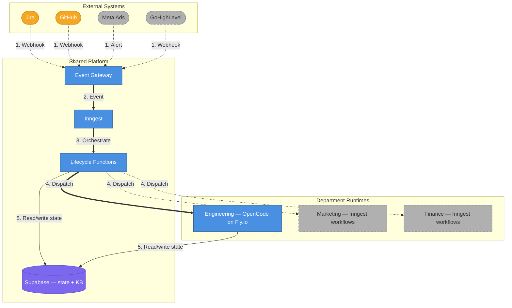
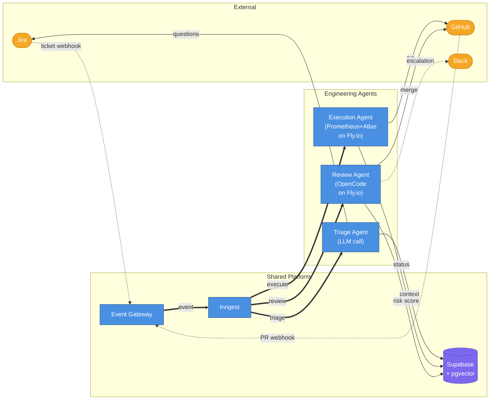

# AI Employee Platform — Full System Vision

## What This Document Is

A consolidated view of the complete AI Employee Platform — what it looks like when fully built, informed by everything we've learned building the Engineering MVP. This replaces the need to read the original architecture doc (2800+ lines) and MVP phases doc (1200+ lines) to understand the end state. Those documents remain useful as detailed references, but they contain assumptions we've since revised.

**Read this when you need to answer**: "Where is this whole thing going, and how do we get there?"

---

## The Complete System in One Page

The AI Employee Platform deploys autonomous AI agents across company departments. Each department follows the same workflow: **Trigger → Triage → Execute → Review → Deliver**. The shared infrastructure (Event Gateway, Inngest, Supabase) handles orchestration. What changes per department is the config — integrations, tools, knowledge base, risk model, agent runtime.

| #   | What happens     | Details                                                                                         |
| --- | ---------------- | ----------------------------------------------------------------------------------------------- |
| 1   | Webhook/Alert    | External systems send events (Jira ticket created, GitHub PR event, Meta Ads spend alert, etc.) |
| 2   | Event            | Gateway normalizes the payload and emits a typed event to Inngest                               |
| 3   | Orchestrate      | Inngest routes the event to the correct lifecycle function based on department                  |
| 4   | Dispatch         | Lifecycle function provisions the department runtime (solid = active, dashed = planned)         |
| 5   | Read/write state | Runtimes and lifecycle functions read/write task state and knowledge base via Supabase          |

### What Exists Today

| Component                   | Status                                                      |
| --------------------------- | ----------------------------------------------------------- |
| Event Gateway (Fastify)     | Built — Jira/GitHub webhooks, admin API, Slack interactions |
| Inngest lifecycle functions | Built — orchestration, watchdog, redispatch                 |
| Execution Agent (worker)    | Built — OpenCode on Docker/Fly.io, creates PRs              |
| Supabase (16-table schema)  | Built — task state, projects, executions, deliverables      |
| Triage Agent                | Not built — gateway writes `Ready` directly                 |
| Review Agent                | Not built — developer reviews PRs manually                  |
| Knowledge Base (pgvector)   | Not built — SQL task history + OpenCode native search only  |
| Marketing Department        | Not built — archetype designed                              |
| Cross-Department Workflows  | Not built — event contract designed                         |

### What's Actively Changing

The worker orchestration is being redesigned: custom TypeScript orchestration (~600 lines of phases, waves, fix loops, validation pipelines) is being replaced by a thin wrapper that delegates to the oh-my-opencode Prometheus + Atlas agent system. See [worker post-redesign overview](./2026-04-14-0057-worker-post-redesign-overview.md) for the target worker state.

---

## What We've Learned (Revisions to Original Design)

These are material changes from the original architecture doc, not cosmetic ones.

### 1. Agent delegation beats custom orchestration

The original design had `orchestrate.mts` managing phases, waves, sessions, fix loops, and validation pipelines in TypeScript. This duplicated what the oh-my-opencode agent system (Prometheus for planning, Atlas for execution) already does natively. The redesign replaces ~600 lines with ~100: start OpenCode, hand the task to Prometheus, monitor for completion.

**Impact**: The execution agent becomes dramatically simpler to maintain. The agent owns planning, validation, fix iteration strategy, and completion signaling. The platform only needs to monitor heartbeats, enforce cost limits, and detect stuck agents.

### 2. Supabase CLI doesn't support custom database names

The original design assumed `supabase start` for local development. The CLI hardcodes `Database: "postgres"` in Go source — PostgREST always connects to `postgres` regardless of config. Since workers use PostgREST (not direct Prisma), this creates a split-brain: Prisma writes to `ai_employee`, PostgREST reads from `postgres`.

**Fix**: Docker Compose with `${POSTGRES_DB}=ai_employee` throughout. This is the permanent local infrastructure pattern for all departments.

### 3. Single session with auto-compact, not session-per-wave

The original design created a new OpenCode session for each "wave" of execution. OpenCode natively supports `EventSessionCompacted` — when the context window fills up, it auto-compacts and continues. One session per task is correct.

### 4. Cost-based escalation, not iteration counts

The original "3 retries per stage, 10 global" was arbitrary and didn't account for task complexity. A $20 cost ceiling per task is more meaningful — simple tasks use less budget, complex tasks get more runway. The agent decides how to spend its budget.

### 5. The agent should discover tooling, not be told

The original design assumed every project uses pnpm/Node.js. The redesigned worker has a multi-language Docker image (Node + Python + Go + Rust) and tells the agent: "Discover what's available. Read package.json, Makefile, Cargo.toml. Install what you need." Project profiles cache this discovery for subsequent runs.

### 6. ngrok free tier doesn't work with Fly.io

Fly.io egress IPs are blocked by ngrok's free infrastructure. Cloudflare Tunnel is the permanent solution for hybrid mode. ngrok is being removed entirely.

### 7. Plan file is the checkpoint, not the branch alone

The original design used the git branch as the sole restart checkpoint. The redesign adds the plan file (`.sisyphus/plans/{TICKET-KEY}.md`) — Atlas checks off tasks as it completes them, the plan syncs to Supabase, and a restarted machine continues from the first unchecked task.

---

## Engineering Department — Complete Vision

When fully built, the Engineering department has three agents and a knowledge base, all coordinated by Inngest lifecycle functions.

### Architecture

### Task Lifecycle (Engineering)

| #   | What happens            | Details                                                                                      |
| --- | ----------------------- | -------------------------------------------------------------------------------------------- |
| 1   | Ticket arrives          | Customer creates a Jira ticket; webhook fires to the Event Gateway                           |
| 2   | Analyze requirements    | Triage agent queries knowledge base for similar past work, checks requirement completeness   |
| 2a  | Ambiguous               | Requirements unclear — triage posts clarifying questions back to Jira                        |
| 2b  | Clarified               | Customer responds — triage re-evaluates                                                      |
| 3   | Clear — dispatch        | Requirements are unambiguous; ticket marked `Ready` and dispatched to execution              |
| 4   | Code, validate, fix, PR | Prometheus plans the work, Atlas implements, runs validation, iterates on failures, opens PR |
| 5   | Review PR               | Review agent cross-references diff against ticket acceptance criteria, waits for CI          |
| 6   | Score risk              | Compute risk score (0-100) based on files changed, critical paths, new dependencies          |
| 6a  | Low risk                | Auto-merge the PR without human intervention                                                 |
| 6b  | High risk               | Escalate to Slack with risk breakdown for human review                                       |
| 7   | Complete                | Task marked `Done`, Slack notification sent to stakeholders                                  |

### Triage Agent (Not Yet Built)

**What it does**: Analyzes incoming Jira tickets, consults the knowledge base for similar past work, determines if requirements are clear enough to execute, and asks targeted questions if not.

**Runtime**: Stateless LLM call via OpenRouter. No Fly.io machine needed — it only reads tickets and posts comments.

**How it changes the current flow**: Today the gateway writes `Ready` directly. With triage, the gateway writes `Received`, triage evaluates, and only marks `Ready` when requirements are unambiguous. This prevents the execution agent from wasting compute on vague tickets.

**When to build**: When ticket volume or ambiguity justifies the investment. The gateway already stores the raw webhook in `triage_result` — the triage agent reads that and enriches it.

### Execution Agent (Active — Being Redesigned)

**What it does**: Receives a triaged ticket, provisions a Fly.io machine, delegates planning to Prometheus and execution to Atlas, validates the output, and creates a PR.

**Post-redesign flow** (see [worker post-redesign overview](./2026-04-14-0057-worker-post-redesign-overview.md)):

1. Thin `orchestrate.mts` starts OpenCode with oh-my-opencode plugin
2. Single session, `agent: "prometheus"` — Prometheus generates the plan
3. Plan verifier (Haiku) validates the plan before execution
4. Atlas executes the plan, checking off tasks as it goes
5. Agent signals completion by writing `status=Submitting` to Supabase via PostgREST
6. Agent creates the PR on GitHub

**Key properties**:

- Cost-based escalation (`TASK_COST_LIMIT_USD`) instead of iteration limits
- Heartbeat-based timeout instead of fixed 30-minute monitor
- Plan file synced to Supabase for restart recovery
- Project profiles cached for cross-run learning
- Multi-language support (Node, Python, Go, Rust in Docker image)

### Review Agent (Not Yet Built)

**What it does**: Evaluates PRs created by the execution agent. Cross-references the diff against the original Jira ticket's acceptance criteria. Runs on a Fly.io machine (same image as execution) so it has filesystem access for merge conflict resolution via rebase.

**Key capabilities**:

- Acceptance criteria validation (diff vs. ticket requirements)
- Code quality review (with full codebase context, not just the diff)
- CI wait (`step.waitForEvent` for GitHub check_suite)
- Merge conflict resolution (rebase directly — has filesystem access)
- Risk scoring (0-100 based on files changed, critical paths, new deps)
- Auto-merge low-risk PRs, Slack escalation for high-risk

**When to build**: When execution agent output quality is proven and manual review becomes the bottleneck. Building it before the execution agent is reliable wastes effort — you'd be automating review of bad output.

### Knowledge Base (Not Yet Built)

**Layer 1 — Vector Embeddings (pgvector)**: Code chunks, docstrings, READMEs embedded and stored in Supabase. The triage agent queries this to identify relevant files without reading the entire codebase. Re-indexed on every merge to `main`.

**Layer 2 — Task History (already exists)**: The `tasks`, `executions`, `deliverables`, and `feedback` tables are institutional memory. Agents query: "How was similar work done before?"

**Layers 3-4** (deferred): Tree-sitter AST structural index and living documentation. Add when Layers 1-2 prove insufficient.

**When to build**: Layer 1 is the prerequisite for the triage agent. Build them together.

---

## Second Department: Paid Marketing

The marketing department validates that the archetype pattern generalizes beyond code. It uses Inngest workflows as its runtime (not Fly.io machines) — appropriate for API-heavy tasks that don't need filesystem access.

**Trigger sources**: Meta Ads API (spend alerts, performance thresholds), scheduled crons (daily performance reviews), GoHighLevel webhooks.

**V1 scope**: Campaign performance monitoring and optimization against Meta/Google Ads APIs. Creative generation is V2.

**What's needed to ship it**:

1. Extract the engineering archetype from hardcoded config into a registry pattern (the shared platform already exists — routing is the gap)
2. Write the marketing archetype config (trigger sources, tools, risk model)
3. Write 2-3 Inngest workflow functions (the "agent" for marketing)
4. Add marketing-specific columns/tables to Supabase if needed

**When to build**: After the Engineering department reaches autonomous operation (shadow → supervised → autonomous progression). Building it before engineering is stable compounds complexity.

---

## Cross-Department Workflows

When a deal closes in Sales, Engineering provisions the environment, Finance generates the invoice, Marketing drafts the case study. Departments communicate via a standardized `cross_department_trigger` event contract — neither side knows the other's internals.

**When to build**: After Engineering and Marketing are each independently operational. The event contract is designed (table exists in the schema), but wiring should wait until each department is validated separately.

---

## Remaining Milestones (Priority Order)

| #   | Milestone                      | What It Unlocks                                           | Effort | Dependencies               |
| --- | ------------------------------ | --------------------------------------------------------- | ------ | -------------------------- |
| 1   | **Worker redesign**            | Simpler worker, multi-language support, cost controls     | XL     | None (in progress)         |
| 2   | **Cloud deployment**           | Real Jira tickets trigger the flow end-to-end             | M      | Worker redesign complete   |
| 3   | **Production integration**     | Shadow mode → supervised mode on real tickets             | S      | Cloud deployment           |
| 4   | **Knowledge base (pgvector)**  | Semantic search across codebase and task history          | M      | Supabase Cloud running     |
| 5   | **Triage agent**               | Auto-filter ambiguous tickets, ask clarifying questions   | M      | Knowledge base             |
| 6   | **Review agent**               | Auto-merge low-risk PRs, risk-based escalation            | L      | Execution agent reliable   |
| 7   | **Marketing department**       | Validates archetype generalization, second revenue stream | L      | Engineering autonomous     |
| 8   | **Cross-department workflows** | End-to-end business process automation                    | M      | 2+ departments operational |

### What "Done" Looks Like for Each Stage

**Engineering MVP** (current target):

- Real Jira tickets trigger automated PR creation
- PRs compile and pass tests ≥80% of the time
- Human reviewer approves without changes ≥60% of the time
- Escalation works (Slack notifications)
- Feedback loop captures corrections

**Engineering Autonomous** (post-review-agent):

- Low-risk PRs auto-merge without human review
- High-risk PRs escalated to Slack with risk breakdown
- Triage filters out ambiguous tickets before execution
- Knowledge base informs agent context

**Multi-Department** (marketing operational):

- Marketing archetype processes real campaign alerts
- Engineering and Marketing share the same Event Gateway and Inngest
- Cross-department triggers wired (at least one working chain)

---

## Risk & Open Questions

| Risk                                     | Mitigation                                                                           | Status                                         |
| ---------------------------------------- | ------------------------------------------------------------------------------------ | ---------------------------------------------- |
| Agent quality too low for autonomous PRs | Shadow → supervised → autonomous progression. ≥60% approval rate gate.               | Mitigated by design                            |
| Cost runaway on complex tasks            | `TASK_COST_LIMIT_USD` ceiling + daily department cost gate                           | Being built (redesign)                         |
| pgvector scale limits                    | Stay in Postgres until bottleneck proven. pgvectorscale or Qdrant as escape hatches. | Designed, not needed yet                       |
| Inngest `waitForEvent` race condition    | Supabase-first writes + pre-check before all `waitForEvent` calls                    | Implemented                                    |
| Fly.io `auto_destroy` bug                | Explicit `destroyMachine()` in `finally` blocks (hybrid mode pattern)                | Fixed in hybrid, redesign applies to all modes |

### Open Questions

1. **Triage agent runtime**: The original doc specifies a stateless LLM call. Should it instead run as a lightweight OpenCode session to leverage native codebase search tools? The answer depends on whether pgvector semantic search alone is sufficient for file identification.

2. **Review agent cost/value**: Running the review agent on a Fly.io machine costs ~$0.60-$2.40/review (vs. ~$0.10-$0.40 for a stateless LLM call). Is filesystem access for rebase worth 6× cost? The answer depends on merge conflict frequency.

3. **Marketing archetype validation**: The architecture assumes Inngest workflows are the right runtime for non-engineering departments. This is untested. The first marketing workflow will validate or invalidate this assumption.

4. **Multi-tenancy timing**: The schema has `tenant_id` everywhere, but multi-tenancy is designed for later. When does the SaaS path activate, and does it require infrastructure changes beyond the already-designed tenant isolation?

---

## Reference Documents

| Document                                                                                                        | What It Covers                                                                                       | When to Read                                   |
| --------------------------------------------------------------------------------------------------------------- | ---------------------------------------------------------------------------------------------------- | ---------------------------------------------- |
| [`2026-03-22-2317-ai-employee-architecture.md`](./2026-03-22-2317-ai-employee-architecture.md)                  | Full original architecture (2800+ lines) — archetypes, data model, security, scaling, cost estimates | Deep dives into specific subsystems            |
| [`2026-03-25-1901-mvp-implementation-phases.md`](./2026-03-25-1901-mvp-implementation-phases.md)                | Original 10-phase MVP build plan with verification criteria                                          | Understanding what was built and in what order |
| [`2026-04-07-1732-hybrid-mode-current-state.md`](./2026-04-07-1732-hybrid-mode-current-state.md)                | Current worker system state (pre-redesign) with exact code references                                | Debugging or understanding the current worker  |
| [`2026-04-14-0057-worker-post-redesign-overview.md`](./2026-04-14-0057-worker-post-redesign-overview.md)        | Target worker state after redesign (before/after, files added/removed)                               | Understanding the redesign scope               |
| [`.sisyphus/plans/worker-agent-delegation-redesign.md`](../.sisyphus/plans/worker-agent-delegation-redesign.md) | Detailed redesign plan with 14 tasks across 4 waves                                                  | Executing the redesign                         |
| [`AGENTS.md`](../AGENTS.md)                                                                                     | Agent onboarding guide (commands, conventions, env vars)                                             | Working in the codebase day-to-day             |
