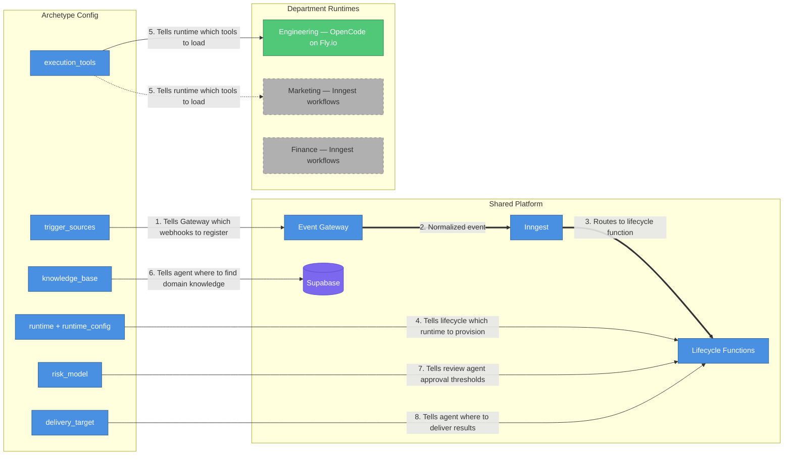
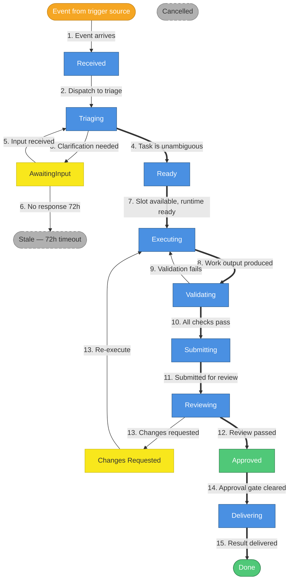
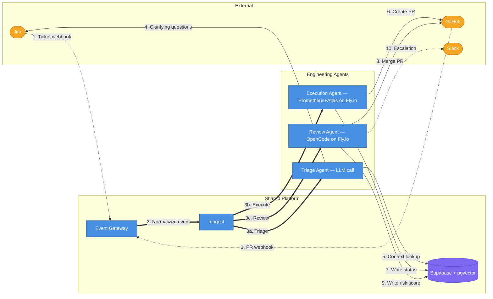
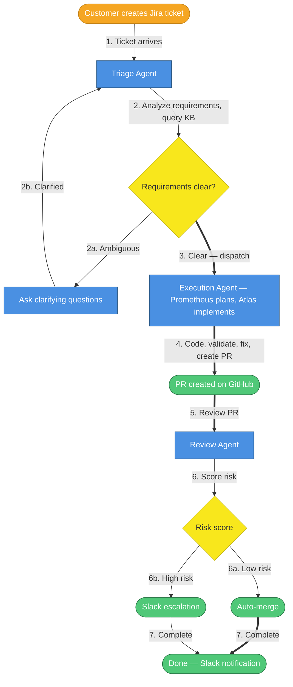
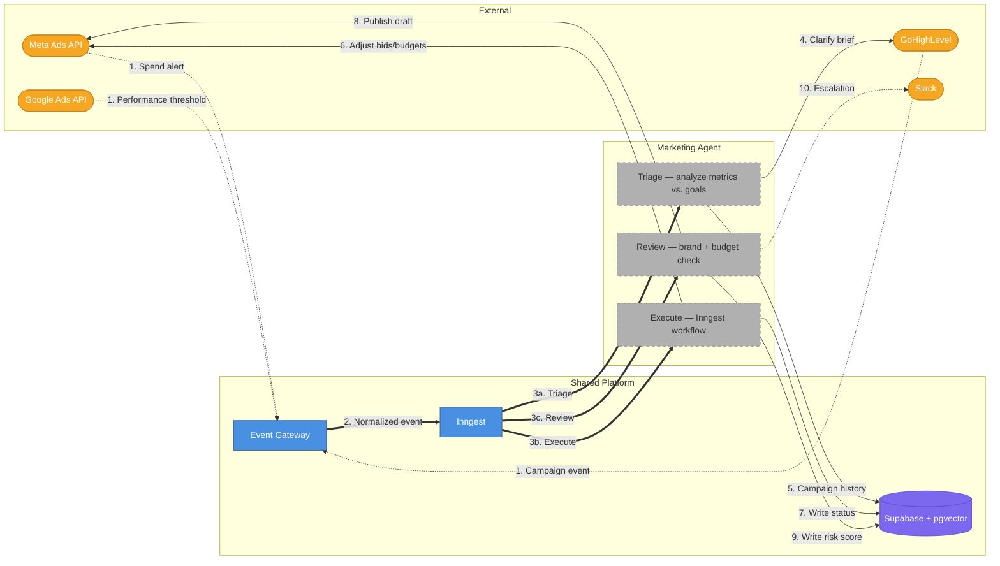

# AI Employee Platform — Full System Vision

## What This Document Is

A consolidated view of the complete AI Employee Platform — what it looks like when fully built, informed by everything we've learned building the Engineering MVP. This replaces the need to read the original architecture doc (2800+ lines) and MVP phases doc (1200+ lines) to understand the end state. Those documents remain useful as detailed references, but they contain assumptions we've since revised.

**Read this when you need to answer**: "Where is this whole thing going, and how do we get there?"

---

## Core Concept: The Archetype Framework

The platform's central design principle: **every department is a config, not new code.**

A department is defined by a declarative **archetype config**. The shared platform reads this config and knows which webhooks to watch, which tools to provision, which knowledge base to query, which risk model to apply, and which agent runtime to spin up. Adding a department means writing a config and implementing the department-specific agent logic — the orchestration, state management, queue infrastructure, and observability are all reused.



| #   | What happens                           | Details                                                                                      |
| --- | -------------------------------------- | -------------------------------------------------------------------------------------------- |
| 1   | Gateway learns which webhooks to watch | `trigger_sources` registers Jira endpoints for Engineering, Meta Ads endpoints for Marketing |
| 2   | Normalized event                       | Gateway validates payload, normalizes to universal task schema, emits to Inngest             |
| 3   | Routes to lifecycle function           | Inngest dispatches to the correct department's lifecycle function based on archetype         |
| 4   | Provisions runtime                     | `runtime` + `runtime_config` determine: Fly.io machine, Inngest workflow, or other           |
| 5   | Loads tools                            | `execution_tools` tells the agent what it can do (git, file editor, Meta Ads API, etc.)      |
| 6   | Queries knowledge base                 | `knowledge_base` points to pgvector embeddings, task history, campaign playbooks, etc.       |
| 7   | Applies risk model                     | `risk_model` determines auto-approve threshold and escalation rules                          |
| 8   | Delivers results                       | `delivery_target` tells the agent where output goes (GitHub PR, ad platform draft, etc.)     |

### Full Archetype Config Schema

| Field              | Purpose                      | Engineering Example                                | Marketing Example                                                        |
| ------------------ | ---------------------------- | -------------------------------------------------- | ------------------------------------------------------------------------ |
| `department`       | Logical grouping             | `engineering`                                      | `marketing.paid`                                                         |
| `trigger_sources`  | Webhook endpoints to monitor | Jira, GitHub                                       | Meta Ads API, GoHighLevel                                                |
| `triage_tools`     | Tools during triage          | Jira API, codebase search                          | Ad account API, campaign history                                         |
| `execution_tools`  | Tools during execution       | Git, file editor, test runner                      | Meta Ads API, analytics query                                            |
| `review_tools`     | Tools during review          | GitHub PR API, CI status                           | Performance dashboard, brand checker                                     |
| `knowledge_base`   | Domain knowledge sources     | pgvector embeddings, task history                  | Campaign playbooks, brand docs                                           |
| `delivery_target`  | Where results go             | GitHub PR                                          | Ad platform draft                                                        |
| `risk_model`       | Approval gate configuration  | File-count + critical-path score                   | Spend threshold + audience size                                          |
| `concurrency`      | Max parallel tasks           | 3 per project                                      | 2 per ad account                                                         |
| `escalation_rules` | When to involve a human      | DB migrations, auth changes                        | Budget > $500/day, new audience                                          |
| `runtime`          | Agent runtime type           | `opencode`                                         | `inngest`                                                                |
| `runtime_config`   | Runtime-specific settings    | `{type: "fly-machine", vm_size: "performance-2x"}` | `{type: "inngest-function", function_id: "marketing/optimize-campaign"}` |

### Runtime Config Examples

**Engineering** — needs filesystem access, git, test runners → Fly.io machine:

```json
{
  "runtime": "opencode",
  "runtime_config": {
    "type": "fly-machine",
    "vm_size": "performance-2x",
    "image": "ai-employee-worker:latest",
    "max_duration_minutes": 90
  }
}
```

**Marketing** — needs only API calls → Inngest workflow function:

```json
{
  "runtime": "inngest",
  "runtime_config": {
    "type": "inngest-function",
    "function_id": "marketing/optimize-campaign"
  }
}
```

---

## Universal Task Lifecycle

All departments share this state machine. The states and transitions are identical — only what happens _inside_ each state changes per archetype.



| #   | What happens          | Details                                                                                    |
| --- | --------------------- | ------------------------------------------------------------------------------------------ |
| 1   | Event arrives         | External system fires webhook; Gateway normalizes and emits to Inngest                     |
| 2   | Dispatch to triage    | Lifecycle function sends task to the triage agent for analysis                             |
| 3   | Clarification needed  | Triage determines requirements are ambiguous; posts questions back to source system        |
| 4   | Task is unambiguous   | Triage confirms requirements are clear; task marked Ready for execution                    |
| 5   | Input received        | Source system provides clarification; triage re-evaluates                                  |
| 6   | No response 72h       | Clarification never received; task goes Stale (can be manually revived)                    |
| 7   | Slot available        | Execution slot opens; lifecycle provisions the runtime (Fly.io machine, Inngest function)  |
| 8   | Work output produced  | Agent produces deliverable; validation begins                                              |
| 9   | Validation fails      | Check fails (lint, tests, budget, brand); agent re-enters execution to fix                 |
| 10  | All checks pass       | All validation stages pass; deliverable ready for submission                               |
| 11  | Submitted for review  | Deliverable submitted to review agent                                                      |
| 12  | Review passed         | Review agent approves; risk score below auto-approve threshold                             |
| 13  | Changes requested     | Review agent finds issues; task re-enters execution with feedback                          |
| 14  | Approval gate cleared | Human or auto-approval complete; ready to deliver                                          |
| 15  | Result delivered      | Output published (PR merged, campaign draft pushed, invoice posted); stakeholders notified |

**Any state can also transition to Cancelled.**

**Engineering MVP simplification**: Gateway writes `Ready` directly (triage bypassed), PRs are reviewed manually (review agent deferred), so the active flow is: `Ready → Executing → Submitting → Done`.

### What Each State Means Per Department

| State         | Engineering                       | Paid Marketing                          | Finance (future)                    | Sales (future)                      |
| ------------- | --------------------------------- | --------------------------------------- | ----------------------------------- | ----------------------------------- |
| Received      | Jira ticket created               | Ad performance alert                    | Invoice received                    | Lead form submitted                 |
| Triaging      | Analyze requirements vs. codebase | Analyze metrics vs. campaign goals      | Classify expense, check budget      | Qualify lead, check CRM history     |
| AwaitingInput | Questions posted to Jira          | Clarification on creative brief         | Missing receipt or PO number        | Missing company info                |
| Executing     | Write code on Fly.io, run tests   | Call Meta/Google Ads APIs, adjust bids  | Categorize, reconcile, draft entry  | Research prospect, draft outreach   |
| Validating    | Lint → Unit → Integration → E2E   | Brand compliance + budget limits check  | Double-entry balance + policy check | Messaging tone + CRM completeness   |
| Reviewing     | AI code review + risk score       | Human creative approval via Slack       | Manager approval over threshold     | Manager approval for enterprise     |
| Delivering    | PR merged → Slack notification    | Campaign draft published to ad platform | Journal entry posted, Slack alert   | Email sequence sent via GoHighLevel |

---

## Engineering Department — First Archetype Instance

Engineering is the first fully implemented department. When complete, it has three agents and a knowledge base, all coordinated by Inngest lifecycle functions.

### Architecture



| #   | What happens         | Details                                                                            |
| --- | -------------------- | ---------------------------------------------------------------------------------- |
| 1   | Webhooks arrive      | Jira ticket events and GitHub PR events hit the Event Gateway                      |
| 2   | Normalized event     | Gateway validates, normalizes payload, and emits a typed event to Inngest          |
| 3a  | Triage               | Inngest dispatches to Triage Agent for new tickets requiring analysis              |
| 3b  | Execute              | Inngest dispatches to Execution Agent for triaged tickets ready for implementation |
| 3c  | Review               | Inngest dispatches to Review Agent for PRs awaiting validation                     |
| 4   | Clarifying questions | Triage posts questions back to Jira when requirements are ambiguous                |
| 5   | Context lookup       | Triage queries Supabase (pgvector embeddings + task history) for similar past work |
| 6   | Create PR            | Execution Agent pushes branch and opens PR on GitHub                               |
| 7   | Write status         | Execution Agent updates task state in Supabase throughout its lifecycle            |
| 8   | Merge PR             | Review Agent merges the PR after validation passes and risk score is acceptable    |
| 9   | Write risk score     | Review Agent persists the computed risk score (0-100) to Supabase                  |
| 10  | Escalation           | Review Agent sends Slack notification when risk score exceeds auto-merge threshold |

### Engineering Task Lifecycle



| #   | What happens            | Details                                                                                      |
| --- | ----------------------- | -------------------------------------------------------------------------------------------- |
| 1   | Ticket arrives          | Customer creates a Jira ticket; webhook fires to the Event Gateway                           |
| 2   | Analyze requirements    | Triage agent queries knowledge base for similar past work, checks requirement completeness   |
| 2a  | Ambiguous               | Requirements unclear — triage posts clarifying questions back to Jira                        |
| 2b  | Clarified               | Customer responds — triage re-evaluates                                                      |
| 3   | Clear — dispatch        | Requirements are unambiguous; ticket marked `Ready` and dispatched to execution              |
| 4   | Code, validate, fix, PR | Prometheus plans the work, Atlas implements, runs validation, iterates on failures, opens PR |
| 5   | Review PR               | Review agent cross-references diff against ticket acceptance criteria, waits for CI          |
| 6   | Score risk              | Compute risk score (0-100) based on files changed, critical paths, new dependencies          |
| 6a  | Low risk                | Auto-merge the PR without human intervention                                                 |
| 6b  | High risk               | Escalate to Slack with risk breakdown for human review                                       |
| 7   | Complete                | Task marked `Done`, Slack notification sent to stakeholders                                  |

### Engineering Agents (Detail)

**Triage Agent** (not yet built): Analyzes incoming Jira tickets, consults the knowledge base for similar past work, determines if requirements are clear enough to execute. Runtime: stateless LLM call via OpenRouter — no Fly.io machine needed. Today the gateway writes `Ready` directly; with triage, it writes `Received` first.

**Execution Agent** (active — being redesigned): Receives a triaged ticket, provisions a Fly.io machine, delegates planning to Prometheus and execution to Atlas, validates output, creates a PR. Post-redesign: thin `orchestrate.mts` wrapper, single session with auto-compact, cost-based escalation (`TASK_COST_LIMIT_USD`), plan file checkpoint for restart recovery. See [worker post-redesign overview](./2026-04-14-0057-worker-post-redesign-overview.md).

**Review Agent** (not yet built): Evaluates PRs against acceptance criteria, runs on Fly.io (filesystem access for rebase). Risk scoring (0-100), auto-merge low-risk, Slack escalation for high-risk. Build when execution agent output quality is proven.

**Knowledge Base** (not yet built): Layer 1 — pgvector embeddings of code chunks and docs, re-indexed on merge to `main`. Layer 2 — SQL task history (already exists in `tasks`, `executions`, `deliverables`, `feedback` tables). Build Layer 1 alongside the triage agent.

### Engineering Risk Model

Risk score 0-100 based on: files changed, lines modified, critical paths touched (auth, DB migrations, payment, security), new dependencies introduced.

- **Low risk** (docs, config, small patches, tests): auto-merge after AI review. No human needed.
- **High risk** (DB migrations, auth, security, new external deps): human approval via Slack with one-click approve/reject.
- Threshold configurable per project.

---

## Marketing Department — Second Archetype Instance

Marketing validates that the archetype pattern generalizes beyond code. It uses Inngest workflows as its runtime — appropriate for API-heavy tasks that don't need filesystem access.

### Architecture



| #   | What happens        | Details                                                                               |
| --- | ------------------- | ------------------------------------------------------------------------------------- |
| 1   | Alerts arrive       | Meta Ads spend alerts, Google Ads performance thresholds, GoHighLevel campaign events |
| 2   | Normalized event    | Gateway normalizes ad platform payloads to universal task schema                      |
| 3a  | Triage              | Analyze campaign metrics against goals; determine if action is needed                 |
| 3b  | Execute             | Inngest workflow calls ad platform APIs to adjust bids, budgets, targeting            |
| 3c  | Review              | Validate changes against brand compliance rules and budget limits                     |
| 4   | Clarify brief       | Post questions to GoHighLevel when campaign brief is ambiguous                        |
| 5   | Campaign history    | Query Supabase for similar past campaigns and their outcomes                          |
| 6   | Adjust bids/budgets | Execute optimization actions via Meta/Google Ads APIs                                 |
| 7   | Write status        | Update task state in Supabase throughout lifecycle                                    |
| 8   | Publish draft       | Push approved campaign changes to ad platform                                         |
| 9   | Write risk score    | Persist risk score based on spend impact and audience size                            |
| 10  | Escalation          | Slack notification when budget exceeds threshold or targeting changes are high-risk   |

### Marketing Risk Model

Risk score based on: daily spend impact, audience size change, new creative (untested), targeting change scope.

- **Low risk** (bid adjustments within 10%, tested creative swap): auto-apply.
- **High risk** (budget > $500/day, new audience, untested creative): human approval via Slack.
- Detailed risk model weights deferred to Marketing department planning phase.

### What's Needed to Ship Marketing

1. Extract the engineering archetype from hardcoded config into a registry pattern
2. Write the marketing archetype config (trigger sources, tools, risk model)
3. Write 2-3 Inngest workflow functions (the marketing agent logic)
4. Add marketing-specific webhook handlers to the Event Gateway
5. Add per-department cost tracking (replace hardcoded `'default'` department)

**V1 scope**: Campaign performance monitoring and optimization. Creative generation is V2.

**When to build**: After Engineering reaches autonomous operation. Building before engineering is stable compounds complexity.

---

## Adding a New Department

To add a department (e.g., Finance, Sales, HR), follow this checklist. The shared platform handles orchestration — you only build the department-specific pieces.

### Onboarding Checklist

1. **Define the archetype** — Fill in all 12 fields: trigger sources, triage/execution/review tools, knowledge base, delivery target, risk model, concurrency, escalation rules, runtime, runtime config
2. **Register webhook endpoints** — Add handlers in Event Gateway; normalize payloads to universal task schema
3. **Configure LLM Gateway** — Model selection per task type, token budgets, fallback chain
4. **Build the knowledge base** — Index domain content into pgvector; set up re-indexing pipeline
5. **Implement the triage agent** — Stateless LLM call or lightweight OpenCode session
6. **Implement the execution agent** — Fly.io machine (filesystem-heavy) or Inngest workflow (API-heavy)
7. **Implement the review agent** — Validation tools + risk scoring logic
8. **Configure the risk model** — Start conservative (low auto-approve threshold), loosen as confidence grows
9. **Shadow mode** (2-4 weeks) — Full pipeline runs but all external actions suppressed; human reviews all output
10. **Supervised mode** — Enable external actions but require human approval for every delivery; gradually increase auto-approval threshold
11. **Autonomous mode** — Full autonomous operation with human escalation only for high-risk tasks

### What You Reuse vs. What You Build

| Reused (shared platform)        | Built (per department)                            |
| ------------------------------- | ------------------------------------------------- |
| Event Gateway (Fastify)         | Webhook handlers for department's trigger sources |
| Inngest orchestration           | Department-specific lifecycle function(s)         |
| Supabase state management       | Department-specific tables/columns (if needed)    |
| Universal task lifecycle states | What happens inside each state                    |
| Risk model framework            | Risk factors and thresholds for the domain        |
| Slack notifications             | Escalation rules for the domain                   |
| Cost tracking infrastructure    | Per-department cost limits                        |
| Observability (logs, metrics)   | Domain-specific alerting                          |

---

## Cross-Department Workflows

When a deal closes in Sales, Engineering provisions the environment, Finance generates the invoice, Marketing drafts the case study. Departments communicate via a standardized event contract — neither side knows the other's internals.

### Event Contract

```json
{
  "event_type": "cross_department_trigger",
  "source_department": "sales",
  "source_task_id": "task_abc123",
  "target_department": "engineering",
  "target_archetype": "client_provisioning",
  "runtime_hint": "opencode",
  "payload": {
    "client_name": "Acme Corp",
    "plan_tier": "enterprise",
    "requirements": ["SSO", "custom domain", "dedicated DB"]
  },
  "priority": "high",
  "deadline": "2026-04-01T00:00:00Z"
}
```

The `runtime_hint` suggests a runtime (`opencode` → Fly.io, `inngest` → workflow function), but the target department can override based on its own archetype config. The `cross_dept_triggers` table already exists in the schema.

**When to build**: After Engineering and Marketing are each independently operational. The event contract is designed and the database table exists, but wiring should wait until each department is validated separately.

---

## What's Built vs. What's Designed

The multi-department architecture exists at different layers of readiness. This distinction matters — the schema is ready, but the application code only knows about Engineering.

| Concept                    | Database Schema           | Application Code          | API             |
| -------------------------- | ------------------------- | ------------------------- | --------------- |
| Department model           | Table exists, empty       | Never written to          | Not exposed     |
| Archetype model            | Table exists, empty       | Never written to          | Not exposed     |
| KnowledgeBase model        | Table exists, empty       | Never written to          | Not exposed     |
| RiskModel model            | Table exists, empty       | Never written to          | Not exposed     |
| CrossDeptTrigger model     | Table exists, empty       | Never written to          | Not exposed     |
| AgentVersion model         | Table exists, empty       | Never written to          | Not exposed     |
| Multi-tenant routing       | `tenant_id` on all tables | Single hardcoded UUID     | Not exposed     |
| Department event routing   | N/A                       | All events `engineering/` | N/A             |
| Per-department cost limits | N/A                       | Single global limit       | N/A             |
| Marketing webhooks         | N/A                       | Not implemented           | Not implemented |

**What this means**: The schema is forward-compatible and ready for multi-department support. Activating it requires:

1. Seed `departments` and `archetypes` rows
2. Expose `department_id` in `POST /admin/projects`
3. Add department lookup in webhook handlers (read `project.department_id` → `archetype.runtime`)
4. Parameterize Inngest event names by department (e.g., `marketing/task.received`)
5. Register department-specific Inngest functions
6. Add per-department cost tracking (replace `'default'` literal with actual department name)

---

## What We've Learned (Revisions to Original Design)

These are material changes from the original architecture doc, not cosmetic ones.

### 1. Agent delegation beats custom orchestration

The original design had `orchestrate.mts` managing phases, waves, sessions, fix loops, and validation pipelines in TypeScript. This duplicated what the oh-my-opencode agent system (Prometheus for planning, Atlas for execution) already does natively. The redesign replaces ~600 lines with ~100: start OpenCode, hand the task to Prometheus, monitor for completion.

**Impact**: The execution agent becomes dramatically simpler to maintain. The agent owns planning, validation, fix iteration strategy, and completion signaling. The platform only needs to monitor heartbeats, enforce cost limits, and detect stuck agents.

### 2. Supabase CLI doesn't support custom database names

The original design assumed `supabase start` for local development. The CLI hardcodes `Database: "postgres"` in Go source — PostgREST always connects to `postgres` regardless of config. Since workers use PostgREST (not direct Prisma), this creates a split-brain: Prisma writes to `ai_employee`, PostgREST reads from `postgres`.

**Fix**: Docker Compose with `${POSTGRES_DB}=ai_employee` throughout. This is the permanent local infrastructure pattern for all departments.

### 3. Single session with auto-compact, not session-per-wave

The original design created a new OpenCode session for each "wave" of execution. OpenCode natively supports `EventSessionCompacted` — when the context window fills up, it auto-compacts and continues. One session per task is correct.

### 4. Cost-based escalation, not iteration counts

The original "3 retries per stage, 10 global" was arbitrary and didn't account for task complexity. A $20 cost ceiling per task is more meaningful — simple tasks use less budget, complex tasks get more runway. The agent decides how to spend its budget.

### 5. The agent should discover tooling, not be told

The original design assumed every project uses pnpm/Node.js. The redesigned worker has a multi-language Docker image (Node + Python + Go + Rust) and tells the agent: "Discover what's available. Read package.json, Makefile, Cargo.toml. Install what you need." Project profiles cache this discovery for subsequent runs.

### 6. ngrok free tier doesn't work with Fly.io

Fly.io egress IPs are blocked by ngrok's free infrastructure. Cloudflare Tunnel is the permanent solution for hybrid mode. ngrok is being removed entirely.

### 7. Plan file is the checkpoint, not the branch alone

The original design used the git branch as the sole restart checkpoint. The redesign adds the plan file (`.sisyphus/plans/{TICKET-KEY}.md`) — Atlas checks off tasks as it completes them, the plan syncs to Supabase, and a restarted machine continues from the first unchecked task.

---

## Remaining Milestones (Priority Order)

| #   | Milestone                      | What It Unlocks                                           | Effort | Dependencies               |
| --- | ------------------------------ | --------------------------------------------------------- | ------ | -------------------------- |
| 1   | **Worker redesign**            | Simpler worker, multi-language support, cost controls     | XL     | None (in progress)         |
| 2   | **Cloud deployment**           | Real Jira tickets trigger the flow end-to-end             | M      | Worker redesign complete   |
| 3   | **Production integration**     | Shadow mode → supervised mode on real tickets             | S      | Cloud deployment           |
| 4   | **Knowledge base (pgvector)**  | Semantic search across codebase and task history          | M      | Supabase Cloud running     |
| 5   | **Triage agent**               | Auto-filter ambiguous tickets, ask clarifying questions   | M      | Knowledge base             |
| 6   | **Review agent**               | Auto-merge low-risk PRs, risk-based escalation            | L      | Execution agent reliable   |
| 7   | **Marketing department**       | Validates archetype generalization, second revenue stream | L      | Engineering autonomous     |
| 8   | **Cross-department workflows** | End-to-end business process automation                    | M      | 2+ departments operational |

### What "Done" Looks Like for Each Stage

**Engineering MVP** (current target):

- Real Jira tickets trigger automated PR creation
- PRs compile and pass tests ≥80% of the time
- Human reviewer approves without changes ≥60% of the time
- Escalation works (Slack notifications)
- Feedback loop captures corrections

**Engineering Autonomous** (post-review-agent):

- Low-risk PRs auto-merge without human review
- High-risk PRs escalated to Slack with risk breakdown
- Triage filters out ambiguous tickets before execution
- Knowledge base informs agent context

**Multi-Department** (marketing operational):

- Marketing archetype processes real campaign alerts
- Engineering and Marketing share the same Event Gateway and Inngest
- Cross-department triggers wired (at least one working chain)

---

## Risk & Open Questions

| Risk                                     | Mitigation                                                                           | Status                                         |
| ---------------------------------------- | ------------------------------------------------------------------------------------ | ---------------------------------------------- |
| Agent quality too low for autonomous PRs | Shadow → supervised → autonomous progression. ≥60% approval rate gate.               | Mitigated by design                            |
| Cost runaway on complex tasks            | `TASK_COST_LIMIT_USD` ceiling + daily department cost gate                           | Being built (redesign)                         |
| pgvector scale limits                    | Stay in Postgres until bottleneck proven. pgvectorscale or Qdrant as escape hatches. | Designed, not needed yet                       |
| Inngest `waitForEvent` race condition    | Supabase-first writes + pre-check before all `waitForEvent` calls                    | Implemented                                    |
| Fly.io `auto_destroy` bug                | Explicit `destroyMachine()` in `finally` blocks (hybrid mode pattern)                | Fixed in hybrid, redesign applies to all modes |

### Open Questions

1. **Triage agent runtime**: The original doc specifies a stateless LLM call. Should it instead run as a lightweight OpenCode session to leverage native codebase search tools? The answer depends on whether pgvector semantic search alone is sufficient for file identification.

2. **Review agent cost/value**: Running the review agent on a Fly.io machine costs ~$0.60-$2.40/review (vs. ~$0.10-$0.40 for a stateless LLM call). Is filesystem access for rebase worth 6× cost? The answer depends on merge conflict frequency.

3. **Marketing archetype validation**: The architecture assumes Inngest workflows are the right runtime for non-engineering departments. This is untested. The first marketing workflow will validate or invalidate this assumption.

4. **Multi-tenancy timing**: The schema has `tenant_id` everywhere, but multi-tenancy is designed for later. When does the SaaS path activate, and does it require infrastructure changes beyond the already-designed tenant isolation?

---

## Reference Documents

| Document                                                                                                        | What It Covers                                                                                       | When to Read                                   |
| --------------------------------------------------------------------------------------------------------------- | ---------------------------------------------------------------------------------------------------- | ---------------------------------------------- |
| [`2026-03-22-2317-ai-employee-architecture.md`](./2026-03-22-2317-ai-employee-architecture.md)                  | Full original architecture (2800+ lines) — archetypes, data model, security, scaling, cost estimates | Deep dives into specific subsystems            |
| [`2026-03-25-1901-mvp-implementation-phases.md`](./2026-03-25-1901-mvp-implementation-phases.md)                | Original 10-phase MVP build plan with verification criteria                                          | Understanding what was built and in what order |
| [`2026-04-07-1732-hybrid-mode-current-state.md`](./2026-04-07-1732-hybrid-mode-current-state.md)                | Current worker system state (pre-redesign) with exact code references                                | Debugging or understanding the current worker  |
| [`2026-04-14-0057-worker-post-redesign-overview.md`](./2026-04-14-0057-worker-post-redesign-overview.md)        | Target worker state after redesign (before/after, files added/removed)                               | Understanding the redesign scope               |
| [`.sisyphus/plans/worker-agent-delegation-redesign.md`](../.sisyphus/plans/worker-agent-delegation-redesign.md) | Detailed redesign plan with 14 tasks across 4 waves                                                  | Executing the redesign                         |
| [`AGENTS.md`](../AGENTS.md)                                                                                     | Agent onboarding guide (commands, conventions, env vars)                                             | Working in the codebase day-to-day             |
