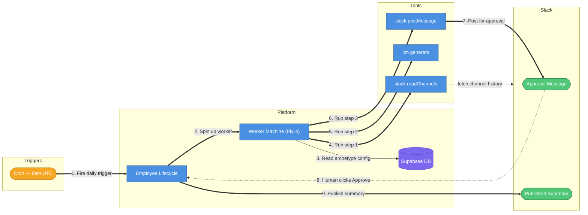
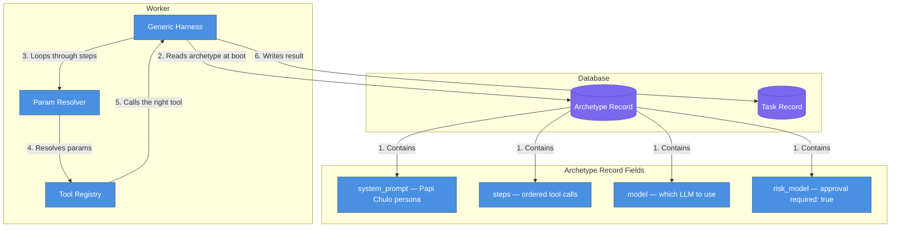
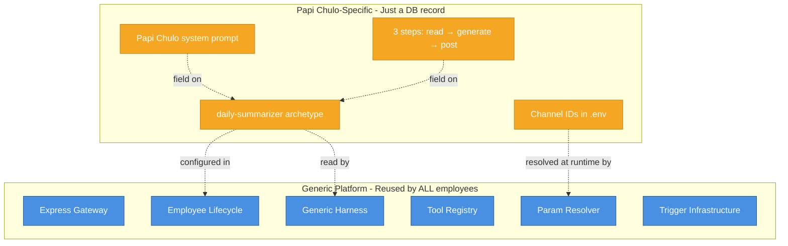

# Papi Chulo — The Summarizer AI Employee

## What is it?

Papi Chulo is an AI employee that **automatically reads your Slack channels, generates a dramatic Spanish news-style summary, and asks a human to approve it before posting it publicly** — every weekday morning.

Before this work, the platform only knew how to do one thing: receive a Jira ticket and open a GitHub pull request. Papi Chulo is the first proof that the platform is truly **generic** — new AI employees can be created by adding a database record, not writing new code.

---

## Diagram 1 — What happens every weekday morning

> **Question**: What is the end-to-end flow from cron tick to Slack message?

| #   | What happens          | Details                                                                               |
| --- | --------------------- | ------------------------------------------------------------------------------------- |
| 1   | Cron fires            | Inngest runs `0 8 * * 1-5` (weekdays at 8am UTC)                                      |
| 2   | Spin up worker        | Lifecycle creates a Fly.io machine with the generic harness command                   |
| 3   | Read archetype config | Worker reads its job description from the database (Papi Chulo persona, steps, model) |
| 4   | Read Slack channels   | Step 1: fetches last 24h of messages from configured channels                         |
| 5   | Generate summary      | Step 2: sends messages to the LLM with Papi Chulo's dramatic Spanish persona prompt   |
| 6   | Post for approval     | Step 3: posts the summary to a target channel with Approve/Reject buttons             |
| 7   | Human sees it         | A human reads the summary in Slack                                                    |
| 8   | Human approves        | Clicks the Approve button → Slack sends an interaction event to the gateway           |
| 9   | Publish               | Lifecycle receives approval, posts the final summary to the public channel            |

---

## Diagram 2 — How the platform knows what Papi Chulo should do

> **Question**: Where does the "job description" live, and how does the worker read it?

| #   | What happens            | Details                                                                                                                                            |
| --- | ----------------------- | -------------------------------------------------------------------------------------------------------------------------------------------------- |
| 1   | Archetype record        | A single DB row defines everything: persona prompt, which tools to run in which order, which LLM model, whether human approval is required         |
| 2   | Worker reads it at boot | The generic harness (a single TypeScript file) reads this record on startup — it doesn't know it's Papi Chulo until that moment                    |
| 3   | Loop through steps      | Each step says "call tool X with params Y"                                                                                                         |
| 4   | Resolve params          | Params can reference env vars (`$DAILY_SUMMARY_CHANNELS`), previous step output (`$prev_result`), or archetype fields (`$archetype.system_prompt`) |
| 5   | Call the right tool     | The tool registry is a map of tool names → implementations                                                                                         |
| 6   | Write result            | Summary text is stored to the task's deliverable record                                                                                            |

---

## Diagram 3 — What's generic vs. what's Papi Chulo-specific

> **Question**: What's reusable for any future employee vs. what's unique to Papi Chulo?

**The key design principle**: everything in the blue box was built once and works for any employee. Everything in the orange box is just configuration — if you wanted a "Daily Standup Summarizer" or a "Sales Report Employee", you'd add a new DB record and point it at existing tools. No new code.

---

## What was changed in the codebase

| Area         | What changed                                                                                                                                  |
| ------------ | --------------------------------------------------------------------------------------------------------------------------------------------- |
| **Gateway**  | Migrated from Fastify → Express + added Slack Bolt for handling Approve/Reject button clicks                                                  |
| **Database** | Added config fields to the `archetypes` table; added `content` and `metadata` to `deliverables`; new statuses `Failed` and `AwaitingApproval` |
| **Tools**    | Three new platform tools: `slack.readChannels`, `llm.generate`, `slack.postMessage`                                                           |
| **Worker**   | New `generic-harness.mts` — the single file all non-engineering employees run                                                                 |
| **Inngest**  | New `employee-lifecycle` function (generic); new `trigger/daily-summarizer` cron function                                                     |
| **Seed**     | Added Operations department + Papi Chulo archetype record with full persona                                                                   |
| **Tests**    | 843 tests passing; 4 new test files for the new tools and lifecycle                                                                           |
| **Docs**     | `AGENTS.md` updated to explain how to add future employees                                                                                    |
