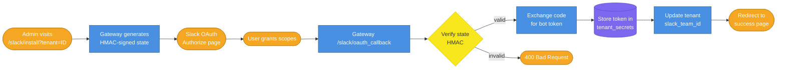

# Multi-Tenancy Admin Guide

This guide covers how to provision, configure, and operate multiple tenants (organizations) on the AI Employee Platform. Each tenant runs the same AI employees independently, with full data isolation.

---

## Overview

The platform supports multiple organizations sharing the same infrastructure. Each organization is a **tenant** with its own:

- Slack workspace (bot token stored encrypted per-tenant)
- Jira webhook secret (per-tenant HMAC verification)
- GitHub token and OpenRouter API key (per-tenant billing isolation)
- Channel configuration (which channels to read/post to)

Data isolation is enforced at the application layer: every database query filters by `tenant_id`. There is no cross-tenant data leakage by design.

---

## Architecture

### Data Model

```
Tenant (id, name, slug, slack_team_id, config JSONB, deleted_at)
  └── TenantSecret (tenant_id, key, ciphertext, iv, auth_tag)
       Examples: slack_bot_token, jira_webhook_secret, github_token, openrouter_api_key
```

### Encryption Model

All secrets are encrypted with **AES-256-GCM** before storage. The `ENCRYPTION_KEY` environment variable (64 hex chars = 32 bytes) is the master key. Each secret has a unique random IV — the same plaintext produces different ciphertexts on every write.

### Slack OAuth Flow



**Flow Walkthrough:**

| Step | Description                                                                             |
| ---- | --------------------------------------------------------------------------------------- |
| 1    | Admin visits `/slack/install?tenant=<uuid>`                                             |
| 2    | Gateway validates tenant exists, generates HMAC-signed state (base64url payload + HMAC) |
| 3    | User is redirected to Slack's OAuth authorize page                                      |
| 4    | User grants the requested scopes                                                        |
| 5    | Slack redirects to `/slack/oauth_callback?code=...&state=...`                           |
| 6    | Gateway verifies state HMAC to prevent CSRF                                             |
| 7    | Gateway exchanges the code for a bot token via Slack API                                |
| 8    | Bot token is encrypted and stored in `tenant_secrets`                                   |
| 9    | Tenant's `slack_team_id` is updated atomically                                          |
| 10   | User is redirected to a success confirmation                                            |

---

## Setup

### Prerequisites

1. **Slack App**: Create a Slack app at https://api.slack.com/apps with OAuth scopes: `channels:history`, `chat:write`, `channels:read`
2. **ENCRYPTION_KEY**: Generate with `openssl rand -hex 32` (64 hex chars)
3. **Redirect URL**: Set `SLACK_REDIRECT_BASE_URL` to your public gateway URL (e.g., via Cloudflare Tunnel for local dev)

### Required Environment Variables

```bash
ENCRYPTION_KEY=<64-hex-chars>          # Master encryption key
SLACK_CLIENT_ID=<from-slack-app>       # Slack app client ID
SLACK_CLIENT_SECRET=<from-slack-app>   # Slack app client secret
SLACK_SIGNING_SECRET=<from-slack-app>  # For verifying Slack interactions
SLACK_REDIRECT_BASE_URL=https://your-domain.com  # Public URL for OAuth callback
```

---

## Creating a Tenant

```bash
curl -X POST http://localhost:3000/admin/tenants \
  -H "X-Admin-Key: $ADMIN_API_KEY" \
  -H "Content-Type: application/json" \
  -d '{
    "name": "Acme Corp",
    "slug": "acme-corp"
  }'
```

Response:

```json
{
  "id": "uuid-here",
  "name": "Acme Corp",
  "slug": "acme-corp",
  "install_link": "http://localhost:3000/slack/install?tenant=uuid-here"
}
```

---

## Installing Slack

1. Visit the `install_link` from the tenant creation response (or construct it manually):
   ```
   http://localhost:3000/slack/install?tenant=<tenant-id>
   ```
2. You will be redirected to Slack's OAuth page. Grant the requested scopes.
3. After approval, Slack redirects back to the gateway callback.
4. The gateway stores the bot token encrypted in `tenant_secrets` and sets `slack_team_id` on the tenant.

**Verify installation:**

```bash
curl http://localhost:3000/admin/tenants/<tenant-id> \
  -H "X-Admin-Key: $ADMIN_API_KEY"
# slack_team_id should now be set (e.g., "T0XXXXXXX")
```

---

## Setting Config

Configure which Slack channels the summarizer reads from and posts to:

```bash
curl -X PATCH http://localhost:3000/admin/tenants/<tenant-id>/config \
  -H "X-Admin-Key: $ADMIN_API_KEY" \
  -H "Content-Type: application/json" \
  -d '{
    "summary": {
      "channel_ids": ["C0XXXXXXX", "C0YYYYYYY"],
      "target_channel": "C0ZZZZZZZ"
    }
  }'
```

Config is stored as plain JSONB (non-sensitive). The `loadTenantEnv()` function reads these values and injects them into the Fly.io machine environment automatically — no `.env` changes needed.

---

## Storing Tenant Secrets

For secrets like `jira_webhook_secret`, `github_token`, `openrouter_api_key`:

```bash
curl -X POST http://localhost:3000/admin/tenants/<tenant-id>/secrets \
  -H "X-Admin-Key: $ADMIN_API_KEY" \
  -H "Content-Type: application/json" \
  -d '{
    "key": "jira_webhook_secret",
    "value": "your-secret-here"
  }'
```

Secrets are stored encrypted. The listing endpoint returns metadata only (no plaintext values):

```bash
curl http://localhost:3000/admin/tenants/<tenant-id>/secrets \
  -H "X-Admin-Key: $ADMIN_API_KEY"
# Returns: [{ "key": "jira_webhook_secret", "is_set": true, "updated_at": "..." }]
```

---

## Triggering an Employee

```bash
curl -X POST http://localhost:3000/admin/tenants/<tenant-id>/employees/daily-summarizer/trigger \
  -H "X-Admin-Key: $ADMIN_API_KEY" \
  -H "Content-Type: application/json" \
  -d '{}'
```

The worker machine receives tenant-scoped environment variables (secrets + config) — not the platform's global `.env`.

---

## Verification

Run the automated verification script after provisioning both tenants:

```bash
pnpm verify:multi-tenancy
```

This checks:

1. Schema: `tenants` and `tenant_secrets` tables exist
2. Tenant existence: Platform, DozalDevs, VLRE all present
3. Encryption sanity: ciphertext ≠ plaintext, roundtrip works
4. Cross-tenant API isolation: Tenant B cannot access Tenant A's tasks
5. Tenant env loader: different tokens per tenant
6. InstallationStore: correct bot token per Slack team ID

---

## Provisioning DozalDevs + VLRE

Use the interactive provisioning script:

```bash
pnpm setup:two-tenants
```

This script:

1. Ensures DozalDevs and VLRE tenants exist (idempotent)
2. Migrates legacy `SLACK_BOT_TOKEN` into VLRE's `tenant_secrets` (one-shot)
3. Guides you through the DozalDevs Slack OAuth install flow
4. Prompts for per-tenant channel configuration
5. Verifies both tenants are fully configured

---

## Troubleshooting

### Bot uninstalled from workspace

If a user uninstalls the bot from Slack, `fetchInstallation` will fail with "No bot token found for team". Re-run the OAuth install flow:

```
http://localhost:3000/slack/install?tenant=<tenant-id>
```

### OAuth state error (400 Bad Request)

The HMAC-signed state has a 10-minute TTL. If the OAuth flow takes longer, restart from the install link.

### Encryption key rotation (deferred)

Key rotation is not yet implemented. To rotate: decrypt all secrets with the old key, re-encrypt with the new key, update `ENCRYPTION_KEY`. This is a planned future enhancement.

### Jira webhook 401 after adding tenant secret

The Jira webhook handler uses the tenant's `jira_webhook_secret` if set, falling back to `JIRA_WEBHOOK_SECRET` env var. After storing a tenant secret, re-sign your Jira webhook with the new secret.

### Worker uses wrong GitHub token

Verify the tenant has a `github_token` secret set:

```bash
curl http://localhost:3000/admin/tenants/<tenant-id>/secrets \
  -H "X-Admin-Key: $ADMIN_API_KEY"
```

If missing, add it via `POST /admin/tenants/<id>/secrets`.
