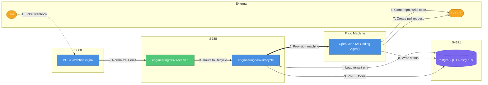

# AI Employee Platform — Current System State

## What This Document Is

A snapshot of what is actually built and working today, as of April 16, 2026. Written after completing multi-tenancy and the Summarizer employee (Papi Chulo) across two real organizations.

**Read the [Full System Vision](./2026-04-14-0104-full-system-vision.md) for where the platform is going.** This document describes where it **is**.

---

## Platform Overview

The AI Employee Platform deploys autonomous AI agents — "digital employees" — each with a single responsibility. Every employee follows the same lifecycle, uses the same infrastructure, and runs on the same runtime. What changes per employee is the config.

Two employees are live and proven:

| Employee                          | Department  | Trigger               | Delivery            | Status                        |
| --------------------------------- | ----------- | --------------------- | ------------------- | ----------------------------- |
| **Engineering Coder**             | Engineering | Jira webhook          | GitHub pull request | Active (single-tenant)        |
| **Papi Chulo** (Daily Summarizer) | Operations  | Manual trigger / Cron | Slack message       | Active (multi-tenant, 2 orgs) |

Two real organizations are running Papi Chulo with zero cross-contamination:

| Tenant        | Slack Workspace | Source Channel          | Approval Channel        | Publish Channel         |
| ------------- | --------------- | ----------------------- | ----------------------- | ----------------------- |
| **DozalDevs** | DozalDevs       | #project-lighthouse     | #victor-tests           | #project-lighthouse     |
| **VLRE**      | VLRE            | (configured per tenant) | (configured per tenant) | (configured per tenant) |

---

## Stack

| Layer          | Technology                        | Role                                                                  |
| -------------- | --------------------------------- | --------------------------------------------------------------------- |
| Gateway        | Express (TypeScript)              | HTTP server, webhook receiver, admin API, Slack OAuth, Inngest host   |
| Orchestration  | Inngest                           | Durable workflows, event routing, cron scheduling, approval gates     |
| Database       | PostgreSQL (Supabase self-hosted) | State management via Prisma (gateway) and PostgREST (workers)         |
| Worker Runtime | Fly.io                            | Ephemeral machines provisioned per task, destroyed after completion   |
| Slack          | Bolt SDK (Socket Mode)            | Per-tenant bot token resolution, interactive buttons (approve/reject) |
| LLM            | OpenRouter                        | Model inference for all employees                                     |
| Container      | Docker                            | Worker images built locally, pushed to Fly.io registry                |

---

## Architecture

### How a Summarizer Task Runs (End-to-End)

```mermaid
flowchart LR
    subgraph External
        SLACK_IN(["Slack Channels"]):::external
        SLACK_OUT(["Slack (Approval + Publish)"]):::external
    end

    subgraph Gateway [:3000]
        TRIGGER["Admin API Trigger"]:::service
        BOLT["Slack Bolt (Socket Mode)"]:::service
    end

    subgraph Inngest [:8288]
        DISPATCH["employee/task.dispatched"]:::event
        LIFECYCLE["employee/task-lifecycle"]:::service
        APPROVAL["employee/approval.received"]:::event
    end

    subgraph Fly.io Machine
        HARNESS["Generic Harness"]:::service
        READ["slack.readChannels"]:::service
        LLM["llm.generate"]:::service
        POST["slack.postMessage"]:::service
    end

    subgraph Supabase [:54321]
        DB[("PostgreSQL + PostgREST")]:::storage
    end

    TRIGGER -->|"1. POST /admin/tenants/:id/employees/:slug/trigger"| DISPATCH
    DISPATCH ==>|"2. Inngest routes to lifecycle"| LIFECYCLE
    LIFECYCLE -->|"3. Load tenant env (secrets + config)"| DB
    LIFECYCLE ==>|"4. Provision Fly.io machine"| HARNESS
    HARNESS -->|"5. Fetch archetype + steps"| DB
    HARNESS ==>|"6a. Read channels"| READ
    READ -->|"6b. Slack API: conversations.history"| SLACK_IN
    READ ==>|"7. Channel messages"| LLM
    LLM ==>|"8. Generated summary"| POST
    POST -->|"9. Post approval message with buttons"| SLACK_OUT
    POST -->|"10. Write deliverable (ts, channel, blocks)"| DB
    HARNESS -->|"11. Task status → Submitting"| DB
    LIFECYCLE -->|"12. Detect Submitting → AwaitingApproval"| DB
    BOLT -->|"13. User clicks Approve"| APPROVAL
    APPROVAL ==>|"14. Inngest resumes lifecycle"| LIFECYCLE
    LIFECYCLE -->|"15a. Publish summary to target channel"| SLACK_OUT
    LIFECYCLE -->|"15b. Task status → Done"| DB

    classDef service fill:#4A90E2,stroke:#2E5C8A,color:#fff
    classDef storage fill:#7B68EE,stroke:#5B4BC7,color:#fff
    classDef external fill:#F5A623,stroke:#C4841A,color:#fff
    classDef event fill:#50C878,stroke:#2D7A4A,color:#fff
```



| #   | What happens                | Details                                                                                                                                           |
| --- | --------------------------- | ------------------------------------------------------------------------------------------------------------------------------------------------- |
| 1   | Admin triggers employee     | `POST /admin/tenants/:tenantId/employees/daily-summarizer/trigger` creates task + fires Inngest event                                             |
| 2   | Inngest routes to lifecycle | `employee/task.dispatched` event handled by `employee/task-lifecycle` function                                                                    |
| 3   | Load tenant environment     | Lifecycle function decrypts tenant's secrets (Slack bot token, OpenRouter key) and reads config (channel IDs, target channel) from DB             |
| 4   | Provision Fly.io machine    | Machine created with tenant-scoped env vars injected; runs `generic-harness.mjs`                                                                  |
| 5   | Fetch archetype             | Harness reads task + archetype from PostgREST, extracts ordered step definitions                                                                  |
| 6   | Read Slack channels         | `slack.readChannels` tool reads last 24h from configured channels, filters out bot subtypes and Papi Chulo's own previous summaries               |
| 7   | Pass messages to LLM        | Channel messages passed as context to `llm.generate` with archetype's system prompt                                                               |
| 8   | Generate summary            | LLM produces a dramatic Spanish news-style digest                                                                                                 |
| 9   | Post approval message       | `slack.postMessage` posts summary with Approve/Reject buttons to the tenant's approval channel                                                    |
| 10  | Write deliverable           | Message timestamp, channel, and blocks stored in `deliverables` table for later retrieval                                                         |
| 11  | Signal completion           | Harness sets task status to `Submitting` via PostgREST                                                                                            |
| 12  | Transition to approval      | Lifecycle function polls, detects `Submitting`, transitions to `AwaitingApproval`, calls `waitForEvent`                                           |
| 13  | User approves               | Slack Bolt (Socket Mode) receives button click, immediately removes buttons (chat.update), checks idempotency, fires `employee/approval.received` |
| 14  | Resume lifecycle            | Inngest matches the approval event to the waiting lifecycle function                                                                              |
| 15  | Publish and complete        | Lifecycle reads deliverable blocks, publishes to the tenant's publish channel using tenant-scoped bot token, marks task `Done`                    |

### How an Engineering Task Runs (End-to-End)



The Engineering employee runs OpenCode inside the Fly.io machine (not the generic harness). It clones the target repo, plans the work, writes code, runs validation, and opens a pull request on GitHub. The lifecycle function handles retries (up to 3 dispatch attempts), cost gating, and machine cleanup.

---

## Multi-Tenancy (Implemented)

Multi-tenancy is fully operational. Every data structure is tenant-scoped.

### Data Model

```
tenants
├── id (UUID, PK)
├── name, slug (unique)
├── slack_team_id (unique, nullable — linked via OAuth)
├── config (JSONB — channel_ids, target_channel, publish_channel)
├── status ("active" | "suspended")
├── deleted_at (soft-delete only — data is NEVER hard-deleted)
└── tenant_secrets (1:N — encrypted credentials per tenant)
    ├── key (e.g. "slack_bot_token", "openrouter_api_key")
    ├── ciphertext, iv, auth_tag (AES-256-GCM)
    └── @@unique([tenant_id, key])
```

**Three tenants exist today:**

| UUID                | Name      | Slug        | Purpose                                                                   |
| ------------------- | --------- | ----------- | ------------------------------------------------------------------------- |
| `00000000-...-0001` | Platform  | `platform`  | System/legacy tenant; owns seed data, test project, engineering archetype |
| `00000000-...-0002` | DozalDevs | `dozaldevs` | Real business #1; runs Papi Chulo against #project-lighthouse             |
| `00000000-...-0003` | VLRE      | `vlre`      | Real business #2; runs Papi Chulo against its own workspace               |

### Tenant Isolation

- All 6 core tables have `tenant_id` with FK constraints (`ON DELETE RESTRICT`): `tasks`, `projects`, `feedback`, `departments`, `archetypes`, `knowledge_bases`
- Admin API endpoints are tenant-scoped: `GET /admin/tenants/:A/tasks/:B_task_id` returns 404 on cross-tenant access
- Slack Bolt uses `authorize` callback: resolves `bot_token` per `team_id` → tenant lookup → decrypt from `tenant_secrets`
- Worker machines receive only their tenant's secrets via `loadTenantEnv()` — never another tenant's credentials

### Secret Management

Secrets are encrypted at rest with AES-256-GCM. The `ENCRYPTION_KEY` (32-byte hex) is the only secret that stays in `.env`. Everything else is per-tenant in the database.

| What stays in `.env` (platform infrastructure)                   | What's in `tenant_secrets` (per-tenant) |
| ---------------------------------------------------------------- | --------------------------------------- |
| `DATABASE_URL`, `SUPABASE_URL`, `SUPABASE_SECRET_KEY`            | `slack_bot_token`                       |
| `ADMIN_API_KEY`, `ENCRYPTION_KEY`                                | `openrouter_api_key`                    |
| `INNGEST_*`, `FLY_*`                                             | `github_token`                          |
| `SLACK_CLIENT_ID`, `SLACK_CLIENT_SECRET`, `SLACK_SIGNING_SECRET` | `jira_webhook_secret`                   |

### Slack OAuth Flow

One distributed Slack app, multiple workspace installs. No admin UI needed.

1. Admin visits `GET /slack/install?tenant=<uuid>` — server generates HMAC-signed state, redirects to Slack OAuth
2. User authorizes the app in their Slack workspace
3. Slack redirects to `GET /slack/oauth_callback` — server verifies state signature, exchanges code for bot token
4. Token encrypted and stored in `tenant_secrets`; `slack_team_id` linked to tenant
5. Socket Mode `authorize` function now resolves this tenant's bot token for all future interactions

Scopes requested: `channels:history`, `groups:history`, `groups:read`, `chat:write`, `chat:write.public`

---

## The Archetype Pattern (Config-Driven Employees)

Every non-engineering employee is defined by an **archetype config** stored in the database. The generic harness reads the config and executes accordingly — zero employee-specific code.

### Current Archetype: Daily Summarizer (Papi Chulo)

```json
{
  "role_name": "daily-summarizer",
  "runtime": "generic-harness",
  "model": "anthropic/claude-sonnet-4-6",
  "deliverable_type": "slack_message",
  "system_prompt": "(dramatic Spanish news correspondent persona)",
  "steps": [
    {
      "tool": "slack.readChannels",
      "params": { "channels": "$DAILY_SUMMARY_CHANNELS", "lookback_hours": 24 }
    },
    {
      "tool": "llm.generate",
      "params": {
        "model": "$archetype.model",
        "system_prompt": "$archetype.system_prompt",
        "user_prompt": "Generate a dramatic Spanish news-style summary...\n\n$prev_result"
      }
    },
    {
      "tool": "slack.postMessage",
      "params": {
        "channel": "$SUMMARY_TARGET_CHANNEL",
        "summary_text": "$prev_result",
        "task_id": "$TASK_ID"
      }
    }
  ],
  "risk_model": { "approval_required": true, "timeout_hours": 24 },
  "trigger_sources": { "type": "cron", "expression": "0 8 * * 1-5", "timezone": "America/Chicago" }
}
```

### Parameter Resolution

Step params use `$` prefixes for dynamic values:

| Prefix             | Source                                 | Example                                              |
| ------------------ | -------------------------------------- | ---------------------------------------------------- |
| `$VARIABLE_NAME`   | Environment variable (from tenant env) | `$DAILY_SUMMARY_CHANNELS` → `"C092BJ04HUG"`          |
| `$archetype.field` | Archetype record field                 | `$archetype.model` → `"anthropic/claude-sonnet-4-6"` |
| `$prev_result`     | Previous step's output                 | LLM-generated summary text                           |
| `$TASK_ID`         | Current task ID                        | UUID of the running task                             |

### Tool Registry

Three tools are registered and available to the generic harness:

| Tool                 | What it does                                                                                                                                                                                 |
| -------------------- | -------------------------------------------------------------------------------------------------------------------------------------------------------------------------------------------- |
| `slack.readChannels` | Reads messages from Slack channels for a configurable lookback period. Filters out bot subtypes and Papi Chulo's own previous summaries (via `block_id: 'papi-chulo-daily-summary'` marker). |
| `llm.generate`       | Calls OpenRouter with system prompt + user prompt. Uses the model specified in the archetype (currently `anthropic/claude-sonnet-4-6`).                                                      |
| `slack.postMessage`  | Posts the generated summary to the approval channel with Approve/Reject interactive buttons. Includes a `block_id` marker for self-filtering in future runs.                                 |

### Adding a New Employee (Today)

If the required tools already exist in the registry:

1. Seed a new `employee_archetypes` record with `role_name`, `system_prompt`, `steps`, `model`, `deliverable_type`
2. No code changes needed — the generic harness executes any archetype
3. Add a trigger (cron function in `src/inngest/triggers/` or manual via admin API)
4. Configure tenant: set the new employee's env vars in `tenant_secrets` and `tenant.config`

If new tools are needed:

1. Create a tool file in `src/workers/tools/`
2. Register it in `src/workers/tools/registry.ts`
3. Rebuild the Docker image (`docker build -t ai-employee-worker:latest .`)
4. Push to Fly.io (`pnpm fly:image`)

---

## Task Lifecycle (As Implemented)

### Summarizer Lifecycle (Generic Employee)

```
Received → Executing → Submitting → AwaitingApproval → Done/Cancelled
```

States actually traversed today:

| State                | What happens                                                                       | Who drives it               |
| -------------------- | ---------------------------------------------------------------------------------- | --------------------------- |
| **Received**         | Task row created by admin trigger endpoint                                         | Gateway                     |
| **Executing**        | Fly.io machine provisioned, generic harness runs archetype steps                   | Inngest lifecycle + Harness |
| **Submitting**       | Harness completed all steps, deliverable written                                   | Harness                     |
| **AwaitingApproval** | Lifecycle detects Submitting, transitions, posts approval message, waits for event | Inngest lifecycle           |
| **Done**             | Human approved; summary published to target channel                                | Inngest lifecycle           |
| **Cancelled**        | Human rejected or approval timed out (24h)                                         | Inngest lifecycle           |

### Engineering Lifecycle

```
Ready → Executing → Submitting/Done
```

More complex: includes cost gating, dispatch retries (up to 3), hybrid/local Docker modes, pre-check for race conditions, and machine cleanup. See `src/inngest/lifecycle.ts`.

---

## Admin API

All endpoints require `X-Admin-Key` header.

| Method   | Path                                               | Description                          |
| -------- | -------------------------------------------------- | ------------------------------------ |
| `POST`   | `/admin/projects`                                  | Register a project                   |
| `GET`    | `/admin/projects`                                  | List projects                        |
| `GET`    | `/admin/projects/:id`                              | Get project                          |
| `PATCH`  | `/admin/projects/:id`                              | Update project                       |
| `DELETE` | `/admin/projects/:id`                              | Delete project (409 if active tasks) |
| `POST`   | `/admin/tenants`                                   | Create tenant                        |
| `GET`    | `/admin/tenants`                                   | List tenants                         |
| `GET`    | `/admin/tenants/:id`                               | Get tenant                           |
| `PATCH`  | `/admin/tenants/:id`                               | Update tenant                        |
| `DELETE` | `/admin/tenants/:id`                               | Soft-delete tenant                   |
| `POST`   | `/admin/tenants/:id/restore`                       | Restore soft-deleted tenant          |
| `GET`    | `/admin/tenants/:id/secrets`                       | List secret keys (no plaintext)      |
| `PUT`    | `/admin/tenants/:id/secrets/:key`                  | Set secret (encrypted at rest)       |
| `DELETE` | `/admin/tenants/:id/secrets/:key`                  | Delete secret                        |
| `GET`    | `/admin/tenants/:id/config`                        | Get tenant config (JSONB)            |
| `PATCH`  | `/admin/tenants/:id/config`                        | Update tenant config                 |
| `POST`   | `/admin/tenants/:tenantId/employees/:slug/trigger` | Trigger employee for tenant          |
| `GET`    | `/admin/tenants/:tenantId/tasks/:id`               | Check task status (tenant-scoped)    |
| `GET`    | `/slack/install?tenant=<uuid>`                     | Start Slack OAuth install            |
| `GET`    | `/slack/oauth_callback`                            | OAuth callback (automatic)           |

---

## Inngest Functions (5 Total)

| Function ID                   | Trigger                       | Purpose                                                                            |
| ----------------------------- | ----------------------------- | ---------------------------------------------------------------------------------- |
| `engineering/task-lifecycle`  | `engineering/task.received`   | Full engineering employee lifecycle (Fly.io machine, OpenCode, retries, cost gate) |
| `engineering/task-redispatch` | `engineering/task.redispatch` | Re-dispatch failed engineering tasks with backoff                                  |
| `engineering/watchdog-cron`   | Cron (hourly)                 | Detect stuck engineering tasks, force-fail after timeout                           |
| `employee/task-lifecycle`     | `employee/task.dispatched`    | Generic employee lifecycle (Fly.io machine, generic harness, approval gate)        |
| `trigger/daily-summarizer`    | Cron (`0 8 * * 1-5`)          | Daily 8am CT trigger for summarizer (fires for each tenant)                        |

---

## UX Hardening

### Approve Button — Double-Click Prevention

The approve/reject buttons in Slack are hardened against double-clicks:

1. On first click: `ack()` immediately, then `chat.update` replaces the message with "Processing approval from @user..." (buttons removed instantly)
2. Idempotency check: queries Supabase for task status — if not `AwaitingApproval`, shows "Already processed" message
3. If Inngest event send fails: buttons are restored so the user can retry
4. Same pattern for reject button

### Papi Chulo Self-Filtering

The summarizer excludes its own previous summary from the next day's digest:

- `slack.postMessage` adds `block_id: 'papi-chulo-daily-summary'` to the header block
- The same blocks are stored in the deliverable and reused when publishing (so published summaries also carry the marker)
- `slack.readChannels` checks each message's `blocks` array for the marker `block_id`
- Messages with the marker are filtered out before being passed to the LLM
- The `isSummaryPost` flag is stripped before returning results (implementation detail, not surfaced)

---

## Database Schema (18 Tables)

### Active Tables (7 — regularly written to)

| Table             | Purpose                                     | Has `tenant_id`       |
| ----------------- | ------------------------------------------- | --------------------- |
| `tasks`           | Task state machine                          | Yes (FK)              |
| `executions`      | Runtime records per task attempt            | No (via task FK)      |
| `deliverables`    | Output artifacts (PR links, Slack messages) | No (via execution FK) |
| `validation_runs` | Lint/test/build results                     | No (via execution FK) |
| `projects`        | Registered repositories                     | Yes (FK)              |
| `tenants`         | Organizations / businesses                  | N/A (is the tenant)   |
| `tenant_secrets`  | Encrypted per-tenant credentials            | Yes (FK, CASCADE)     |

### Forward-Compatibility Tables (9 — schema exists, empty)

| Table                 | Purpose                             | Has `tenant_id` |
| --------------------- | ----------------------------------- | --------------- |
| `departments`         | Organizational grouping             | Yes (FK)        |
| `archetypes`          | Employee type definitions           | Yes (FK)        |
| `knowledge_bases`     | Domain knowledge sources (pgvector) | Yes (FK)        |
| `feedback`            | Human feedback on deliverables      | Yes (FK)        |
| `risk_models`         | Per-archetype risk scoring config   | No              |
| `cross_dept_triggers` | Employee-to-employee event triggers | No              |
| `agent_versions`      | LLM prompt/model version tracking   | No              |
| `clarifications`      | Questions asked during triage       | No              |
| `reviews`             | Deliverable review records          | No              |

### Audit Table (1)

| Table             | Purpose                  |
| ----------------- | ------------------------ |
| `audit_log`       | API call tracking        |
| `task_status_log` | State transition history |

---

## Project Structure

```
src/
├── gateway/                    # Express HTTP server (port 3000)
│   ├── routes/                 # admin-projects, admin-tenants, admin-tenant-secrets,
│   │                           #   admin-tenant-config, admin-employee-trigger, admin-tasks,
│   │                           #   jira, github, slack-oauth, health
│   ├── services/               # employee-dispatcher, tenant-repository,
│   │                           #   tenant-secret-repository, tenant-env-loader
│   ├── slack/                  # handlers (approve/reject), installation-store
│   ├── inngest/                # client, serve (registers functions with Express)
│   ├── middleware/             # admin-auth
│   └── validation/            # Zod schemas
├── inngest/                    # Durable workflow functions
│   ├── lifecycle.ts            # engineering/task-lifecycle
│   ├── employee-lifecycle.ts   # employee/task-lifecycle (generic)
│   ├── redispatch.ts           # engineering/task-redispatch
│   ├── watchdog.ts             # engineering/watchdog-cron
│   ├── triggers/               # daily-summarizer cron trigger
│   └── lib/                    # poll-completion helper
├── workers/                    # Runs inside Docker/Fly.io containers
│   ├── generic-harness.mts     # Config-driven worker for non-engineering employees
│   ├── orchestrate.mts         # OpenCode-based worker for engineering employee
│   ├── tools/                  # Tool registry + implementations
│   │   ├── registry.ts         # 3 tools: slack.readChannels, llm.generate, slack.postMessage
│   │   ├── slack-read-channels.ts
│   │   ├── slack-post-message.ts
│   │   ├── llm-generate.ts
│   │   ├── param-resolver.ts
│   │   └── types.ts
│   └── lib/                    # postgrest-client, supabase helpers
└── lib/                        # Shared utilities
    ├── encryption.ts           # AES-256-GCM encrypt/decrypt + key validation
    ├── fly-client.ts           # Fly.io Machines API
    ├── slack-client.ts         # Slack Web API wrapper
    ├── call-llm.ts             # OpenRouter LLM client with cost circuit breaker
    ├── logger.ts               # Pino logger factory
    ├── tunnel-client.ts        # Cloudflare Tunnel URL resolver
    ├── retry.ts                # Retry with exponential backoff
    └── errors.ts               # Custom error classes

prisma/                         # Schema (18 tables), migrations, seed
scripts/                        # TypeScript scripts (setup, trigger, verify, dev-start)
docker/                         # Supabase self-hosted Docker Compose
docs/                           # Architecture, phase docs, guides
```

---

## Vision vs. Reality — Discrepancies

This section maps every major concept from the [Full System Vision](./2026-04-14-0104-full-system-vision.md) to what's actually built today.

### Implemented as Envisioned

| Vision Concept                      | Status          | Notes                                                                                      |
| ----------------------------------- | --------------- | ------------------------------------------------------------------------------------------ |
| Single-responsibility employees     | **Implemented** | Engineering Coder and Papi Chulo each have one job                                         |
| Archetype config pattern            | **Implemented** | `archetypes` table drives generic harness; steps, model, system prompt all config-driven   |
| Fly.io for all employees            | **Implemented** | Both employees run on Fly.io machines                                                      |
| Inngest orchestration               | **Implemented** | 5 functions handle lifecycle, retries, cron, approval gates                                |
| Multi-tenancy                       | **Implemented** | `Tenant` + `TenantSecret` tables, FK constraints, tenant-scoped queries, encrypted secrets |
| Slack OAuth per workspace           | **Implemented** | One distributed app, per-workspace installs, `InstallationStore` resolves bot tokens       |
| Supervised operating mode           | **Implemented** | All deliverables require human approval via Slack buttons                                  |
| Admin API for management            | **Implemented** | Full CRUD for tenants, secrets, config, projects, employee triggers                        |
| Soft-delete for tenants             | **Implemented** | `deleted_at` column, no hard-delete API surface                                            |
| Supabase self-hosted Docker Compose | **Implemented** | Replaces `supabase start` to support custom database name (`ai_employee`)                  |

### Partially Implemented (Deviations from Vision)

| Vision Concept                                              | What's Different                                                                                                                                                                                                           | Why                                                                                                                                                                                                                                                                          |
| ----------------------------------------------------------- | -------------------------------------------------------------------------------------------------------------------------------------------------------------------------------------------------------------------------- | ---------------------------------------------------------------------------------------------------------------------------------------------------------------------------------------------------------------------------------------------------------------------------- |
| **Universal task lifecycle** (all states for all employees) | The generic employee lifecycle skips Triaging, AwaitingInput, Validating, Reviewing states. It goes: `Received → Executing → Submitting → AwaitingApproval → Done`.                                                        | The summarizer's input is unambiguous (cron/manual trigger) and its output doesn't need multi-stage validation. The vision stated these states would "auto-pass without blocking" — in practice, they're simply not traversed. The state machine is simpler than envisioned. |
| **Every employee runs OpenCode**                            | Only the Engineering Coder uses OpenCode. The summarizer uses a generic harness that executes a fixed sequence of tools.                                                                                                   | The generic harness is simpler, cheaper, and sufficient for non-coding employees. The vision later evolved to acknowledge this split (mentioned in "Worker Post-Redesign Overview").                                                                                         |
| **LLM model selection: MiniMax M2.7**                       | Current production model is `anthropic/claude-sonnet-4-6`, not MiniMax M2.7.                                                                                                                                               | Model selection evolved. The archetype config correctly supports `model_config` per employee, but the chosen model is Sonnet, not MiniMax. The vision's cost analysis assumed MiniMax pricing — actual costs are higher.                                                     |
| **Cron triggers fire automatically**                        | The daily summarizer cron trigger exists (`0 8 * * 1-5`) but multi-tenant cron dispatch is not fully automated. Manual trigger via admin API is the primary method today.                                                  | Proving multi-tenant manual triggers was the priority. Automatic cron dispatch to all tenants is the next step.                                                                                                                                                              |
| **Credential injection via environment variables only**     | Implemented, but with a nuance: the tenant env loader (`loadTenantEnv`) constructs the env map at dispatch time by merging platform `.env` values + decrypted tenant secrets + tenant config. Workers still read env vars. | Functionally equivalent to the vision's model. The addition is the encrypted secret storage layer the vision hadn't fully specified.                                                                                                                                         |
| **Slack as the single feedback channel**                    | Slack is used for approvals and notifications, but the feedback capture pipeline (thread replies → `feedback` table → knowledge base → context injection) is not built.                                                    | Feedback infrastructure is designed in the schema (`feedback` table exists) but the ingestion pipeline is deferred.                                                                                                                                                          |

### Not Yet Built (Vision Features Still Pending)

| Vision Concept                         | Current State                                                                                                                                                                                                                        | Effort Estimate                          |
| -------------------------------------- | ------------------------------------------------------------------------------------------------------------------------------------------------------------------------------------------------------------------------------------ | ---------------------------------------- |
| **Event router + colleague discovery** | Not implemented. Employees don't emit events to trigger other employees. No `event_catalog` table. No colleague manifest injection.                                                                                                  | Medium                                   |
| **AI-assisted event binding**          | Not implemented. No LLM suggests `input_events` when creating archetypes.                                                                                                                                                            | Medium (depends on event router)         |
| **Knowledge base (pgvector)**          | Table exists, empty. No embeddings, no semantic search, no re-indexing pipeline.                                                                                                                                                     | Medium                                   |
| **Autonomous operating mode**          | Not implemented. All employees are supervised-only. No confidence scoring, no auto-delivery, no promotion/demotion mechanics.                                                                                                        | Medium                                   |
| **Feedback & continuous learning**     | No Slack thread reply capture, no feedback summarization, no knowledge base injection. `feedback` table exists but is unused.                                                                                                        | Small-Medium                             |
| **Engineering - Code Reviewer**        | Not built. Vision described a second engineering employee that reviews pull requests.                                                                                                                                                | Large                                    |
| **Plan quality verification (Haiku)**  | Not implemented for generic employees. Engineering Coder has plan verification in its OpenCode workflow, but the generic harness has no plan stage.                                                                                  | Small                                    |
| **Risk model scoring**                 | `risk_models` table exists but is unused. Deliverables have a `risk_score` column (always 0). The `approval_required` boolean on the archetype config is the only risk-related mechanism.                                            | Small                                    |
| **Cost tracking per employee**         | Engineering lifecycle has `COST_LIMIT_USD_PER_DEPT_PER_DAY`. Generic harness has no cost tracking. The `call-llm.ts` has a cost circuit breaker but it's a per-call safety net, not aggregate tracking.                              | Small                                    |
| **Worker-tools as shell commands**     | Vision described `src/worker-tools/slack/*.ts` scripts callable via `node /tools/slack/post-message.js`. Actual implementation uses TypeScript tool classes registered in a `TOOL_REGISTRY`, called programmatically by the harness. | N/A — deliberate design change           |
| **Jira daily status employee**         | Not built.                                                                                                                                                                                                                           | Small (tools exist)                      |
| **Pull request summary bot**           | Not built.                                                                                                                                                                                                                           | Small (tools + GitHub integration exist) |
| **Repo health checker**                | Not built.                                                                                                                                                                                                                           | Medium                                   |
| **Marketing employees**                | Not built. Explicitly deferred in vision until platform proven with 3+ employees.                                                                                                                                                    | Large                                    |

### Deliberate Design Changes (Vision Evolved)

| Original Vision                                       | What Changed                                                         | Why                                                                                                                                                                                                                |
| ----------------------------------------------------- | -------------------------------------------------------------------- | ------------------------------------------------------------------------------------------------------------------------------------------------------------------------------------------------------------------ |
| **Shell commands as tool interface**                  | Tools are TypeScript classes in a registry, invoked programmatically | Programmatic invocation is type-safe, testable, and doesn't require compiling scripts to `/tools/` inside the container. The generic harness pattern proved more elegant than the vision's shell-command approach. |
| **Inngest workflows as runtime for simple employees** | All employees get Fly.io machines                                    | Vision Lesson #8 acknowledged this: "Fly.io for all employees — consistency and flexibility outweigh the compute cost difference at MVP scale."                                                                    |
| **One model (MiniMax M2.7) for everything**           | Sonnet 4 is the production model                                     | Model market evolved; `model_config` per archetype means this is a config change, not an architecture change.                                                                                                      |
| **Single hardcoded tenant UUID**                      | Full multi-tenancy with 3 real tenants                               | The vision described this as "designed but not yet activated." It's now activated.                                                                                                                                 |
| **`process.env` spread into worker machines**         | `loadTenantEnv()` constructs a curated env map                       | Eliminates the security risk of leaking platform secrets to worker containers. Only tenant-relevant env vars are injected.                                                                                         |

---

## Commands

| Action                         | Command                                                                                                                                                     |
| ------------------------------ | ----------------------------------------------------------------------------------------------------------------------------------------------------------- |
| First-time setup               | `pnpm setup`                                                                                                                                                |
| Start services                 | `pnpm dev:start`                                                                                                                                            |
| Run tests                      | `pnpm test -- --run`                                                                                                                                        |
| Lint                           | `pnpm lint`                                                                                                                                                 |
| Build                          | `pnpm build`                                                                                                                                                |
| Trigger engineering task       | `pnpm trigger-task`                                                                                                                                         |
| Trigger summarizer (DozalDevs) | `curl -X POST -H "X-Admin-Key: $ADMIN_API_KEY" http://localhost:3000/admin/tenants/00000000-0000-0000-0000-000000000002/employees/daily-summarizer/trigger` |
| Trigger summarizer (VLRE)      | `curl -X POST -H "X-Admin-Key: $ADMIN_API_KEY" http://localhost:3000/admin/tenants/00000000-0000-0000-0000-000000000003/employees/daily-summarizer/trigger` |
| Check task status              | `curl -H "X-Admin-Key: $ADMIN_API_KEY" http://localhost:3000/admin/tenants/<tenantId>/tasks/<taskId>`                                                       |
| Rebuild worker image           | `docker build -t ai-employee-worker:latest .`                                                                                                               |
| Push to Fly.io registry        | `pnpm fly:image`                                                                                                                                            |
| Verify E2E                     | `pnpm verify:e2e --task-id <uuid>`                                                                                                                          |

---

## What's Next

In priority order, based on what unlocks the most value:

1. **Automatic multi-tenant cron dispatch** — The daily summarizer should fire automatically for all active tenants at 8am CT without manual triggers.
2. **Cloud deployment** — Move from local development to production Inngest Cloud + Fly.io + Supabase Cloud.
3. **A third employee** (e.g., Jira Daily Status or PR Summary Bot) — Proves the archetype pattern generalizes to 3+ employees with zero code changes.
4. **Event router + colleague discovery** — Employees trigger each other via events. This is the foundation for the full vision.
5. **Feedback pipeline** — Capture Slack thread replies, summarize patterns, inject into employee context.
6. **Knowledge base (pgvector)** — Semantic search across codebase and task history.
7. **Autonomous mode** — Confidence-based auto-delivery for proven employees.

---

## Reference Documents

| Document                                                                            | What it covers                                                                             | When to read                      |
| ----------------------------------------------------------------------------------- | ------------------------------------------------------------------------------------------ | --------------------------------- |
| [Full System Vision](./2026-04-14-0104-full-system-vision.md)                       | Where the platform is going — archetypes, event routing, operating modes, employee roadmap | Understanding the north star      |
| [Multi-Tenancy Guide](./2026-04-16-1655-multi-tenancy-guide.md)                     | How to provision tenants, run Slack OAuth, set secrets, verify isolation                   | Operating the multi-tenant system |
| [Slack OAuth Setup Guide](./2026-04-16-1811-slack-oauth-setup-guide.md)             | Step-by-step Slack app configuration                                                       | Setting up a new Slack workspace  |
| [Manual Employee Trigger](./2026-04-16-0310-manual-employee-trigger.md)             | Admin API trigger endpoints, curl examples                                                 | Triggering employees manually     |
| [Summarizer Overview](./2026-04-15-1910-summarizer-overview.md)                     | Papi Chulo design, archetype config, harness flow                                          | Understanding the summarizer      |
| [Worker Post-Redesign Overview](./2026-04-14-0057-worker-post-redesign-overview.md) | Engineering worker redesign (before/after)                                                 | Understanding the coding employee |
| [System Overview](./2026-04-01-1726-system-overview.md)                             | Original system architecture, data flow, local setup                                       | Deep dives into subsystems        |
| [AGENTS.md](../AGENTS.md)                                                           | Agent onboarding guide, commands, conventions                                              | Working in the codebase           |
