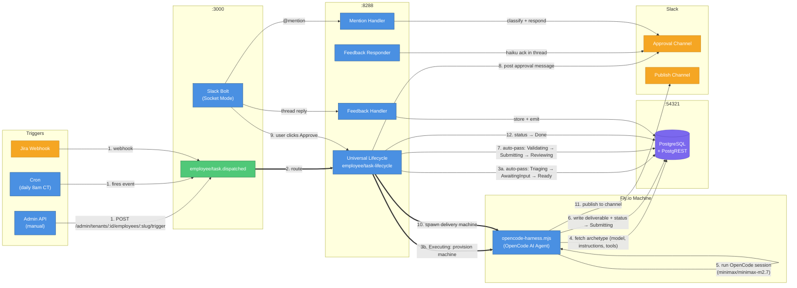

# AI Employee Platform — Current System State

> As of April 17, 2026. After the platform architecture redesign.

---

## How It Works

Every employee — regardless of type — follows the same path: trigger → universal lifecycle → OpenCode worker on Fly.io → human approval → done.



| #   | What happens                                                                                                                                                   |
| --- | -------------------------------------------------------------------------------------------------------------------------------------------------------------- |
| 1   | Task created via admin API, cron, or Jira webhook — fires `employee/task.dispatched`                                                                           |
| 2   | Inngest routes to the **universal lifecycle** (one function for all employees)                                                                                 |
| 3   | States **Triaging → AwaitingInput → Ready** auto-pass instantly (no blocking)                                                                                  |
| 4   | **Executing**: Fly.io machine provisioned, runs `opencode-harness.mjs` — reads archetype (model, natural-language instructions, available shell tools) from DB |
| 5   | OpenCode session runs with `minimax/minimax-m2.7`, using shell tools at `/tools/slack/`                                                                        |
| 6   | Worker writes deliverable + sets task status → `Submitting`                                                                                                    |
| 7   | States **Validating → Submitting → Reviewing** auto-pass; lifecycle waits for human approval                                                                   |
| 8   | Approval message posted to tenant's Slack approval channel with Approve/Reject buttons                                                                         |
| 9   | User clicks Approve — Slack Bolt fires `employee/approval.received`                                                                                            |
| 10  | Lifecycle spawns a **delivery machine** on Fly.io                                                                                                              |
| 11  | Delivery machine publishes the deliverable to the tenant's publish channel                                                                                     |
| 12  | Task → `Done`                                                                                                                                                  |

---

## Universal Lifecycle States

```
Received → Triaging* → AwaitingInput* → Ready → Executing → Validating* → Submitting → Reviewing → Approved → Delivering → Done
```

\* auto-pass (no blocking)

---

## Workers: Only OpenCode Now

Both employees run the same entrypoint — `opencode-harness.mjs`. What changes per employee is the archetype config in the DB.

| What              | Before                                  | Now                                                                        |
| ----------------- | --------------------------------------- | -------------------------------------------------------------------------- |
| Worker entrypoint | `generic-harness.mjs`                   | `opencode-harness.mjs`                                                     |
| Tool access       | TypeScript tool registry (programmatic) | Shell scripts at `/tools/slack/`                                           |
| Instructions      | Ordered `steps: []` JSON array          | Natural language `instructions` field                                      |
| Models            | `anthropic/claude-sonnet-4-6`           | `minimax/minimax-m2.7` (primary) / `anthropic/claude-haiku-4-5` (verifier) |

---

## Feedback Pipeline (New)

Thread replies and @mentions are now captured bidirectionally:

- **Thread reply** on a summary → stored in `feedback` table → `anthropic/claude-haiku-4-5` acknowledges in-thread
- **@mention** to the bot → classified (feedback / teaching / question / task) → responded to in-thread
- **Weekly cron** summarizes feedback patterns for future context injection

---

## Inngest Functions (9 total)

| Function                      | Trigger                       | Purpose                                 |
| ----------------------------- | ----------------------------- | --------------------------------------- |
| `engineering/task-lifecycle`  | `engineering/task.received`   | Engineering coder (deprecated, kept)    |
| `engineering/task-redispatch` | `engineering/task.redispatch` | Engineering retry                       |
| `engineering/watchdog-cron`   | Hourly cron                   | Detect stuck engineering tasks          |
| `employee/task-lifecycle`     | `employee/task.dispatched`    | **Universal lifecycle — all employees** |
| `trigger/daily-summarizer`    | `0 8 * * 1-5`                 | Daily cron trigger                      |
| `employee/feedback-handler`   | `employee/feedback.received`  | Store feedback + emit stored event      |
| `employee/feedback-responder` | `employee/feedback.stored`    | Haiku acknowledgment in Slack thread    |
| `employee/mention-handler`    | `employee/mention.received`   | Classify @mention + respond             |
| `trigger/feedback-summarizer` | Sunday midnight cron          | Weekly feedback digest                  |

---

## Tenant Integrations (Changed)

Slack workspace links are no longer a column on the `tenants` table. They live in `tenant_integrations`:

```
tenant_integrations
├── tenant_id, provider ('slack'), external_id (team_id)
├── config (JSONB — provider-specific settings)
├── status ('active')
└── deleted_at (soft-delete)
```

This makes the platform ready for Jira, GitHub, Linear, and other providers without schema changes.

---

## Quick Start

```bash
# Trigger the summarizer
curl -X POST -H "X-Admin-Key: $ADMIN_API_KEY" \
  http://localhost:3000/admin/tenants/00000000-0000-0000-0000-000000000001/employees/daily-summarizer/trigger

# Check task status
curl -H "X-Admin-Key: $ADMIN_API_KEY" \
  http://localhost:3000/admin/tenants/00000000-0000-0000-0000-000000000001/tasks/<task-id>

# Rebuild worker image after any src/workers/ change
docker build -t ai-employee-worker:latest . && pnpm fly:image
```
