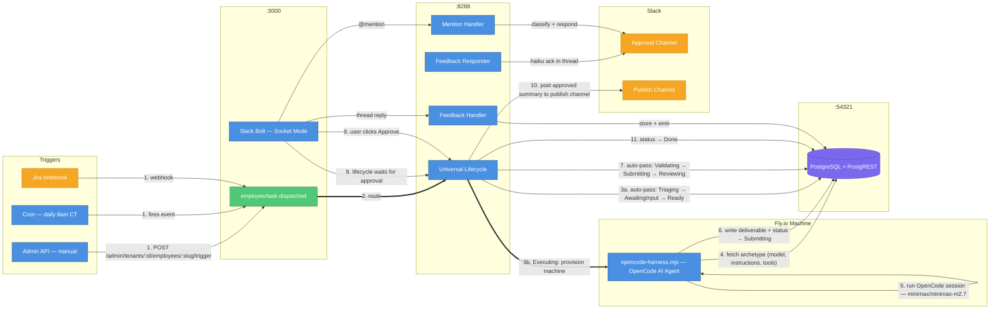
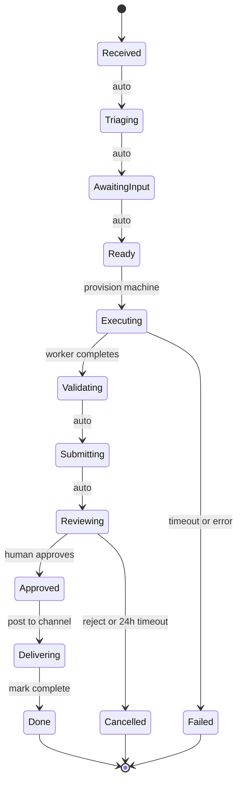
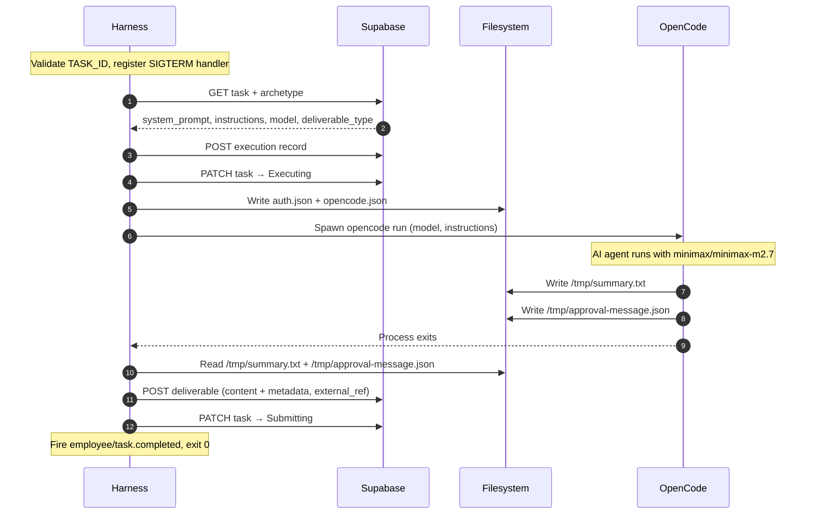
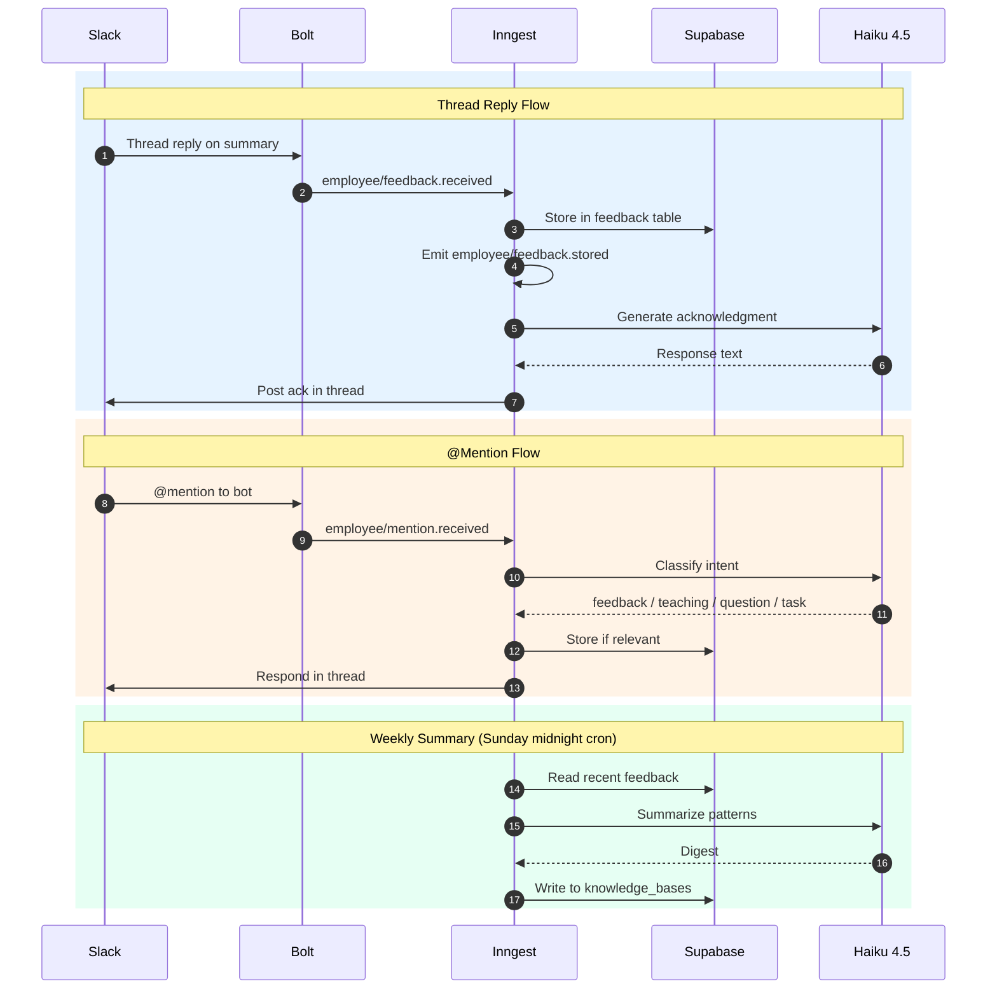

# AI Employee Platform — Current System State

> As of April 20, 2026. After the summarizer end-to-end fix.

---

## How It Works

Every employee follows the same path: trigger → universal lifecycle → OpenCode worker on Fly.io → human approval → done.



| #   | What happens                                                                                                                                                   |
| --- | -------------------------------------------------------------------------------------------------------------------------------------------------------------- |
| 1   | Task created via admin API, cron, or Jira webhook — fires `employee/task.dispatched`                                                                           |
| 2   | Inngest routes to the **universal lifecycle** (one function for all employees)                                                                                 |
| 3   | States **Triaging → AwaitingInput → Ready** auto-pass instantly (no blocking)                                                                                  |
| 4   | **Executing**: Fly.io machine provisioned, runs `opencode-harness.mjs` — reads archetype (model, natural-language instructions, available shell tools) from DB |
| 5   | OpenCode session runs with `minimax/minimax-m2.7`, using shell tools at `/tools/slack/`                                                                        |
| 6   | Worker writes deliverable + sets task status → `Submitting`                                                                                                    |
| 7   | States **Validating → Submitting → Reviewing** auto-pass; lifecycle waits for human approval                                                                   |
| 8   | Lifecycle holds at `Reviewing`, waiting for Slack button click                                                                                                 |
| 9   | User clicks Approve — Slack Bolt fires `employee/approval.received`                                                                                            |
| 10  | Lifecycle posts the approved summary **directly** to the publish channel (no delivery machine spawned)                                                         |
| 11  | Task → `Done`                                                                                                                                                  |

---

## Universal Lifecycle States

```
Received → Triaging* → AwaitingInput* → Ready → Executing → Validating* → Submitting → Reviewing → Approved → Delivering → Done
```

\* auto-pass (no blocking)



Terminal states: `Failed` (machine poll timeout or unhandled error), `Cancelled` (reject action or approval timeout).

Approval gate is controlled per-archetype via `risk_model.approval_required`.

---

## Workers: OpenCode Harness

Both employees run the same entrypoint — `opencode-harness.mjs`. What changes per employee is the archetype config in the DB. The old `generic-harness.mts` has been fully deleted from the codebase.

| What              | Before                                  | Now                                                                        |
| ----------------- | --------------------------------------- | -------------------------------------------------------------------------- |
| Worker entrypoint | `generic-harness.mjs`                   | `opencode-harness.mjs`                                                     |
| Tool access       | TypeScript tool registry (programmatic) | Shell scripts at `/tools/slack/`                                           |
| Instructions      | Ordered `steps: []` JSON array          | Natural language `instructions` field                                      |
| Models            | `anthropic/claude-sonnet-4-6`           | `minimax/minimax-m2.7` (primary) / `anthropic/claude-haiku-4-5` (verifier) |

### Harness Execution Flow



| Step | What the harness does                                                                                   |
| ---- | ------------------------------------------------------------------------------------------------------- |
| 1    | Validate `TASK_ID` env var — fatal if missing                                                           |
| 2    | Register `SIGTERM` handler — PATCHes task to `Failed` on termination                                    |
| 3    | Fetch task + archetype from Supabase (`GET /rest/v1/tasks?id=eq.{TASK_ID}&select=*,archetypes(*)`)      |
| 4    | Extract: `system_prompt`, `instructions`, `model` (default: `minimax/minimax-m2.7`), `deliverable_type` |
| 5    | Optionally prepend `FEEDBACK_CONTEXT` to system prompt                                                  |
| 6    | Create execution record (`POST /rest/v1/executions`)                                                    |
| 7    | PATCH task to `Executing`                                                                               |
| 8    | Write OpenCode auth (`~/.local/share/opencode/auth.json`) + `.opencode/opencode.json` permissions       |
| 9    | Spawn `opencode run` subprocess with model, instructions, and `TASK_ID` appended                        |
| 10   | Wait for OpenCode to complete                                                                           |
| 11   | Read `/tmp/summary.txt` → deliverable content                                                           |
| 12   | Read `/tmp/approval-message.json` → deliverable metadata (`approval_message_ts`, `target_channel`)      |
| 13   | POST deliverable to Supabase (with `external_ref: TASK_ID`)                                             |
| 14   | PATCH task to `Submitting`                                                                              |
| 15   | Fire Inngest event `employee/task.completed`, exit 0                                                    |

**Output contract**: OpenCode MUST write `/tmp/summary.txt` AND `/tmp/approval-message.json`. Absence of either is a hard failure.

### Shell Tools

| Tool                            | Usage                                                                                                                              | Output                                                                                               |
| ------------------------------- | ---------------------------------------------------------------------------------------------------------------------------------- | ---------------------------------------------------------------------------------------------------- |
| `/tools/slack/post-message.js`  | `NODE_NO_WARNINGS=1 node /tools/slack/post-message.js --channel "C123" --text "msg" --task-id "uuid" > /tmp/approval-message.json` | JSON `{"ts":"...","channel":"..."}`. If `--task-id` provided, auto-generates Approve/Reject buttons. |
| `/tools/slack/read-channels.js` | `node /tools/slack/read-channels.js --channels "C123,C456" --lookback-hours 24`                                                    | JSON `{"channels":[...]}`. Reads channel history with thread replies; filters out bot summary posts. |

---

## Feedback Pipeline

Thread replies and @mentions are captured bidirectionally:



| #     | What happens          | Details                                                                     |
| ----- | --------------------- | --------------------------------------------------------------------------- |
| 1–7   | **Thread Reply Flow** | Reply in Slack thread → store in `feedback` → Haiku ack posted in thread    |
| 8–13  | **@Mention Flow**     | @mention → classify intent → store if relevant → respond in thread          |
| 14–17 | **Weekly Summary**    | Cron reads recent feedback → Haiku summarizes → writes to `knowledge_bases` |

---

## Inngest Functions (9 total)

### Active (6)

| Function ID                   | Trigger                              | File                                          | Purpose                                                                            |
| ----------------------------- | ------------------------------------ | --------------------------------------------- | ---------------------------------------------------------------------------------- |
| `employee/task-lifecycle`     | `employee/task.dispatched`           | `src/inngest/employee-lifecycle.ts`           | Universal lifecycle for all employees                                              |
| `trigger/daily-summarizer`    | cron: `0 8 * * 1-5` (Mon-Fri 8am CT) | `src/inngest/triggers/summarizer-trigger.ts`  | Creates daily-summarizer task; deduplicates by `external_id: summary-{YYYY-MM-DD}` |
| `employee/feedback-handler`   | `employee/feedback.received`         | `src/inngest/feedback-handler.ts`             | Ingests thread reply into feedback table, emits `employee/feedback.stored`         |
| `employee/feedback-responder` | `employee/feedback.stored`           | `src/inngest/feedback-responder.ts`           | LLM acknowledgment (`claude-haiku-4-5`) in Slack thread                            |
| `employee/mention-handler`    | `employee/mention.received`          | `src/inngest/mention-handler.ts`              | Classifies @mention intent, stores if relevant                                     |
| `trigger/feedback-summarizer` | cron: `0 0 * * 0` (Sunday midnight)  | `src/inngest/triggers/feedback-summarizer.ts` | Weekly feedback digest → `knowledge_bases`                                         |

### Deprecated (3) — still registered, do not modify

| Function ID                   | Trigger                       | File                        | Purpose                                      |
| ----------------------------- | ----------------------------- | --------------------------- | -------------------------------------------- |
| `engineering/task-lifecycle`  | `engineering/task.received`   | `src/inngest/lifecycle.ts`  | Engineering-only lifecycle (on hold)         |
| `engineering/task-redispatch` | `engineering/task.redispatch` | `src/inngest/redispatch.ts` | Engineering retry (3-attempt max, 8h budget) |
| `engineering/watchdog-cron`   | `*/10 * * * *`                | `src/inngest/watchdog.ts`   | Detect stuck engineering tasks               |

---

## Gateway and Routes

Gateway startup: validates `ENCRYPTION_KEY` + `ADMIN_API_KEY`, initializes Slack Bolt (Socket Mode when `SLACK_APP_TOKEN` is set, HTTP fallback otherwise), registers all routes, listens on `PORT` (default 3000).

### Webhook Routes (no auth)

| Method | Path               | Description                              |
| ------ | ------------------ | ---------------------------------------- |
| `GET`  | `/health`          | Returns `{ status: 'ok' }`               |
| `POST` | `/webhooks/jira`   | Jira issue events, HMAC-SHA256 validated |
| `POST` | `/webhooks/github` | Stub only — not active                   |

### Slack OAuth Routes (no auth)

| Method | Path                         | Description                                 |
| ------ | ---------------------------- | ------------------------------------------- |
| `GET`  | `/slack/install?tenant=uuid` | Initiates OAuth flow with HMAC-signed state |
| `GET`  | `/slack/oauth_callback`      | Completes OAuth, stores encrypted token     |

### Admin Routes (`X-Admin-Key` header required)

| Method   | Path                                         | Description                          |
| -------- | -------------------------------------------- | ------------------------------------ |
| `POST`   | `/admin/projects`                            | Create project                       |
| `GET`    | `/admin/projects`                            | List all projects                    |
| `GET`    | `/admin/projects/:id`                        | Get project                          |
| `PATCH`  | `/admin/projects/:id`                        | Update project                       |
| `DELETE` | `/admin/projects/:id`                        | Delete project (409 if active tasks) |
| `POST`   | `/admin/tenants`                             | Create tenant                        |
| `GET`    | `/admin/tenants`                             | List tenants                         |
| `GET`    | `/admin/tenants/:id`                         | Get tenant                           |
| `PATCH`  | `/admin/tenants/:id`                         | Update tenant                        |
| `DELETE` | `/admin/tenants/:id`                         | Soft-delete tenant                   |
| `POST`   | `/admin/tenants/:id/restore`                 | Restore soft-deleted tenant          |
| `GET`    | `/admin/tenants/:id/secrets`                 | List secret key names (not values)   |
| `PUT`    | `/admin/tenants/:id/secrets/:key`            | Set/overwrite secret (encrypted)     |
| `DELETE` | `/admin/tenants/:id/secrets/:key`            | Delete secret                        |
| `GET`    | `/admin/tenants/:id/config`                  | Get tenant config                    |
| `PATCH`  | `/admin/tenants/:id/config`                  | Deep-merge update tenant config      |
| `POST`   | `/admin/tenants/:id/employees/:slug/trigger` | Manually trigger employee            |
| `GET`    | `/admin/tenants/:id/tasks/:taskId`           | Get task status (tenant-scoped)      |

### Inngest

| Method         | Path           | Description                |
| -------------- | -------------- | -------------------------- |
| `POST/GET/PUT` | `/api/inngest` | Inngest SDK serve endpoint |

### Slack Bolt Handlers (Socket Mode)

- **Events**: `message` (thread replies → feedback handler), `app_mention` (→ mention handler)
- **Actions**: `approve` (fires `employee/approval.received`), `reject` (fires same with `action: 'reject'`)
- **Idempotency**: checks task status === `'Reviewing'` before firing; dedupes by Inngest ID `employee-approval-{taskId}`

---

## Tenant Configuration

Three tenants are seeded. Each requires its own Slack OAuth connection to operate.

| Field                | Platform                       | DozalDevs                                     | VLRE                           |
| -------------------- | ------------------------------ | --------------------------------------------- | ------------------------------ |
| ID                   | `...000000000001`              | `...000000000002`                             | `...000000000003`              |
| Slug                 | `platform`                     | `dozaldevs`                                   | `vlre`                         |
| Slack Workspace      | — (none)                       | `T0601SMSVEU` (Dozal Inc.)                    | `T06KFDGLHS6`                  |
| Archetype ID         | `...0011`                      | `...0012`                                     | `...0013`                      |
| Read Channels        | env: `DAILY_SUMMARY_CHANNELS`  | `C092BJ04HUG` (`#project-lighthouse`)         | env: `DAILY_SUMMARY_CHANNELS`  |
| Approval Channel     | env: `SUMMARY_TARGET_CHANNEL`  | `C0AUBMXKVNU` (`#victor-tests`)               | env: `SUMMARY_TARGET_CHANNEL`  |
| Publish Channel      | env: `SUMMARY_PUBLISH_CHANNEL` | `C092BJ04HUG` (`#project-lighthouse`)         | env: `SUMMARY_PUBLISH_CHANNEL` |
| Instructions Pattern | Generic (env vars)             | Hardcoded channel IDs + mandatory file output | Generic (env vars)             |

DozalDevs archetype instructions hardcode channel IDs and require the worker to write `/tmp/summary.txt` and `/tmp/approval-message.json` with the `NODE_NO_WARNINGS=1` prefix on the post-message call.

All three archetypes share the same Papi Chulo system prompt (dramatic Spanish TV news correspondent persona), model (`minimax/minimax-m2.7`), runtime (`opencode`), and risk model (`approval_required: true`, `timeout_hours: 24`).

---

## Database Schema

16 models across 3 groups. 17 migrations total.

### Group A: MVP-Active (7 tables)

| Table             | Key Columns                                                                  | Purpose                              |
| ----------------- | ---------------------------------------------------------------------------- | ------------------------------------ |
| `tasks`           | `id`, `archetype_id`, `status`, `tenant_id`, `external_id`, `source_system`  | Core work unit                       |
| `executions`      | `id`, `task_id`, `runtime_type`, `status`, `heartbeat_at`, `wave_state`      | Worker run record                    |
| `deliverables`    | `id`, `execution_id`, `delivery_type`, `external_ref`, `content`, `metadata` | Output produced by execution         |
| `validation_runs` | `id`, `execution_id`, `stage`, `status`, `error_output`                      | Per-execution validation attempts    |
| `projects`        | `id`, `name`, `repo_url`, `jira_project_key`, `tenant_id`                    | Registered repos                     |
| `feedback`        | `id`, `task_id`, `feedback_type`, `tenant_id`                                | Human corrections to agent decisions |
| `task_status_log` | `id`, `task_id`, `from_status`, `to_status`, `actor`                         | Immutable audit trail                |

### Group B: Config and Versioning (active but not queried at scale)

| Table             | Key Columns                                                                         | Purpose                                   |
| ----------------- | ----------------------------------------------------------------------------------- | ----------------------------------------- |
| `archetypes`      | `id`, `role_name`, `tenant_id`, `system_prompt`, `instructions`, `model`, `runtime` | Employee type definitions (config-driven) |
| `departments`     | `id`, `name`, `tenant_id`                                                           | Org unit grouping                         |
| `agent_versions`  | `id`, `archetype_id`, `model_id`, `prompt_hash`, `is_active`                        | Versioned snapshots of archetype config   |
| `knowledge_bases` | `id`, `archetype_id`, `source_config`, `tenant_id`                                  | Feedback-derived knowledge (pgvector)     |

### Group D: Forward-Compatibility (schema-ready, not yet active)

`risk_models`, `cross_dept_triggers`, `clarifications`, `reviews`, `audit_log`

### Group C: Multi-Tenancy (3 tables)

| Table                 | Key Columns                                              | Purpose                                    |
| --------------------- | -------------------------------------------------------- | ------------------------------------------ |
| `tenants`             | `id`, `name`, `slug`, `config`, `status`, `deleted_at`   | Tenant registry                            |
| `tenant_integrations` | `id`, `tenant_id`, `provider`, `external_id`, `status`   | External service connections (Slack OAuth) |
| `tenant_secrets`      | `id`, `tenant_id`, `key`, `ciphertext`, `iv`, `auth_tag` | Encrypted per-tenant credentials           |

### Key Constraints

- `tasks`: unique `(external_id, source_system, tenant_id)` — prevents duplicate task creation
- `archetypes`: unique `(tenant_id, role_name)` — one archetype per role per tenant
- `tenant_integrations`: unique `(tenant_id, provider)` — one per provider per tenant
- `tenant_secrets`: unique `(tenant_id, key)`

---

## Approved LLM Models

| Model            | ID                           | Purpose                                                                                     |
| ---------------- | ---------------------------- | ------------------------------------------------------------------------------------------- |
| MiniMax M2.7     | `minimax/minimax-m2.7`       | Primary execution — all employee work, code generation, summaries                           |
| Claude Haiku 4.5 | `anthropic/claude-haiku-4-5` | Verification/judge only — plan verification, intent classification, feedback acknowledgment |

**Forbidden**: `anthropic/claude-sonnet-*`, `anthropic/claude-opus-*`, `openai/gpt-4o`, `openai/gpt-4o-mini`, or any other model not listed above. This applies to production code, seed data, default fallbacks, environment variable examples, and test fixtures.

---

## Docker and Deployment

### Docker Compose Services (6)

| Service  | Image                            | Host Port           | Purpose                           |
| -------- | -------------------------------- | ------------------- | --------------------------------- |
| `studio` | `supabase/studio:2026.03.16`     | 54323               | Supabase Dashboard UI             |
| `kong`   | `kong/kong:3.9.1`                | 54321               | API Gateway (routes to auth/rest) |
| `auth`   | `supabase/gotrue:v2.186.0`       | internal            | Authentication (GoTrue)           |
| `rest`   | `postgrest/postgrest:v14.6`      | internal (via Kong) | REST API over PostgreSQL          |
| `meta`   | `supabase/postgres-meta:v0.95.2` | internal            | Postgres metadata (for Studio)    |
| `db`     | `supabase/postgres:17.6.1`       | 54322               | PostgreSQL 17                     |

Database name: `ai_employee` (not `postgres` — Docker Compose uses `POSTGRES_DB=ai_employee`).

### Dockerfile

Two-stage build (`node:20-slim`). Builder stage: `pnpm install` → `prisma generate` → `tsc` → prod install. Runtime stage installs: `git`, `curl`, `bash`, `jq`, `gh` CLI v2.45.0, `opencode-ai@1.3.3` (global).

Default CMD: `bash entrypoint.sh` (engineering worker). Summarizer overrides this at dispatch.

### Deployment Commands

```bash
# Rebuild after any src/workers/ change
docker build -t ai-employee-worker:latest .

# Push to Fly.io registry
pnpm fly:image

# Fly.io CMD for summarizer
["node", "/app/dist/workers/opencode-harness.mjs"]

# Fly.io CMD for engineering (default Dockerfile CMD)
["bash", "entrypoint.sh"]
```

---

## Quick Start

```bash
# Trigger the DozalDevs summarizer
curl -X POST -H "X-Admin-Key: $ADMIN_API_KEY" \
  "http://localhost:3000/admin/tenants/00000000-0000-0000-0000-000000000002/employees/daily-summarizer/trigger"

# Check task status
curl -H "X-Admin-Key: $ADMIN_API_KEY" \
  "http://localhost:3000/admin/tenants/00000000-0000-0000-0000-000000000002/tasks/<task-id>"

# Manual approval (fallback when Slack button doesn't reach gateway)
curl -X POST "http://localhost:8288/e/local" \
  -H "Content-Type: application/json" \
  -d '{"name":"employee/approval.received","data":{"taskId":"<TASK_ID>","action":"approve","userName":"Victor"}}'

# Rebuild worker image after any src/workers/ change
docker build -t ai-employee-worker:latest . && pnpm fly:image
```

---

## Shared Libraries (`src/lib/`)

| File               | Purpose                                                                                                   |
| ------------------ | --------------------------------------------------------------------------------------------------------- |
| `fly-client.ts`    | Fly.io Machines API — create/destroy/query VMs, retries on 429                                            |
| `github-client.ts` | GitHub REST API — create/list/get PRs                                                                     |
| `slack-client.ts`  | Slack Web API — `postMessage`, `updateMessage`                                                            |
| `jira-client.ts`   | Jira Cloud REST API v3 — `getIssue`, `addComment`, `transitionIssue`                                      |
| `call-llm.ts`      | OpenRouter LLM caller — enforces approved models, cost circuit breaker ($50/day default)                  |
| `logger.ts`        | Pino structured logger — auto-redacts secrets                                                             |
| `retry.ts`         | Exponential backoff — 3 attempts, 1s base delay                                                           |
| `errors.ts`        | Custom errors: `LLMTimeoutError`, `CostCircuitBreakerError`, `RateLimitExceededError`, `ExternalApiError` |
| `encryption.ts`    | AES-256-GCM encrypt/decrypt for tenant secrets                                                            |
| `tunnel-client.ts` | Cloudflare tunnel URL resolver for hybrid mode                                                            |
| `repo-url.ts`      | GitHub repo URL parser                                                                                    |
| `agent-version.ts` | Agent version hash (SHA-256 of prompt + model + tools) and upsert                                         |

---

## Scripts

| Script                    | Command                          | Purpose                                                        |
| ------------------------- | -------------------------------- | -------------------------------------------------------------- |
| `setup.ts`                | `pnpm setup`                     | One-time setup: Docker Compose, migrations, seed, Docker image |
| `dev-start.ts`            | `pnpm dev:start`                 | Start all services with health checks                          |
| `trigger-task.ts`         | `pnpm trigger-task`              | Send mock Jira webhook, monitor execution                      |
| `verify-e2e.ts`           | `pnpm verify:e2e --task-id uuid` | 12-point E2E verification                                      |
| `register-project.ts`     | `pnpm register-project`          | Interactive project registration wizard                        |
| `setup-two-tenants.ts`    | `pnpm setup:two-tenants`         | Migrate legacy `SLACK_BOT_TOKEN` to per-tenant secrets         |
| `fly-setup.ts`            | `pnpm fly:setup`                 | Create Fly.io app (idempotent)                                 |
| `verify-supabase.ts`      | —                                | Verify Docker Compose stack health                             |
| `verify-multi-tenancy.ts` | `pnpm verify:multi-tenancy`      | Verify per-tenant Slack tokens and config                      |

---

## Project Structure

```
src/
├── gateway/          # Express HTTP server + Slack Bolt
│   ├── routes/       # All HTTP route handlers (10 files)
│   ├── slack/        # Bolt event/action handlers + OAuth installation store
│   ├── middleware/   # Admin auth middleware
│   ├── validation/   # Zod schemas + HMAC signature verification
│   ├── services/     # Tenant env loader
│   └── inngest/      # Inngest client factory + serve registration
├── inngest/          # Durable workflow functions
│   ├── triggers/     # Cron trigger functions (daily-summarizer, feedback-summarizer)
│   └── lib/          # Shared: create-task-and-dispatch helper
├── workers/          # Docker container code — runs on Fly.io
│   ├── lib/          # 30 worker utilities (session mgr, wave executor, PR manager, etc.)
│   └── config/       # OpenCode permission config
├── worker-tools/     # Shell tools compiled into Docker image
│   └── slack/        # post-message.ts, read-channels.ts
└── lib/              # Shared: fly-client, slack-client, github-client, logger, etc.
prisma/               # Schema (16 tables), 17 migrations, seed
scripts/              # TypeScript scripts run via tsx
docker/               # Supabase self-hosted Docker Compose
docs/                 # Architecture docs
tests/                # 102 test files (Vitest)
```
