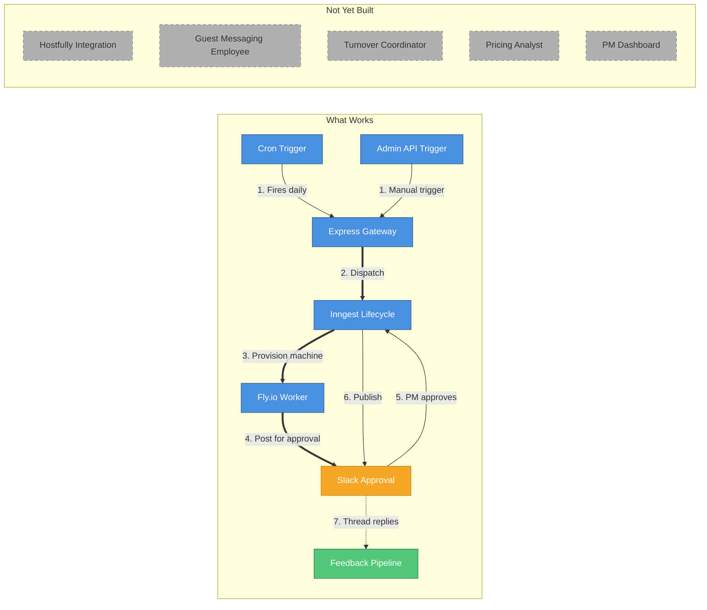
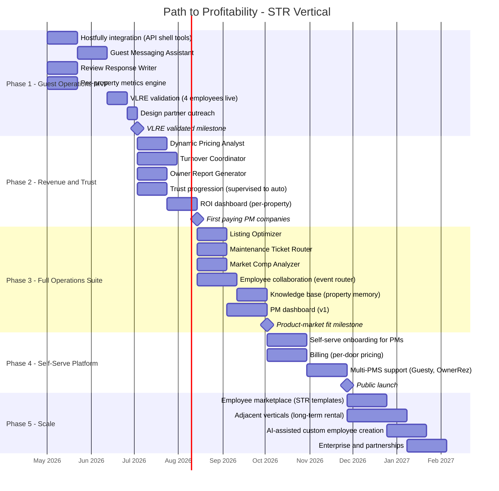
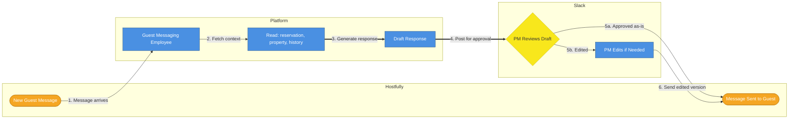
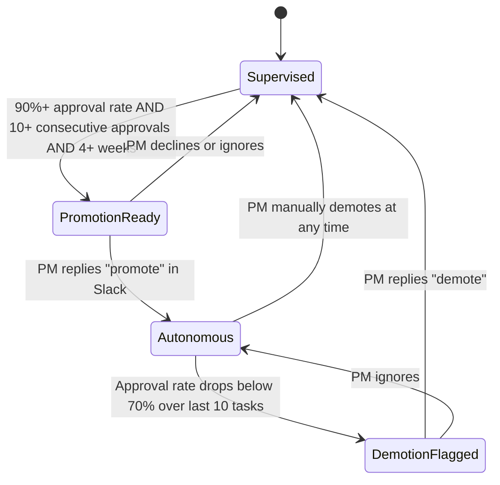
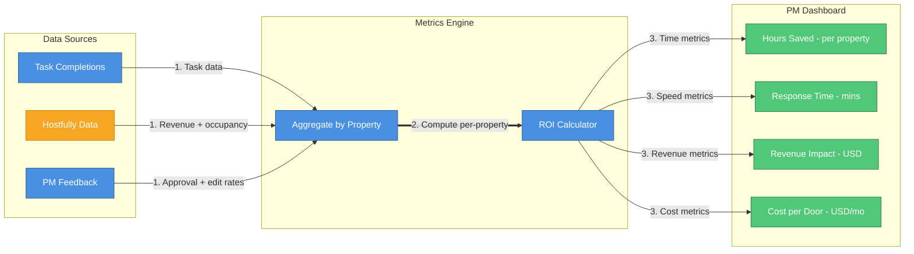
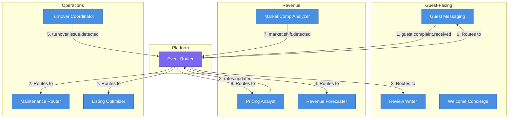
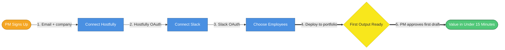
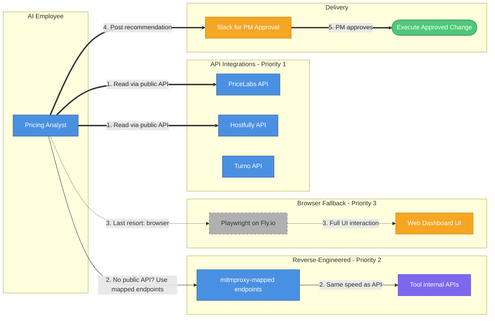

# AI Employee Platform — Product Roadmap

## Short-Term Rental Property Management

> **Purpose**: Strategic roadmap to unblock sales and drive the platform to profitability, starting with the short-term rental (STR) property management vertical.
>
> **Last updated**: April 21, 2026

---

## Executive Summary

The AI Employee Platform deploys autonomous AI agents — "digital employees" — each with a single job. Every employee follows the same lifecycle, uses the same infrastructure, and is controlled through the same approval mechanism. What changes per employee is the config.

**The vertical**: Short-term rental property management. Property managers drown in repetitive, high-volume work — guest messaging, turnover coordination, pricing adjustments, review responses, owner reporting. Each of these is a single-responsibility job. Each becomes an AI employee.

**The pitch**: Hire an AI operations team for your rental portfolio. These aren't chatbots or rule-based automations — they are AI employees that outperform your best human operators. Faster response times, perfect consistency, zero fatigue, and they improve from every interaction. Each one starts supervised — you approve every guest message, every pricing change, every owner report before it goes out. As they prove themselves, you promote them to work autonomously. They use the tools you already pay for (PriceLabs, Turno, Hostfully) better than any human could — across your entire portfolio, simultaneously.

**The unfair advantage**: We own VLRE, a short-term rental management company with 31-100 units on Hostfully. Everything we build, we validate on our own portfolio first. Customers don't get a demo — they get our actual production numbers.

**Current state**: One production employee (Slack Daily Summarizer) running across two tenants, including VLRE. Universal lifecycle, multi-tenancy, feedback pipeline, and human approval flow are working end-to-end.

**What this roadmap delivers**: A path from proof-of-concept to a sellable STR operations platform with 10+ pre-built employees, per-property ROI dashboards, and self-serve onboarding — organized into five phases over ~24 weeks.

### Three Strategic Pillars

| Pillar                       | What it means for PMs                                                         | Why it sells                                               |
| ---------------------------- | ----------------------------------------------------------------------------- | ---------------------------------------------------------- |
| **Extensibility**            | New employee types added in hours, not weeks — custom workflows per portfolio | PMs have unique processes; the platform adapts to them     |
| **Metrics & ROI**            | Time saved per property, guest response time, revenue impact — all tracked    | PMs justify the spend at $X/door; owners see the ROI       |
| **Property Manager Control** | Every guest message, price change, and report is approved before it goes live | PMs cannot afford a bad guest experience — trust is earned |

---

## The VLRE Advantage: Customer Zero

Most platforms launch with customers they've never met. We launch with our own portfolio.

| Advantage                | What it means                                                                     |
| ------------------------ | --------------------------------------------------------------------------------- |
| **Real pain points**     | We know exactly which tasks eat PM hours — we do them daily                       |
| **Immediate validation** | Every employee is tested on live guests, real turnovers, actual pricing decisions |
| **Honest metrics**       | ROI numbers come from our own P&L, not projections                                |
| **Hostfully expertise**  | We know the PMS API, its limitations, and the workarounds from operating on it    |
| **Sales credibility**    | "We manage 50+ units with this platform" beats any demo                           |
| **Fast iteration**       | Bug found at 9am, fixed by lunch, validated on tonight's check-in                 |

**The sales motion**: Validate on VLRE → package the results → sell to PM companies who feel the same pain.

Every phase in this roadmap has a VLRE validation gate before it goes to market.

---

## Market Opportunity

### The Pain: Property Management is Drowning in Repetitive Work

A PM with 50 units handles approximately:

| Task                                                     | Volume                   | Time per occurrence | Monthly hours  | Annual cost at $25/hr |
| -------------------------------------------------------- | ------------------------ | ------------------- | -------------- | --------------------- |
| Guest messages (inquiries, check-in/out, issues)         | ~300 msgs/mo             | 5 min avg           | 25 hrs         | $7,500                |
| Turnover coordination (cleaning, inspection, restocking) | ~200 turnovers/mo        | 20 min avg          | 67 hrs         | $20,000               |
| Pricing adjustments (daily rate optimization)            | ~1,500 rate decisions/mo | 2 min avg           | 50 hrs         | $15,000               |
| Review responses                                         | ~80 reviews/mo           | 10 min avg          | 13 hrs         | $4,000                |
| Owner reporting                                          | ~50 reports/mo           | 30 min avg          | 25 hrs         | $7,500                |
| Daily operations summary                                 | 22 summaries/mo          | 30 min avg          | 11 hrs         | $3,300                |
| **Total**                                                |                          |                     | **191 hrs/mo** | **$57,300/yr**        |

That's more than a full-time employee's worth of repetitive work — per 50-unit portfolio. Most PMs either over-hire (expensive, high turnover, inconsistent quality) or grind through it themselves until they burn out. The work isn't hard — it's relentless. And it's exactly the kind of work AI employees are already better at than humans: high-volume, context-dependent, cross-referencing multiple data sources in real time.

### The Market

| Segment        | Size (US)      | Portfolio    | Current spend on automation     | Our opportunity                    |
| -------------- | -------------- | ------------ | ------------------------------- | ---------------------------------- |
| Solo hosts     | ~1M hosts      | 1-5 units    | $0-50/mo (basic tools)          | Self-serve tier, high volume       |
| Small PMs      | ~50K companies | 5-30 units   | $50-300/mo (PMS + pricing tool) | Entry point, grow with them        |
| Mid-market PMs | ~10K companies | 30-200 units | $300-2,000/mo (PMS + stack)     | Primary target, highest ROI        |
| Enterprise PMs | ~1K companies  | 200+ units   | $2,000-20,000/mo                | Enterprise deals, custom employees |

**Beachhead**: Mid-market PMs (30-200 units) already paying for Hostfully/Guesty + PriceLabs/Wheelhouse + Turno/Breezeway. They're spending $500-2,000/mo on 4-5 point solutions that don't talk to each other — and still drowning in the manual work of _operating_ those tools across 50+ properties. We add the AI team that operates their existing tool stack intelligently, at scale, 24/7.

---

## Where We Are Today

One employee is live. The infrastructure is proven. The architecture is designed for multi-employee, multi-tenant scale.



| #   | What happens      | Details                                                             |
| --- | ----------------- | ------------------------------------------------------------------- |
| 1   | Trigger fires     | Cron (daily) or manual API call creates a task                      |
| 2   | Dispatch          | Gateway validates, creates task row, fires Inngest event            |
| 3   | Provision machine | Lifecycle provisions Fly.io VM, runs OpenCode with archetype config |
| 4   | Post for approval | Worker completes task, posts result with Approve/Reject buttons     |
| 5   | PM approves       | Property manager clicks Approve in Slack                            |
| 6   | Publish           | Lifecycle delivers the approved output                              |
| 7   | Feedback captured | Thread replies stored, acknowledged, summarized weekly              |

### What's Built vs. What's Needed for STR

| Component                        | Status        | STR Impact                                      |
| -------------------------------- | ------------- | ----------------------------------------------- |
| Universal lifecycle (all states) | Built         | Can run any STR employee type                   |
| Multi-tenancy (DB + API)         | Built         | Can onboard multiple PM companies               |
| Slack approval flow              | Built         | PMs approve outputs before delivery             |
| Feedback pipeline                | Built         | Employees learn PM preferences                  |
| Per-tenant secrets and OAuth     | Built         | Secure PMS credential isolation                 |
| Admin API (18 routes)            | Built         | Programmatic employee management                |
| Hostfully integration            | **Not built** | Cannot read reservations or send guest messages |
| Guest messaging employee         | **Not built** | #1 pain point unaddressed                       |
| Turnover coordination employee   | **Not built** | #2 pain point unaddressed                       |
| Pricing analyst employee         | **Not built** | #3 pain point unaddressed                       |
| Per-property metrics and ROI     | **Not built** | Cannot demonstrate value per door               |
| PM dashboard                     | **Not built** | No visual control surface                       |

---

## Roadmap Overview



---

## Phase 1: Guest Operations MVP (Weeks 1-8)

> **Goal**: Four employees running on VLRE's portfolio. Validate that AI employees handle the #1 pain point — guest communication — with PM-acceptable quality. Sign 3-5 design partners.

### 1.1 Hostfully Integration

The foundation. Every STR employee needs access to reservation data, guest profiles, and messaging.

**Shell tools to build** (`src/worker-tools/hostfully/`):

| Tool                  | What it does                                                              | Used by                                              |
| --------------------- | ------------------------------------------------------------------------- | ---------------------------------------------------- |
| `get-reservations.js` | Fetch upcoming/active/past reservations with guest details                | Guest Messaging, Turnover Coordinator, Owner Reports |
| `get-property.js`     | Fetch property details (address, amenities, rules, check-in instructions) | Guest Messaging, Listing Optimizer                   |
| `send-message.js`     | Send a message to a guest via Hostfully's unified inbox                   | Guest Messaging (after PM approval)                  |
| `get-calendar.js`     | Fetch availability calendar and pricing                                   | Pricing Analyst, Turnover Coordinator                |
| `get-reviews.js`      | Fetch reviews from connected channels (Airbnb, VRBO)                      | Review Response Writer                               |

**Implementation**: Same pattern as existing Slack tools — thin Node.js scripts under `src/worker-tools/hostfully/`, compiled into the Docker image at `/tools/hostfully/`. Each script reads Hostfully API credentials from environment variables (injected per-tenant via `loadTenantEnv`).

### 1.2 Guest Messaging Assistant

The flagship employee. Handles the highest-volume, most time-sensitive task in STR operations.

**What it does**:

- Runs on a schedule (every 30 min) or triggered by new message webhook
- Reads unresponded guest messages from Hostfully
- Cross-references reservation details, property info, and check-in/out times
- Drafts contextual responses matching the PM's voice and tone
- Posts drafts to Slack for PM approval before sending

**The supervised flow is critical here**: A bad guest message can tank a review, trigger a refund request, or lose a booking. Every message is approved by the PM until the employee earns trust.



| #     | What happens      | Details                                                                                              |
| ----- | ----------------- | ---------------------------------------------------------------------------------------------------- |
| 1     | Message arrives   | Guest sends a message via Airbnb/VRBO — Hostfully aggregates it                                      |
| 2     | Fetch context     | Employee reads reservation dates, property rules, check-in instructions, past conversation history   |
| 3     | Generate response | LLM drafts a response in the PM's established voice and tone — warm, professional, property-specific |
| 4     | Post for approval | Draft appears in Slack with guest name, property, and one-click Approve/Edit/Reject                  |
| 5a/5b | PM decides        | Approve sends as-is; Edit opens a text field for adjustments; Reject discards                        |
| 6     | Sent              | Approved or edited response delivered to guest via Hostfully API                                     |

**Metrics tracked**: Response time (time from guest message to response sent), approval rate, edit rate (how often PM modifies the draft), guest satisfaction correlation.

**VLRE validation target**: 80% of routine messages (check-in instructions, WiFi questions, checkout reminders) approved without edits within 2 weeks.

### 1.3 Review Response Writer

Lower volume, lower risk, high visibility. Responding to every review is table stakes for STR — most PMs skip it because it's tedious.

**What it does**:

- Runs daily — checks for new reviews across all properties
- Reads the review text, rating, reservation history, and any notes about the stay
- Drafts a personalized response (grateful for 5-star, empathetic + corrective for negative)
- Posts to Slack for PM approval
- After approval, posts the response to the OTA platform via Hostfully

**Why this employee is a great early win**: Review responses are lower-risk than guest messaging (not time-sensitive, no booking at stake), but highly visible. A PM who sees every review responded to within 24 hours — with zero effort on their part — immediately understands the platform's value.

### 1.4 Per-Property Metrics Engine

PMs think in properties and doors, not tasks. The metrics engine must reflect this.

**Metrics per property, per employee, per tenant**:

| Metric                            | How it's computed                                            | Why PMs care                                              |
| --------------------------------- | ------------------------------------------------------------ | --------------------------------------------------------- |
| **Time saved per property/month** | Tasks completed for this property x estimated manual minutes | "This property costs me 0 hours now"                      |
| **Guest response time**           | Time from guest message to response sent                     | Faster responses = better reviews = more bookings         |
| **Review response rate**          | Reviews responded to / total reviews received                | 100% response rate boosts listing visibility              |
| **Approval rate**                 | Tasks approved without edits / total tasks reviewed          | Tracks how well the employee matches PM expectations      |
| **Cost per property/month**       | LLM + compute costs allocated by property                    | Transparency — "It costs $0.36/mo per door for messaging" |
| **Edit rate**                     | How often PM modifies a draft before approving               | Decreasing edit rate = employee is learning               |

**Exposed via**: `GET /admin/tenants/:tenantId/metrics?property_id=X&employee=guest-messaging&period=30d`

### 1.5 What Phase 1 Unlocks

After Phase 1, VLRE has four employees running on its portfolio:

1. **Daily Operations Summarizer** (already live)
2. **Guest Messaging Assistant** (new)
3. **Review Response Writer** (new)
4. **Plus**: Hostfully integration enables every future employee

**The sales conversation**:

> "We run 50+ units on Hostfully — same as you. Here's what happened in the first month: our Guest Messaging employee handled 280 messages with a 92% approval-without-edit rate. Average response time dropped from 47 minutes to 3 minutes. That's 23 hours of our team's time back. And every single message was approved by our PM before it went to the guest. Want to see it work on your portfolio?"

**Design partner criteria**: PM companies on Hostfully with 20-100 units, using Slack, feeling the pain of guest communication volume.

---

## Phase 2: Revenue & Trust Engine (Weeks 9-16)

> **Goal**: Address pain points #2 and #3 (turnover coordination and pricing). Build the trust progression system. Convert design partners to paying customers by showing ROI per door.

### 2.1 Dynamic Pricing Analyst

**What it does**:

- Runs daily (or on-demand) for each property
- Reads rate recommendations from PriceLabs (the PM's existing pricing tool)
- Cross-references with Hostfully calendar (availability, booking velocity, upcoming turnovers)
- Synthesizes a pricing decision with reasoning ("Memorial Day weekend: PriceLabs recommends +30%, but Unit 12 has a same-day turnover — recommending +25% with late check-in buffer")
- Posts recommendations to Slack for PM approval
- On approval, updates rates in Hostfully via API

**Why supervised mode is essential**: Pricing directly impacts revenue. A 10% pricing mistake on a 50-unit portfolio over a weekend could cost thousands. PMs need to approve every adjustment until the employee proves it understands their market.

**Metrics tracked**: Revenue per available night (RevPAN) before/after, occupancy rate impact, rate change acceptance rate.

### 2.2 Turnover Coordinator

**What it does**:

- Monitors upcoming checkouts from Hostfully reservations
- Automatically generates and assigns cleaning tasks based on property-specific checklists
- Coordinates with cleaning teams via Slack or integrated messaging
- Tracks completion and flags issues ("Cleaner hasn't confirmed for Unit 12, check-in is in 4 hours")
- Posts daily turnover summary to PM

**Integration**: Operates the PM's existing cleaning management tools — Turno API for cleaner dispatch and job tracking (Phase 2), Breezeway API for inspection tasks (Phase 3+). Initially, coordination happens through Slack channels where cleaning teams already communicate. As tool integrations come online, the employee reads from and writes to these tools directly, just like a human operator would — except across all properties simultaneously.

### 2.3 Owner Report Generator

**What it does**:

- Runs monthly (or on-demand) per property owner
- Pulls revenue, expenses, occupancy, and maintenance data from Hostfully
- Generates a professional owner statement with P&L, YoY comparison, and market context
- Includes upcoming bookings forecast and maintenance recommendations
- Posts to Slack for PM approval before sending to owner

**Why PMs love this**: Owner reports are the #1 thing PMs procrastinate on. They take 30 minutes per owner, they're repetitive, and owners complain if they're late. An AI employee that generates a draft report the PM can approve in 60 seconds is an instant win.

### 2.4 Trust Progression: Supervised to Autonomous

Every employee starts supervised. The platform tracks performance and recommends promotion when thresholds are met. The PM always makes the final call.



**Per-employee trust thresholds** (configurable):

| Employee                     | Confidence threshold | Rationale                                   |
| ---------------------------- | -------------------- | ------------------------------------------- |
| Guest Messaging (routine)    | 0.7                  | Check-in instructions, WiFi info — low risk |
| Guest Messaging (complaints) | 0.95                 | Guest complaints always escalate to PM      |
| Review Response (positive)   | 0.6                  | Thank-you responses are low risk            |
| Review Response (negative)   | 0.9                  | Negative review responses need PM voice     |
| Pricing Analyst              | 0.85                 | Direct revenue impact                       |
| Turnover Coordinator         | 0.7                  | Scheduling is mostly procedural             |
| Owner Report                 | 0.8                  | Financial accuracy matters                  |

**The key insight**: Trust isn't binary per employee. A Guest Messaging employee might be autonomous for checkout reminders but supervised for complaint responses. Confidence scoring enables this granularity.

### 2.5 ROI Dashboard (Per-Property)

The metrics engine feeds into a PM-facing view that shows value per door:



| #   | What happens             | Details                                                                                                                                         |
| --- | ------------------------ | ----------------------------------------------------------------------------------------------------------------------------------------------- |
| 1   | Data collection          | Task completions (which property, which employee, duration), Hostfully revenue and occupancy data, PM approval/edit rates                       |
| 2   | Per-property computation | Aggregate time saved, cost, response times, and revenue changes — broken down per door                                                          |
| 3   | Dashboard metrics        | Four headline numbers: hours saved per property, average guest response time, revenue impact from pricing changes, total platform cost per door |

**The ROI formula for STR**:

```
Monthly Value per Door = Time Saved (hrs) x PM Hourly Rate
                       + Revenue Uplift from Pricing (est.)
                       + Review Response Value (booking conversion)
                       - Platform Cost per Door
```

**VLRE example** (50 units, conservative estimates):

| Employee             | Monthly value (50 units)         | Platform cost | ROI       |
| -------------------- | -------------------------------- | ------------- | --------- |
| Guest Messaging      | $1,250 (25 hrs saved x $50/hr)   | $18           | 69:1      |
| Review Responses     | $325 (6.5 hrs saved x $50/hr)    | $8            | 41:1      |
| Pricing Analyst      | $2,500 (est. 2% RevPAN uplift)   | $12           | 208:1     |
| Turnover Coordinator | $1,675 (33.5 hrs saved x $50/hr) | $15           | 112:1     |
| Owner Reports        | $625 (12.5 hrs saved x $50/hr)   | $7            | 89:1      |
| **Total**            | **$6,375/mo**                    | **$60/mo**    | **106:1** |

### 2.6 What Phase 2 Unlocks

> "Here's our VLRE dashboard. 50 properties, 7 AI employees. Last month: 77 hours saved, average guest response time under 4 minutes, 2.3% revenue uplift from pricing optimization, 100% review response rate. Total platform cost: $60. That's $1.20 per door per month — and unlike a human team member, every one of these employees works 24/7, across all 50 properties simultaneously, and gets better every week. Want to run a pilot on 10 of your properties?"

---

## Phase 3: Full Operations Suite (Weeks 17-26)

> **Goal**: Complete STR employee catalog. Enable employee-to-employee collaboration. Build the PM dashboard. Achieve product-market fit.

### 3.1 Employee Catalog Expansion

| Employee                      | Trigger             | What it does                                                                  | Pain it solves                           |
| ----------------------------- | ------------------- | ----------------------------------------------------------------------------- | ---------------------------------------- |
| **Listing Optimizer**         | Cron (weekly)       | Analyzes listing performance, suggests title/description/photo improvements   | Stale listings underperform              |
| **Maintenance Ticket Router** | Webhook / manual    | Triages maintenance requests, dispatches to correct vendor, tracks resolution | Maintenance falls through the cracks     |
| **Market Comp Analyzer**      | Cron (weekly)       | Compares portfolio performance to nearby comps, identifies opportunities      | PMs fly blind on market positioning      |
| **Guest Welcome Concierge**   | Event (new booking) | Sends personalized pre-arrival guide with local recommendations               | Generic check-in emails feel impersonal  |
| **Compliance Monitor**        | Cron (monthly)      | Tracks local STR regulation changes, permit renewals, tax deadlines           | Compliance violations are expensive      |
| **Revenue Forecaster**        | Cron (weekly)       | Projects next 30/60/90 day revenue based on bookings and market trends        | PMs need forward-looking data for owners |

### 3.2 Employee Collaboration: The STR Operations Team

This is what separates the platform from a collection of bots. Employees trigger each other through events, creating intelligent workflows.



| #   | What happens             | Details                                                                                                      |
| --- | ------------------------ | ------------------------------------------------------------------------------------------------------------ |
| 1   | Guest complaint received | Guest Messaging detects a complaint (AC broken, dirty unit) and emits `guest.complaint.received`             |
| 2   | Auto-routed              | Maintenance Router creates a vendor ticket; Review Writer flags property for proactive follow-up             |
| 3   | Rates updated            | Pricing Analyst adjusts rates based on demand signals, emits `rates.updated`                                 |
| 4   | Downstream updates       | Revenue Forecaster recalculates projections; Listing Optimizer checks if description matches new positioning |
| 5   | Turnover issue           | Turnover Coordinator detects a problem (cleaner no-show, late finish), emits `turnover.issue.detected`       |
| 6   | Guest notified           | Guest Messaging proactively messages the arriving guest: "Check-in will be delayed 30 minutes"               |
| 7   | Market shift             | Comp Analyzer detects competitor price drops or new supply, emits `market.shift.detected`                    |
| 8   | Pricing adjusts          | Pricing Analyst re-evaluates rates in response to market conditions                                          |

**The sales pitch**: "When a guest complains about a broken AC, three things happen automatically: maintenance gets a ticket, the guest gets an empathetic response, and the review writer is flagged to handle the inevitable review. No PM intervention needed for the coordination — they just approve the individual outputs."

### 3.3 Knowledge Base: Property Memory

Each property builds up institutional knowledge over time:

- Past guest issues and resolutions (AC problems in Unit 12 every July)
- Guest communication preferences (this owner wants formal language)
- Pricing patterns (this property books late, lower prices 7 days out)
- Maintenance history (replaced HVAC in Unit 5, warranty expires Dec 2026)
- Cleaning notes (Unit 8 requires extra pet cleaning supplies)

Employees query this knowledge base before every task. The Pricing Analyst knows Unit 12's AC issues cause summer cancellations. The Guest Messaging employee knows this guest prefers text over app messages.

### 3.4 PM Dashboard (v1)

The web dashboard gives PMs the "operations control center" they need:

1. **Portfolio Overview** — All properties, employee activity per property, health indicators
2. **Approval Queue** — Pending guest messages, price changes, reports — approve without opening Slack
3. **Employee Performance** — Per-employee metrics, trust level, learning curve
4. **ROI Summary** — Time saved, cost per door, revenue impact — exportable for owner presentations
5. **Activity Feed** — Real-time log of everything employees are doing

### 3.5 What Phase 3 Unlocks

Full product-market fit. The platform handles the complete STR operations stack. Employee collaboration creates workflows that no collection of point solutions can match.

> "Your AI operations team has 10 employees. They coordinate automatically — when a guest complains, maintenance, messaging, and review management all activate. Your dashboard shows every property, every employee, every dollar saved. You approve what matters and let the rest run. That's $6,000/month in value for $60/month in platform cost."

---

## Phase 4: Self-Serve Platform (Weeks 27-34)

> **Goal**: Product-led growth. PM companies sign up, connect Hostfully, deploy employees, and see value without talking to sales.

### 4.1 Self-Serve Onboarding



| #   | What happens      | Details                                                                        |
| --- | ----------------- | ------------------------------------------------------------------------------ |
| 1   | PM signs up       | Email + company name creates a tenant automatically                            |
| 2   | Connect Hostfully | OAuth flow links PM's Hostfully account — imports properties and reservations  |
| 3   | Connect Slack     | OAuth installs the bot into PM's Slack workspace                               |
| 4   | Choose employees  | PM picks from catalog (start with Guest Messaging + Review Writer recommended) |
| 5   | Value realized    | First guest message draft appears in Slack within minutes — the "aha moment"   |

**Target**: Sign up to first approved guest message draft in under 15 minutes.

### 4.2 Per-Door Pricing

PMs think in cost-per-door. The pricing model matches their mental model, with task allowances that protect against edge cases when PMs deploy many employees or create compute-heavy custom workflows.

| Tier             | Price       | Employees          | Task allowance    | Overage    | Best for                     |
| ---------------- | ----------- | ------------------ | ----------------- | ---------- | ---------------------------- |
| **Starter**      | $5/door/mo  | Up to 3            | 15 tasks/door/mo  | $0.10/task | Solo hosts, 1-10 units       |
| **Professional** | $12/door/mo | Up to 7            | 50 tasks/door/mo  | $0.07/task | Small PMs, 10-50 units       |
| **Business**     | $18/door/mo | Up to 12           | 150 tasks/door/mo | $0.05/task | Mid-market PMs, 50-200 units |
| **Enterprise**   | Custom      | Unlimited + custom | Negotiated        | Negotiated | Large PMs, 200+ units        |

**Why task allowances exist**: Per-door pricing stays flat regardless of how many employees run or how frequently they trigger. The standard catalog (12 employees) generates ~45 tasks/door/month at normal operating frequency — well within every tier's allowance. Task caps protect against custom employees with unusually high compute costs (e.g., hourly web scraping across hundreds of competitor listings). Most PMs will never hit the cap.

**Example**: A 50-unit PM on Professional pays **$600/month** with a 2,500 task allowance. Standard catalog usage: ~2,250 tasks/month — comfortably within limits. They save ~$6,375/month in operational time. Platform COGS: ~$60/month. That's a **106:1 ROI** for the PM and **90% gross margin** for us.

**Volume pricing**: 100+ doors get 15% off. 200+ doors get 25% off. Encourages consolidation onto the platform.

### 4.3 Multi-PMS Support

Hostfully is Phase 1. Expanding PMS support unlocks the broader market:

| PMS       | Priority       | Market share                    | Integration complexity    |
| --------- | -------------- | ------------------------------- | ------------------------- |
| Hostfully | Phase 1 (done) | Growing mid-market              | REST API, solid docs      |
| Guesty    | Phase 4        | Largest mid-market PMS          | REST API, comprehensive   |
| OwnerRez  | Phase 4        | Popular with direct-booking PMs | REST API, well-documented |
| Hostaway  | Phase 4-5      | Fast-growing                    | REST API                  |
| Lodgify   | Phase 5        | Website-focused PMs             | REST API                  |

**Architecture advantage**: PMS integration is just a set of shell tools. Adding Guesty means writing `src/worker-tools/guesty/get-reservations.js`, etc. The employees themselves don't change — they call the same tool interface regardless of PMS.

---

## Phase 5: Scale & Ecosystem (Weeks 35+)

> **Goal**: Platform economics. Expand beyond Hostfully, launch marketplace, enter adjacent verticals.

### 5.1 STR Employee Marketplace

PM companies and STR service providers publish employee templates:

- **Cleaning company** publishes a "Turnover Quality Inspector" employee that works with their specific checklist
- **Revenue management consultant** publishes a "Seasonal Pricing Strategy" employee
- **STR insurance provider** publishes a "Risk Assessment" employee that flags property issues
- Community templates are free; premium templates have a revenue share

### 5.2 Adjacent Verticals

The platform architecture is vertical-agnostic. After proving PMF in STR:

| Vertical                       | Why it's adjacent                                                              | Timeline |
| ------------------------------ | ------------------------------------------------------------------------------ | -------- |
| Long-term rental management    | Same PMs, different workflows — lease renewals, tenant screening, maintenance  | Phase 5  |
| Vacation rental OTA operations | Boutique hotels, glamping, unique stays — similar to STR                       | Phase 5  |
| Commercial property management | Larger portfolios, different compliance — reuse turnover + reporting employees | Phase 6  |
| Real estate agencies           | Transaction coordination, lead nurture — different buyer, similar platform     | Phase 6+ |

### 5.3 AI-Assisted Custom Employee Creation

PMs describe a workflow in natural language:

> "Every time we get a 1-star review on a property, I want someone to pull the reservation details, the guest's past messages, and any maintenance tickets during their stay. Then compile a root-cause analysis and post it to #quality-issues in Slack."

The platform generates the archetype config, suggests event bindings (listens for `review.received` where rating <= 2), and deploys. PM reviews and approves.

### 5.4 Enterprise Features

- SAML/OIDC SSO for large PM companies
- SOC 2 Type II certification (guest data is PII)
- Role-based access (ops manager vs. owner vs. cleaning staff)
- Audit logs for every employee action (schema already exists)
- White-label option for PM software vendors

---

## The STR Employee Ecosystem

Here is the complete catalog of AI employees, organized by the operational domain they serve:

### Guest Experience (3 employees)

| Employee                      | Trigger                | Tools it operates                                                 | Est. manual time   |
| ----------------------------- | ---------------------- | ----------------------------------------------------------------- | ------------------ |
| **Guest Messaging Assistant** | New message / schedule | Hostfully (messages, reservations), Hospitable (templates)        | 5 min per message  |
| **Review Response Writer**    | New review detected    | Hostfully (reviews), Airbnb/VRBO (via Hostfully)                  | 10 min per review  |
| **Welcome Concierge**         | New booking confirmed  | Hostfully (reservations, property info), Google Maps (local recs) | 15 min per booking |

### Revenue Management (3 employees)

| Employee                    | Trigger                 | Tools it operates                                                    | Est. manual time           |
| --------------------------- | ----------------------- | -------------------------------------------------------------------- | -------------------------- |
| **Dynamic Pricing Analyst** | Daily cron              | PriceLabs (recommendations), Hostfully (calendar, rates)             | 2 min per property per day |
| **Market Comp Analyzer**    | Weekly cron             | PriceLabs (market data), AirDNA/Mashvisor (via mitmproxy or browser) | 45 min per report          |
| **Revenue Forecaster**      | Weekly cron / on-demand | Hostfully (bookings), PriceLabs (demand data), QuickBooks (actuals)  | 30 min per report          |

### Operations (4 employees)

| Employee                        | Trigger                  | Tools it operates                                                 | Est. manual time    |
| ------------------------------- | ------------------------ | ----------------------------------------------------------------- | ------------------- |
| **Turnover Coordinator**        | Checkout detected        | Turno (cleaning jobs, cleaner dispatch), Hostfully (reservations) | 20 min per turnover |
| **Maintenance Ticket Router**   | Guest complaint / manual | Breezeway (work orders), Hostfully (property data)                | 15 min per ticket   |
| **Compliance Monitor**          | Monthly cron             | Local STR registries (via browser), Hostfully (property permits)  | 60 min per report   |
| **Daily Operations Summarizer** | Daily cron               | Slack (channel history), Hostfully (today's activity)             | 30 min per day      |

### Reporting (2 employees)

| Employee                   | Trigger                  | Tools it operates                                                                      | Est. manual time   |
| -------------------------- | ------------------------ | -------------------------------------------------------------------------------------- | ------------------ |
| **Owner Report Generator** | Monthly cron / on-demand | Hostfully (revenue, bookings), QuickBooks/Xero (expenses), PriceLabs (market context)  | 30 min per owner   |
| **Listing Optimizer**      | Weekly cron              | Hostfully (listing content), PriceLabs (performance data), Airbnb/VRBO (via Hostfully) | 20 min per listing |

**Total**: 12 employees covering the full STR operations stack. Each operates the PM's existing tools via API, reverse-engineered API, or browser automation. Each is a new archetype row — the universal lifecycle, harness, approval flow, and metrics engine are reused without modification.

---

## Property Manager Control Model

The #1 objection from PMs: "What if the AI sends a wrong message to my guest?" or "What if it prices my property at $50/night during peak season?"

The answer is the same control model real employers use, adapted for STR operations:

| Mechanism                    | How it works in STR                                                                      | Why it matters                                                                        |
| ---------------------------- | ---------------------------------------------------------------------------------------- | ------------------------------------------------------------------------------------- |
| **Supervised mode**          | Every guest message, price change, and report is approved before delivery                | Zero risk — nothing goes to a guest or owner without PM sign-off                      |
| **Context-aware confidence** | Routine check-in messages auto-approve; guest complaints always escalate                 | The employee knows what it's good at and what requires human judgment                 |
| **Feedback loop**            | PM edits a draft → employee learns the correction for next time                          | Unlike rule-based tools, the employee adapts to your voice and preferences over time  |
| **Trust progression**        | After 50+ approved messages with <5% edit rate, PM can promote to autonomous             | Data-driven promotion — not a gut feeling, but measurable performance                 |
| **Instant demotion**         | PM can revert any employee to supervised at any time                                     | Full control, always — one click to restore oversight                                 |
| **Property-level control**   | Different trust levels per property (new listing = supervised, established = autonomous) | Granular control — your flagship property gets more oversight than a steady performer |
| **Cost ceiling**             | $50/day spend limit prevents runaway LLM costs                                           | Predictable costs — no surprise bills                                                 |
| **Full audit trail**         | Every message, price change, and report logged with PM approval status                   | Complete accountability — every action traceable                                      |

---

## Revenue Model & Path to Profitability

### Unit Economics (Per Door)

| Component                           | Cost per door/month (est.) | Notes                                                                |
| ----------------------------------- | -------------------------- | -------------------------------------------------------------------- |
| LLM tokens (all employees)          | $0.10 - $0.40              | MiniMax M2.7 via OpenRouter: $0.30/M input, $1.20/M output           |
| Fly.io compute                      | $0.50 - $1.50              | Shared across task executions                                        |
| Infrastructure                      | $0.10                      | Amortized Supabase, Inngest                                          |
| **Total COGS per door**             | **$0.70 - $2.00**          |                                                                      |
| **Revenue per door (Professional)** | **$12.00**                 |                                                                      |
| **Gross margin**                    | **83 - 94%**               | MiniMax M2.7 is 10-30x cheaper than GPT-4o/Claude — margins are real |

### Revenue Projections

| Milestone         | Timeline           | PM customers | Total doors | Avg revenue/door | MRR       | ARR    |
| ----------------- | ------------------ | ------------ | ----------- | ---------------- | --------- | ------ |
| VLRE validation   | Phase 1 (Week 8)   | 1 (VLRE)     | 50          | $0 (internal)    | $0        | -      |
| Design partners   | Phase 1 (Week 10)  | 5            | 200         | $0 (free pilot)  | $0        | -      |
| First paid        | Phase 2 (Week 16)  | 5            | 200         | $10              | $2,000    | $24K   |
| PMF               | Phase 3 (Week 26)  | 20           | 1,000       | $12              | $12,000   | $144K  |
| Self-serve launch | Phase 4 (Week 34)  | 75           | 4,000       | $11              | $44,000   | $528K  |
| Scale             | Phase 5 (Week 45+) | 250+         | 15,000+     | $10              | $150,000+ | $1.8M+ |

### Key Assumptions

- Average PM manages 50 doors
- PMs start on Professional tier ($12/door), solo hosts on Starter ($5/door)
- Net revenue retention: 140% (PMs add more properties + upgrade tiers)
- Self-serve conversion: 8% (higher than generic SaaS — PMs have urgent pain)
- Enterprise ACV: $24K-$120K/year (200+ door portfolios)
- Blended average drops as solo hosts join at lower tier

---

## Strategic Positioning: Operate Your Tools, Don't Replace Them

PMs already pay for best-in-class point solutions — PriceLabs for pricing intelligence, Turno for cleaning management, Hospitable for messaging templates, Breezeway for property ops. These tools are good at what they do. **We don't replace them. We hire AI employees that operate them.**

The problem isn't the tools. The problem is that a PM with 50 units doesn't have enough hours in the day to operate those tools well across every property, every day. PriceLabs generates rate recommendations — but who reviews and applies them across 50 listings daily? Turno tracks cleaning schedules — but who monitors for no-shows 4 hours before check-in? Hospitable has templates — but who personalizes responses to escalations that don't fit a template?

AI employees do.

### Why This Positioning Wins

**1. Zero switching cost.** PMs keep PriceLabs, keep Turno, keep Hospitable. They just add AI employees on top. No migration, no risk, no retraining. This eliminates the #1 sales objection: "But I just set up PriceLabs last quarter."

**2. Complementary, not competitive.** This opens partnership opportunities. PriceLabs might want to _recommend_ us to their customers: "PriceLabs sets the pricing strategy. Our AI Pricing Analyst executes it across your portfolio daily." We make their tools more valuable, not less.

**3. The connective tissue problem.** PMs have 4-7 tools that don't talk to each other. The AI employee is the intelligence layer that ties them together — it reads PriceLabs rate recommendations, cross-references Hostfully availability and booking velocity, checks Turno cleaning status for turnovers that might affect availability, and makes an informed decision. No human can coordinate across all these data sources at 50+ doors. The AI employee does it every time, for every property, without fatigue.

### Tool Integration Strategy

AI employees interact with external tools through three methods, in priority order:

| Priority | Method                                 | When to use                                                                                              | Tradeoffs                                                                                                                          |
| -------- | -------------------------------------- | -------------------------------------------------------------------------------------------------------- | ---------------------------------------------------------------------------------------------------------------------------------- |
| 1        | **Public API**                         | Tool has documented REST/GraphQL API (Hostfully, PriceLabs, Turno)                                       | Stable, fast, supported. Preferred whenever available.                                                                             |
| 2        | **Reverse-engineered API** (mitmproxy) | Tool has a web app but no public API — internal HTTP calls are well-structured                           | API-level speed and token efficiency without official docs. Fragile if endpoints change. Gray area on ToS — evaluate per tool.     |
| 3        | **Browser automation** (Playwright)    | No API, no inspectable HTTP calls, or heavily JS-rendered UI (local STR registries, some OTA dashboards) | Most flexible — can interact with any web UI. But slowest, most expensive (full browser on Fly.io), and most brittle. Last resort. |

Every Fly.io worker machine has root access and can install any tool at runtime. Playwright comes pre-installed in the Docker image. For mitmproxy-based integrations, the reverse-engineered endpoints are wrapped in the same shell tool interface as public APIs — the AI employee doesn't know or care which method is used behind the scenes.

**Tool-by-tool integration plan**:

| Tool                     | Method                  | What the AI employee does with it                                                                                                |
| ------------------------ | ----------------------- | -------------------------------------------------------------------------------------------------------------------------------- |
| **Hostfully**            | Public API              | Reads reservations, guests, properties. Sends messages. Updates calendar and rates.                                              |
| **PriceLabs**            | Public API + mitmproxy  | Reads rate recommendations and market data. Applies approved adjustments. Extracts comp analysis from dashboard views.           |
| **Turno**                | Public API              | Creates cleaning jobs, assigns cleaners, monitors completion status, flags no-shows.                                             |
| **Breezeway**            | Public API              | Creates inspection tasks, tracks property readiness, pulls maintenance logs.                                                     |
| **Hospitable**           | Public API              | Reads saved reply templates and automation rules. Supplements with AI-generated responses for edge cases templates can't handle. |
| **Airbnb / VRBO**        | Via Hostfully API       | All OTA communication routed through Hostfully's unified inbox — no direct OTA API needed.                                       |
| **QuickBooks / Xero**    | Public API or mitmproxy | Pulls expense data and transaction history for owner reports. Categorizes line items.                                            |
| **Local STR registries** | Browser (Playwright)    | Checks permit status, regulation updates, license renewals. Most municipal sites have no API.                                    |
| **Google Sheets**        | Public API              | Reads/writes owner-facing spreadsheets, cleaning checklists, inventory trackers.                                                 |



| #   | What happens           | Details                                                                                                                                                                                                                   |
| --- | ---------------------- | ------------------------------------------------------------------------------------------------------------------------------------------------------------------------------------------------------------------------- |
| 1   | Read via public API    | Employee pulls rate recommendations from PriceLabs, availability from Hostfully, cleaning status from Turno — fast, reliable, officially supported                                                                        |
| 2   | Reverse-engineered API | If a tool has no public API, mitmproxy captures the web app's internal HTTP calls. These endpoints are wrapped in shell tools — same interface as public APIs. API-level speed without official docs.                     |
| 3   | Browser fallback       | Last resort for tools with no API and no inspectable HTTP calls. Playwright runs a real browser on the Fly.io machine, interacting with the UI just like a human would. Works with anything, but slower and more fragile. |
| 4   | Post recommendation    | Employee synthesizes data from multiple tools into a single recommendation posted to Slack with full context                                                                                                              |
| 5   | PM approves            | Approved action is executed back into the source tool via API (rate update in Hostfully, cleaning assignment in Turno, etc.)                                                                                              |

---

## Competitive Landscape

We are **not** competing with PriceLabs, Turno, Hospitable, or Breezeway. These are best-in-class point solutions. We are the AI operations team that makes them work together.

| Tool           | What it does well                                    | What it can't do                                                                                                    | What our AI employee adds                                                                                                        |
| -------------- | ---------------------------------------------------- | ------------------------------------------------------------------------------------------------------------------- | -------------------------------------------------------------------------------------------------------------------------------- |
| **PriceLabs**  | Market data, rate algorithms, demand forecasting     | Execute rate changes across 50 properties daily; cross-reference with cleaning schedules and guest feedback         | AI Pricing Analyst reads PriceLabs recommendations, validates against property context, applies approved changes at scale        |
| **Turno**      | Cleaner marketplace, job tracking, scheduling        | Monitor for no-shows in real time; proactively notify guests of delays; learn from property-specific cleaning notes | AI Turnover Coordinator operates Turno, monitors completion, escalates issues, coordinates with guest messaging                  |
| **Hospitable** | Message templates, basic automation triggers         | Handle nuanced guest complaints; personalize responses based on reservation history; learn from PM corrections      | AI Guest Messaging reads Hospitable templates as a starting point, then generates context-aware responses that adapt to PM style |
| **Breezeway**  | Property inspection checklists, maintenance tracking | Triage and route tickets to the right vendor; cross-reference with guest complaints; predict recurring issues       | AI Maintenance Router reads Breezeway data, dispatches vendors, tracks resolution, feeds insights to other employees             |

**What we sell**: The intelligence layer that operates your existing tool stack — the "brain" that connects PriceLabs data to Hostfully rates to Turno schedules to guest communication. Each AI employee is better than your best human operator at its specific job, works 24/7 across your entire portfolio simultaneously, and improves from every interaction.

**What we don't sell**: Pricing algorithms (PriceLabs does this), cleaner marketplaces (Turno does this), message template libraries (Hospitable does this), or inspection checklists (Breezeway does this). We make all of those tools more valuable by ensuring they're operated optimally, every day, across every property.

---

## Why This Is Not Zapier

The first question from technical buyers: "How is this different from a Zapier/n8n workflow?" The answer is fundamental — it's the difference between a flowchart and an employee.

### Workflow Automation vs. Autonomous Employees

**Zapier/n8n model**: "When X happens, do Y, then Z." Every step is predefined. Every branch is manually configured. Every edge case requires a new zap or a new conditional node. The automation is only as smart as the person who built the workflow — and it breaks the moment something unexpected happens.

**AI Employee model**: "Here's your job. Here's the context. Figure it out." The employee understands the _goal_, not just the steps. It reasons about the situation, adapts to unexpected inputs, retries when something fails, and escalates when it's genuinely stuck — exactly like a competent human employee would.

| Dimension                | Zapier / n8n                                               | AI Employee                                                                                                      |
| ------------------------ | ---------------------------------------------------------- | ---------------------------------------------------------------------------------------------------------------- |
| **Intelligence**         | None — executes predefined steps                           | Reasons about goals, context, and constraints                                                                    |
| **Unexpected input**     | Breaks or silently fails                                   | Adapts — reads the situation, adjusts approach                                                                   |
| **Error handling**       | Retry the same failed step N times                         | Diagnoses root cause, tries a different approach, escalates if needed                                            |
| **Context awareness**    | Only data explicitly passed between steps                  | Reads reservation history, guest sentiment, property notes, past interactions                                    |
| **Learning**             | Never changes — same workflow forever                      | Improves from PM corrections and feedback over time                                                              |
| **Cross-tool reasoning** | Passes data between tools mechanically                     | Synthesizes data from multiple tools into an informed decision                                                   |
| **Judgment calls**       | Cannot make them — needs a human to add another branch     | Makes them constantly — "this guest is upset, escalate to PM" vs. "this is a routine question, respond directly" |
| **Setup effort**         | Hours of workflow building per use case, per property type | One archetype config — works across the entire portfolio                                                         |

### A Concrete Example: The 2 AM Angry Guest

A guest messages at 2 AM: "The AC is broken and my kids can't sleep. This is unacceptable."

**Zapier workflow**:

1. Trigger: new message received ✓
2. Step 1: Send auto-reply template "We're sorry for the inconvenience, we'll look into it" ✓
3. Step 2: Create maintenance ticket ✓
4. ...that's it. The guest gets a generic response. Nobody is coordinating the actual fix. If the HVAC vendor's number isn't in the zap, nothing happens. If the guest replies "That's not good enough, I want a refund," the zap has no idea what to do.

**AI Guest Messaging employee**:

1. Reads the message — detects urgency (broken AC + children + 2 AM) and emotional tone (angry, escalating)
2. Pulls property context — sees Unit 12 had an AC issue last July, knows the HVAC vendor on file
3. Drafts an empathetic, specific response: "I'm so sorry about the AC — I know that's miserable with kids. I've already contacted [HVAC vendor] and they can be there by 8 AM. In the meantime, there are two portable fans in the hallway closet. I'll follow up first thing in the morning to make sure this is fully resolved."
4. Simultaneously emits `guest.complaint.received` — Maintenance Router creates a vendor ticket, Turnover Coordinator flags the next turnover for AC inspection, Review Writer is alerted to expect a review about this stay
5. Posts the draft to Slack for PM approval (or auto-sends if the employee has earned autonomous trust for urgent maintenance scenarios)
6. If the guest replies "I want a partial refund" — the employee recognizes this exceeds its authority, responds "I completely understand. I'm escalating this to [PM name] personally" and flags the PM with full context

The employee didn't follow a flowchart. It _understood the situation_ and coordinated an appropriate response across multiple systems and stakeholders — at 2 AM, when no human was available.

### Why Workflow Tools Can't Bridge This Gap

This isn't a matter of adding more Zapier steps or smarter n8n conditions. The gap is architectural:

**1. Workflows are brittle by design.** Every new edge case requires a new branch. A 50-unit portfolio with 30+ property types, seasonal variations, different owner preferences, and unpredictable guest behavior would need thousands of conditional branches — each manually built, each a potential failure point. AI employees handle novel situations by reasoning about them, not by matching them to a pre-built branch.

**2. Workflows can't synthesize context.** Zapier can pass data between steps, but it can't _think_ about data from multiple sources simultaneously. An AI employee reading a guest complaint considers the reservation dates, the property's maintenance history, the guest's previous stays, the owner's preferences for handling complaints, and the current cleaning schedule — all at once — to generate a response. A workflow can only do what each step explicitly tells it to do.

**3. Workflows don't improve.** A Zapier workflow on day 1 is identical to the same workflow on day 365. An AI employee that's been corrected 200 times by a PM has learned that PM's voice, preferences, escalation thresholds, and property-specific quirks. The edit rate drops from 40% in week 1 to under 10% by month 3. No workflow automation gets better with use.

**4. Workflows can't collaborate.** An n8n workflow that handles guest messaging doesn't know about the workflow that handles pricing. They're isolated automations. AI employees emit events that trigger other employees — the Guest Messaging employee's complaint detection automatically activates Maintenance, Review Response, and Turnover Coordination. This collaboration is emergent, not pre-configured for every possible scenario.

### The One-Line Pitch

> "Zapier follows instructions. Our AI employees _have_ jobs."

---

## Risks & Mitigations

| Risk                                 | Probability | Impact   | Mitigation                                                                          |
| ------------------------------------ | ----------- | -------- | ----------------------------------------------------------------------------------- |
| Guest message quality too low        | Medium      | Critical | Supervised mode catches everything; PM approves every message until trust is earned |
| Hostfully API changes or rate limits | Low         | High     | Shell tool abstraction isolates API changes to one file; cache aggressively         |
| PMs won't trust AI with guest comms  | Medium      | High     | Supervised mode IS the answer; 100% PM control; only earn autonomy with proof       |
| Pricing recommendations lose money   | Medium      | High     | Conservative defaults; PM approves every change; A/B testing against manual         |
| Point solution competitors add AI    | High        | Medium   | 6+ month head start; cross-employee coordination is architectural, hard to bolt on  |
| PMS vendor becomes a competitor      | Medium      | Medium   | Multi-PMS support reduces dependency; PM relationships are ours                     |
| STR regulatory changes reduce market | Low         | Medium   | Compliance Monitor employee turns regulation into a feature, not a threat           |
| Guest data privacy (PII handling)    | Medium      | High     | SOC 2 on roadmap; data encryption in transit and at rest; tenant isolation proven   |

---

## Success Criteria by Phase

| Phase       | Deadline | Must Hit                                                                 | VLRE Validation Gate                                       |
| ----------- | -------- | ------------------------------------------------------------------------ | ---------------------------------------------------------- |
| **Phase 1** | Week 8   | Hostfully integration, Guest Messaging + Review Writer live, metrics API | 80%+ approval-without-edit rate on VLRE guest messages     |
| **Phase 2** | Week 16  | Pricing + Turnover employees, ROI dashboard, 3 paying PMs                | $5,000+/mo documented savings on VLRE portfolio            |
| **Phase 3** | Week 26  | 10+ employees, event router, dashboard v1, 20 paying PMs                 | VLRE team reports 50%+ operational time reduction          |
| **Phase 4** | Week 34  | Self-serve onboarding, per-door billing, multi-PMS support               | VLRE ROI data used as landing page case study              |
| **Phase 5** | Week 45+ | $150K MRR, marketplace, adjacent vertical exploration                    | Platform running VLRE operations with minimal PM oversight |

---

## Appendix: Existing Infrastructure Leverage

Everything in this roadmap builds on top of proven, production-tested infrastructure:

| Component              | Status     | Lines of Code | What It Does                                                     |
| ---------------------- | ---------- | ------------- | ---------------------------------------------------------------- |
| Universal Lifecycle    | Production | ~500          | 11-state machine: Received to Done, with approval gates          |
| OpenCode Harness       | Production | ~300          | Fetch archetype, run OpenCode, write deliverable, update state   |
| Express Gateway        | Production | ~2000         | 18 admin routes, webhooks, Slack OAuth, Inngest serve            |
| Multi-tenant DB        | Production | 19 tables     | Tenant-scoped everything, encrypted secrets, OAuth tokens        |
| Slack Bolt Integration | Production | ~400          | Socket Mode, approve/reject buttons, feedback capture, mentions  |
| Feedback Pipeline      | Production | ~300          | Capture, store, acknowledge, weekly summarize, knowledge base    |
| Shell Tool System      | Production | ~200          | Slack post-message, read-channels; extensible to Hostfully       |
| Cost Circuit Breaker   | Production | ~50           | $50/day limit, per-task cost tracking                            |
| Docker Worker Image    | Production | 1 Dockerfile  | Node 20, Git, gh CLI, OpenCode, shell tools — extensible         |
| VLRE Tenant            | Production | Seeded        | Tenant ID, Slack OAuth, channel config — ready for new employees |

**Total existing infrastructure**: ~4,000+ lines of production code. Phase 1 adds Hostfully shell tools and 2 new archetype rows. The platform is not hypothetical — it's running.
