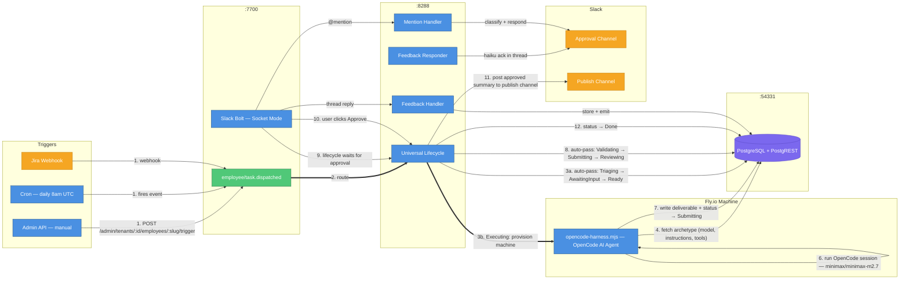
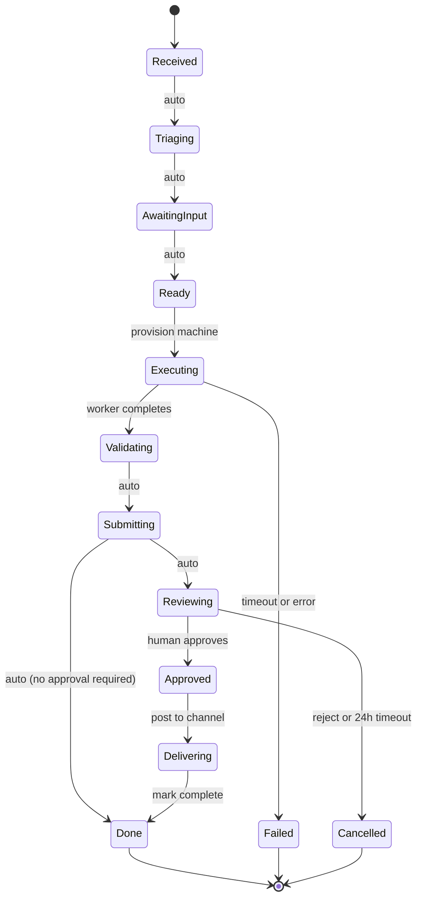
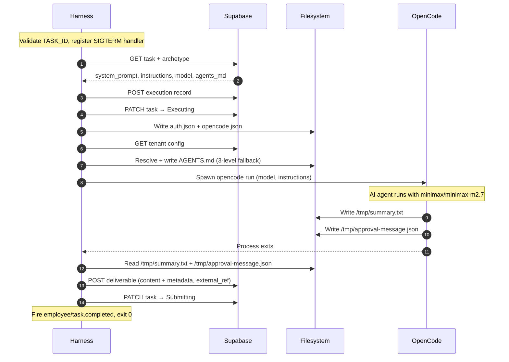
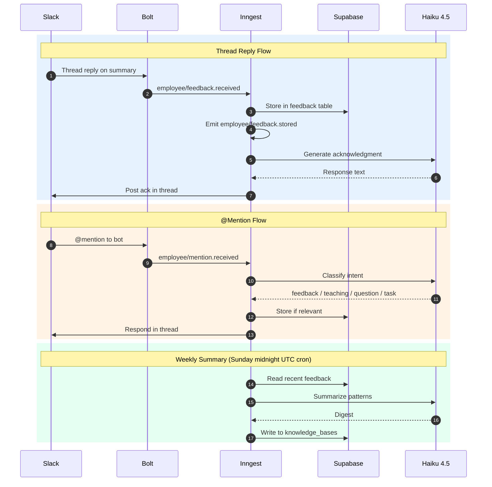

# AI Employee Platform — Current System State

> As of April 24, 2026. After Phase 1 Guest Operations MVP work: guest-messaging employee, Hostfully integration (7 shell tools), knowledge base entries, configurable AGENTS.md, issue reporting, tsx worker-tool migration, and shared local infrastructure.

---

## How It Works

Every employee follows the same path: trigger → universal lifecycle → OpenCode worker on Fly.io → human approval → done.



| #   | What happens                                                                                                                                                   |
| --- | -------------------------------------------------------------------------------------------------------------------------------------------------------------- |
| 1   | Task created via admin API, cron, or Jira webhook — fires `employee/task.dispatched`                                                                           |
| 2   | Inngest routes to the **universal lifecycle** (one function for all employees)                                                                                 |
| 3   | States **Triaging → AwaitingInput → Ready** auto-pass instantly (no blocking)                                                                                  |
| 4   | **Executing**: Fly.io machine provisioned, runs `opencode-harness.mjs` — reads archetype (model, natural-language instructions, available shell tools) from DB |
| 5   | Harness resolves AGENTS.md content via three-level fallback: `archetype.agents_md` → `tenant.config.default_agents_md` → static platform default               |
| 6   | OpenCode session runs with `minimax/minimax-m2.7`, using shell tools at `/tools/`                                                                              |
| 7   | Worker writes deliverable + sets task status → `Submitting`                                                                                                    |
| 8   | States **Validating → Submitting → Reviewing** auto-pass; lifecycle waits for human approval                                                                   |
| 9   | Lifecycle holds at `Reviewing`, waiting for Slack button click                                                                                                 |
| 10  | User clicks Approve — Slack Bolt fires `employee/approval.received`                                                                                            |
| 11  | Lifecycle posts the approved summary **directly** to the publish channel (no delivery machine spawned)                                                         |
| 12  | Task → `Done`                                                                                                                                                  |

---

## Employees

Three employees are defined; one is deprecated and on hold:

| Employee                          | Department  | Trigger                      | Delivery            | Tenant    | Status                   |
| --------------------------------- | ----------- | ---------------------------- | ------------------- | --------- | ------------------------ |
| **Papi Chulo** (Daily Summarizer) | Operations  | Cron `0 8 * * 1-5` (8am UTC) | Slack message       | Both      | Active                   |
| **Guest Messaging**               | Operations  | Manual / Webhook             | Hostfully message   | VLRE only | Active (Release 1.0 WIP) |
| **Engineering Coder**             | Engineering | Jira webhook                 | GitHub pull request | —         | Deprecated — on hold     |

### Daily Summarizer (Papi Chulo)

Runs Mon–Fri at 8am UTC. Reads configured Slack channels, generates a dramatic Spanish news-style digest via OpenCode, posts an approval card to a Slack channel, and on approval publishes the final summary.

Both DozalDevs and VLRE tenants have their own archetype records with hardcoded channel IDs in instructions.

### Guest Messaging

VLRE only. Receives guest messages from Hostfully's unified inbox, classifies them (`NEEDS_APPROVAL` vs `NO_ACTION_NEEDED`), drafts a response using property-specific knowledge base content, and posts an approval card to Slack. On approval, sends the response back to the guest via Hostfully.

- **Archetype ID**: `00000000-0000-0000-0000-000000000015`
- **Trigger**: Webhook / manual via Admin API (`POST /admin/tenants/:tenantId/employees/guest-messaging/trigger`). No cron trigger yet.
- **Concurrency**: 5 (multiple concurrent guests)
- **Tools**: Hostfully (7 tools) + Slack + KB search + Platform issue reporting
- **Classification output**: JSON with `classification`, `confidence`, `draftResponse`, `category`, `urgency`, `conversationSummary`
- **Delivery**: Always runs inside a Fly.io machine with `EMPLOYEE_PHASE=delivery`. The harness reads `archetype.delivery_instructions` to determine what delivery action to perform (calls `send-message.ts` to send the approved response to the guest via Hostfully). Lifecycle retries up to 3 times on failure.

---

## Universal Lifecycle States

```
Received → Triaging* → AwaitingInput* → Ready → Executing → Validating* → Submitting → Reviewing → Approved → Delivering → Done
```

\* auto-pass (no blocking)



Terminal states: `Failed` (machine poll timeout or unhandled error), `Cancelled` (reject action or approval timeout).

Approval gate is controlled per-archetype via `risk_model.approval_required`. When `approval_required: false`, the lifecycle short-circuits from `Submitting` directly to `Done`.

---

## Workers: OpenCode Harness

All active employees run `opencode-harness.mjs` directly (Fly.io CMD override at dispatch time). The engineering employee (on hold) uses the default Dockerfile CMD `bash entrypoint.sh`, which calls `orchestrate.mts`.

| What              | Before                                  | Now                                                                        |
| ----------------- | --------------------------------------- | -------------------------------------------------------------------------- |
| Worker entrypoint | `generic-harness.mjs`                   | `opencode-harness.mjs`                                                     |
| Tool access       | TypeScript tool registry (programmatic) | Shell scripts at `/tools/` (tsx execution)                                 |
| Instructions      | Ordered `steps: []` JSON array          | Natural language `instructions` field                                      |
| Models            | `anthropic/claude-sonnet-4-6`           | `minimax/minimax-m2.7` (primary) / `anthropic/claude-haiku-4-5` (verifier) |

### Harness Execution Flow



| Step | What the harness does                                                                                  |
| ---- | ------------------------------------------------------------------------------------------------------ |
| 1    | Validate `TASK_ID` env var — fatal if missing                                                          |
| 2    | Register `SIGTERM` handler — PATCHes task to `Failed` on termination                                   |
| 3    | Fetch task + archetype from Supabase (`GET /rest/v1/tasks?id=eq.{TASK_ID}&select=*,archetypes(*)`)     |
| 4    | Extract: `system_prompt`, `instructions`, `model` (default: `minimax/minimax-m2.7`), `agents_md`       |
| 5    | Optionally prepend `FEEDBACK_CONTEXT` to system prompt                                                 |
| 6    | Create execution record (`POST /rest/v1/executions`)                                                   |
| 7    | PATCH task to `Executing`                                                                              |
| 8    | Write OpenCode auth (`~/.local/share/opencode/auth.json`) + `.opencode/opencode.json` permissions      |
| 9    | Resolve AGENTS.md: `archetype.agents_md` → `tenant.config.default_agents_md` → static `/app/AGENTS.md` |
| 10   | Spawn `opencode run` subprocess with model, instructions, and `TASK_ID` appended                       |
| 11   | Wait for OpenCode to complete                                                                          |
| 12   | Read `/tmp/summary.txt` → deliverable content                                                          |
| 13   | Read `/tmp/approval-message.json` → deliverable metadata (`approval_message_ts`, `target_channel`)     |
| 14   | POST deliverable to Supabase (with `external_ref: TASK_ID`)                                            |
| 15   | PATCH task to `Submitting`                                                                             |
| 16   | Fire Inngest event `employee/task.completed`, exit 0                                                   |

**AGENTS.md resolution** (new since last doc): The harness fetches the tenant config and uses `resolveAgentsMd()` (`src/workers/lib/agents-md-resolver.mts`) to determine which AGENTS.md content to write to `/app/AGENTS.md` before starting OpenCode. The static platform AGENTS.md (`src/workers/config/agents.md`) serves as the fallback — it contains self-repair policies (permission to read/patch tool source, mandatory issue reporting, database access only via tools).

**Output contract**: OpenCode SHOULD write `/tmp/summary.txt` AND `/tmp/approval-message.json`. Absence of **both** is the hard failure condition. Writing either file alone is sufficient to proceed.

---

## Shell Tools (11 tools across 4 directories)

All tools are TypeScript source files executed via `tsx` inside the worker container. All write JSON to stdout, errors to stderr. Exit code 0 = success, 1 = failure.

### `slack/` (2 tools)

| Tool               | Usage                                                                                                | Output                                                                                    |
| ------------------ | ---------------------------------------------------------------------------------------------------- | ----------------------------------------------------------------------------------------- |
| `post-message.ts`  | `NODE_NO_WARNINGS=1 tsx /tools/slack/post-message.ts --channel "C123" --text "msg" --task-id "uuid"` | `{"ts":"...","channel":"..."}`. Auto-generates approval blocks when `--task-id` provided. |
| `read-channels.ts` | `tsx /tools/slack/read-channels.ts --channels "C123,C456" --lookback-hours 24`                       | `{"channels":[...]}`. Thread replies included; bot summary posts filtered out.            |

### `hostfully/` (7 tools)

All require `HOSTFULLY_API_KEY` env var. API base: `https://api.hostfully.com/api/v3.2` (v3.3 for reviews).

| Tool                  | Usage                                                                                                     | Output                                                      |
| --------------------- | --------------------------------------------------------------------------------------------------------- | ----------------------------------------------------------- |
| `validate-env.ts`     | `tsx /tools/hostfully/validate-env.ts`                                                                    | `{"ok":true,"apiKeySet":true,"agencyUidSet":true}`          |
| `get-properties.ts`   | `tsx /tools/hostfully/get-properties.ts`                                                                  | `[{"uid":"...","name":"...","city":"...","isActive":true}]` |
| `get-property.ts`     | `tsx /tools/hostfully/get-property.ts --property-id "<uid>"`                                              | Full property detail: address, amenities, house rules, WiFi |
| `get-reservations.ts` | `tsx /tools/hostfully/get-reservations.ts --property-id "<uid>" [--status confirmed] [--from] [--to]`     | `[{"guestName":"...","checkIn":"...","channel":"AIRBNB"}]`  |
| `get-messages.ts`     | `tsx /tools/hostfully/get-messages.ts --property-id "<uid>" [--unresponded-only] [--limit 30]`            | `[{"guestName":"...","unresponded":true,"messages":[...]}]` |
| `get-reviews.ts`      | `tsx /tools/hostfully/get-reviews.ts [--property-id "<uid>"] [--since "2026-05-01"] [--unresponded-only]` | `[{"rating":5,"content":"...","hasResponse":false}]`        |
| `send-message.ts`     | `tsx /tools/hostfully/send-message.ts --lead-id "<uid>" --message "<text>" [--thread-id "<uid>"]`         | `{"sent":true,"messageId":"..."}`. **Irreversible.**        |

### `kb/` (1 tool)

| Tool        | Usage                                                                                                   | Output                                                                                                             |
| ----------- | ------------------------------------------------------------------------------------------------------- | ------------------------------------------------------------------------------------------------------------------ |
| `search.ts` | `tsx /tools/knowledge_base/search.ts --entity-type property --entity-id "<uid>" [--tenant-id "<uuid>"]` | `{"content":"...","entityFound":true,"commonFound":true}`. Returns entity-specific + common policies concatenated. |

### `platform/` (1 tool)

| Tool              | Usage                                                                                                                      | Output                                                                               |
| ----------------- | -------------------------------------------------------------------------------------------------------------------------- | ------------------------------------------------------------------------------------ |
| `report-issue.ts` | `tsx /tools/platform/report-issue.ts --task-id "<id>" --tool-name "get-messages" --description "..." [--patch-diff "..."]` | `{"ok":true,"event_id":"..."}`. Writes to `system_events` table + posts Slack alert. |

---

## Feedback Pipeline

Thread replies and @mentions are captured bidirectionally:



---

## Inngest Functions (9 total)

### Active (6)

| Function ID                    | Trigger                               | File                                          | Purpose                                                                            |
| ------------------------------ | ------------------------------------- | --------------------------------------------- | ---------------------------------------------------------------------------------- |
| `employee/universal-lifecycle` | `employee/task.dispatched`            | `src/inngest/employee-lifecycle.ts`           | Universal lifecycle for all employees                                              |
| `trigger/daily-summarizer`     | cron: `0 8 * * 1-5` (Mon–Fri 8am UTC) | `src/inngest/triggers/summarizer-trigger.ts`  | Creates daily-summarizer task; deduplicates by `external_id: summary-{YYYY-MM-DD}` |
| `employee/feedback-handler`    | `employee/feedback.received`          | `src/inngest/feedback-handler.ts`             | Ingests thread reply into feedback table, emits `employee/feedback.stored`         |
| `employee/feedback-responder`  | `employee/feedback.stored`            | `src/inngest/feedback-responder.ts`           | LLM acknowledgment (`claude-haiku-4-5`) in Slack thread                            |
| `employee/mention-handler`     | `employee/mention.received`           | `src/inngest/mention-handler.ts`              | Classifies @mention intent, stores if relevant                                     |
| `trigger/feedback-summarizer`  | cron: `0 0 * * 0` (Sunday midnight)   | `src/inngest/triggers/feedback-summarizer.ts` | Weekly feedback digest → `knowledge_bases`                                         |

> **Cron timezone — CRITICAL**: The Inngest cron `0 8 * * 1-5` fires at **8am UTC**, not 8am CT. Inngest has no timezone config on this function.

### Deprecated (3) — still registered, do not modify

| Function ID                   | Trigger                       | File                        | Purpose                                      |
| ----------------------------- | ----------------------------- | --------------------------- | -------------------------------------------- |
| `engineering/task-lifecycle`  | `engineering/task.received`   | `src/inngest/lifecycle.ts`  | Engineering-only lifecycle (on hold)         |
| `engineering/task-redispatch` | `engineering/task.redispatch` | `src/inngest/redispatch.ts` | Engineering retry (3-attempt max, 8h budget) |
| `engineering/watchdog-cron`   | `*/10 * * * *`                | `src/inngest/watchdog.ts`   | Detect stuck engineering tasks               |

All 9 functions are registered in `src/gateway/inngest/serve.ts`.

---

## Gateway and Routes

Gateway startup: validates `ENCRYPTION_KEY` + `ADMIN_API_KEY`, initializes Slack Bolt (Socket Mode when `SLACK_APP_TOKEN` is set), registers all routes, listens on `PORT` (default 7700).

### Webhook Routes (no auth)

| Method | Path               | Description                              |
| ------ | ------------------ | ---------------------------------------- |
| `GET`  | `/health`          | Returns `{ status: 'ok' }`               |
| `POST` | `/webhooks/jira`   | Jira issue events, HMAC-SHA256 validated |
| `POST` | `/webhooks/github` | Stub only — not active                   |

### Slack OAuth Routes (no auth)

| Method | Path                         | Description                                 |
| ------ | ---------------------------- | ------------------------------------------- |
| `GET`  | `/slack/install?tenant=uuid` | Initiates OAuth flow with HMAC-signed state |
| `GET`  | `/slack/oauth_callback`      | Completes OAuth, stores encrypted token     |

### Admin Routes (`X-Admin-Key` header required)

| Method   | Path                                               | Description                                     |
| -------- | -------------------------------------------------- | ----------------------------------------------- |
| `POST`   | `/admin/tenants/:tenantId/projects`                | Create project                                  |
| `GET`    | `/admin/tenants/:tenantId/projects`                | List all projects                               |
| `GET`    | `/admin/tenants/:tenantId/projects/:id`            | Get project                                     |
| `PATCH`  | `/admin/tenants/:tenantId/projects/:id`            | Update project                                  |
| `DELETE` | `/admin/tenants/:tenantId/projects/:id`            | Delete project (409 if active tasks)            |
| `POST`   | `/admin/tenants`                                   | Create tenant                                   |
| `GET`    | `/admin/tenants`                                   | List tenants (`?include_deleted=true` opt)      |
| `GET`    | `/admin/tenants/:tenantId`                         | Get tenant                                      |
| `PATCH`  | `/admin/tenants/:tenantId`                         | Update tenant                                   |
| `DELETE` | `/admin/tenants/:tenantId`                         | Soft-delete tenant                              |
| `POST`   | `/admin/tenants/:tenantId/restore`                 | Restore soft-deleted tenant                     |
| `GET`    | `/admin/tenants/:tenantId/secrets`                 | List secret key names (not values)              |
| `PUT`    | `/admin/tenants/:tenantId/secrets/:key`            | Set/overwrite secret (encrypted)                |
| `DELETE` | `/admin/tenants/:tenantId/secrets/:key`            | Delete secret                                   |
| `GET`    | `/admin/tenants/:tenantId/config`                  | Get tenant config                               |
| `PATCH`  | `/admin/tenants/:tenantId/config`                  | Deep-merge update tenant config                 |
| `POST`   | `/admin/tenants/:tenantId/employees/:slug/trigger` | Manually trigger employee (`?dry_run=true` opt) |
| `GET`    | `/admin/tenants/:tenantId/tasks/:id`               | Get task status (tenant-scoped)                 |

### Inngest

| Method         | Path           | Description                |
| -------------- | -------------- | -------------------------- |
| `POST/GET/PUT` | `/api/inngest` | Inngest SDK serve endpoint |

### Slack Bolt Handlers (Socket Mode)

**What happens when a user interacts with a summary message:**

| User action         | What the system does                                                                                                                                     |
| ------------------- | -------------------------------------------------------------------------------------------------------------------------------------------------------- |
| Replies in thread   | Captured as feedback → stored in DB → bot posts a Haiku-generated acknowledgment in the same thread                                                      |
| @mentions the bot   | Intent classified (feedback / teaching / question / task) → stored if relevant → bot responds in thread                                                  |
| Clicks **Approve**  | Message instantly swaps to "⏳ Processing approval..." → fires `employee/approval.received` → lifecycle proceeds to publish                              |
| Clicks **Reject**   | Message instantly swaps to "⏳ Processing rejection..." → fires `employee/approval.received` with `action: reject` → task cancelled                      |
| Clicks button twice | Second click is ignored — handler checks task is still in `Reviewing` status before firing; if already processed, updates message to "already processed" |

**Message format standards** (enforced on every Slack message):

- **User attribution**: Lifecycle updates display the actor as `<@userId>` so Slack renders their display name (e.g., `@Victor Dozal`), not a raw username
- **Task traceability**: Every message includes a trailing gray metadata block: `Task {taskId}`

**Implementation notes** (for developers modifying handlers):

- Events: `message` → feedback handler, `app_mention` → mention handler
- Actions: `approve` / `reject` both emit `employee/approval.received` with `{ taskId, action, userId, userName }`, deduped by Inngest ID `employee-approval-{taskId}`
- The "⏳ Processing..." swap uses `(ack as any)({ replace_original: true, blocks: [...] })` — embedded directly in the Socket Mode ack envelope, not a separate `chat.update` call
- Task ID context block shape: `{ type: 'context', elements: [{ type: 'mrkdwn', text: 'Task \`{taskId}\`' }] }`

---

## Tenant Configuration

Two tenants are seeded. Each requires its own Slack OAuth connection to operate.

| Field           | DozalDevs                    | VLRE                                                      |
| --------------- | ---------------------------- | --------------------------------------------------------- |
| ID              | `...000000000002`            | `...000000000003`                                         |
| Slug            | `dozaldevs`                  | `vlre`                                                    |
| Slack Workspace | `T0601SMSVEU` (Dozal Inc.)   | `T06KFDGLHS6`                                             |
| Archetypes      | Daily Summarizer (`...0012`) | Daily Summarizer (`...0013`), Guest Messaging (`...0015`) |
| Department      | —                            | VLRE Operations (`...0021`)                               |

### DozalDevs Summarizer

- **Archetype ID**: `00000000-0000-0000-0000-000000000012`
- Read from: `C092BJ04HUG` (`#project-lighthouse`)
- Approval channel: `C0AUBMXKVNU` (`#victor-tests`)
- Publish channel: `C092BJ04HUG` (`#project-lighthouse`)

### VLRE Summarizer

- **Archetype ID**: `00000000-0000-0000-0000-000000000013`
- Read from: `C0AMGJQN05S`, `C0ANH9J91NC`, `C0960S2Q8RL`
- Approval + publish channel: `C0960S2Q8RL`

### VLRE Guest Messaging

- **Archetype ID**: `00000000-0000-0000-0000-000000000015`
- Approval channel: `C0960S2Q8RL`
- Delivery: Sends directly to guest via Hostfully API (not Slack)

All archetypes use model `minimax/minimax-m2.7`, runtime `opencode`, and risk model `approval_required: true`, `timeout_hours: 24`.

---

## Knowledge Base

Two seeded KB entries for VLRE (stored in `knowledge_base_entries` table):

| ID        | Scope    | Entity                                | Content                                                                                                   |
| --------- | -------- | ------------------------------------- | --------------------------------------------------------------------------------------------------------- |
| `...0100` | `common` | —                                     | Tenant-wide policies: 21-property reference, service directory, classification rules, escalation triggers |
| `...0101` | `entity` | property `c960c8d2-...` (3505 Banton) | WiFi, access codes, amenities, house rules, fees                                                          |

Queried via `tsx /tools/knowledge_base/search.ts --entity-type property --entity-id "<uid>"`. Returns entity-specific content + common policies concatenated.

---

## Database Schema

21 models across 5 groups. 21 migrations total.

### Group A: MVP-Active (7 tables)

| Table             | Key Columns                                                                  | Purpose                              |
| ----------------- | ---------------------------------------------------------------------------- | ------------------------------------ |
| `tasks`           | `id`, `archetype_id`, `status`, `tenant_id`, `external_id`, `source_system`  | Core work unit                       |
| `executions`      | `id`, `task_id`, `runtime_type`, `status`, `heartbeat_at`, `wave_state`      | Worker run record                    |
| `deliverables`    | `id`, `execution_id`, `delivery_type`, `external_ref`, `content`, `metadata` | Output produced by execution         |
| `validation_runs` | `id`, `execution_id`, `stage`, `status`, `error_output`                      | Per-execution validation attempts    |
| `projects`        | `id`, `name`, `repo_url`, `jira_project_key`, `tenant_id`                    | Registered repos                     |
| `feedback`        | `id`, `task_id`, `feedback_type`, `tenant_id`                                | Human corrections to agent decisions |
| `task_status_log` | `id`, `task_id`, `from_status`, `to_status`, `actor`                         | Immutable audit trail                |

### Group B: Config and Versioning

| Table                        | Key Columns                                                                                          | Purpose                                                |
| ---------------------------- | ---------------------------------------------------------------------------------------------------- | ------------------------------------------------------ |
| `archetypes`                 | `id`, `role_name`, `tenant_id`, `system_prompt`, `instructions`, `model`, `runtime`, **`agents_md`** | Employee type definitions (config-driven)              |
| `departments`                | `id`, `name`, `tenant_id`                                                                            | Org unit grouping                                      |
| `agent_versions`             | `id`, `archetype_id`, `model_id`, `prompt_hash`, `is_active`                                         | Versioned snapshots of archetype config                |
| `knowledge_bases`            | `id`, `archetype_id`, `source_config`, `tenant_id`                                                   | Feedback-derived knowledge (weekly digest)             |
| **`knowledge_base_entries`** | `id`, `tenant_id`, `entity_type`, `entity_id`, `scope`, `content`                                    | Per-entity KB content (property info, common policies) |

### Group C: Multi-Tenancy (4 tables)

| Table                 | Key Columns                                                                                   | Purpose                                    |
| --------------------- | --------------------------------------------------------------------------------------------- | ------------------------------------------ |
| `tenants`             | `id`, `name`, `slug`, `config`, `status`, `deleted_at`                                        | Tenant registry                            |
| `tenant_integrations` | `id`, `tenant_id`, `provider`, `external_id`, `status`                                        | External service connections (Slack OAuth) |
| `tenant_secrets`      | `id`, `tenant_id`, `key`, `ciphertext`, `iv`, `auth_tag`                                      | Encrypted per-tenant credentials           |
| **`system_events`**   | `id`, `task_id`, `tenant_id`, `tool_name`, `issue_description`, `patch_applied`, `patch_diff` | Runtime tool issue tracking                |

### Group D: Forward-Compatibility (schema-ready, not yet active)

`risk_models`, `cross_dept_triggers`, `clarifications`, `reviews`, `audit_log`

### Key Constraints

- `tasks`: unique `(external_id, source_system, tenant_id)` — prevents duplicate task creation
- `projects`: unique `(jira_project_key, tenant_id)` — one project per Jira key per tenant
- `archetypes`: unique `(tenant_id, role_name)` — one archetype per role per tenant
- `tenant_integrations`: unique `(tenant_id, provider)` — one per provider per tenant
- `tenant_secrets`: unique `(tenant_id, key)`
- `knowledge_base_entries`: unique `(tenant_id, entity_type, entity_id, scope)` — one entry per entity per scope per tenant

### Changes Since Last Doc (April 20)

| Change                                   | Migration                                    |
| ---------------------------------------- | -------------------------------------------- |
| Added `system_events` table              | `20260422224712_add_system_events_table`     |
| Added `agents_md` column to `archetypes` | `20260423060515_add_agents_md_to_archetypes` |
| Added `knowledge_base_entries` table     | `20260424020323_add_knowledge_base_entries`  |

---

## Approved LLM Models

| Model            | ID                           | Purpose                                                                                     |
| ---------------- | ---------------------------- | ------------------------------------------------------------------------------------------- |
| MiniMax M2.7     | `minimax/minimax-m2.7`       | Primary execution — all employee work, code generation, summaries                           |
| Claude Haiku 4.5 | `anthropic/claude-haiku-4-5` | Verification/judge only — plan verification, intent classification, feedback acknowledgment |

**Forbidden**: `anthropic/claude-sonnet-*`, `anthropic/claude-opus-*`, `openai/gpt-4o`, `openai/gpt-4o-mini`, or any other model not listed above.

---

## Docker and Deployment

### Local Infrastructure (Split Compose)

The project uses a **split Docker Compose architecture** — shared infrastructure services run in one compose file, project-specific services in another:

#### `docker/shared-infra.yml` — Shared across all local projects

| Container         | Image                          | Host Port                 | Purpose                             |
| ----------------- | ------------------------------ | ------------------------- | ----------------------------------- |
| `shared-postgres` | `supabase/postgres:17.6.1.064` | 54322                     | PostgreSQL (shared by all projects) |
| `shared-mailpit`  | `axllent/mailpit:latest`       | 54325 (web), 54324 (SMTP) | Email testing                       |
| `shared-redis`    | `redis:7-alpine`               | 6379                      | Redis                               |

#### `docker/supabase-services.yml` — Per-project (ai-employee)

| Container          | Image                       | Host Port | Purpose                                     |
| ------------------ | --------------------------- | --------- | ------------------------------------------- |
| `ai-employee-auth` | `supabase/gotrue:v2.186.0`  | internal  | GoTrue authentication                       |
| `ai-employee-kong` | `kong/kong:3.9.1`           | 54331     | API Gateway (Supabase URL for this project) |
| `ai-employee-rest` | `postgrest/postgrest:v14.6` | internal  | PostgREST REST API                          |

**Supabase URL**: `http://localhost:54331`. Database name: `ai_employee`.

`pnpm docker:start` runs `scripts/ensure-infra.sh` — a 3-state idempotent script that handles FRESH (nothing running), PARTIAL (shared infra up, project services missing), and COMPLETE (everything running) states.

### Dockerfile (Worker Container)

Two-stage build (`node:20-slim`). Builder stage: `pnpm install` → `prisma generate` → `tsc` → prod install. Runtime stage installs:

- **System packages**: `git`, `curl`, `bash`, `jq`, `ca-certificates`, `fuse-overlayfs`, `uidmap` (rootless Docker on Fly.io)
- **GitHub CLI**: `gh` v2.45.0
- **Global npm packages**: `opencode-ai@1.3.3`, `tsx`

Default CMD: `bash entrypoint.sh` (engineering worker). Active employees override this at dispatch: `["node", "/app/dist/workers/opencode-harness.mjs"]`.

### Tools Installed in Image

| Docker Path              | Contents                                                                                                                                 |
| ------------------------ | ---------------------------------------------------------------------------------------------------------------------------------------- |
| `/tools/slack/`          | `read-channels.ts`, `post-message.ts` + `@slack/web-api` installed                                                                       |
| `/tools/hostfully/`      | `validate-env.ts`, `get-property.ts`, `get-properties.ts`, `get-reservations.ts`, `get-messages.ts`, `get-reviews.ts`, `send-message.ts` |
| `/tools/knowledge_base/` | `search.ts`                                                                                                                              |
| `/tools/platform/`       | `report-issue.ts`                                                                                                                        |
| `/app/AGENTS.md`         | Static platform AGENTS.md (self-repair policy, overridden at runtime by harness)                                                         |

All tools under `src/worker-tools/` are bulk-copied into the image via `COPY src/worker-tools/ /tools/` — new tools are automatically included without Dockerfile changes.

### Deployment Commands

```bash
# Rebuild after any src/workers/ or src/worker-tools/ change
docker build -t ai-employee-worker:latest .

# Push to Fly.io registry
pnpm fly:image

# Fly.io CMD for all active employees
["node", "/app/dist/workers/opencode-harness.mjs"]

# Fly.io CMD for engineering (default Dockerfile CMD)
["bash", "entrypoint.sh"]
```

---

## Platform Infrastructure Additions (New)

### Configurable AGENTS.md

Three-level fallback resolved by the harness before starting OpenCode:

1. **`archetype.agents_md`** — per-employee override (nullable text column on `archetypes`)
2. **`tenant.config.default_agents_md`** — tenant-level default (JSONB field on `tenants.config`)
3. **Static `/app/AGENTS.md`** — platform default baked into Docker image

The static AGENTS.md (`src/workers/config/agents.md`) encodes self-repair policy: permission to read/patch tool `.ts` source, mandatory smoke test after patches, mandatory issue reporting via `report-issue.ts`, database access only via `/tools/` tools (never direct PostgREST/psql).

### Issue Reporting (`system_events` table)

AI employees can self-report tool issues via `tsx /tools/platform/report-issue.ts`. Issues are written to the `system_events` table and optionally posted to a Slack channel (`ISSUES_SLACK_CHANNEL` env var). The lifecycle injects `TENANT_ID` and `ISSUES_SLACK_CHANNEL` into the worker machine environment.

### Telegram Notifications

`src/lib/telegram-client.ts` provides push notifications for plan completion and orchestration events. CLI wrapper: `tsx scripts/telegram-notify.ts "message"`. Requires `TELEGRAM_BOT_TOKEN` and `TELEGRAM_CHAT_ID` env vars.

---

## Shared Libraries (`src/lib/`)

| File                 | Purpose                                                                                                                                   |
| -------------------- | ----------------------------------------------------------------------------------------------------------------------------------------- |
| `fly-client.ts`      | Fly.io Machines API — create/destroy/query VMs, retries on 429                                                                            |
| `github-client.ts`   | GitHub REST API — create/list/get PRs                                                                                                     |
| `slack-client.ts`    | Slack Web API — `postMessage`, `updateMessage`                                                                                            |
| `jira-client.ts`     | Jira Cloud REST API v3 — `getIssue`, `addComment`, `transitionIssue`                                                                      |
| `call-llm.ts`        | OpenRouter LLM caller — enforces approved models, cost circuit breaker ($50/day default)                                                  |
| `logger.ts`          | Pino structured logger — auto-redacts secrets                                                                                             |
| `retry.ts`           | Exponential backoff — 3 attempts, 1s base delay                                                                                           |
| `errors.ts`          | Custom errors: `LLMTimeoutError`, `CostCircuitBreakerError`, `RateLimitExceededError`, `ExternalApiError`, `ProjectRegistryConflictError` |
| `encryption.ts`      | AES-256-GCM encrypt/decrypt for tenant secrets                                                                                            |
| `tunnel-client.ts`   | Cloudflare tunnel URL resolver for hybrid mode                                                                                            |
| `repo-url.ts`        | GitHub repo URL parser                                                                                                                    |
| `agent-version.ts`   | Agent version hash (SHA-256 of prompt + model + tools) and upsert                                                                         |
| `telegram-client.ts` | Telegram Bot API — push notifications with retry                                                                                          |

---

## Scripts

| Script                              | Command                          | Purpose                                                        |
| ----------------------------------- | -------------------------------- | -------------------------------------------------------------- |
| `setup.ts`                          | `pnpm setup`                     | One-time setup: Docker Compose, migrations, seed, Docker image |
| `dev-start.ts`                      | `pnpm dev:start`                 | Start all services with health checks                          |
| `ensure-infra.sh`                   | `pnpm docker:start`              | 3-state idempotent shared infra startup                        |
| `trigger-task.ts`                   | `pnpm trigger-task`              | Send mock Jira webhook, monitor execution                      |
| `verify-e2e.ts`                     | `pnpm verify:e2e --task-id uuid` | 12-point E2E verification                                      |
| `register-project.ts`               | `pnpm register-project`          | Interactive project registration wizard                        |
| `setup-two-tenants.ts`              | `pnpm setup:two-tenants`         | Migrate legacy `SLACK_BOT_TOKEN` to per-tenant secrets         |
| `telegram-notify.ts`                | `tsx scripts/telegram-notify.ts` | CLI wrapper for Telegram push notifications                    |
| `fly-setup.ts`                      | `pnpm fly:setup`                 | Create Fly.io app (idempotent)                                 |
| `verify-supabase.ts`                | —                                | Verify Docker Compose stack health                             |
| `verify-multi-tenancy.ts`           | `pnpm verify:multi-tenancy`      | Verify per-tenant Slack tokens and config                      |
| `long-running-sim/mock-supabase.ts` | —                                | Local mock Supabase server for long-running task simulation    |

---

## Phase 1: Guest Operations MVP — Progress

Active development plan: `docs/2026-04-21-2202-phase1-story-map.md`. Five releases across 39 stories.

### Release 1.0 (End-to-End Thin Slice) — In Progress

| Story   | Name                              | Status      |
| ------- | --------------------------------- | ----------- |
| HF-01   | Hostfully API Authentication      | Done        |
| HF-02   | get-property shell tool           | Done        |
| HF-03   | get-reservations shell tool       | Done        |
| HF-04   | get-messages shell tool           | Done        |
| HF-05   | send-message shell tool           | Done        |
| HF-06   | get-reviews shell tool            | Done        |
| PLAT-01 | tsx worker-tool execution         | Done        |
| PLAT-02 | Static AGENTS.md for workers      | Done        |
| PLAT-03 | report-issue tool + system_events | Done        |
| PLAT-04 | Configurable AGENTS.md            | Done        |
| GM-01   | Guest Messaging archetype         | Done        |
| GM-02   | System prompt + instructions      | Done        |
| GM-03   | Single-property knowledge base    | Done        |
| GM-04   | Message classification pipeline   | Not started |
| GM-05   | Slack approval card               | Not started |
| GM-06   | Send approved response            | Not started |

### Releases 1.1–1.4: Not started

---

## Quick Start

```bash
# Trigger the DozalDevs summarizer
curl -X POST -H "X-Admin-Key: $ADMIN_API_KEY" \
  "http://localhost:7700/admin/tenants/00000000-0000-0000-0000-000000000002/employees/daily-summarizer/trigger"

# Trigger the VLRE guest messaging employee
curl -X POST -H "X-Admin-Key: $ADMIN_API_KEY" \
  "http://localhost:7700/admin/tenants/00000000-0000-0000-0000-000000000003/employees/guest-messaging/trigger"

# Check task status
curl -H "X-Admin-Key: $ADMIN_API_KEY" \
  "http://localhost:7700/admin/tenants/00000000-0000-0000-0000-000000000003/tasks/<task-id>"

# Manual approval (fallback when Slack button doesn't reach gateway)
curl -X POST "http://localhost:8288/e/local" \
  -H "Content-Type: application/json" \
  -d '{"name":"employee/approval.received","data":{"taskId":"<TASK_ID>","action":"approve","userId":"<SLACK_USER_ID>","userName":"Victor"}}'

# Rebuild worker image after any src/workers/ or src/worker-tools/ change
docker build -t ai-employee-worker:latest . && pnpm fly:image
```

---

## Project Structure

```
src/
├── gateway/          # Express HTTP server + Slack Bolt
│   ├── routes/       # All HTTP route handlers (10 files)
│   ├── slack/        # Bolt event/action handlers + OAuth installation store
│   ├── middleware/   # Admin auth middleware
│   ├── validation/   # Zod schemas + HMAC signature verification
│   ├── services/     # Business logic (10 files): dispatcher, task creation, project registry, tenant/secret repos
│   └── inngest/      # Inngest client factory, event sender, serve registration
├── inngest/          # Durable workflow functions
│   ├── triggers/     # Cron trigger functions (daily-summarizer, feedback-summarizer)
│   └── lib/          # Shared: create-task-and-dispatch, poll-completion
├── workers/          # Docker container code — runs on Fly.io
│   ├── opencode-harness.mts  # Active entrypoint — fetch archetype, resolve AGENTS.md, run OpenCode, write deliverable
│   ├── lib/
│   │   ├── postgrest-client.ts     # PostgREST HTTP client (shared with harness)
│   │   └── agents-md-resolver.mts  # Three-level AGENTS.md fallback resolver
│   ├── orchestrate.mts       # Engineering entrypoint (on hold)
│   ├── entrypoint.sh         # Default Dockerfile CMD — engineering worker
│   └── config/               # OpenCode permission config + static AGENTS.md
├── worker-tools/     # Shell tools compiled into Docker image (tsx execution)
│   ├── slack/        # post-message.ts, read-channels.ts
│   ├── hostfully/    # validate-env, get-property, get-properties, get-reservations, get-messages, get-reviews, send-message
│   ├── kb/           # search.ts
│   └── platform/     # report-issue.ts
└── lib/              # Shared: fly-client, slack-client, github-client, telegram-client, logger, etc. (13 files)
prisma/               # Schema (21 models), 21 migrations, seed
scripts/              # TypeScript scripts run via tsx (12 files)
docker/               # Split Compose: shared-infra.yml + supabase-services.yml + init SQL
docs/                 # Architecture docs, story map, product roadmap
tests/                # 118 test files (Vitest)
```

---

## Reference Documents

| Document                                          | When to Read                                                          |
| ------------------------------------------------- | --------------------------------------------------------------------- |
| `docs/2026-04-21-1813-product-roadmap.md`         | Product vision, Phase 1–3 roadmap, employee roadmap                   |
| `docs/2026-04-21-2202-phase1-story-map.md`        | Phase 1 story map — 39 stories across 5 releases, acceptance criteria |
| `docs/2026-04-20-1314-current-system-state.md`    | Previous system state snapshot (pre-Phase 1 work)                     |
| `docs/2026-04-14-0104-full-system-vision.md`      | Architecture, archetypes, lifecycle, event routing, operating modes   |
| `docs/2026-04-16-1655-multi-tenancy-guide.md`     | Multi-tenancy: provisioning tenants, Slack OAuth, per-tenant secrets  |
| `docs/2026-04-16-0310-manual-employee-trigger.md` | Manual employee trigger API — endpoints, curl examples                |
