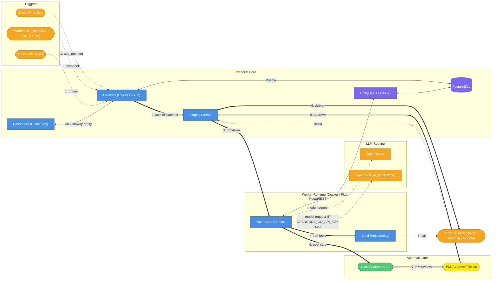

> **Last updated:** 2026-06-07

# Current Architecture

**Question this diagram answers:** How does a trigger become a completed AI employee task?

## Flow Walkthrough

| #   | What happens         | Details                                                                                                                                                                                                           |
| --- | -------------------- | ----------------------------------------------------------------------------------------------------------------------------------------------------------------------------------------------------------------- |
| 1   | Trigger arrives      | A Slack @mention (Socket Mode WebSocket), an inbound webhook (Hostfully `NEW_INBOX_MESSAGE`, GitHub push, Jira event), or a manual admin API call / cron fires. All paths land at the Gateway.                    |
| 2   | Task dispatched      | Gateway creates a `tasks` row via Prisma and emits `employee/task.dispatched` to Inngest. The universal lifecycle function picks it up and transitions the task through `Received → Ready`.                       |
| 3   | Worker provisioned   | Inngest triggers the OpenCode Harness in a Docker container (local) or Fly.io machine (prod). The harness reads the archetype from DB via PostgREST, compiles the AGENTS.md file, and starts an OpenCode session. |
| 4   | Tools executed       | The OpenCode session calls shell tools at `/tools/` (TypeScript scripts run via `tsx`). Tools cover Slack, Hostfully, Sifely, Jira, Knowledge Base, Notion, Platform, GitHub, and Google.                         |
| 5   | External APIs called | Shell tools make authenticated calls to external services. Credentials come from `tenant_secrets` in the DB, injected at harness startup via `loadTenantEnv()`.                                                   |
| 6   | Approval card posted | When work is complete, the worker calls `submit-output.ts` which writes `/tmp/approval-message.json`. The harness reads this and posts a Slack Block Kit approval card.                                           |
| 7   | PM reviews           | The PM sees the card in Slack and clicks Approve, Edit & Send, or Reject. The Slack action hits the Gateway via Socket Mode.                                                                                      |
| 8   | Approval received    | Gateway emits `employee/approval.received` to Inngest. On approve, the lifecycle transitions to `Delivering`. On reject, it transitions to `Failed`.                                                              |
| 9   | Delivery             | A delivery container runs the archetype's `delivery_steps`, sending the final output (Slack message, Hostfully reply, etc.) to the appropriate external API.                                                      |

## Key Design Decisions

**Two DB access paths:** The Gateway uses Prisma (direct PostgreSQL connection) for writes during task creation and lifecycle management. Worker containers use PostgREST (REST API at `:54331`) because they run in isolated Docker/Fly.io environments without direct DB access.

**OpenCodeGo routing:** When `OPENCODE_GO_API_KEY` is set, the harness routes compatible models (14 models, see `src/lib/go-models.ts`) through OpenCodeGo at a flat $10/month subscription instead of per-token OpenRouter pricing. Incompatible models fall back to OpenRouter automatically.

**Approval gate is optional:** Controlled per-archetype via `risk_model.approval_required`. When `false`, the lifecycle skips steps 6-8 and goes straight from `Submitting` to `Delivering`.

**Socket Mode (no public webhook URL needed):** Slack events arrive via a persistent WebSocket connection managed by Bolt. No ngrok or public URL required for Slack integration in local dev.
