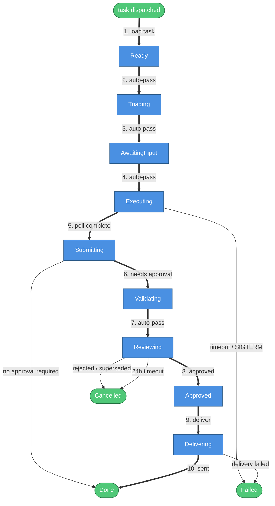
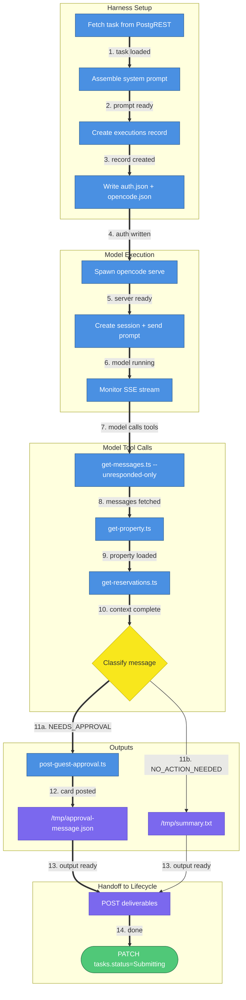
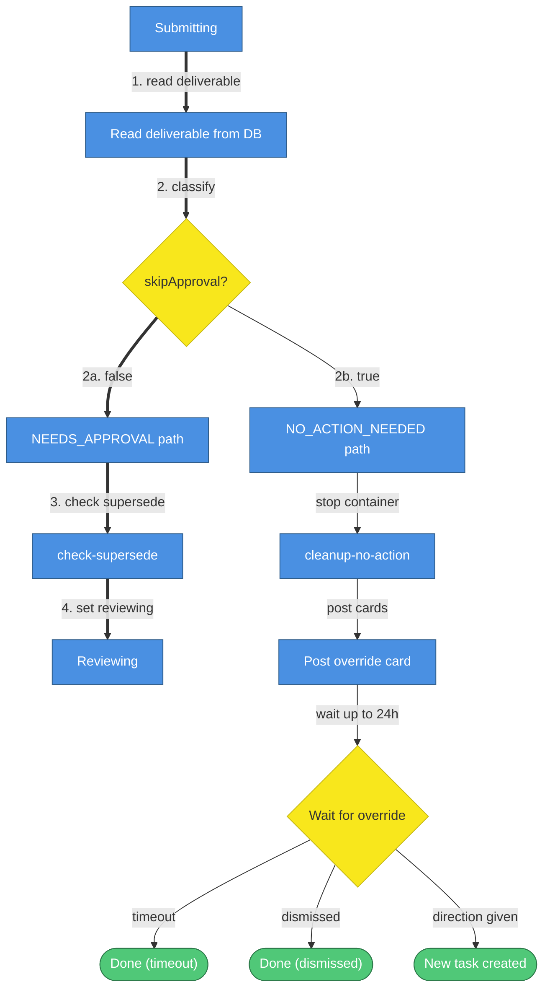
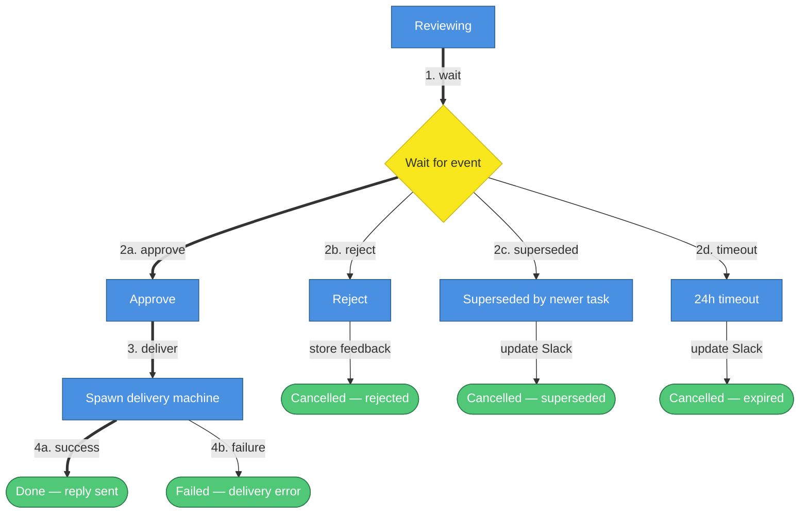
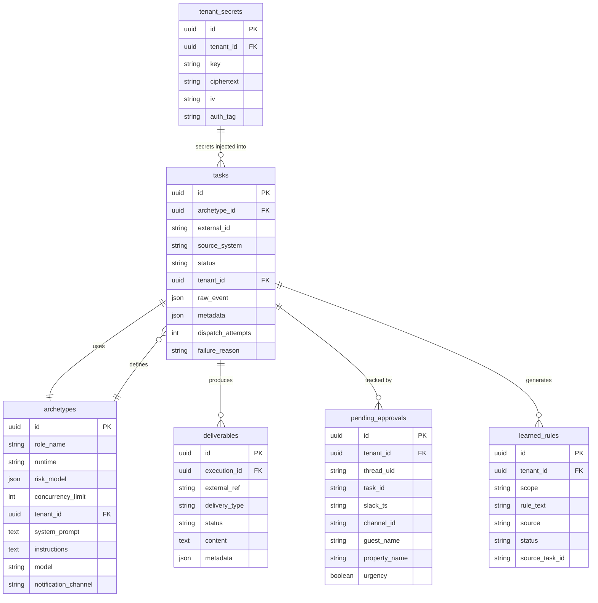

# Guest-Messaging Employee — Complete Technical Guide

> **Tenant**: VLRE (`00000000-0000-0000-0000-000000000003`)
> **Archetype ID**: `00000000-0000-0000-0000-000000000015`
> **Role name**: `guest-messaging`
> **Model**: `minimax/minimax-m2.7`
> **Approval required**: yes (24-hour timeout)
> **Notification channel**: `C0AMGJQN05S` (`#cs-guest-communication`)

---

## Table of Contents

1. [What This Employee Does](#1-what-this-employee-does)
2. [Archetype Configuration](#2-archetype-configuration)
3. [Trigger Sources](#3-trigger-sources)
   - 3.1 [Hostfully Webhook](#31-hostfully-webhook)
   - 3.2 [Polling Cron](#32-polling-cron)
4. [High-Level Flow Overview](#4-high-level-flow-overview)
5. [Lifecycle States](#5-lifecycle-states)
6. [Step-by-Step: Webhook Dispatch](#6-step-by-step-webhook-dispatch)
7. [Step-by-Step: Lifecycle Execution](#7-step-by-step-lifecycle-execution)
   - 7.1 [Pre-check: Skip If Host Already Replied](#71-pre-check-skip-if-host-already-replied)
   - 7.2 [Notify Received](#72-notify-received)
   - 7.3 [Worker Execution](#73-worker-execution)
8. [Worker Execution Detail](#8-worker-execution-detail)
9. [Classification Branch: NEEDS_APPROVAL vs NO_ACTION_NEEDED](#9-classification-branch-needs_approval-vs-no_action_needed)
10. [Approval Flow](#10-approval-flow)
    - 10.1 [Supersede Detection](#101-supersede-detection)
    - 10.2 [Waiting for PM Decision](#102-waiting-for-pm-decision)
    - 10.3 [Approve Path](#103-approve-path)
    - 10.4 [Reject Path](#104-reject-path)
    - 10.5 [Timeout Path](#105-timeout-path)
    - 10.6 [Superseded Path](#106-superseded-path)
11. [NO_ACTION_NEEDED: Override Flow](#11-no_action_needed-override-flow)
12. [Delivery Phase](#12-delivery-phase)
13. [Slack Button Handlers](#13-slack-button-handlers)
14. [Database Schema](#14-database-schema)
15. [Environment Variables and Secrets](#15-environment-variables-and-secrets)
16. [Key Files Reference](#16-key-files-reference)
17. [Critical Gotchas](#17-critical-gotchas)

---

## 1. What This Employee Does

The guest-messaging employee is an AI agent that monitors Hostfully for unresponded guest messages and drafts replies for PM review. When a guest sends a message on Airbnb (or another OTA), Hostfully fires a webhook. The employee fetches the full conversation, gathers property context, drafts a reply, and posts an approval card to Slack. The PM approves, edits, or rejects. On approval, the reply is sent back to the guest via Hostfully.

The employee never sends a message without human approval. Every draft goes through a Slack card with Approve, Edit & Send, and Reject buttons.

---

## 2. Archetype Configuration

The archetype is seeded in `prisma/seed.ts` (lines 3272-3338). These values drive every aspect of the employee's behavior.

| Field                          | Value                                         |
| ------------------------------ | --------------------------------------------- |
| `id`                           | `00000000-0000-0000-0000-000000000015`        |
| `tenant_id`                    | `00000000-0000-0000-0000-000000000003` (VLRE) |
| `role_name`                    | `guest-messaging`                             |
| `runtime`                      | `opencode`                                    |
| `model`                        | `minimax/minimax-m2.7`                        |
| `deliverable_type`             | `hostfully_message`                           |
| `notification_channel`         | `C0AMGJQN05S` (`#cs-guest-communication`)     |
| `concurrency_limit`            | 5                                             |
| `risk_model.approval_required` | `true`                                        |
| `risk_model.timeout_hours`     | 24                                            |

**Tool registry** (shell scripts available to the model inside the worker container):

| Tool                     | Path                                   | Purpose                                  |
| ------------------------ | -------------------------------------- | ---------------------------------------- |
| `get-messages.ts`        | `/tools/hostfully/get-messages.ts`     | Fetch unresponded guest messages         |
| `get-property.ts`        | `/tools/hostfully/get-property.ts`     | Fetch property details, amenities, rules |
| `get-reservations.ts`    | `/tools/hostfully/get-reservations.ts` | Fetch reservation list for a property    |
| `send-message.ts`        | `/tools/hostfully/send-message.ts`     | Send reply to guest via Hostfully API    |
| `post-guest-approval.ts` | `/tools/slack/post-guest-approval.ts`  | Post approval card to Slack              |
| `post-message.ts`        | `/tools/slack/post-message.ts`         | General Slack message posting            |
| `read-channels.ts`       | `/tools/slack/read-channels.ts`        | Read Slack channel history               |
| `report-issue.ts`        | `/tools/platform/report-issue.ts`      | Log platform events                      |
| `search.ts`              | `/tools/knowledge_base/search.ts`      | Query learned knowledge base             |
| `diagnose-access.ts`     | `/tools/sifely/diagnose-access.ts`     | Diagnose lock/access issues              |

**System prompt** (`prisma/prompts/guest-messaging.ts`, 217 lines): Defines the model as a professional guest communication specialist. Includes classification rules (when to use `NEEDS_APPROVAL` vs `NO_ACTION_NEEDED`), tone and style guidelines, formatting rules, polite reply guidance, acknowledgment detection, confidence scoring, and door access handling.

**Instructions** (6-step natural language workflow): fetch messages, gather property context, classify and draft, route by classification, post approval card, handle errors.

---

## 3. Trigger Sources

The employee has two independent trigger paths. Both converge on the same universal lifecycle.

### 3.1 Hostfully Webhook

**Entry point**: `POST /webhooks/hostfully` (`src/gateway/routes/hostfully.ts`)

Hostfully fires a `NEW_INBOX_MESSAGE` event whenever a guest sends a message. The gateway receives it, validates it, matches the tenant, and creates a task.

**Important**: Hostfully does NOT fire webhooks for leads with status `CLOSED`. Those are caught by the polling cron instead.

### 3.2 Polling Cron

**File**: `src/inngest/triggers/guest-message-poll.ts`
**Schedule**: `*/15 * * * *` (every 15 minutes)
**Status**: Currently deregistered from Inngest — source preserved, not running.

The cron independently polls Hostfully for all unresponded messages across all leads (any status: NEW, BOOKED, CLOSED). It creates tasks for threads that don't already have an active task. Dedup key: `hostfully-poll-{leadUid}-{YYYY-MM-DD}` (one task per lead per day).

---

## 4. High-Level Flow Overview

**Question this diagram answers**: How does a guest message travel from Airbnb to a Slack approval card?

```mermaid
flowchart LR
    subgraph ExternalSystems["External Systems"]
        AIRBNB(["Guest on Airbnb"]):::external
        HOSTFULLY["Hostfully Platform"]:::external
    end

    subgraph Gateway["Event Gateway"]
        WEBHOOK["POST /webhooks/hostfully"]:::service
        DISPATCH["Task Created + Dispatched"]:::service
    end

    subgraph WorkerLayer["Worker Layer"]
        LIFECYCLE["Universal Lifecycle"]:::service
        WORKER["OpenCode Worker"]:::service
    end

    subgraph SlackLayer["Slack"]
        CARD(["Approval Card"]):::event
        PM["PM Reviews"]:::external
    end

    AIRBNB -.->|"message sent"| HOSTFULLY
    HOSTFULLY ==>|"1. NEW_INBOX_MESSAGE webhook"| WEBHOOK
    WEBHOOK ==>|"2. validate + match tenant"| DISPATCH
    DISPATCH ==>|"3. employee/task.dispatched"| LIFECYCLE
    LIFECYCLE ==>|"4. spawn worker"| WORKER
    WORKER ==>|"5. draft reply"| CARD
    CARD ==>|"6. PM approves"| PM
    PM -.->|"7. send via Hostfully"| HOSTFULLY

    classDef service  fill:#4A90E2,stroke:#2E5C8A,color:#fff
    classDef storage  fill:#7B68EE,stroke:#5B4BC7,color:#fff
    classDef external fill:#F5A623,stroke:#C4841A,color:#fff
    classDef event    fill:#50C878,stroke:#2D7A4A,color:#fff
    classDef decision fill:#F8E71C,stroke:#C7B916,color:#333
```



| #   | What happens       | Details                                                                                    |
| --- | ------------------ | ------------------------------------------------------------------------------------------ |
| 1   | Webhook fires      | Hostfully sends `NEW_INBOX_MESSAGE` to `POST /webhooks/hostfully`.                         |
| 2   | Validate and match | Gateway parses payload, matches tenant by `agency_uid`, finds `guest-messaging` archetype. |
| 3   | Task dispatched    | Task created in DB with `status='Ready'`, Inngest event emitted.                           |
| 4   | Worker spawned     | Lifecycle transitions through states, spawns OpenCode worker container.                    |
| 5   | Draft reply        | Worker fetches messages, gathers property context, drafts reply, posts approval card.      |
| 6   | PM reviews         | PM sees card in `#cs-guest-communication` with Approve / Edit & Send / Reject buttons.     |
| 7   | Reply delivered    | On approval, lifecycle sends reply to guest via Hostfully `send-message.ts`.               |

---

## 5. Lifecycle States

**Question this diagram answers**: What states does a task move through from creation to completion?

The lifecycle has more than 8 states and includes backward arcs and error paths, so `flowchart TD` is used instead of `stateDiagram-v2`.



| #   | What happens            | Details                                                                 |
| --- | ----------------------- | ----------------------------------------------------------------------- |
| 1   | Load task               | Lifecycle reads task + archetype from DB via PostgREST.                 |
| 2   | Auto-pass Triaging      | No triage logic for guest-messaging — passes immediately.               |
| 3   | Auto-pass AwaitingInput | No input needed — passes immediately.                                   |
| 4   | Executing               | Worker container spawned. Polls for completion every 15s, up to 30 min. |
| 5   | Poll complete           | Worker patches task to `Submitting` when done.                          |
| 6   | Needs approval          | `approval_required=true` — moves to Validating.                         |
| 7   | Auto-pass Validating    | Passes immediately.                                                     |
| 8   | Approved                | PM clicks Approve in Slack.                                             |
| 9   | Deliver                 | Lifecycle spawns delivery machine (up to 3 retries).                    |
| 10  | Sent                    | Reply delivered to guest via Hostfully. Task marked Done.               |

**Note on pre-check short-circuit**: Before step 1 above, the lifecycle runs a pre-check. If the last Hostfully message is already from the host, the task goes directly to `Done` without spawning a worker. See [Section 7.1](#71-pre-check-skip-if-host-already-replied).

---

## 6. Step-by-Step: Webhook Dispatch

**File**: `src/gateway/routes/hostfully.ts`

This section traces every line of logic in the webhook handler, in order.

**1. Payload parsing** (line 24)

`parseHostfullyWebhook(req.body)` validates the body against a Zod schema (`src/gateway/validation/schemas.ts`, lines 322-341). The schema uses `.passthrough()` so unknown fields are preserved.

Required fields: `agency_uid`, `event_type`, `message_uid`, `thread_uid`.
Optional fields: `lead_uid`, `property_uid`, `message_content`, `created`, `type`, `status`.

**2. Early exits**

- `event_type !== 'NEW_INBOX_MESSAGE'` (line 37-41): Returns 200 with `{ ignored: true }`. Other event types are silently dropped.
- `!lead_uid` (line 43-47): Returns 400. A `lead_uid` is required to look up messages later.

**3. Tenant matching** (lines 49-62)

`prisma.tenant.findMany()` loads ALL tenants. JavaScript `.find()` compares `tenant.config.guest_messaging.hostfully_agency_uid === agency_uid`. No SQL WHERE clause on `agency_uid`. If no tenant matches, returns 200 with `{ tenant_not_found: true }`.

**4. Archetype lookup** (lines 66-82)

`prisma.archetype.findUnique()` with composite unique key `(tenant_id, role_name: 'guest-messaging')`. If not found, returns 200 with `{ archetype_not_found: true }`.

**5. Thread-level dedup with supersede** (lines 84-138)

`prisma.task.findFirst()` where `status NOT IN (Done, Failed, Cancelled)` AND `raw_event->thread_uid = payload.thread_uid`, with `select: { id, status, metadata }`.

If an active task exists for this thread:

- **Executing or Validating**: Returns 200 with `{ active_task_exists: true }` — blocks the duplicate to avoid parallel workers on the same thread.
- **Any other non-terminal state** (e.g. Reviewing, Submitting): Cancels the old task (`status = 'Cancelled'`), reads `notify_slack_ts` and `notify_slack_channel` from the old task's `metadata`, and falls through to create a new task. These values are passed to the new task's `raw_event` as `superseded_notify_ts` and `superseded_notify_channel` so the lifecycle can reuse the old Slack thread.

Echo-loop webhooks (AI reply triggers) are handled by the lifecycle pre-check, which auto-completes tasks where the last message is already from the host.

**6. Task creation** (lines 141-165)

`prisma.task.create()` with:

- `archetype_id`: from step 4
- `external_id`: `hostfully-msg-{message_uid}`
- `source_system`: `'hostfully'`
- `status`: `'Ready'` (not `'Received'` — the lifecycle starts at Ready for webhook-triggered tasks)
- `tenant_id`: from step 3
- `raw_event`: `{ thread_uid, message_uid, lead_uid, property_uid, message_content?, superseded_notify_ts?, superseded_notify_channel? }`

The `superseded_notify_ts` and `superseded_notify_channel` fields are only present when the webhook handler superseded an old task that had already posted a Slack notification (step 5). The lifecycle uses these to reuse the old Slack thread instead of creating a new top-level message.

The unique constraint `(external_id, source_system, tenant_id)` catches duplicate webhooks. A Prisma P2002 error returns 200 with `{ duplicate: true }`.

**7. Inngest event emission** (lines 175-190)

```
inngest.send({
  name: 'employee/task.dispatched',
  data: { taskId, archetypeId },
  id: 'hostfully-dispatch-hostfully-msg-{message_uid}'
})
```

The `id` field deduplicates at the Inngest level. Errors are logged but not re-thrown — the 200 response is already sent.

---

## 7. Step-by-Step: Lifecycle Execution

**File**: `src/inngest/employee-lifecycle.ts` (2000 lines)
**Trigger**: `employee/task.dispatched` event → `employee/universal-lifecycle` function

### 7.1 Pre-check: Skip If Host Already Replied

**Step name**: `pre-check-skip-host-message` (line 152)

This step runs only for `guest-messaging` tasks that have a `lead_uid` in `raw_event`. It calls `checkLastMessageSender(leadUid, apiKey)` from `src/lib/hostfully-precheck.ts`.

**Pre-check logic** (`src/lib/hostfully-precheck.ts`, 44 lines):

1. `GET /messages?leadUid={leadUid}&_limit=5`
2. If HTTP error: returns `{ lastSenderIsHost: false, error }`
3. If no messages: returns `{ lastSenderIsHost: false }`
4. Sorts messages chronologically by `createdUtcDateTime`
5. Checks `lastMessage.senderType === 'AGENCY'`
6. Returns `{ lastSenderIsHost: boolean }`

If `lastSenderIsHost === true`, the lifecycle runs `skip-host-message-done`:

- PATCH `tasks.status = 'Done'`
- POST `task_status_log` (Received → Done)
- Returns immediately — no Slack notification, no worker spawned

This is the most common fast-exit path. A task that completes in under 5 seconds almost always hit this pre-check.

### 7.2 Notify Received

**Step name**: `notify-received` (line 191)

For guest-messaging tasks, the lifecycle calls `fetchLeadEnrichment(leadUid, apiKey)` from `src/lib/hostfully-enrichment.ts` to get: guest name, property name, check-in/out dates, booking channel.

**Supersede thread reuse**: Before posting a new Slack message, the step checks `raw_event.superseded_notify_ts` and `raw_event.superseded_notify_channel`. If both are present (set by the webhook handler when it superseded an old task), the step calls `slackClient.updateMessage()` to update the old parent message in-place with the new task's "Processing" content. This reuses the existing Slack thread instead of creating a new top-level message. If `chat.update` fails (e.g. message deleted, channel mismatch), the step logs a warning and falls back to posting a new top-level message.

If no supersede values are present, the step posts a new rich Slack card using `buildEnrichedNotifyBlocks()` to the `notification_channel` (`C0AMGJQN05S`). The card includes guest details and a snippet of the message from `raw_event.message_content`.

**Metadata persistence**: After posting (or updating) the Slack message, the step writes `{ notify_slack_ts, notify_slack_channel }` to `tasks.metadata` via a PostgREST PATCH (read-modify-write merge pattern). This ensures the Slack thread reference is persisted in the database and available to the webhook handler if a future webhook supersedes this task. The metadata write is non-fatal — failures are logged but do not block the lifecycle.

The return value `notifyMsgRef = { ts, channel, enrichment }` is stored and used for ALL subsequent `chat.update` calls throughout the lifecycle. Never discard this reference.

### 7.3 Worker Execution

**Step name**: `executing` (line 464)

Before spawning the worker, the lifecycle injects these env vars from `raw_event`:

- `PROPERTY_UID`
- `LEAD_UID`
- `THREAD_UID`
- `MESSAGE_UID`
- `OVERRIDE_DIRECTION` (only present on override-triggered tasks)

It also loads:

- Feedback context: last 3 `knowledge_bases` entries (30 days) + last 10 `feedback` rows
- Learned rules: all `learned_rules WHERE status='confirmed'`

These are injected as `FEEDBACK_CONTEXT` and `LEARNED_RULES_CONTEXT` env vars, prepended to the system prompt inside the worker.

The worker also receives:

- `NOTIFY_MSG_TS` — Slack `ts` of the notify-received message, so the approval card can be posted as a thread reply to the original notification message.
- `REPLY_BROADCAST` — Set to `'true'` when `raw_event.superseded_notify_ts` is present (i.e. this task superseded an old one and is reusing the old Slack thread). The archetype instructions tell the model to pass `--reply-broadcast "$REPLY_BROADCAST"` to `post-guest-approval.ts`, which makes the new approval card visible at the channel level (not just in the thread).

---

## 8. Worker Execution Detail

**File**: `src/workers/opencode-harness.mts` (compiled to `dist/workers/opencode-harness.mjs`)
**CMD**: `["node", "/app/dist/workers/opencode-harness.mjs"]`

**Question this diagram answers**: What does the worker do inside the container, step by step?



| #   | What happens      | Details                                                                                                                                                                         |
| --- | ----------------- | ------------------------------------------------------------------------------------------------------------------------------------------------------------------------------- |
| 1   | Task loaded       | PostgREST `GET /tasks?id=eq.{TASK_ID}&select=*,archetypes(*)`. Exit 1 if not found.                                                                                             |
| 2   | Prompt ready      | System prompt = `archetype.system_prompt` + `FEEDBACK_CONTEXT` + `LEARNED_RULES_CONTEXT`. Instructions = `OVERRIDE_DIRECTION` prefix (if set) + `archetype.instructions`.       |
| 3   | Record created    | POST `executions { task_id, runtime_type: 'opencode', status: 'running' }`.                                                                                                     |
| 4   | Auth written      | Writes `~/.local/share/opencode/auth.json` (OpenRouter key) and `/app/.opencode/opencode.json` (permissions).                                                                   |
| 5   | Server ready      | Spawns `opencode serve --port 4096`. Waits up to 300s for "listening".                                                                                                          |
| 6   | Model running     | `POST /session/{id}/prompt/async` with model `minimax/minimax-m2.7`.                                                                                                            |
| 7   | Model calls tools | SSE stream monitored for `session.idle` or `session.error`. Fallback: polling every 10s.                                                                                        |
| 8   | Messages fetched  | `get-messages.ts --lead-id "$LEAD_UID" --unresponded-only --fallback-property-uid "$PROPERTY_UID"`. Returns `ThreadSummary[]` with guest name, channel, check-in/out, messages. |
| 9   | Property loaded   | `get-property.ts --property-id {propertyUid}`. Parallel calls: property details, amenities, rules.                                                                              |
| 10  | Context complete  | `get-reservations.ts --property-id {propertyUid}`. For access/lock messages: `diagnose-access.ts --property-id {uid}`.                                                          |
| 11a | NEEDS_APPROVAL    | Model drafts reply, calls `post-guest-approval.ts`. If `REPLY_BROADCAST=true`, adds `--reply-broadcast` flag so the card is visible at channel level.                           |
| 11b | NO_ACTION_NEEDED  | Model writes classification JSON to `/tmp/summary.txt`.                                                                                                                         |
| 12  | Card posted       | Approval card posted to `#cs-guest-communication` as thread reply to `NOTIFY_MSG_TS`. When `--reply-broadcast` is set, the card also appears at the channel level.              |
| 13  | Output ready      | `/tmp/approval-message.json` written with full metadata. Harness validates `ts` and `channel` are non-empty.                                                                    |
| 14  | Done              | POST `deliverables`, PATCH `tasks.status='Submitting'`, fire `employee/task.completed`.                                                                                         |

**SIGTERM handling**: If the container receives SIGTERM (e.g., Fly.io preemption), the harness PATCHes `tasks.status='Failed'` and exits 1. This is why tasks sometimes appear as Failed after machine preemption.

**Critical**: The webhook payload (`thread_uid`, `message_uid`) is stored in `raw_event` and passed as env vars to the worker, but the model does NOT use them to fetch a specific message. Instead, `get-messages.ts --unresponded-only` independently polls ALL unresponded messages for the lead. If no unresponded messages exist at execution time, the model returns `NO_ACTION_NEEDED` regardless of what the webhook said.

---

## 9. Classification Branch: NEEDS_APPROVAL vs NO_ACTION_NEEDED

**Step name**: `check-classification` (line 800)

After the worker completes, the lifecycle reads the deliverable from DB (`deliverables WHERE external_ref={taskId}`) and calls `parseClassifyResponse(content)` from `src/lib/classify-message.ts`. This returns `{ skipApproval: boolean, reasoning: string, displayContext: object }`.

**Question this diagram answers**: How does the lifecycle branch based on the model's classification?



| #   | What happens     | Details                                                                          |
| --- | ---------------- | -------------------------------------------------------------------------------- |
| 1   | Read deliverable | Reads `deliverables WHERE external_ref={taskId}` from DB.                        |
| 2   | Classify         | `parseClassifyResponse(content)` returns `skipApproval` boolean.                 |
| 2a  | NEEDS_APPROVAL   | `skipApproval=false` — proceed to supersede check and approval flow.             |
| 2b  | NO_ACTION_NEEDED | `skipApproval=true` — stop container, post override card, wait for PM direction. |
| 3   | Check supersede  | Detect if another task is already in Reviewing for this conversation.            |
| 4   | Set reviewing    | Task moves to Reviewing state, PM sees approval card.                            |

---

## 10. Approval Flow

### 10.1 Supersede Detection

**Step name**: `check-supersede` (line 1098)

The lifecycle determines the conversation lookup key using two sources, in priority order:

1. **`raw_event.thread_uid`** (authoritative) — set by the gateway from the Hostfully webhook payload. Always consistent for the same Hostfully conversation thread.
2. **`deliverables.metadata.conversation_ref`** (fallback) — set by the AI model via `post-guest-approval.ts`. Can be inconsistent (sometimes `lead_uid`, sometimes `property_uid`) depending on model behavior.

The final lookup key is: `authoritativeThreadUid ?? conversationRef`. If neither is available, the step returns immediately.

**Primary path**: Queries `pending_approvals WHERE thread_uid={lookupKey}` to find any other task already in `Reviewing` for this conversation. If found and the old task is still in `Reviewing` or `Cancelled` state, proceeds to supersede it.

**Fallback path**: If no `pending_approvals` record exists (e.g. race condition with `track-pending-approval`, or transient write failure), the step falls back to a direct task query: fetches the 5 most recent `Reviewing` or `Cancelled` tasks for this tenant and checks each one's `raw_event.thread_uid` against the `lookupKey`. If a match is found, it reads the old task's `approval_message_ts` and `target_channel` from its deliverable metadata.

If a superseded task is found (via either path):

- Updates the old Slack approval card to `⏭️ Superseded` via `slackClient.updateMessage()`
- Emits `employee/approval.received` with `action: 'superseded'` to unblock the old lifecycle
- Clears the old `pending_approvals` row

This prevents two approval cards from existing simultaneously for the same guest thread.

### 10.2 Waiting for PM Decision

**Step name**: `wait-for-approval` (line 1334)

`step.waitForEvent('employee/approval.received')` with a 24-hour timeout. The event carries `action` (one of `'approve'`, `'reject'`, `'superseded'`) and optional `editedContent` or `rejectionReason`.

Before waiting, the lifecycle:

1. Updates the notify message to `⏳ Awaiting approval — reply drafted for {guestName}` (`update-notify-reviewing`, line 1252)
2. Inserts a `pending_approvals` row (`track-pending-approval`, line 1295). The `threadUid` used for the row is determined the same way as in `check-supersede`: `raw_event.thread_uid` (authoritative) falling back to `deliverables.metadata.conversation_ref`. This ensures both steps use the same consistent key for lookup and tracking.

### 10.3 Approve Path

**Step name**: `handle-approval-result` (line 1341)

On `action: 'approve'`:

1. DB: `tasks.status = 'Approved'` then `'Delivering'`
2. If `editedContent` was provided: patches `deliverables.content`, emits `employee/rule.extract-requested` (triggers rule extraction pipeline)
3. Updates Slack notify message to `✅ Approved by <@userId> — delivering now`
4. Spawns delivery machine (up to 3 retries, polls every 15s, 20 polls per attempt)
5. On delivery success: Slack `✅ Reply sent to {guestName}`, DB `Done`
6. On delivery failure: Slack `❌ Delivery failed`, DB `Failed`

### 10.4 Reject Path

On `action: 'reject'`:

1. Updates Slack to `❌ Rejected by <@userId>`
2. If `rejectionReason` provided: stores in `tasks.metadata`, posts `feedback` row, posts thread reply with reason
3. If no reason: asks for feedback in thread, creates `learned_rules` row with `status='awaiting_input'`
4. DB: `tasks.status = 'Cancelled'`

### 10.5 Timeout Path

On 24-hour timeout:

1. Updates both Slack messages to `⏰ Expired`
2. Deletes `pending_approvals` row
3. DB: `tasks.status = 'Cancelled'`

### 10.6 Superseded Path

On `action: 'superseded'` (fired by a newer task's supersede check):

1. Updates Slack to `⏭️ Superseded`
2. DB: `tasks.status = 'Cancelled'`

**Question this diagram answers**: What are all the possible outcomes after the PM sees the approval card?



| #   | What happens | Details                                                         |
| --- | ------------ | --------------------------------------------------------------- |
| 1   | Wait         | `step.waitForEvent('employee/approval.received')`, 24h timeout. |
| 2a  | Approve      | PM clicks Approve or Edit & Send in Slack.                      |
| 2b  | Reject       | PM clicks Reject, optionally provides reason.                   |
| 2c  | Superseded   | A newer task for the same thread supersedes this one.           |
| 2d  | Timeout      | No PM action within 24 hours.                                   |
| 3   | Deliver      | Lifecycle spawns delivery machine (up to 3 retries).            |
| 4a  | Success      | Reply sent to guest. Task marked Done.                          |
| 4b  | Failure      | Delivery failed after retries. Task marked Failed.              |

---

## 11. NO_ACTION_NEEDED: Override Flow

When the model classifies a message as `NO_ACTION_NEEDED`, the lifecycle doesn't immediately close the task. Instead, it gives the PM a chance to override.

**Step name**: `post-override-card` (line 843)

1. Stops the worker container (`cleanup-no-action`)
2. Posts a thread reply with `buildNoActionThreadBlocks()` — shows reasoning, property UID, lead UID
3. Posts an override card with `buildOverrideCardBlocks()` — shows reasoning + "Override" button
4. Patches `deliverables.metadata` with `override_card_ts` and `override_card_channel`

**Step name**: `wait-for-override` (line 918)

`step.waitForEvent('employee/override.requested')` with `{timeoutHours}h` timeout.

Three outcomes:

- **Timeout**: `complete-no-action-timeout` — DB `tasks.status='Done'`, updates both Slack messages
- **Override dismissed** (direction is null): `complete-override-dismissed` — DB `tasks.status='Done'`
- **Override with direction**: `create-override-task` — creates a new task with `source_system='override'` and `raw_event.direction={direction}`, emits `employee/task.dispatched` for the new task, marks original task `Done` with `metadata.overridden_no_action=true`

The override direction is injected as `OVERRIDE_DIRECTION` env var into the new task's worker, prepended to the instructions so the model knows what the PM wants.

---

## 12. Delivery Phase

The delivery phase runs as a second OpenCode session inside the same worker container type, but with `EMPLOYEE_PHASE=delivery`.

**How it works**:

1. Harness detects `EMPLOYEE_PHASE=delivery`
2. Fetches the deliverable from DB
3. Pre-parses the deliverable JSON to extract `leadUid`, `threadUid`, `draftResponse`
4. Builds the exact command: `tsx /tools/hostfully/send-message.ts --lead-id "{leadUid}" --thread-id "{threadUid}" --message "{draftResponse}"`
5. Runs another OpenCode session with this command as the instruction
6. `send-message.ts` calls `POST https://api.hostfully.com/api/v3.2/messages` with `{ type: 'DIRECT_MESSAGE', leadUid, threadUid, content: { text } }`

The lifecycle spawns the delivery machine with up to 3 retries, polling every 15 seconds with 20 polls per attempt.

---

## 13. Slack Button Handlers

**File**: `src/gateway/slack/handlers.ts` (1217 lines)

All button clicks go through Socket Mode (not a webhook URL). The gateway starts Bolt in Socket Mode using `SLACK_APP_TOKEN`.

**Idempotency check** (`isTaskAwaitingApproval`, line 45): Before firing any Inngest event, handlers query `tasks.status`. Returns `true` only if status is `Reviewing`. Retries for transient states (`Submitting`, `Validating`, `Executing`). Terminal states return `false` — the button click is silently ignored.

| Handler                | Action ID              | Lines   | What it does                                                                                       |
| ---------------------- | ---------------------- | ------- | -------------------------------------------------------------------------------------------------- |
| `guest_approve`        | `guest_approve`        | 416-500 | Acks with "⏳ Processing approval...", sends `employee/approval.received` with `action: 'approve'` |
| `guest_edit`           | `guest_edit`           | 502-555 | Opens Slack modal with textarea pre-filled with `draftResponse`                                    |
| `guest_edit_modal`     | (modal submit)         | 557-639 | Sends `employee/approval.received` with `action: 'approve'` + `editedContent`                      |
| `guest_reject`         | `guest_reject`         | 641-696 | Opens modal with optional rejection reason field                                                   |
| `guest_reject_modal`   | (modal submit)         | 855-968 | Sends `employee/approval.received` with `action: 'reject'` + optional `rejectionReason`            |
| `override_take_action` | `override_take_action` | 698-745 | Opens modal for PM direction text                                                                  |
| `override_dismiss`     | `override_dismiss`     | 747-778 | Inline ack "✅ Dismissed", sends `employee/override.requested` with `direction: null`              |

Dedup ID for approval events: `employee-approval-{taskId}` — Inngest deduplicates at the event level.

---

## 14. Database Schema

**Question this diagram answers**: How are the key database tables related to each other?



**Key relationships**:

- `tasks.archetype_id` links to `archetypes.id` — the archetype defines the model, tools, and behavior
- `tasks.external_id` + `tasks.source_system` + `tasks.tenant_id` form a unique constraint — prevents duplicate tasks
- `tasks.metadata` (JSONB, nullable) — stores `notify_slack_ts` and `notify_slack_channel` after the `notify-received` step. Used by the webhook handler to read the old task's Slack thread reference when superseding, and passed to the new task's `raw_event` as `superseded_notify_ts`/`superseded_notify_channel`
- `deliverables.external_ref` = `tasks.id` — the deliverable stores the draft reply and approval metadata
- `pending_approvals.thread_uid` = Hostfully `thread_uid` (from `raw_event.thread_uid`) — unique per tenant, used for supersede detection
- `tenant_secrets` rows are auto-injected into worker env by `tenant-env-loader.ts` (key uppercased)
- `learned_rules.source_task_id` links a rule back to the task that generated it

---

## 15. Environment Variables and Secrets

**File**: `src/gateway/services/tenant-env-loader.ts` (88 lines)

The tenant env loader builds the worker machine environment in this order:

1. **Platform whitelist**: `DATABASE_URL`, `SUPABASE_URL`, `SUPABASE_SECRET_KEY`, `INNGEST_EVENT_KEY`, `INNGEST_SIGNING_KEY`, `INNGEST_BASE_URL`, `OPENROUTER_API_KEY`, `NODE_ENV`, `LOG_LEVEL`, `AGENT_VERSION_ID`, `HOSTFULLY_MOCK`

2. **Tenant secrets** (no whitelist): `secretRepo.getMany(tenantId)` → `env[key.toUpperCase()] = value`. Every secret stored in `tenant_secrets` is automatically injected. For VLRE: `hostfully_api_key` → `HOSTFULLY_API_KEY`, `hostfully_agency_uid` → `HOSTFULLY_AGENCY_UID`.

3. **Notification channel**: Archetype-level `notification_channel` overrides tenant-level → `NOTIFICATION_CHANNEL`

4. **Source channels**: `tenant.config.source_channels` → `SOURCE_CHANNELS`

5. **Summary channels**: `config.summary.target_channel` → `SUMMARY_TARGET_CHANNEL`

**Lifecycle-injected vars** (added by `executing` step, not by tenant-env-loader):

- `TASK_ID`
- `TENANT_ID`
- `NOTIFY_MSG_TS` — Slack `ts` of the notify-received message, so approval card posts as thread reply
- `REPLY_BROADCAST` — Set to `'true'` when `raw_event.superseded_notify_ts` is present (task superseded an old one and is reusing its Slack thread). Tells the model to pass `--reply-broadcast` to `post-guest-approval.ts` so the new approval card appears at channel level.
- `FEEDBACK_CONTEXT` — last 3 knowledge base entries + last 10 feedback rows
- `LEARNED_RULES_CONTEXT` — all confirmed learned rules
- `PROPERTY_UID`, `LEAD_UID`, `THREAD_UID`, `MESSAGE_UID` — from `raw_event`
- `OVERRIDE_DIRECTION` — only on override-triggered tasks

**Hostfully credentials are NOT in `.env`**. They live in `tenant_secrets` rows. Never put `HOSTFULLY_API_KEY` in `.env` — the system never reads it from there.

---

## 16. Key Files Reference

| File                                                | Purpose                                                |
| --------------------------------------------------- | ------------------------------------------------------ |
| `src/gateway/routes/hostfully.ts`                   | Webhook handler — entry point for all Hostfully events |
| `src/gateway/validation/schemas.ts` (lines 322-341) | Zod schema for Hostfully webhook payload               |
| `src/inngest/employee-lifecycle.ts`                 | Universal lifecycle — all 29 steps                     |
| `src/inngest/triggers/guest-message-poll.ts`        | Polling cron (deregistered, source preserved)          |
| `src/workers/opencode-harness.mts`                  | Worker harness — runs inside Docker container          |
| `src/gateway/slack/handlers.ts`                     | Slack button handlers for approve/reject/override      |
| `src/gateway/services/tenant-env-loader.ts`         | Builds worker machine environment                      |
| `src/lib/hostfully-precheck.ts`                     | Pre-check: is last message from host?                  |
| `src/lib/classify-message.ts`                       | Parses NEEDS_APPROVAL vs NO_ACTION_NEEDED              |
| `src/lib/hostfully-enrichment.ts`                   | Fetches guest/property enrichment for notify card      |
| `src/worker-tools/hostfully/get-messages.ts`        | Fetch unresponded messages from Hostfully API          |
| `src/worker-tools/hostfully/get-property.ts`        | Fetch property details, amenities, rules               |
| `src/worker-tools/hostfully/get-reservations.ts`    | Fetch reservation list                                 |
| `src/worker-tools/hostfully/send-message.ts`        | Send reply to guest via Hostfully API                  |
| `src/worker-tools/slack/post-guest-approval.ts`     | Post approval card to Slack                            |
| `src/worker-tools/sifely/diagnose-access.ts`        | Diagnose lock/access issues (conditional)              |
| `prisma/seed.ts` (lines 3272-3338)                  | Archetype seed data                                    |
| `prisma/prompts/guest-messaging.ts`                 | System prompt (217 lines)                              |

---

## 17. Critical Gotchas

**1. The webhook payload is NOT passed to the model.**

The `thread_uid` and `message_uid` from the webhook are stored in `raw_event` and passed as env vars (`THREAD_UID`, `MESSAGE_UID`), but the model calls `get-messages.ts --unresponded-only` which independently polls ALL unresponded messages for the lead. If no unresponded messages exist in Hostfully at execution time, the model returns `NO_ACTION_NEEDED` regardless of what the webhook said.

**2. CLOSED leads do not fire webhooks.**

Hostfully silently drops `NEW_INBOX_MESSAGE` webhooks for leads with status `CLOSED`. The polling cron (`*/15 * * * *`) catches these. If you need an immediate response for a CLOSED lead, fire the webhook manually:

```bash
curl -X POST http://localhost:7700/webhooks/hostfully \
  -H "Content-Type: application/json" \
  -d '{
    "agency_uid": "942d08d9-82bb-4fd3-9091-ca0c6b50b578",
    "event_type": "NEW_INBOX_MESSAGE",
    "message_uid": "manual-<timestamp>",
    "thread_uid": "<thread_uid>",
    "lead_uid": "<lead_uid>",
    "property_uid": "<property_uid>"
  }'
```

**3. Task status starts at `Ready`, not `Received`.**

Webhook-created tasks are created with `status='Ready'`. The lifecycle starts at Ready and skips the Received state. This is intentional — the webhook handler has already done the triage work.

**4. Pre-check completes tasks in under 5 seconds.**

If the last Hostfully message is from the host at the time the lifecycle runs, the task goes directly to `Done` without spawning a worker, posting to Slack, or doing anything else. A task that completes in under 5 seconds almost always hit this path.

**5. `/tmp/approval-message.json` is the critical handoff artifact.**

The lifecycle reads `deliverables.metadata` (which contains the parsed contents of this file) to get `approval_message_ts`, `target_channel`, `conversation_ref`, `guest_name`, `draft_response`, and more. If this file is missing or malformed, the harness treats it as a hard failure.

**6. Delivery is a second OpenCode session.**

The harness pre-parses the deliverable JSON to build the exact `send-message.ts` command before starting the delivery OpenCode session. The model in the delivery phase just executes that command — it doesn't re-draft anything.

**7. Supersede detection uses `raw_event.thread_uid`, not `conversation_ref`.**

The `check-supersede` and `track-pending-approval` steps use `raw_event.thread_uid` (set by the gateway from the Hostfully webhook payload) as the authoritative key for `pending_approvals` lookups. The `deliverables.metadata.conversation_ref` field (set by the AI model) is only used as a fallback when `raw_event.thread_uid` is absent. This was changed because the model inconsistently sets `conversation_ref` — sometimes using `lead_uid`, sometimes `property_uid` — which caused supersede detection to fail when two tasks for the same conversation had different `conversation_ref` values.

**8. All Hostfully tools check `HOSTFULLY_MOCK=true`.**

For local testing without real Hostfully credentials, set `HOSTFULLY_MOCK=true` in the worker env. All Hostfully shell tools check this flag and return fixture data instead of calling the real API.

**9. `message_uid` must be unique per webhook request.**

The dedup key is `hostfully-msg-{message_uid}`. If you fire a test webhook twice with the same `message_uid`, the second one returns `{ duplicate: true }` and no task is created.

**10. The approval card is in a thread, not the top-level channel.**

The top-level message in `#cs-guest-communication` says "Task received — processing". The actual approval card (with Approve/Reject buttons) is posted as a reply in that thread. PMs need to click "View thread" or "1 reply" to find it.

**11. Superseded tasks reuse the old Slack thread.**

When a guest sends a follow-up message while a previous reply is pending approval, the webhook handler cancels the old task and reads `notify_slack_ts`/`notify_slack_channel` from the old task's `metadata`. These are passed to the new task's `raw_event` as `superseded_notify_ts`/`superseded_notify_channel`. The new lifecycle's `notify-received` step calls `chat.update` on the old parent message instead of posting a new top-level message, keeping one Slack thread per guest conversation. The new approval card is posted with `reply_broadcast` so it appears at the channel level. If the old task's metadata is missing (race condition or transient error), the new task gracefully falls back to creating a new top-level message.

**12. `tasks.metadata` persists Slack thread references.**

After `notify-received` posts (or updates) the Slack notification, it writes `{ notify_slack_ts, notify_slack_channel }` to `tasks.metadata` via PostgREST. This is the mechanism that enables supersede thread reuse — the webhook handler reads these values from the old task to pass to the new one. The metadata write is non-fatal; if it fails, the task proceeds normally but thread reuse on future supersedes won't work for this task.
