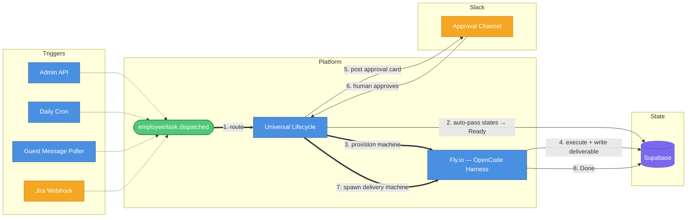
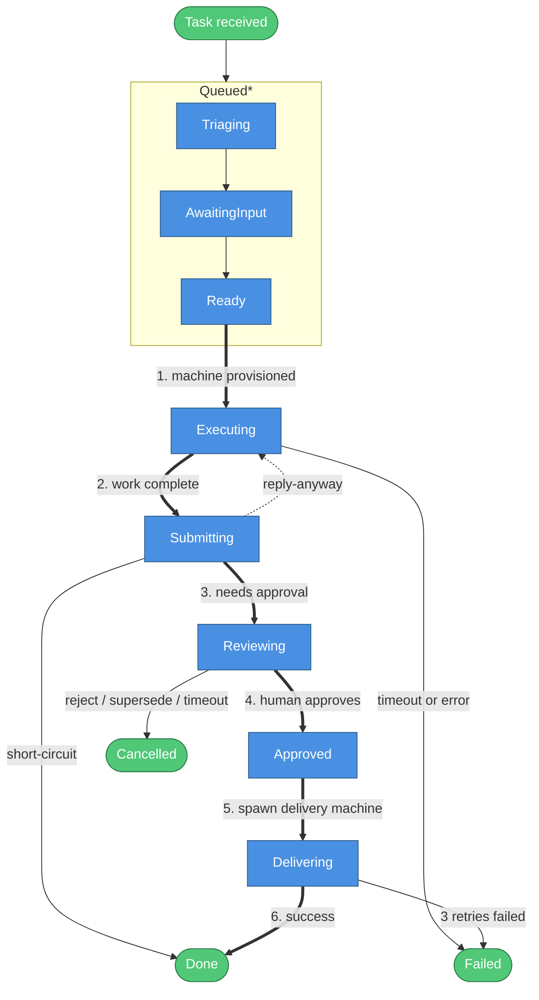
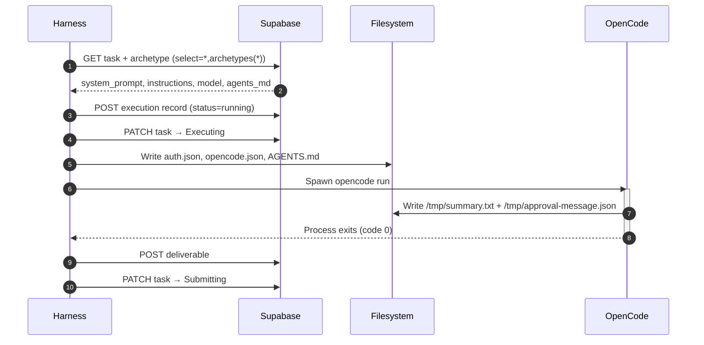
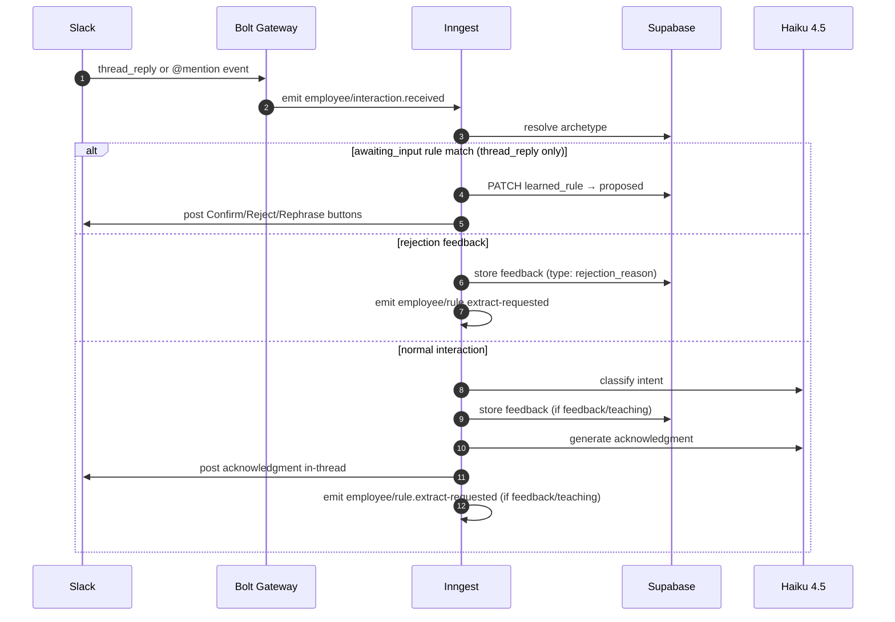
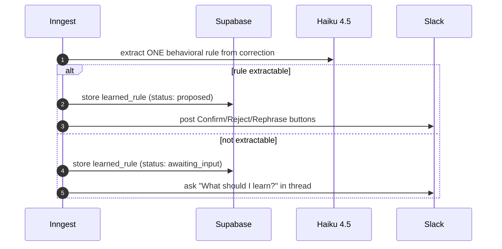

# AI Employee Platform — Current System State

> As of April 29, 2026. After Phase 1 Release 1.0 completion: unified interaction handler (PLAT-10), guest messaging employee with full approval flow, learned rules pipeline, message superseding, reply-anyway flow, rejection feedback loop, delivery phase (PLAT-05), and unresponded message alerts.

---

## How It Works

Every employee follows the same path: trigger → universal lifecycle → OpenCode worker on Fly.io → human approval → done.



| #   | What happens                                                                                                  |
| --- | ------------------------------------------------------------------------------------------------------------- |
| 1   | Inngest routes `employee/task.dispatched` to the **universal lifecycle** (one function for all employees)     |
| 2   | States **Triaging → AwaitingInput → Ready** auto-pass instantly — persisted in Supabase                       |
| 3   | **Executing**: lifecycle provisions a Fly.io machine running `opencode-harness.mjs`                           |
| 4   | Harness fetches archetype + runs OpenCode session; writes deliverable and PATCHes task → `Submitting`         |
| 5   | Lifecycle classifies deliverable, runs supersede check, posts approval card to Slack (`Reviewing`)            |
| 6   | Human clicks Approve — Slack Bolt fires `employee/approval.received`; lifecycle unblocks                      |
| 7   | Lifecycle spawns a **delivery machine** (`EMPLOYEE_PHASE=delivery`) — reads `archetype.delivery_instructions` |
| 8   | Delivery machine PATCHes task → `Done`                                                                        |

---

## Employees

Three employees are defined; one is deprecated and on hold:

| Employee                          | Department  | Trigger                      | Delivery            | Tenant    | Status               |
| --------------------------------- | ----------- | ---------------------------- | ------------------- | --------- | -------------------- |
| **Papi Chulo** (Daily Summarizer) | Operations  | Cron `0 8 * * 1-5` (8am UTC) | Slack message       | Both      | Active               |
| **Guest Messaging**               | Operations  | Cron `*/5 * * * *` + Webhook | Hostfully message   | VLRE only | Active               |
| **Engineering Coder**             | Engineering | Jira webhook                 | GitHub pull request | —         | Deprecated — on hold |

### Daily Summarizer (Papi Chulo)

Runs Mon–Fri at 8am UTC. Reads configured Slack channels, generates a dramatic Spanish news-style digest via OpenCode, posts an approval card to a Slack notification channel, and on approval publishes the final summary via a dedicated delivery phase.

Both DozalDevs and VLRE tenants have their own archetype records. Delivery is handled by a dedicated delivery phase using `delivery_instructions` (PLAT-05 complete) rather than inline lifecycle code.

#### DozalDevs Archetype (`00000000-0000-0000-0000-000000000012`)

- **tenant_id**: `00000000-0000-0000-0000-000000000002`
- **department_id**: `00000000-0000-0000-0000-000000000020` (Operations/DozalDevs)
- **model**: `minimax/minimax-m2.7`
- **runtime**: `opencode`
- **deliverable_type**: `slack_message`
- **trigger_sources**: `{ type: 'cron', expression: '0 8 * * 1-5', timezone: 'America/Chicago' }` (timezone is metadata only — Inngest fires at 8am UTC)
- **risk_model**: `{ approval_required: true, timeout_hours: 24 }`
- **concurrency_limit**: `1`
- **notification_channel**: `null` (resolved via `NOTIFICATION_CHANNEL` env var at runtime)
- **agents_md**: PLATFORM_AGENTS_MD (loaded from `src/workers/config/agents.md`)
- **delivery_instructions**: Reads approved summary from deliverable content, posts to publish channel via `post-message.ts` without approval buttons
- **Channels**:
  - Read from: `C092BJ04HUG` (#project-lighthouse)
  - Notify (approval card): `C0AUBMXKVNU` (#victor-tests)
  - Publish (final): `C092BJ04HUG` (#project-lighthouse)

#### VLRE Archetype (`00000000-0000-0000-0000-000000000013`)

- **tenant_id**: `00000000-0000-0000-0000-000000000003`
- **department_id**: `00000000-0000-0000-0000-000000000021` (Operations/VLRE)
- All other fields identical to DozalDevs archetype (same model, runtime, risk_model, concurrency_limit, delivery_instructions)
- **Channels**:
  - Read from: `C0AMGJQN05S`, `C0ANH9J91NC`, `C0960S2Q8RL`
  - Notify (approval card): `C0960S2Q8RL`
  - Publish (final): `C0960S2Q8RL`

### Guest Messaging

VLRE only. Polls Hostfully's unified inbox every 5 minutes (and accepts webhook triggers), classifies guest messages (`NEEDS_APPROVAL` vs `NO_ACTION_NEEDED`), drafts a response using property-specific knowledge base content, and posts an approval card to Slack. On approval, sends the response back to the guest via Hostfully using a dedicated delivery phase.

#### VLRE Guest Messaging Archetype (`00000000-0000-0000-0000-000000000015`)

- **tenant_id**: `00000000-0000-0000-0000-000000000003` (VLRE)
- **department_id**: `00000000-0000-0000-0000-000000000021` (Operations/VLRE)
- **model**: `minimax/minimax-m2.7`
- **runtime**: `opencode`
- **deliverable_type**: `slack_message`
- **trigger_sources**: `{ type: 'cron_and_webhook', cron_expression: '*/5 * * * *' }`
- **risk_model**: `{ approval_required: true, timeout_hours: 24 }`
- **concurrency_limit**: `5` (multiple concurrent guests)
- **notification_channel**: `null` (resolved via `NOTIFICATION_CHANNEL` env var at runtime)
- **agents_md**: PLATFORM_AGENTS_MD
- **delivery_instructions**: Reads approved response from deliverable content (JSON with `draftResponse` field), sends to guest via `send-message.ts`
- **tool_registry** (8 tools):
  - `/tools/hostfully/get-property.ts`
  - `/tools/hostfully/get-reservations.ts`
  - `/tools/hostfully/get-messages.ts`
  - `/tools/hostfully/send-message.ts`
  - `/tools/slack/post-message.ts`
  - `/tools/slack/read-channels.ts`
  - `/tools/platform/report-issue.ts`
  - `/tools/knowledge_base/search.ts`

**Classification output format** (17 fields):

- Original 8: `classification`, `confidence`, `reasoning`, `draftResponse`, `summary`, `category`, `conversationSummary`, `urgency`
- Guest context fields (9): `guestName`, `propertyName`, `checkIn`, `checkOut`, `bookingChannel`, `originalMessage`, `leadUid`, `threadUid`, `messageUid`

**Classification values**: `NEEDS_APPROVAL`, `NO_ACTION_NEEDED`

### Engineering Coder

Status: **Deprecated — on hold**. Receives Jira tickets via webhook, spawns a Docker/Fly.io worker running OpenCode, delivers a GitHub pull request. No archetype record seeded. See `AGENTS.md` Deprecated Components table.

### Archetype Schema Fields (as of April 29, 2026)

| Column                  | Type         | Default | Notes                                           |
| ----------------------- | ------------ | ------- | ----------------------------------------------- |
| `id`                    | String UUID  | —       | Primary key                                     |
| `department_id`         | String? UUID | —       | FK to departments                               |
| `role_name`             | String?      | —       | e.g. `daily-summarizer`, `guest-messaging`      |
| `runtime`               | String?      | —       | `opencode`                                      |
| `trigger_sources`       | Json?        | —       | Cron/webhook config                             |
| `tool_registry`         | Json?        | —       | Tools available to worker                       |
| `risk_model`            | Json?        | —       | `approval_required`, `timeout_hours`            |
| `concurrency_limit`     | Int          | `3`     | Max parallel machines                           |
| `agent_version_id`      | String? UUID | —       | FK to agent_versions                            |
| `tenant_id`             | String UUID  | —       | FK to tenants (immutable)                       |
| `system_prompt`         | String? Text | —       | LLM system prompt                               |
| `instructions`          | String? Text | —       | Natural language work instructions              |
| `agents_md`             | String? Text | —       | Added 20260423 — AGENTS.md injected into worker |
| `delivery_instructions` | String? Text | —       | Added 20260426 — delivery phase instructions    |
| `notification_channel`  | String? Text | —       | Added 20260427 — channel for approval cards     |
| `model`                 | String?      | —       | LLM model ID                                    |
| `deliverable_type`      | String?      | —       | e.g. `slack_message`                            |

---

## Universal Lifecycle States

```
Received → Triaging* → AwaitingInput* → Ready → Executing → [harness sets Submitting]
→ Validating* → Submitting → [classification check]
  ├─ NO_ACTION_NEEDED: hold at Submitting, wait for reply-anyway event
  │    ├─ timeout (24h): → Done
  │    └─ reply-anyway received: → Executing (re-draft) → Submitting → Reviewing
  └─ normal: → [supersede check] → Reviewing → [wait approval event]
       ├─ approve: → Approved → Delivering → Done (up to 3 delivery retries)
       ├─ reject: → Cancelled (+ posts feedback prompt in thread)
       ├─ superseded: → Cancelled
       └─ timeout (24h): → Cancelled
```

Short-circuit: `Submitting → Done` (when `risk_model.approval_required: false`)

`*` = auto-pass (transit immediately, no blocking)



| #   | Transition   | What happens                                                                               |
| --- | ------------ | ------------------------------------------------------------------------------------------ |
| 1   | → Executing  | Lifecycle provisions a Fly.io machine running `opencode-harness.mjs`                       |
| 2   | → Submitting | OpenCode session completes; harness writes deliverable and PATCHes task to `Submitting`    |
| 3   | → Reviewing  | Lifecycle classifies deliverable, runs supersede check, posts approval card to Slack       |
| 4   | → Approved   | Human clicks Approve in Slack; Bolt fires `employee/approval.received`; lifecycle unblocks |
| 5   | → Delivering | Lifecycle spawns a second Fly.io machine with `EMPLOYEE_PHASE=delivery`                    |
| 6   | → Done       | Delivery machine completes and PATCHes task to `Done`                                      |

**Terminal states:**

- **`Failed`**: (a) poll-completion timeout after 60 polls × 15s; (b) harness sets `Failed` directly (SIGTERM, OOM, unhandled error); (c) archetype missing `delivery_instructions`; (d) delivery machine failed all 3 attempts
- **`Cancelled`**: (a) human rejects approval; (b) 24-hour approval timeout; (c) superseded by a newer task for the same `conversation_ref`
- **`Done`**: (a) delivery machine marks `Done` after successful delivery; (b) `approval_required: false` short-circuit; (c) `NO_ACTION_NEEDED` + 24h timeout (no reply-anyway received)

### Delivery Mechanism (PLAT-05)

On approval:

1. Lifecycle sets `Approved` then immediately `Delivering`
2. Spawns a new Fly.io machine with `EMPLOYEE_PHASE: 'delivery'` env var
3. Polls for `Done` or `Failed` (max 20 polls × 15s = 5 min per attempt)
4. Up to **3 retry attempts** on failure; between retries, resets status back to `Delivering`
5. After 3 failures: marks `Failed`, updates Slack message with error
6. On success: updates Slack message to "Sent to guest", clears `pending_approvals` row

### Message Superseding (GM-11)

After deciding approval is required, the `check-supersede` step runs:

1. Reads `deliverable.metadata.conversation_ref` (identifies the Hostfully guest conversation)
2. Calls `getPendingApproval(tenantId, conversationRef)` against `pending_approvals` table
3. If a previous task exists for that `conversation_ref` and is still `Reviewing`: fires `employee/approval.received` with `action: 'superseded'` to unblock old lifecycle; old task transitions to `Cancelled`; old Slack card updated to "⏭️ Superseded"
4. New task then sets `Reviewing` and tracks itself in `pending_approvals`

The `@@unique([tenant_id, thread_uid])` constraint enforces one pending approval per conversation per tenant.

### Rejection Feedback Loop (GM-17)

On rejection:

1. If `rejectionReason` provided: stored in `task.metadata.rejectionReason` and in `feedback` table as `feedback_type: 'rejection_reason'`
2. Sets `task.metadata.rejection_feedback_requested: true` — lets the interaction handler route subsequent thread replies as rejection feedback
3. Posts thread reply: "Got it, @user. What should I have done differently? (Reply here — I'll learn from it.)"
4. Updates Slack card to "❌ Rejected by @user"
5. Clears `pending_approvals` row, sets status `Cancelled`

### Reply Anyway Flow (GM-16)

Triggered when classification returns `NO_ACTION_NEEDED`:

1. Lifecycle destroys original machine, enters `wait-for-reply-anyway` step
2. Waits for `employee/reply-anyway.requested` event, up to `timeoutHours`
3. **Timeout path**: marks `Done` (no action taken)
4. **Reply-anyway path**: sets `task.metadata.reply_anyway: true`, spawns re-draft machine with `REPLY_ANYWAY_CONTEXT` env var, polls for `Submitting`, then proceeds to `check-supersede` → `Reviewing`

### Edited Content on Approval

If `approvalEvent.data.editedContent` is present (PM edited the draft before approving):

- Patches deliverable's `content.draftResponse` with the edited text
- Emits `employee/rule.extract-requested` with `feedback_type: 'edit_diff'` for automated rule extraction

---

## Workers: OpenCode Harness

All active employees run `opencode-harness.mjs` directly (Fly.io CMD override at dispatch time). The engineering employee (on hold) uses the default Dockerfile CMD `bash entrypoint.sh`.

The harness handles two distinct phases controlled by the `EMPLOYEE_PHASE` env var:

- **Default (execution phase)**: Fetches archetype, builds system prompt with context injections, runs OpenCode, POSTs deliverable, transitions to `Submitting`
- **Delivery phase** (`EMPLOYEE_PHASE=delivery`): Reads the approved deliverable, constructs delivery instructions, runs a second OpenCode session, transitions to `Done`

### Harness Execution Flow



| Step | What the harness does                                                                                                                             |
| ---- | ------------------------------------------------------------------------------------------------------------------------------------------------- |
| 1    | Validate `TASK_ID` env var — `process.exit(1)` if missing                                                                                         |
| 2    | Register `SIGTERM` handler — PATCHes task to `Failed` with reason `"Worker terminated"`, then `process.exit(1)`                                   |
| 3    | Set `OPENCODE_EXPERIMENTAL_BASH_DEFAULT_TIMEOUT_MS = 1200000` (20 min bash tool timeout) if not already set                                       |
| 4    | Fetch task + archetype: `GET /rest/v1/tasks?id=eq.{TASK_ID}&select=*,archetypes(*)`                                                               |
| 5    | Check `EMPLOYEE_PHASE === 'delivery'` — if true, branch to delivery phase (see below)                                                             |
| 6    | Build system prompt: start with `archetype.system_prompt`, optionally prepend `FEEDBACK_CONTEXT`, then append `LEARNED_RULES_CONTEXT`             |
| 7    | Build instructions: if `REPLY_ANYWAY_CONTEXT` is set, prepend the reply-anyway override preamble; otherwise use `archetype.instructions` verbatim |
| 8    | Validate that `instructions` is non-empty — `process.exit(1)` if missing                                                                          |
| 9    | Create execution record: `POST /rest/v1/executions` (`status: "running"`)                                                                         |
| 10   | PATCH task to `Executing`                                                                                                                         |
| 11   | Write OpenCode auth: `~/.local/share/opencode/auth.json` (OpenRouter API key)                                                                     |
| 12   | Write `.opencode/opencode.json` with `{ permission: { '*': 'allow', question: 'deny' } }`                                                         |
| 13   | Fetch tenant config: `GET /rest/v1/tenants?id=eq.{tenant_id}&select=config`                                                                       |
| 14   | Resolve + write AGENTS.md: read `/app/AGENTS.md` → call `resolveAgentsMd()` → overwrite `/app/AGENTS.md`                                          |
| 15   | Spawn `opencode run --model openrouter/{model} "{systemPrompt}\n\n{instructions}\n\nTask ID: {TASK_ID}"` subprocess                               |
| 16   | Wait for OpenCode to exit; capture stdout/stderr to logs                                                                                          |
| 17   | Read `/tmp/summary.txt` → deliverable content; read `/tmp/approval-message.json` → metadata. Throw if **both** absent                             |
| 18   | POST deliverable: `POST /rest/v1/deliverables` (`external_ref: TASK_ID`, `content`, `metadata`)                                                   |
| 19   | PATCH task to `Submitting`                                                                                                                        |
| 20   | Fire `employee/task.completed` Inngest event (`POST {INNGEST_BASE_URL}/e/{INNGEST_EVENT_KEY}`)                                                    |
| 21   | `process.exit(0)`                                                                                                                                 |

### Delivery Phase Flow (6 steps)

| Step | What the harness does                                                                                        |
| ---- | ------------------------------------------------------------------------------------------------------------ |
| D1   | Validate `archetype.delivery_instructions` — mark `Failed` and return if missing                             |
| D2   | Fetch latest deliverable: `GET /rest/v1/deliverables?external_ref=eq.{taskId}&order=created_at.desc&limit=1` |
| D3   | Mark `Failed` and return if no deliverable found                                                             |
| D4   | Build delivery instructions: `"APPROVED CONTENT TO DELIVER:\n{content}\n\n{delivery_instructions}"`          |
| D5   | Run second `opencode run` session with delivery instructions                                                 |
| D6   | PATCH task to `Done`, log status transition `Delivering → Done`                                              |

### Context Injections

Three env var context injections are applied to the system prompt / instructions before the OpenCode session:

#### 1. `FEEDBACK_CONTEXT`

- **Source**: Injected by the lifecycle's `load-env` step from stored feedback records in the `feedback` table
- **Injection point**: System prompt — appended after `archetype.system_prompt`

#### 2. `LEARNED_RULES_CONTEXT` (GM-19)

- **Source**: Injected by lifecycle; contains the knowledge base digest written by the feedback-summarizer weekly cron
- **Injection point**: System prompt — appended after FEEDBACK_CONTEXT (or base prompt)

#### 3. `REPLY_ANYWAY_CONTEXT` (GM-16)

- **Source**: Injected by lifecycle when a PM clicks "Reply Anyway" on a NO_ACTION_NEEDED notification
- **Injection point**: Instructions — replaces normal `archetype.instructions`; prepends a full override preamble
- **Behavior**: Instructs OpenCode to skip Step 1 (message fetching), classify as NEEDS_APPROVAL, draft a response, continue from Step 5

### AGENTS.md Resolution (3-level)

Implemented in `src/workers/lib/agents-md-resolver.mts`. The function `resolveAgentsMd(platformContent, tenantConfig, archetype)` concatenates all non-empty sections in order:

| Level        | Source                            | Section header            | Condition                          |
| ------------ | --------------------------------- | ------------------------- | ---------------------------------- |
| 1 (required) | `/app/AGENTS.md` read at runtime  | `# Platform Policy`       | Always included                    |
| 2 (optional) | `tenant.config.default_agents_md` | `# Tenant Conventions`    | Included if non-empty string       |
| 3 (optional) | `archetype.agents_md`             | `# Employee Instructions` | Included if non-null and non-empty |

The result is written back to `/app/AGENTS.md`, overwriting the static file. OpenCode reads `/app/AGENTS.md` automatically during session startup.

**Static platform AGENTS.md** (`src/workers/config/agents.md`) contains 6 policies:

1. **Source access**: Read any `/tools/*.ts` file when debugging tool behavior
2. **Patch permission**: Edit `/tools/` TypeScript files if broken (temporary, session-scoped only)
3. **Smoke test**: Run `--help` after any patch before real use (hard requirement)
4. **Mandatory issue reporting**: Report every tool issue before task ends via `report-issue.ts` tool
5. **Platform code off-limits**: Never modify `/app/dist/`, `/app/node_modules/`, or anything outside `/tools/`
6. **Database access only via tools**: Never use `psql`, PostgREST curl, raw SQL, or connection strings directly

### Output Contract

OpenCode is expected to write two files:

| File                         | Purpose                                                                | Mapped to                                                                                   |
| ---------------------------- | ---------------------------------------------------------------------- | ------------------------------------------------------------------------------------------- |
| `/tmp/summary.txt`           | Deliverable content (the actual output — summary text, analysis, etc.) | `deliverables.content`                                                                      |
| `/tmp/approval-message.json` | Slack message metadata (`ts`, `channel`, optional `conversationRef`)   | `deliverables.metadata` (keys: `approval_message_ts`, `target_channel`, `conversation_ref`) |

**Failure condition**: If **both** files are absent, the harness throws:

> `"Model did not produce content — /tmp/summary.txt and /tmp/approval-message.json were not written. This is a model reliability issue; retry the task."`

Writing **either** file alone is sufficient to proceed.

### SIGTERM Handling

SIGTERM handler registered at module top, before `main()` is called:

1. Logs: `"SIGTERM received — marking task Failed"`
2. PATCHes task: `status: 'Failed', failure_reason: 'Worker terminated'`
3. Calls `process.exit(1)` in `.finally()`

This explains why tasks show as `Failed` after Fly.io machine preemption (machines send SIGTERM before termination).

---

## Shell Tools (13 tools across 4 directories)

All tools are TypeScript source files executed via `tsx` inside the worker container. All write JSON to stdout, errors to stderr. Exit code 0 = success, 1 = failure. `--help` flag available on all tools.

> **Dockerfile gap**: `post-guest-approval.ts` and `post-no-action-notification.ts` exist in `src/worker-tools/slack/` but are **NOT** copied into the Docker image. Invocation via `tsx /tools/slack/post-guest-approval.ts` will fail with "file not found" until the Dockerfile is updated and the image rebuilt.

### `slack/` (4 tools in source; 2 deployed in Docker)

Env var required: `SLACK_BOT_TOKEN`

| Tool                                              | Usage                                                                                                                                                                                                                                                                                                                                                                                                                       | Output                                                                                                                                                                                                                                                                                           |
| ------------------------------------------------- | --------------------------------------------------------------------------------------------------------------------------------------------------------------------------------------------------------------------------------------------------------------------------------------------------------------------------------------------------------------------------------------------------------------------------- | ------------------------------------------------------------------------------------------------------------------------------------------------------------------------------------------------------------------------------------------------------------------------------------------------ |
| `post-message.ts`                                 | `tsx /tools/slack/post-message.ts --channel "C123" --text "msg" [--blocks '[...]'] [--task-id "uuid"] [--conversation-ref "<string>"]`                                                                                                                                                                                                                                                                                      | `{"ts":"...","channel":"...","conversationRef?":"..."}`. When `--task-id` provided, auto-generates approval blocks (header + text + divider + context + Approve/Reject buttons). `--blocks` overrides auto-generation.                                                                           |
| `read-channels.ts`                                | `tsx /tools/slack/read-channels.ts --channels "C123,C456" [--lookback-hours 24]`                                                                                                                                                                                                                                                                                                                                            | `{"channels":[{"channelId":"...","messages":[...],"threadReplies":{}}]}`. Thread replies fetched for all threaded messages. Bot summary posts filtered out. Messages truncated at 500 chars.                                                                                                     |
| `post-guest-approval.ts` ⚠️ NOT IN DOCKER         | `tsx /tools/slack/post-guest-approval.ts --channel "C123" --task-id "uuid" --guest-name "John" --property-name "Beachhouse" --check-in "2026-05-01" --check-out "2026-05-05" --booking-channel "AIRBNB" --original-message "..." --draft-response "..." --confidence 0.92 --category "check_in_question" --lead-uid "uuid" --thread-uid "uuid" --message-uid "uuid" [--urgency] [--conversation-summary "..."] [--dry-run]` | `{"ts":"...","channel":"..."}`. With `--dry-run`: `{"blocks":[...]}` (no Slack call). Posts rich Block Kit card with guest info, original message, draft response, confidence %, and Approve & Send / Edit & Send / Reject buttons (`action_id`: `guest_approve`, `guest_edit`, `guest_reject`). |
| `post-no-action-notification.ts` ⚠️ NOT IN DOCKER | `tsx /tools/slack/post-no-action-notification.ts --channel "C123" --task-id "uuid" --guest-name "John" --property-name "Beachhouse" --check-in "2026-05-01" --check-out "2026-05-05" --booking-channel "AIRBNB" --original-message "..." --summary "..." --confidence 0.88 --category "no_action" --lead-uid "uuid" --thread-uid "uuid" --message-uid "uuid" [--conversation-summary "..."] [--dry-run]`                    | `{"ts":"...","channel":"..."}`. With `--dry-run`: `{"blocks":[...]}`. Posts informational card with "Reply Anyway" button (`action_id`: `guest_reply_anyway`). Original message truncated at 300 chars in display.                                                                               |

### `hostfully/` (7 tools)

All require `HOSTFULLY_API_KEY` env var (header: `X-HOSTFULLY-APIKEY`).
Default API base: `https://api.hostfully.com/api/v3.2` (overridable via `HOSTFULLY_API_URL`).
Exception: `get-reviews.ts` defaults to `https://api.hostfully.com/api/v3.3`.
All support cursor-based pagination with dedup loop.

| Tool                  | Usage                                                                                                                                               | Output                                                                                                                                                                                                                                                                                                                                                                                                           |
| --------------------- | --------------------------------------------------------------------------------------------------------------------------------------------------- | ---------------------------------------------------------------------------------------------------------------------------------------------------------------------------------------------------------------------------------------------------------------------------------------------------------------------------------------------------------------------------------------------------------------- |
| `validate-env.ts`     | `tsx /tools/hostfully/validate-env.ts`                                                                                                              | `{"ok":true,"apiKeySet":true,"agencyUidSet":true}`. Checks both `HOSTFULLY_API_KEY` and `HOSTFULLY_AGENCY_UID`.                                                                                                                                                                                                                                                                                                  |
| `get-properties.ts`   | `tsx /tools/hostfully/get-properties.ts`                                                                                                            | `[{"uid":"...","name":"...","propertyType":"...","city":"...","state":"...","bedrooms":N,"maxGuests":N,"isActive":true}]`. Requires `HOSTFULLY_AGENCY_UID`. Paginates all properties for the agency.                                                                                                                                                                                                             |
| `get-property.ts`     | `tsx /tools/hostfully/get-property.ts --property-id "<uid>"`                                                                                        | `{"uid":"...","name":"...","address":"...","bedrooms":N,"beds":N,"bathrooms":"...","maxGuests":N,"checkInTime":N,"checkOutTime":N,"wifiNetwork":"...","wifiPassword":"...","bookingNotes":"...","extraNotes":"...","guideBookUrl":"...","amenities":[...],"houseRules":[{"rule":"...","description":"..."}]}`. Fetches property + amenities + rules in parallel; amenity/rule failures are warnings (non-fatal). |
| `get-reservations.ts` | `tsx /tools/hostfully/get-reservations.ts --property-id "<uid>" [--status confirmed\|cancelled\|inquiry] [--from "YYYY-MM-DD"] [--to "YYYY-MM-DD"]` | `[{"uid":"...","propertyUid":"...","guestName":"...","checkIn":"...","checkOut":"...","channel":"AIRBNB","numberOfGuests":N,"status":"BOOKED"}]`. Default: BOOKING-type leads only, check-in from today forward.                                                                                                                                                                                                 |
| `get-messages.ts`     | `tsx /tools/hostfully/get-messages.ts --property-id "<uid>" [--unresponded-only] [--limit 30]`                                                      | `[{"reservationId":"...","guestName":"...","channel":"AIRBNB","unresponded":true,"messages":[{"text":"...","sender":"guest"\|"host","timestamp":"ISO8601"}]}]`. Two-step: fetches BOOKING leads first, then `/messages?leadUid=` for each. Client-side unresponded filter (last message senderType === GUEST).                                                                                                   |
| `get-reviews.ts`      | `tsx /tools/hostfully/get-reviews.ts [--property-id "<uid>"] [--since "2026-01-01"] [--unresponded-only]`                                           | `[{"uid":"...","propertyUid":"...","guestName":"...","title":"...","content":"...","rating":N,"date":"...","source":"...","hasResponse":false,"responseDateTimeUTC":null}]`. Without `--property-id`, fetches all properties via `HOSTFULLY_AGENCY_UID` then reviews per property. `--since` maps to `updatedSince`. API v3.3.                                                                                   |
| `send-message.ts`     | `tsx /tools/hostfully/send-message.ts --lead-id "<uid>" --message "<text>" [--thread-id "<uid>"]`                                                   | `{"sent":true,"messageId":"uuid\|null","timestamp":"ISO8601\|null"}`. **IRREVERSIBLE** — delivered immediately to guest via booking channel (Airbnb, VRBO, etc.). senderType: AGENCY. 204 response (empty body) also treated as success.                                                                                                                                                                         |

### `knowledge_base/` (1 tool)

| Tool        | Usage                                                                                            | Output                                                                                                                                                                                                                                                                      |
| ----------- | ------------------------------------------------------------------------------------------------ | --------------------------------------------------------------------------------------------------------------------------------------------------------------------------------------------------------------------------------------------------------------------------- |
| `search.ts` | `tsx /tools/knowledge_base/search.ts --entity-type <type> --entity-id <id> [--tenant-id <uuid>]` | `{"content":"<entity>\n\n---\n\n# Common Policies\n\n<common>","entityFound":true,"commonFound":true,"entityType":"property","entityId":"<id>"}`. Content is entity-specific + common policies concatenated. Returns exit 0 even if no rows found (content = empty string). |

Env vars: `SUPABASE_URL` (required), `SUPABASE_SECRET_KEY` (required), `TENANT_ID` (required if `--tenant-id` not provided).

### `platform/` (1 tool)

| Tool              | Usage                                                                                                                      | Output                                                                                                                                                                                              |
| ----------------- | -------------------------------------------------------------------------------------------------------------------------- | --------------------------------------------------------------------------------------------------------------------------------------------------------------------------------------------------- |
| `report-issue.ts` | `tsx /tools/platform/report-issue.ts --task-id "<id>" --tool-name "<name>" --description "<text>" [--patch-diff "<diff>"]` | `{"ok":true,"event_id":"<uuid>"}`. Writes to `system_events` table via PostgREST. Slack alert is non-fatal (warns to stderr if fails or `ISSUES_SLACK_CHANNEL` not set). DB write failure → exit 1. |

Env vars: `SUPABASE_URL` (required), `SUPABASE_SECRET_KEY` (required), `TENANT_ID` (required), `SLACK_BOT_TOKEN` (required), `ISSUES_SLACK_CHANNEL` (optional), `SLACK_API_BASE_URL` (optional, default `https://slack.com/api`).

---

## Feedback Pipeline

All Slack interactions (thread replies and @mentions) are now routed through a **single Inngest event** `employee/interaction.received`. The Bolt handlers fire this event with `source: 'thread_reply'` or `source: 'mention'`.

### Interaction Handler Flow



| #   | What happens                                                                                               |
| --- | ---------------------------------------------------------------------------------------------------------- |
| 1   | User sends a thread reply or @mention — Slack Bolt captures the event                                      |
| 2   | Bolt Gateway fires `employee/interaction.received` with `source`, `text`, `userId`, `channelId`, `taskId?` |
| 3   | `interaction-handler` resolves the archetype (from `taskId` for thread replies, `channelId` for mentions)  |
| 4a  | **awaiting_input path**: reply text captured as rule, status → `proposed`, confirmation buttons posted     |
| 4b  | **rejection feedback path**: text stored as `rejection_reason`; rule extraction emitted async              |
| 4c  | **normal path**: Haiku classifies intent → stores feedback if applicable → posts acknowledgment in-thread  |

### Rule Extraction Flow



| #   | What happens                                                                                                                              |
| --- | ----------------------------------------------------------------------------------------------------------------------------------------- |
| 1   | Haiku receives the correction text and attempts to extract one concrete behavioral rule                                                   |
| 2a  | **Extractable**: rule stored as `proposed` in `learned_rules`; Confirm/Reject/Rephrase buttons posted to `archetype.notification_channel` |
| 2b  | **Not extractable**: rule created as `awaiting_input`; bot asks "What should I learn?" in thread                                          |

**Thread Reply Flow:**

1. User replies in a Slack thread on a task message
2. Bolt fires `employee/interaction.received` with `source: 'thread_reply'`, `taskId`, `threadTs`, `channelId`, `userId`, `text`
3. `interaction-handler` resolves archetype from `taskId`
4. **Special case — awaiting_input rule:** If the thread matches a `learned_rules` row with `status = 'awaiting_input'`, the reply text is captured as the rule, status set to `proposed`, and Confirm/Reject/Rephrase buttons posted
5. **Special case — rejection feedback:** If task is `Cancelled` and `metadata.rejection_feedback_requested = true` for this user, text is stored as `feedback_type: rejection_reason`, `employee/rule.extract-requested` is emitted
6. Otherwise: intent classified via `InteractionClassifier` (Haiku 4.5) → `feedback | teaching | question | task`
7. Route: `feedback`/`teaching` → stored to `feedback` table; `question` → KB lookup + Haiku answer; `task` → `employee/task.requested` emitted (stubbed)
8. Haiku generates acknowledgment and posts in-thread
9. If feedback/teaching: `employee/rule.extract-requested` emitted → `rule-extractor` processes async

**@Mention Flow:**

1. User @mentions the bot in any channel
2. Bolt fires `employee/interaction.received` with `source: 'mention'`, `tenantId`, `channelId`, `userId`, `text`
3. `interaction-handler` resolves archetype from `channelId` + `tenantId` (may be null)
4. Skips awaiting_input and rejection checks (thread_reply only)
5. Intent classified → same route-and-store → acknowledgment posted
6. If feedback/teaching: rule extraction emitted

**Rule Extraction Sub-flow (async, via `employee/rule-extractor`):**

1. `employee/rule.extract-requested` received
2. Haiku extracts ONE concrete behavioral rule from the correction text
3. If extractable: stored as `proposed` in `learned_rules` + Confirm/Reject/Rephrase buttons posted to `archetype.notification_channel`
4. If not extractable: `awaiting_input` rule created, "What should I learn from this change?" posted in thread

**Weekly Feedback Summary (Sunday midnight UTC):**

1. Reads all feedback from last 7 days
2. Haiku generates theme analysis → stored in `knowledge_bases`
3. Reads all `confirmed` learned rules per archetype
4. If ≥2 confirmed rules: Haiku detects overlaps/contradictions → merged rules proposed via Confirm/Reject/Rephrase buttons; contradictions posted as informational alerts

---

## Inngest Functions

### Active (8)

| #   | Function ID                           | Trigger                                  | File                                                | Purpose                                                                                                                                                                                                                                                           |
| --- | ------------------------------------- | ---------------------------------------- | --------------------------------------------------- | ----------------------------------------------------------------------------------------------------------------------------------------------------------------------------------------------------------------------------------------------------------------- |
| 1   | `employee/universal-lifecycle`        | event: `employee/task.dispatched`        | `src/inngest/employee-lifecycle.ts`                 | Universal durable lifecycle for all employee types (Received → Done), dispatches Fly.io machines, handles approval flow                                                                                                                                           |
| 2   | `trigger/daily-summarizer`            | cron: `0 8 * * 1-5` (8am UTC weekdays)   | `src/inngest/triggers/summarizer-trigger.ts`        | Discovers daily-summarizer archetypes and dispatches one summary task per tenant per day; dedupes via `summary-{YYYY-MM-DD}` external ID                                                                                                                          |
| 3   | `employee/interaction-handler`        | event: `employee/interaction.received`   | `src/inngest/interaction-handler.ts`                | **Unified handler (PLAT-10)** — classifies and routes both thread replies and @mentions; stores feedback, answers questions, sends Haiku acknowledgments, emits rule extraction events                                                                            |
| 4   | `trigger/feedback-summarizer`         | cron: `0 0 * * 0` (Sunday midnight UTC)  | `src/inngest/triggers/feedback-summarizer.ts`       | Reads 7 days of feedback, generates theme summaries via Haiku, writes to knowledge_bases; also synthesizes overlapping confirmed rules into merged proposals                                                                                                      |
| 5   | `trigger/guest-message-poller`        | cron: `*/5 * * * *` (every 5 min)        | `src/inngest/triggers/guest-message-poller.ts`      | Discovers guest-messaging archetypes and dispatches guest message processing tasks; deduplication via time-slot-based external ID                                                                                                                                 |
| 6   | `trigger/unresponded-message-alerter` | cron: `*/5 * * * *` (every 5 min)        | `src/inngest/triggers/unresponded-message-alert.ts` | Checks pending_approvals for stale guest messages (configurable threshold, default 30 min); sends Slack reminder blocks respecting quiet hours config                                                                                                             |
| 7   | `employee/rule-extractor`             | event: `employee/rule.extract-requested` | `src/inngest/rule-extractor.ts`                     | Extracts a concrete behavioral rule from feedback text using Haiku; if extractable, stores as `proposed` in learned_rules and posts Confirm/Reject/Rephrase buttons to Slack; if not extractable, creates `awaiting_input` rule and asks human to supply the rule |
| 8   | `trigger/learned-rules-expiry`        | cron: `0 2 * * *` (daily 2am UTC)        | `src/inngest/triggers/learned-rules-expiry.ts`      | TTL-expires `proposed` learned rules older than 30 days with no confirmation by patching status to `expired`                                                                                                                                                      |

> **Cron timezone — CRITICAL**: The Inngest cron `0 8 * * 1-5` fires at **8am UTC**, not 8am CT. Inngest has no timezone config on this function. The archetype's `trigger_sources.timezone: "America/Chicago"` is stored as documentation metadata only — the Inngest runtime never reads it.

### Deprecated (3 — still registered in serve.ts)

| #   | Function ID                   | Trigger                              | File                        | Notes                                                             |
| --- | ----------------------------- | ------------------------------------ | --------------------------- | ----------------------------------------------------------------- |
| 1   | `engineering/task-lifecycle`  | event: `engineering/task.received`   | `src/inngest/lifecycle.ts`  | Engineering employee lifecycle — on hold, do not modify           |
| 2   | `engineering/task-redispatch` | event: `engineering/task.redispatch` | `src/inngest/redispatch.ts` | Paired with deprecated lifecycle — on hold                        |
| 3   | `engineering/watchdog-cron`   | cron: `*/10 * * * *`                 | `src/inngest/watchdog.ts`   | Detects stuck engineering tasks — still registered, do not modify |

All 11 functions are registered in `src/gateway/inngest/serve.ts`.

---

## Gateway and Routes

Gateway startup: validates `ENCRYPTION_KEY` + `ADMIN_API_KEY`, initializes Slack Bolt (Socket Mode when `SLACK_APP_TOKEN` is set), registers all routes, listens on `PORT` (default 7700).

**Required env vars at startup** (hard failures): `ENCRYPTION_KEY`, `ADMIN_API_KEY`

**Logged warnings (soft, gateway still starts)**: `JIRA_WEBHOOK_SECRET` missing, Slack vars missing (`SLACK_SIGNING_SECRET`, `SLACK_CLIENT_ID`, `SLACK_CLIENT_SECRET`)

### Webhook Routes (no auth)

| Method | Path               | Description                                                                                                                                                                                                                            |
| ------ | ------------------ | -------------------------------------------------------------------------------------------------------------------------------------------------------------------------------------------------------------------------------------- |
| `GET`  | `/health`          | Returns `{"status":"ok"}`                                                                                                                                                                                                              |
| `POST` | `/webhooks/jira`   | Jira webhook — handles `jira:issue_created`, `jira:issue_deleted`; ignores `jira:issue_updated`. Resolves tenant from `jira_project_key`, verifies HMAC-SHA256 signature. Creates task + fires `engineering/task.received` to Inngest. |
| `POST` | `/webhooks/github` | GitHub webhook stub — always returns `{received:true, stub:true}`. Not active in MVP.                                                                                                                                                  |

### Slack OAuth Routes (no auth)

| Method | Path                               | Description                                                                                                                                                                             |
| ------ | ---------------------------------- | --------------------------------------------------------------------------------------------------------------------------------------------------------------------------------------- |
| `GET`  | `/slack/install?tenant=<tenantId>` | Generates HMAC-signed state token, redirects to `slack.com/oauth/v2/authorize` with scopes: `channels:history,groups:history,groups:read,chat:write,chat:write.public`                  |
| `GET`  | `/slack/oauth_callback`            | Verifies state, exchanges code for token, stores encrypted `slack_bot_token` in `tenant_secrets`, upserts `tenant_integrations`. 409 if workspace already attached to different tenant. |

### Admin Routes (`X-Admin-Key` header required)

Auth: `requireAdminKey` middleware — timing-safe comparison of `X-Admin-Key` header against `ADMIN_API_KEY` env var. Returns 401 on missing/wrong key.

**Tenant CRUD:**

| Method   | Path                               | Description                                                           |
| -------- | ---------------------------------- | --------------------------------------------------------------------- |
| `POST`   | `/admin/tenants`                   | Create tenant. Returns 201 with `install_link`. 409 on slug conflict. |
| `GET`    | `/admin/tenants`                   | List tenants. `?include_deleted=true` to include soft-deleted.        |
| `GET`    | `/admin/tenants/:tenantId`         | Get single tenant. `?include_deleted=true` supported.                 |
| `PATCH`  | `/admin/tenants/:tenantId`         | Update tenant name/status/config (full replace of config).            |
| `DELETE` | `/admin/tenants/:tenantId`         | Soft-delete tenant. Returns `{id, deleted_at}`.                       |
| `POST`   | `/admin/tenants/:tenantId/restore` | Restore soft-deleted tenant. 404 if not found. 409 if slug collision. |

**Tenant Secrets:**

| Method   | Path                                    | Description                                                    |
| -------- | --------------------------------------- | -------------------------------------------------------------- |
| `GET`    | `/admin/tenants/:tenantId/secrets`      | List secret keys (not values — AES-256-GCM encrypted at rest). |
| `PUT`    | `/admin/tenants/:tenantId/secrets/:key` | Set/upsert a secret value. Body: `{value: string}`.            |
| `DELETE` | `/admin/tenants/:tenantId/secrets/:key` | Delete a secret. 404 if key not found.                         |

**Tenant Config:**

| Method  | Path                              | Description                          |
| ------- | --------------------------------- | ------------------------------------ |
| `GET`   | `/admin/tenants/:tenantId/config` | Get tenant config JSON.              |
| `PATCH` | `/admin/tenants/:tenantId/config` | Deep-merge patch into tenant config. |

**Projects:**

| Method   | Path                                    | Description                                                           |
| -------- | --------------------------------------- | --------------------------------------------------------------------- |
| `POST`   | `/admin/tenants/:tenantId/projects`     | Create project. 409 on conflict.                                      |
| `GET`    | `/admin/tenants/:tenantId/projects`     | List all projects for tenant.                                         |
| `GET`    | `/admin/tenants/:tenantId/projects/:id` | Get single project.                                                   |
| `PATCH`  | `/admin/tenants/:tenantId/projects/:id` | Update project.                                                       |
| `DELETE` | `/admin/tenants/:tenantId/projects/:id` | Delete project. 409 if active tasks exist (`activeTaskIds` returned). |

**Employee + Tasks:**

| Method | Path                                               | Description                                                                                                                                                                                                 |
| ------ | -------------------------------------------------- | ----------------------------------------------------------------------------------------------------------------------------------------------------------------------------------------------------------- |
| `POST` | `/admin/tenants/:tenantId/employees/:slug/trigger` | Trigger employee. `?dry_run=true` to validate without creating task. Returns 202 + `{task_id, status_url}` or 200 `{valid:true, would_fire:{...}}`. 404 if archetype not found. 501 if unsupported runtime. |
| `GET`  | `/admin/tenants/:tenantId/tasks/:id`               | Get task status. Tenant-scoped (404 on cross-tenant). Returns `{id, status, source_system, external_id, archetype_id, created_at, updated_at}`.                                                             |

**Knowledge Base:**

| Method   | Path                                           | Description                                                       |
| -------- | ---------------------------------------------- | ----------------------------------------------------------------- |
| `POST`   | `/admin/tenants/:tenantId/kb/entries`          | Create KB entry. 409 on conflict.                                 |
| `GET`    | `/admin/tenants/:tenantId/kb/entries`          | List KB entries. Filterable by `?entity_type=` and `?entity_id=`. |
| `GET`    | `/admin/tenants/:tenantId/kb/entries/:entryId` | Get single KB entry.                                              |
| `PATCH`  | `/admin/tenants/:tenantId/kb/entries/:entryId` | Update KB entry content.                                          |
| `DELETE` | `/admin/tenants/:tenantId/kb/entries/:entryId` | Delete KB entry.                                                  |

**Total: 29 HTTP routes** (1 health + 2 webhooks + 2 Slack OAuth + 23 admin + 1 Inngest)

### Inngest

| Method         | Path           | Description                                                                               |
| -------------- | -------------- | ----------------------------------------------------------------------------------------- |
| `GET/POST/PUT` | `/api/inngest` | Inngest serve endpoint — registered via `inngestServeRoutes()` mounted at `/api/inngest`. |

### Slack Bolt Handlers (Socket Mode)

**CRITICAL**: The Papi Chulo Slack app uses Socket Mode. Never configure an Interactivity Request URL in the Slack API dashboard. `SLACK_APP_TOKEN=xapp-...` is set in `.env`. Gateway logs show `"Slack Bolt — Socket Mode connected"` on every startup.

#### Event Handlers

| Event         | Condition                                            | Action                                                                                                                                                                 |
| ------------- | ---------------------------------------------------- | ---------------------------------------------------------------------------------------------------------------------------------------------------------------------- |
| `message`     | Thread reply (not top-level, not bot, has text+user) | Looks up `taskId` from `deliverables` table by `approval_message_ts`. Sends `employee/interaction.received` with `source: 'thread_reply'` to Inngest.                  |
| `app_mention` | Any @mention                                         | Strips `<@BOTID>` from text, resolves `tenantId` from Slack team via `tenant_integrations`. Sends `employee/interaction.received` with `source: 'mention'` to Inngest. |

#### Action Handlers

| Action ID            | Button Label   | Description                                                                                                                                     | Inngest Event Fired                                                         |
| -------------------- | -------------- | ----------------------------------------------------------------------------------------------------------------------------------------------- | --------------------------------------------------------------------------- |
| `approve`            | Approve & Post | Summary approval (internal staff flow). Inline ack with "Processing approval...". Idempotency check: only fires if task status === `Reviewing`. | `employee/approval.received` `{action:'approve', taskId, userId, userName}` |
| `reject`             | Reject         | Summary rejection (internal staff flow). Inline ack with "Processing rejection...". Same idempotency check.                                     | `employee/approval.received` `{action:'reject', taskId, userId, userName}`  |
| `guest_approve`      | Approve & Send | Guest message approval (Hostfully guest flow). Same ack pattern + idempotency.                                                                  | `employee/approval.received` `{action:'approve', taskId, userId, userName}` |
| `guest_edit`         | Edit & Send    | Opens `guest_edit_modal` Slack modal. Value can be JSON `{taskId, draftResponse}` or plain taskId.                                              | _(modal submission fires event)_                                            |
| `guest_reject`       | Reject         | Opens `guest_reject_modal` Slack modal with optional rejection reason input.                                                                    | _(modal submission fires event)_                                            |
| `guest_reply_anyway` | Reply Anyway   | For superseded/no-action messages. Inline ack "Processing Reply Anyway...". Idempotency: fires if task NOT in `['Done','Failed','Cancelled']`.  | `employee/reply-anyway.requested` `{taskId, userId, userName}`              |
| `rule_confirm`       | Confirm        | Confirms a proposed learned rule. Updates `learned_rules` table via PostgREST: `status='confirmed', confirmed_at`.                              | _(direct DB update, no Inngest)_                                            |
| `rule_reject`        | Reject         | Rejects a proposed learned rule. Updates `learned_rules` table: `status='rejected'`.                                                            | _(direct DB update, no Inngest)_                                            |
| `rule_rephrase`      | Rephrase       | Opens `rule_rephrase_modal` with current rule text pre-populated. Fetches from `learned_rules` via PostgREST.                                   | _(modal submission patches DB)_                                             |

#### View (Modal) Handlers

| View Callback ID      | Description                                                                                                                                                                                                           | Inngest Event Fired                                                                          |
| --------------------- | --------------------------------------------------------------------------------------------------------------------------------------------------------------------------------------------------------------------- | -------------------------------------------------------------------------------------------- |
| `guest_edit_modal`    | Edit & send modal submission. Validates non-empty text. Idempotency check. Updates original Slack message to "Processing edited response...".                                                                         | `employee/approval.received` `{action:'approve', taskId, userId, userName, editedContent}`   |
| `guest_reject_modal`  | Reject modal submission. Captures optional rejection reason. Idempotency check. Updates original message to "Processing rejection...".                                                                                | `employee/approval.received` `{action:'reject', taskId, userId, userName, rejectionReason?}` |
| `rule_rephrase_modal` | Rephrase rule modal submission. Updates `learned_rules.rule_text` via PostgREST. Then fetches `slack_ts + slack_channel` and updates the original Slack message with new rule text + confirm/reject/rephrase buttons. | _(direct DB update, no Inngest)_                                                             |

#### Button Block Sets (constants in handlers.ts)

Three named button set constants determine which buttons appear on each card type:

| Constant                          | Action IDs Included                           | Used For                                       |
| --------------------------------- | --------------------------------------------- | ---------------------------------------------- |
| `BUTTON_BLOCKS(taskId)`           | `approve`, `reject`                           | Internal summary approval cards (Papi Chulo)   |
| `GUEST_BUTTON_BLOCKS(taskId)`     | `guest_approve`, `guest_edit`, `guest_reject` | Guest message approval cards (Guest Messaging) |
| `NO_ACTION_BUTTON_BLOCKS(taskId)` | `guest_reply_anyway`                          | No-action and superseded notification cards    |

#### Ack Pattern

The Processing ack pattern (used by `approve`, `reject`, `guest_approve`, `guest_reply_anyway`):

```typescript
await (ack as any)({
  replace_original: true,
  text: '⏳ Processing...',
  blocks: [
    { type: 'section', text: { type: 'mrkdwn', text: '⏳ Processing...' } },
    { type: 'context', elements: [{ type: 'mrkdwn', text: `Task \`${taskId}\`` }] },
  ],
});
```

This embeds the processing state directly in the Socket Mode ack envelope — no separate `respond()` call needed, eliminating flash.

#### Idempotency

- **approve/reject/guest_approve/guest_edit_modal/guest_reject_modal**: Check task status === `'Reviewing'` via PostgREST before firing. If not Reviewing, show "This summary has already been processed."
- **guest_reply_anyway**: Check task status NOT IN `['Done','Failed','Cancelled']`. If already resolved, show "This notification has already been resolved."
- **Inngest event dedup**: `approve`/`reject`/`guest_approve`/`guest_edit_modal`/`guest_reject_modal` use `id: \`employee-approval-${taskId}\`` for Inngest event deduplication. `guest_reply_anyway` uses `id: \`employee-reply-anyway-${taskId}\``.

#### Message Format Standards

**Task ID context block** — required on every Slack message:

```json
{ "type": "context", "elements": [{ "type": "mrkdwn", "text": "Task `<taskId>`" }] }
```

**User attribution** — `<@userId>` mrkdwn syntax, NOT raw username. Used in confirmation blocks: `"Rule confirmed by <@${user.id}>"`.

**Manual approval fallback** (use when button click doesn't work):

```bash
curl -X POST "http://localhost:8288/e/local" \
  -H "Content-Type: application/json" \
  -d '{"name":"employee/approval.received","data":{"taskId":"<TASK_ID>","action":"approve","userId":"<SLACK_USER_ID>","userName":"Victor"}}'
```

---

## Tenant Configuration

Two tenants are seeded. Each requires its own Slack OAuth connection to operate.

| ID                                     | Name      | Slug      | Slack Workspace                         | notification_channel          |
| -------------------------------------- | --------- | --------- | --------------------------------------- | ----------------------------- |
| `00000000-0000-0000-0000-000000000002` | DozalDevs | dozaldevs | `T0601SMSVEU` (Dozal Inc.)              | `C0AUBMXKVNU` (#victor-tests) |
| `00000000-0000-0000-0000-000000000003` | VLRE      | vlre      | `T06KFDGLHS6` (vlreworkspace.slack.com) | `C0960S2Q8RL`                 |

**`SLACK_BOT_TOKEN` in `.env` is the VLRE workspace bot token only.** It cannot access DozalDevs channels. Never store it as the DozalDevs tenant secret.

### DozalDevs Summarizer

- **Archetype ID**: `00000000-0000-0000-0000-000000000012`
- Read from: `C092BJ04HUG` (#project-lighthouse)
- Approval channel: `C0AUBMXKVNU` (#victor-tests)
- Publish channel: `C092BJ04HUG` (#project-lighthouse)
- `tenant.config.summary.target_channel`: `C0AUBMXKVNU` (needed for lifecycle approval update)

### VLRE Summarizer

- **Archetype ID**: `00000000-0000-0000-0000-000000000013`
- Read from: `C0AMGJQN05S`, `C0ANH9J91NC`, `C0960S2Q8RL`
- Approval + publish channel: `C0960S2Q8RL`
- `tenant.config.summary.target_channel`: `C0960S2Q8RL`

### VLRE Guest Messaging

- **Archetype ID**: `00000000-0000-0000-0000-000000000015`
- Approval channel: `C0960S2Q8RL`
- Delivery: Sends directly to guest via Hostfully API (not Slack)

All archetypes use model `minimax/minimax-m2.7`, runtime `opencode`, and risk model `approval_required: true`, `timeout_hours: 24`.

**Re-connecting a tenant's Slack workspace:**

1. Confirm gateway is running and Cloudflare tunnel is alive
2. Open in browser: `http://localhost:7700/slack/install?tenant=<tenantId>`
3. Complete OAuth — select the correct workspace
4. Callback stores encrypted token in `tenant_secrets` + upserts `tenant_integrations`

| Tenant    | Install URL                                                                       |
| --------- | --------------------------------------------------------------------------------- |
| DozalDevs | `http://localhost:7700/slack/install?tenant=00000000-0000-0000-0000-000000000002` |
| VLRE      | `http://localhost:7700/slack/install?tenant=00000000-0000-0000-0000-000000000003` |

---

## Knowledge Base

10 entries seeded for VLRE (stored in `knowledge_base_entries` table, all scoped to VLRE tenant `...000003`):

| ID suffix | scope  | entity_id           | Description                |
| --------- | ------ | ------------------- | -------------------------- |
| `...100`  | common | —                   | VLRE-wide common knowledge |
| `...101`  | entity | vlre-3505-ban       | Property 3505-BAN specific |
| `...102`  | entity | test-property-alpha | Test property alpha        |
| `...103`  | entity | test-property-beta  | Test property beta         |
| `...104`  | entity | 4d23f49c (3412-SAN) | Property 3412-SAN specific |
| `...105`  | entity | 2c64f880 (3420-HOV) | Property 3420-HOV specific |
| `...106`  | entity | 6e6169bf (3401-BRE) | Property 3401-BRE specific |
| `...107`  | entity | 646ca297 (271-GIN)  | Property 271-GIN specific  |
| `...108`  | entity | 3fa27670 (219-PAU)  | Property 219-PAU specific  |
| `...109`  | entity | dac5a0e0 (1602-BLU) | Property 1602-BLU specific |

Queried via `tsx /tools/knowledge_base/search.ts --entity-type property --entity-id "<uid>"`. Returns entity-specific content + common policies concatenated.

---

## Database Schema

23 models across 4 groups. 26 migrations total.

### Group A: MVP-Active (7 tables)

| Table             | Key Columns                                                                                                                  | Purpose                              |
| ----------------- | ---------------------------------------------------------------------------------------------------------------------------- | ------------------------------------ |
| `tasks`           | `id`, `archetype_id`, `project_id`, `external_id`, `source_system`, `status`, `tenant_id`, `failure_reason`, `triage_result` | Core work unit                       |
| `executions`      | `id`, `task_id`, `runtime_type`, `runtime_id`, `status`, `heartbeat_at`, `wave_state`, `agent_version_id`                    | Worker run record                    |
| `deliverables`    | `id`, `execution_id`, `delivery_type`, `external_ref`, `content`, `status`, `metadata`                                       | Output produced by execution         |
| `validation_runs` | `id`, `execution_id`, `stage`, `status`, `error_output`, `duration_ms`, `iteration`                                          | Per-execution validation attempts    |
| `projects`        | `id`, `name`, `repo_url`, `jira_project_key`, `tenant_id`, `default_branch`, `concurrency_limit`                             | Registered repos                     |
| `feedback`        | `id`, `task_id`, `feedback_type`, `tenant_id`, `created_by`, `agent_version_id`                                              | Human corrections to agent decisions |
| `task_status_log` | `id`, `task_id`, `from_status`, `to_status`, `actor`                                                                         | Immutable audit trail                |

### Group B: Config and Versioning (5 tables)

| Table                    | Key Columns                                                                                                                                                           | Purpose                                         |
| ------------------------ | --------------------------------------------------------------------------------------------------------------------------------------------------------------------- | ----------------------------------------------- |
| `archetypes`             | `id`, `role_name`, `tenant_id`, `system_prompt`, `instructions`, `model`, `runtime`, `agents_md`, `delivery_instructions`, `notification_channel`, `deliverable_type` | Employee type definitions (config-driven)       |
| `departments`            | `id`, `name`, `tenant_id`, `slack_channel`                                                                                                                            | Org unit grouping                               |
| `agent_versions`         | `id`, `archetype_id`, `model_id`, `prompt_hash`, `tool_config_hash`, `is_active`                                                                                      | Versioned snapshots of archetype config         |
| `knowledge_bases`        | `id`, `archetype_id`, `source_config`, `tenant_id`, `chunk_count`, `last_indexed`                                                                                     | Feedback-derived knowledge (weekly digest)      |
| `knowledge_base_entries` | `id`, `tenant_id`, `entity_type`, `entity_id`, `scope`, `content`                                                                                                     | Per-entity KB content (property info, policies) |

### Group C: Multi-Tenancy (6 tables)

| Table                 | Key Columns                                                                                                                                            | Purpose                                                   |
| --------------------- | ------------------------------------------------------------------------------------------------------------------------------------------------------ | --------------------------------------------------------- |
| `tenants`             | `id`, `name`, `slug`, `config`, `status`, `deleted_at`                                                                                                 | Tenant registry                                           |
| `tenant_integrations` | `id`, `tenant_id`, `provider`, `external_id`, `status`                                                                                                 | External service connections (Slack OAuth)                |
| `tenant_secrets`      | `id`, `tenant_id`, `key`, `ciphertext`, `iv`, `auth_tag`                                                                                               | Encrypted per-tenant credentials (AES-256-GCM)            |
| `system_events`       | `id`, `task_id`, `tenant_id`, `tool_name`, `issue_description`, `patch_applied`, `patch_diff`                                                          | Runtime tool issue tracking                               |
| `pending_approvals`   | `id`, `tenant_id`, `thread_uid`, `task_id`, `slack_ts`, `channel_id`, `reminder_sent_at`, `urgency`, `guest_name`, `property_name`                     | Tracks Hostfully threads awaiting human approval in Slack |
| `learned_rules`       | `id`, `tenant_id`, `entity_type`, `entity_id`, `scope`, `rule_text`, `source`, `status`, `source_task_id`, `slack_ts`, `slack_channel`, `confirmed_at` | Persistent rules extracted from feedback/interactions     |

### Group D: Forward-Compatibility (5 tables — schema-ready, not yet active)

`risk_models`, `cross_dept_triggers`, `clarifications`, `reviews`, `audit_log`

These tables exist in the schema and are migrated but not populated in production workflows.

### New Models Since April 24

**`pending_approvals`** — tracks Hostfully guest-message threads sent to Slack for human approval. One row per thread per tenant. Unique constraint: `(tenant_id, thread_uid)`. Added by migrations `20260429042621` + `20260429131314`.

**`learned_rules`** — stores persistent rules extracted from human feedback, corrections, or interactions. Used to influence future agent behavior within the same tenant/entity scope. Status lifecycle: `proposed` → `confirmed`/`rejected`/`expired`. Added by migration `20260429232114`.

### Key Constraints

| Table                    | Constraint                                               | Purpose                                    |
| ------------------------ | -------------------------------------------------------- | ------------------------------------------ |
| `tasks`                  | unique `(external_id, source_system, tenant_id)`         | Prevents duplicate task creation           |
| `projects`               | unique `(jira_project_key, tenant_id)`                   | One project per Jira key per tenant        |
| `archetypes`             | unique `(tenant_id, role_name)`                          | One archetype per role per tenant          |
| `tenant_integrations`    | unique `(tenant_id, provider)`                           | One provider connection per tenant         |
| `tenant_secrets`         | unique `(tenant_id, key)`                                | One secret per key per tenant              |
| `knowledge_base_entries` | unique `(tenant_id, entity_type, entity_id, scope)`      | One entry per entity per scope per tenant  |
| `pending_approvals`      | unique `(tenant_id, thread_uid)`; index on `(tenant_id)` | One pending approval per thread per tenant |

### All Migrations (26 total)

| #   | Migration Directory                                                        | Notes                          |
| --- | -------------------------------------------------------------------------- | ------------------------------ |
| 1   | `20260326135305_init`                                                      | Initial schema                 |
| 2   | `20260326135326_add_check_constraints`                                     |                                |
| 3   | `20260326135742_sync_schema`                                               |                                |
| 4   | `20260327030220_add_jira_project_key`                                      |                                |
| 5   | `20260401210430_postgrest_grants`                                          | PostgREST GRANT statements     |
| 6   | `20260402011141_updated_at_defaults`                                       |                                |
| 7   | `20260407_unique_jira_project_key_per_tenant`                              |                                |
| 8   | `20260408221305_long_running_session_support`                              |                                |
| 9   | `20260410140640_add_uuid_defaults`                                         |                                |
| 10  | `20260415182242_add_failed_awaiting_approval_statuses`                     |                                |
| 11  | `20260415212203_add_archetype_config_fields`                               |                                |
| 12  | `20260415213855_add_deliverable_content_metadata`                          |                                |
| 13  | `20260416065948_add_archetype_unique_tenant_role_name`                     |                                |
| 14  | `20260416210126_add_tenant_and_secret_tables`                              |                                |
| 15  | `20260416220000_enforce_tenant_id_foreign_keys`                            |                                |
| 16  | `20260417164314_add_timestamps_tenant_integrations_archetype_instructions` |                                |
| 17  | `20260417175738_drop_slack_team_id_and_steps`                              |                                |
| 18  | `20260420204044_remove_platform_tenant_defaults`                           |                                |
| 19  | `20260422224712_add_system_events_table`                                   |                                |
| 20  | `20260423060515_add_agents_md_to_archetypes`                               |                                |
| 21  | `20260424020323_add_knowledge_base_entries`                                | Last migration in April 24 doc |
| 22  | `20260426170200_add_delivery_instructions_to_archetypes`                   | New since April 24             |
| 23  | `20260427064845_add_notification_channel`                                  | New since April 24             |
| 24  | `20260429042621_add_pending_approvals_table`                               | New since April 24             |
| 25  | `20260429131314_add_reminder_fields_to_pending_approvals`                  | New since April 24             |
| 26  | `20260429232114_add_learned_rules`                                         | New since April 24             |

---

## Approved LLM Models

Only two models are approved for use in this codebase. Using any other model is a bug.

| Model            | ID                           | Purpose                                                                                   |
| ---------------- | ---------------------------- | ----------------------------------------------------------------------------------------- |
| MiniMax M2.7     | `minimax/minimax-m2.7`       | Primary execution — all employee work, code generation, summaries                         |
| Claude Haiku 4.5 | `anthropic/claude-haiku-4-5` | Verification/judge — feedback acknowledgment, interaction classification, rule extraction |

**Forbidden**: `anthropic/claude-sonnet-*`, `anthropic/claude-opus-*`, `openai/gpt-4o`, `openai/gpt-4o-mini`, or any other model not listed above.

Usage breakdown:

- `minimax/minimax-m2.7`: All 3 archetypes (daily-summarizer DozalDevs, daily-summarizer VLRE, guest-messaging), harness defaults
- `anthropic/claude-haiku-4-5`: `interaction-handler.ts` (classification), `feedback-summarizer.ts`, `rule-extractor.ts`, `call-llm.ts` (verification judge)

---

## Docker and Deployment

### Local Infrastructure (Split Compose)

#### `docker/shared-infra.yml` — Shared across all local projects

| Container         | Image                                         | Host Port                     | Purpose                             |
| ----------------- | --------------------------------------------- | ----------------------------- | ----------------------------------- |
| `shared-postgres` | `public.ecr.aws/supabase/postgres:17.6.1.064` | `54322`                       | PostgreSQL (shared by all projects) |
| `shared-mailpit`  | `axllent/mailpit:latest`                      | `54325` (web), `54324` (SMTP) | Email testing UI + SMTP relay       |
| `shared-redis`    | `redis:7-alpine`                              | `6379`                        | Redis cache/queue                   |

Network: `supabase-shared` (external bridge, shared across projects)

#### `docker/supabase-services.yml` — Per-project (ai-employee)

| Container          | Image                       | Host Port            | Purpose                    |
| ------------------ | --------------------------- | -------------------- | -------------------------- |
| `ai-employee-auth` | `supabase/gotrue:v2.186.0`  | internal only (9999) | Auth/JWT (GoTrue)          |
| `ai-employee-kong` | `kong/kong:3.9.1`           | `54331`              | API gateway (Supabase URL) |
| `ai-employee-rest` | `postgrest/postgrest:v14.6` | internal only        | PostgREST REST API         |

**Supabase URL**: `http://localhost:54331`. Database name: `ai_employee`.

`pnpm docker:start` runs `scripts/ensure-infra.sh` — a 3-state idempotent script:

| State        | Detection                                                                       | Action                                                                                                              |
| ------------ | ------------------------------------------------------------------------------- | ------------------------------------------------------------------------------------------------------------------- |
| **FRESH**    | `shared-postgres` not running                                                   | Create network → start `shared-infra.yml` → wait healthy → create DB → run init SQL → start `supabase-services.yml` |
| **PARTIAL**  | `shared-postgres` running, `ai-employee-auth` or `ai-employee-kong` not running | Check if DB exists → init if missing → start `supabase-services.yml` only                                           |
| **COMPLETE** | Both `shared-postgres` AND (`ai-employee-auth` + `ai-employee-kong`) running    | No-op, print status, exit 0                                                                                         |

### Dockerfile (Worker Container) — 2-Stage Build

**Stage 1 — builder** (`node:20-slim`): Enables corepack/pnpm, installs all deps, generates Prisma client, compiles TypeScript, prunes to prod deps.

**Stage 2 — runtime** (`node:20-slim`):

- System packages: `git`, `curl`, `bash`, `jq`, `ca-certificates`, `fuse-overlayfs`, `uidmap` (rootless Docker on Fly.io)
- GitHub CLI: **gh v2.45.0**
- Global npm packages: **`opencode-ai@1.3.3`**, **`tsx`** (latest at build time)

Default CMD: `["bash", "entrypoint.sh"]` (deprecated engineering worker). Active employees override this at dispatch.

### Tools Installed in Image

| Docker Path              | Source Path                        | Contents                                                                                                                                   |
| ------------------------ | ---------------------------------- | ------------------------------------------------------------------------------------------------------------------------------------------ |
| `/tools/slack/`          | `src/worker-tools/slack/`          | `post-message.ts`, `read-channels.ts` + `@slack/web-api@^7.15.1` (**missing**: `post-guest-approval.ts`, `post-no-action-notification.ts`) |
| `/tools/hostfully/`      | `src/worker-tools/hostfully/`      | `validate-env.ts`, `get-property.ts`, `get-properties.ts`, `get-reservations.ts`, `get-messages.ts`, `get-reviews.ts`, `send-message.ts`   |
| `/tools/platform/`       | `src/worker-tools/platform/`       | `report-issue.ts`                                                                                                                          |
| `/tools/knowledge_base/` | `src/worker-tools/knowledge_base/` | `search.ts`                                                                                                                                |
| `/app/AGENTS.md`         | `src/workers/config/agents.md`     | Static platform AGENTS.md (injected as base layer of 3-level resolution)                                                                   |
| `/app/opencode.json`     | `src/workers/config/opencode.json` | OpenCode session config                                                                                                                    |

### Deployment Commands

```bash
# Rebuild after any src/workers/ or src/worker-tools/ change (REQUIRED)
docker build -t ai-employee-worker:latest .

# Push to Fly.io registry (hybrid mode)
pnpm fly:image

# Fly.io CMD for all active employees (CMD override at dispatch time)
["node", "/app/dist/workers/opencode-harness.mjs"]
```

---

## Platform Infrastructure Additions

### Configurable AGENTS.md — 3-Level Fallback

Source: `src/workers/lib/agents-md-resolver.mts`

The harness constructs `AGENTS.md` by concatenating up to 3 layers:

| Level                         | Source                                      | Header                    |
| ----------------------------- | ------------------------------------------- | ------------------------- |
| 1 — Platform (always present) | `/app/AGENTS.md` (static, baked into image) | `# Platform Policy`       |
| 2 — Tenant (optional)         | `tenants.config.default_agents_md` (DB)     | `# Tenant Conventions`    |
| 3 — Archetype (optional)      | `archetypes.agents_md` (DB)                 | `# Employee Instructions` |

Layers 2 and 3 are omitted if their DB field is null or whitespace-only. The three sections are joined with `\n\n`. The resolved string is written to the working directory so OpenCode picks it up as its AGENTS.md.

Platform AGENTS.md encodes 6 mandatory policies:

1. **Source access** — read any `/tools/` file freely when debugging
2. **Patch permission** — edit `/tools/*.ts` only, temp for session
3. **Smoke test** — `--help` required after every patch
4. **Mandatory issue reporting** — report all tool issues before task ends
5. **Platform off-limits** — never modify `/app/dist/` or `/app/node_modules/`
6. **DB via tools only** — no direct `psql`, `curl` to PostgREST, or raw SQL

### Issue Reporting (`system_events` table)

Workers call `tsx /tools/platform/report-issue.ts` when they encounter tool failures, unexpected behavior, or apply patches.

```bash
tsx /tools/platform/report-issue.ts \
  --task-id "$TASK_ID" \
  --tool-name "<tool-name>" \
  --description "<what broke and what you did>" \
  [--patch-diff "<unified diff>"]
```

What it does:

1. POSTs to `{SUPABASE_URL}/rest/v1/system_events` — creates a durable record with `tenant_id`, `task_id`, `tool_name`, `issue_description`, `patch_applied` (bool), optional `patch_diff`
2. If `ISSUES_SLACK_CHANNEL` is set, posts a Slack alert with task ID, tool name, and description
3. Slack failure is non-fatal (logged to stderr, exit 0 still on DB success)

Output: `{ "ok": true, "event_id": "<uuid>" }` on stdout.

### Telegram Notifications

Source: `src/lib/telegram-client.ts` + `scripts/telegram-notify.ts`

- Calls `https://api.telegram.org/bot{token}/sendMessage`
- Handles 429 rate limiting with retry (maxAttempts: 2, baseDelay: 1000ms)
- `sendTelegramNotification(text)` — convenience function; reads `TELEGRAM_BOT_TOKEN` + `TELEGRAM_CHAT_ID` from env, silently skips if either is missing

CLI wrapper: `tsx scripts/telegram-notify.ts "Your message here"`

**Mandatory use** per AGENTS.md (Prometheus/Atlas rules):

- Prometheus sends `📋 Plan ready: <plan-name>` immediately after writing plan to `.sisyphus/plans/`
- Every plan includes a final "Notify completion" task
- Atlas sends `✅ <plan_name> complete — All tasks done` as absolute last action after completing any plan

---

## Shared Libraries

15 files in `src/lib/`:

| File                  | Purpose                                                                                                                                                                                                   |
| --------------------- | --------------------------------------------------------------------------------------------------------------------------------------------------------------------------------------------------------- |
| `agent-version.ts`    | Computes SHA-256 hashes for prompt/model/tool configs and upserts `agent_versions` records in the DB for versioning AI agent configurations                                                               |
| `call-llm.ts`         | OpenRouter LLM wrapper with model enforcement (only `minimax/minimax-m2.7` and `anthropic/claude-haiku-4-5` allowed), $50/day cost circuit breaker, retry on rate limits, and token cost tracking         |
| `classify-message.ts` | Pure parser for LLM classification responses — extracts `NEEDS_APPROVAL`/`NO_ACTION_NEEDED` verdict, confidence, draft response, urgency, and booking metadata from raw LLM JSON output; no network calls |
| `encryption.ts`       | AES-256-GCM encrypt/decrypt for tenant secrets, with key validation and a test helper that asserts no plaintext appears in logs                                                                           |
| `errors.ts`           | Custom typed error classes: `LLMTimeoutError`, `CostCircuitBreakerError`, `RateLimitExceededError`, `ExternalApiError`, `ProjectRegistryConflictError`                                                    |
| `fly-client.ts`       | Fly.io Machines API client — `createMachine`, `destroyMachine`, `getMachine` with rate-limit retry and vm_size parsing                                                                                    |
| `github-client.ts`    | GitHub REST API client — `createPR`, `listPRs`, `getPR` with rate-limit detection (handles both 429 and 403 + X-RateLimit-Remaining: 0)                                                                   |
| `jira-client.ts`      | Jira Cloud REST API v3 client — `getIssue`, `addComment`, `transitionIssue` using Basic auth (email:apiToken)                                                                                             |
| `logger.ts`           | Pino-based structured logger — `createLogger(component)`, `taskLogger(component, taskId)`, `logStep`, `logTool`, `logCost` (tokens only, never dollars), `logTiming`; auto-redacts secrets                |
| `repo-url.ts`         | GitHub URL normalizer — strips `.git` suffix, parses `owner/repo` from HTTPS GitHub URLs                                                                                                                  |
| `retry.ts`            | Exponential backoff retry utility — `withRetry(fn, opts)` with configurable `maxAttempts`, `baseDelayMs`, `retryOn` predicate; also exports `sleep(ms)`                                                   |
| `slack-blocks.ts`     | Builds Slack Block Kit message blocks — exports `buildSupersededBlocks()` for marking guest messages superseded by newer pending reviews                                                                  |
| `slack-client.ts`     | Slack Web API client — `postMessage` and `updateMessage` via `chat.postMessage`/`chat.update`, with rate-limit retry and proper `ok` field checking                                                       |
| `telegram-client.ts`  | Telegram Bot API client — `createTelegramClient` for `sendMessage`, plus `sendTelegramNotification(text)` convenience function reading credentials from env                                               |
| `tunnel-client.ts`    | Cloudflare Tunnel URL resolver for hybrid mode — reads `TUNNEL_URL` env var; throws with setup guidance if not set                                                                                        |

---

## Scripts

21 files in `scripts/`:

| Script                      | pnpm Command                       | Purpose                                                                                                     |
| --------------------------- | ---------------------------------- | ----------------------------------------------------------------------------------------------------------- |
| `setup.ts`                  | `pnpm setup`                       | One-time idempotent setup: Docker Compose services, migrations, seed, Docker image build                    |
| `dev.ts`                    | `pnpm dev`                         | Start all local services (gateway, Inngest dev server)                                                      |
| `dev-start.sh`              | —                                  | Shell version of dev-start (legacy/fallback)                                                                |
| `trigger-task.ts`           | `pnpm trigger-task`                | Send mock Jira webhook and monitor task to completion (E2E trigger)                                         |
| `register-project.ts`       | `pnpm register-project`            | Interactive wizard to register a new project via admin API                                                  |
| `verify-e2e.ts`             | `pnpm verify:e2e --task-id <uuid>` | 12-point E2E verification — checks all lifecycle stages                                                     |
| `verify-e2e.sh`             | —                                  | Shell version of verify-e2e                                                                                 |
| `fly-setup.ts`              | `pnpm fly:setup`                   | Creates the `ai-employee-workers` Fly.io app if it doesn't exist                                            |
| `setup-two-tenants.ts`      | `pnpm setup:two-tenants`           | Interactive wizard to seed DozalDevs + VLRE tenants with credentials                                        |
| `verify-multi-tenancy.ts`   | `pnpm verify:multi-tenancy`        | Verifies both tenants have Slack OAuth tokens and correct channel configs                                   |
| `ensure-infra.sh`           | `pnpm docker:start`                | 3-state idempotent shared infra startup (Docker Compose)                                                    |
| `docker-reset.sh`           | `pnpm docker:reset`                | Destroys and recreates project database only (preserves shared infra)                                       |
| `benchmark-classifier.ts`   | —                                  | LLM classification accuracy benchmark — tests classify-message against sample messages; accepts `--dry-run` |
| `migrate-vlre-kb.ts`        | —                                  | Idempotent migration of VLRE property knowledge base files to platform via Admin API                        |
| `resolve-hostfully-uids.ts` | —                                  | Matches VLRE properties to Hostfully UIDs by fetching all properties from Hostfully API                     |
| `telegram-notify.ts`        | —                                  | CLI tool to send Telegram notifications (used by Prometheus/Atlas plan workflow)                            |
| `verify-supabase.ts`        | —                                  | Verifies local Supabase Docker Compose stack is healthy                                                     |
| `verify-container-boot.sh`  | —                                  | Shell script to verify Docker worker container boots correctly                                              |
| `verify-docker.sh`          | —                                  | Shell script to verify Docker setup is functional                                                           |
| `verify-phase1.sh`          | —                                  | Shell script to verify phase 1 features are working                                                         |
| `generate-jwt-keys.sh`      | —                                  | Generates JWT key pair (used for auth setup)                                                                |

### Package.json Commands

| Command              | Purpose                                                                                                |
| -------------------- | ------------------------------------------------------------------------------------------------------ |
| `pnpm build`         | `tsc -p tsconfig.build.json` — TypeScript compile                                                      |
| `pnpm dev`           | `tsx src/gateway/server.ts` — run gateway directly                                                     |
| `pnpm start`         | `node dist/gateway/server.js` — run compiled gateway (production)                                      |
| `pnpm lint`          | `eslint .`                                                                                             |
| `pnpm format`        | `prettier --write .`                                                                                   |
| `pnpm test`          | `vitest`                                                                                               |
| `pnpm fly:image`     | `docker buildx build --platform linux/amd64 --tag registry.fly.io/ai-employee-workers:latest --push .` |
| `pnpm db:migrate`    | `prisma migrate dev`                                                                                   |
| `pnpm db:generate`   | `prisma generate`                                                                                      |
| `pnpm db:seed`       | `tsx prisma/seed.ts`                                                                                   |
| `pnpm test:db:setup` | Creates `ai_employee_test` database (idempotent)                                                       |
| `pnpm db:studio`     | `prisma studio`                                                                                        |
| `pnpm docker:stop`   | `docker compose -f docker/supabase-services.yml down`                                                  |
| `pnpm docker:status` | Lists all containers on `supabase-shared` network                                                      |

---

## Phase 1 Progress

### Release 1.0 (End-to-End Thin Slice) — COMPLETE

All stories checked: HF-01 through HF-05, GM-01 through GM-06, PLAT-01 through PLAT-10 (PLAT-07 has one deferred item, intentional).

### Release 1.1 (Multi-Property + Safety Nets) — Majority complete

Most stories complete per story map.

### Release 1.2 (Smart Locks + Employee Ops) — NOT STARTED

- GM-15 (smart lock diagnosis tool) — 8 items unchecked
- GM-20 (startup/shutdown messages) — 7 items unchecked
- GM-21 (audit_events table) — 8 items unchecked

### Release 1.3 (Metrics + VLRE Validation) — NOT STARTED

- ME-01 through ME-06 — all unchecked (~30 items)
- VP-01, VP-02 — validation not started

### Release 1.4 (Design Partner Readiness) — NOT STARTED

- HF-06 (calendar tool), VP-03/04/05, CLEAN-01/02/03 — all unchecked

**Summary**: Platform foundation solid. Release 1.0 complete. Releases 1.2–1.4 (~60% of total stories) remain.

---

## Quick Start

```bash
# Prerequisites: Node ≥20, pnpm, Docker (with Compose plugin)
pnpm setup          # One-time: infra, migrations, seed, Docker image
pnpm dev            # Start gateway (:7700) + Inngest (:8288)

# Trigger DozalDevs daily summarizer
TENANT=00000000-0000-0000-0000-000000000002
curl -X POST -H "X-Admin-Key: $ADMIN_API_KEY" \
  "http://localhost:7700/admin/tenants/$TENANT/employees/daily-summarizer/trigger" \
  -H "Content-Type: application/json" -d '{}'

# Trigger VLRE guest messaging employee
TENANT=00000000-0000-0000-0000-000000000003
curl -X POST -H "X-Admin-Key: $ADMIN_API_KEY" \
  "http://localhost:7700/admin/tenants/$TENANT/employees/guest-messaging/trigger" \
  -H "Content-Type: application/json" -d '{}'

# Check task status
TENANT=00000000-0000-0000-0000-000000000002
curl -H "X-Admin-Key: $ADMIN_API_KEY" \
  "http://localhost:7700/admin/tenants/$TENANT/tasks/<TASK_ID>"

# Manual approval fallback (when button click doesn't work)
curl -X POST "http://localhost:8288/e/local" \
  -H "Content-Type: application/json" \
  -d '{"name":"employee/approval.received","data":{"taskId":"<TASK_ID>","action":"approve","userId":"<SLACK_USER_ID>","userName":"Victor"}}'

# Rebuild Docker image after worker changes (REQUIRED)
docker build -t ai-employee-worker:latest .

# Push to Fly.io registry (hybrid mode)
pnpm fly:image

# Run tests
pnpm test -- --run

# Setup test DB (one-time)
pnpm test:db:setup
```

**Pre-existing test failures** (do not fix):

- `container-boot.test.ts` — requires Docker socket; fails in CI without Docker
- `inngest-serve.test.ts` — function count check expects old count (test was written before new functions were added)
- `tests/inngest/integration.test.ts` — uses Fastify API that no longer exists after Express migration

---

## Project Structure

```
src/
├── gateway/              # Express HTTP server — webhook receiver + Inngest function host
│   ├── routes/           # 11 route handlers (admin CRUD, health, jira, github, slack-oauth)
│   ├── services/         # 11 business logic files (dispatcher, task-creation, project-registry,
│   │                     #   tenant/secret repos, interaction-classifier, kb-repository,
│   │                     #   notification-channel, tenant-env-loader, tenant-integration-repo)
│   ├── slack/            # 2 files: Bolt event/action handlers + OAuth installation store
│   ├── middleware/       # 1 file: admin-auth.ts (X-Admin-Key validation)
│   ├── validation/       # 2 files: Zod schemas + HMAC signature verification
│   ├── inngest/          # 3 files: Inngest client factory, event sender, serve registration
│   ├── server.ts         # Express app entry point (Socket Mode Bolt, Inngest serve)
│   ├── slack-logger.ts   # Slack-specific logging utility
│   └── types.ts          # Shared Express/gateway type definitions
│
├── inngest/              # Durable workflow functions
│   ├── employee-lifecycle.ts   # Universal lifecycle (all states, approval, delivery)
│   ├── interaction-handler.ts  # Unified interaction handler (thread replies + @mentions)
│   ├── rule-extractor.ts       # Rule extraction from guest interactions (ACTIVE)
│   ├── rule-extractor-types.ts # Type definitions for rule extractor
│   ├── lifecycle.ts            # DEPRECATED — engineering task lifecycle
│   ├── redispatch.ts           # DEPRECATED — engineering redispatch
│   ├── watchdog.ts             # DEPRECATED — engineering watchdog cron
│   ├── triggers/         # 5 cron trigger functions:
│   │                     #   summarizer-trigger, feedback-summarizer, guest-message-poller,
│   │                     #   unresponded-message-alert, learned-rules-expiry
│   └── lib/              # 5 shared inngest helpers:
│                         #   create-task-and-dispatch, poll-completion, pending-approvals,
│                         #   quiet-hours, reminder-blocks
│
├── workers/              # Docker container code — runs inside worker machines on Fly.io
│   ├── opencode-harness.mts   # ACTIVE: OpenCode-based harness (21-step execution + 6-step delivery)
│   ├── orchestrate.mts        # DEPRECATED: Engineering-only ~1100-line orchestrator
│   ├── entrypoint.sh          # DEPRECATED: Engineering worker launcher
│   ├── config/          # Worker config files (agents.md, opencode.json, long-running.ts)
│   ├── lib/             # Worker utilities (deprecated — support orchestrate.mts only,
│   │                    #   except postgrest-client.ts which is shared with harness)
│   └── tools/           # DEPRECATED: Tool registry (replaced by worker-tools/)
│
├── worker-tools/         # Shell tools (TypeScript, executed via tsx in Docker at /tools/)
│   ├── slack/            # post-message.ts, read-channels.ts, post-guest-approval.ts,
│   │                     #   post-no-action-notification.ts (last 2 NOT in Docker image)
│   ├── hostfully/        # 7 files: get-messages, get-properties, get-property,
│   │                     #   get-reservations, get-reviews, send-message, validate-env
│   ├── knowledge_base/   # search.ts — KB semantic search tool
│   └── platform/         # report-issue.ts — platform issue reporting tool
│
└── lib/                  # 15 shared library files (see table above)

prisma/                   # Schema (23 models), 26 migrations, seed.ts
scripts/                  # 21 script files (TypeScript + shell)
docker/                   # Supabase self-hosted Docker Compose (split: shared-infra + supabase-services)
docs/                     # 29 .md documentation files
tests/                    # 152 test files (Vitest)
```

---

## Reference Documents

| Document                                                            | When to Read                                                                                        |
| ------------------------------------------------------------------- | --------------------------------------------------------------------------------------------------- |
| `docs/snapshots/2026-04-29-2255-current-system-state.md`            | **START HERE** — this document, latest ground-truth snapshot                                        |
| `docs/2026-04-14-0104-full-system-vision.md`                        | Architecture deep-dive: archetypes, lifecycle, event routing, operating modes, multi-tenancy design |
| `docs/planning/2026-04-21-2202-phase1-story-map.md`                 | Phase 1 story map: 58 stories across 5 releases — pending/planned work                              |
| `docs/planning/2026-04-21-1813-product-roadmap.md`                  | Product roadmap: 4 phases, design partner strategy, success criteria                                |
| `docs/2026-04-16-1655-multi-tenancy-guide.md`                       | Provisioning tenants, Slack OAuth, per-tenant secrets, verification                                 |
| `docs/2026-04-16-0310-manual-employee-trigger.md`                   | Manual employee trigger API — endpoints, curl examples, how it works                                |
| `docs/2026-04-16-1811-slack-oauth-setup-guide.md`                   | Slack OAuth setup: app creation, redirect URIs, Socket Mode, installation flow                      |
| `docs/2026-04-15-1910-summarizer-overview.md`                       | Papi Chulo summarizer: architecture, channel config, approval flow                                  |
| `docs/2026-04-14-0057-worker-post-redesign-overview.md`             | Worker redesign scope: before/after, files added/removed, deprecated components                     |
| `docs/2026-04-08-1357-project-registration-and-development-loop.md` | Register projects, trigger AI development, get a PR (engineering employee)                          |
| `docs/2026-04-07-1732-hybrid-mode-current-state.md`                 | Hybrid mode (local Supabase + Fly.io workers): setup, Cloudflare Tunnel, env vars                   |
| `docs/2026-04-01-1726-system-overview.md`                           | Original complete architecture, data flow, local setup (pre-multi-tenancy)                          |
| `docs/2026-04-01-2110-troubleshooting.md`                           | Common E2E failures with symptoms and fixes                                                         |
| `docs/2026-03-22-2317-ai-employee-architecture.md`                  | Original detailed architecture (data model, security, scaling, cost estimates)                      |
| `docs/2026-04-03-1251-supabase-infrastructure.md`                   | Supabase infrastructure: Docker Compose setup, why not supabase start                               |
| Phase docs (`phase1`–`phase8`, `mvp-implementation-phases`)         | Historical implementation notes — only read if debugging the specific phase's features              |
