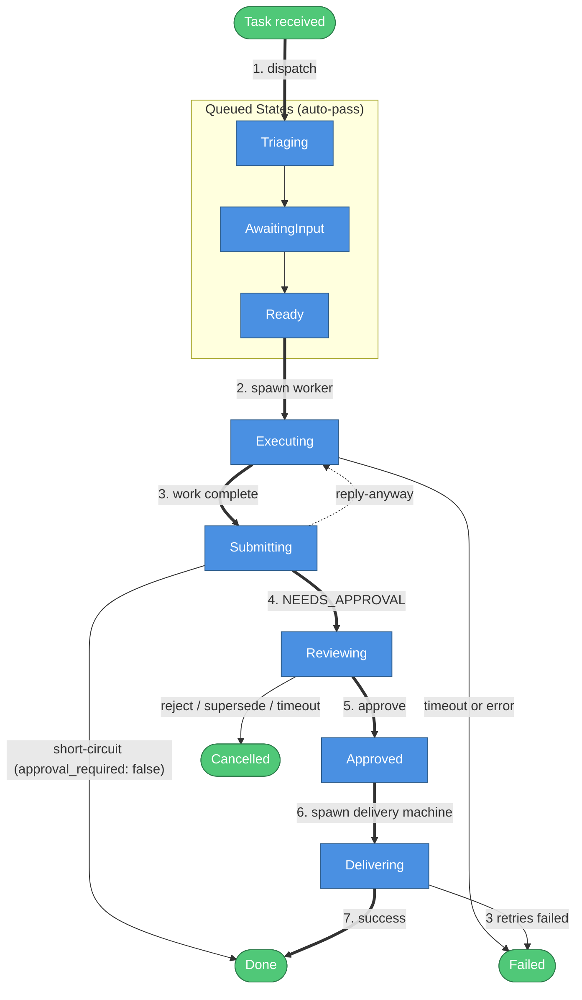
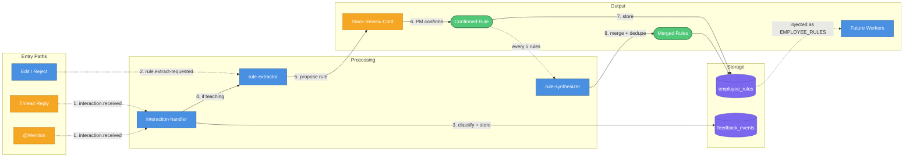
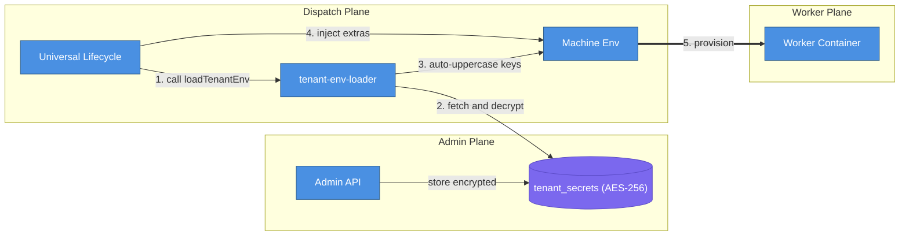
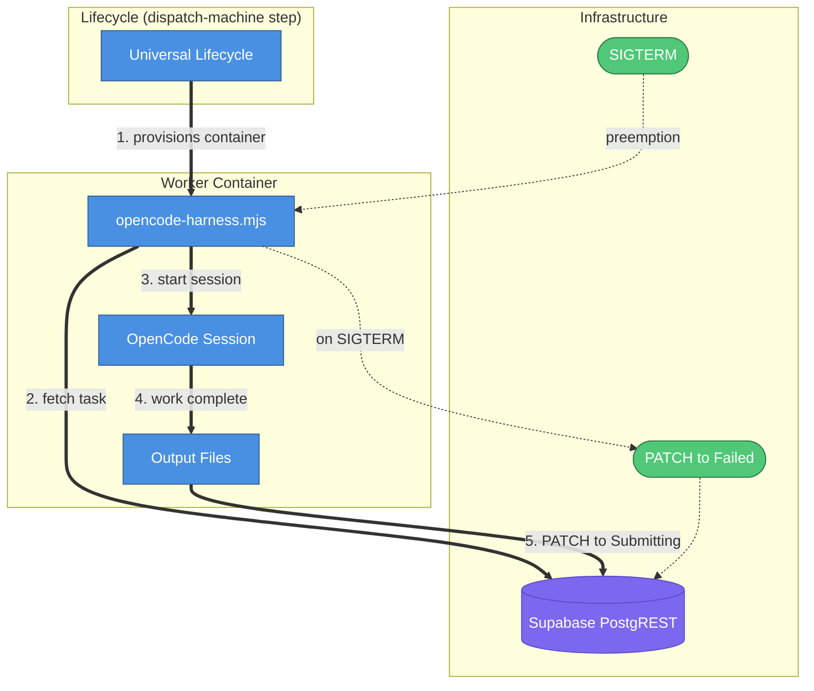

# AI Employee Platform — Current System State

> As of May 14, 2026. Adds code-rotation employee, feedback pipeline redesign (FeedbackEvent + EmployeeRule replacing LearnedRule), four new lock tools, two new admin routes, and WORKER_RUNTIME env var replacing legacy dispatch flags.

## Table of Contents

- [1. Universal Employee Lifecycle](#1-universal-employee-lifecycle)
- [2. Feedback Pipeline](#2-feedback-pipeline)
- [3. Infrastructure Overview](#3-infrastructure-overview)
- [4. Tenant and Secrets Architecture](#4-tenant-and-secrets-architecture)
- [5. Worker and Harness Internals](#5-worker-and-harness-internals)

---

## Overview

The AI Employee Platform deploys autonomous AI agents ("digital employees"), each with a single job. Every employee follows the same lifecycle, uses the same infrastructure (Inngest orchestration, Supabase state, Fly.io runtime), and is defined by a declarative archetype config. What changes per employee: triggers, tools, knowledge base, model, and approval gates.

**Active employees** (as of May 14, 2026):

| Employee                | Trigger                                                  | Approval                      | Archetype slug                      |
| ----------------------- | -------------------------------------------------------- | ----------------------------- | ----------------------------------- |
| Summarizer (Papi Chulo) | External cron via cron-job.org                           | Required (24h timeout)        | `daily-summarizer`                  |
| Guest-Messaging         | Hostfully `NEW_INBOX_MESSAGE` webhook + 15-min poll cron | Required (24h timeout)        | `guest-messaging`                   |
| Code-Rotation           | Manual via admin API                                     | Not required (auto-completes) | `code-rotation`                     |
| Engineering             | Jira webhook                                             | Required                      | `engineering` (deprecated, on hold) |

**Approved LLM models** (only these two — any other reference is a bug):

| Model            | ID                           | Purpose                                                     |
| ---------------- | ---------------------------- | ----------------------------------------------------------- |
| MiniMax M2.7     | `minimax/minimax-m2.7`       | All employee execution work                                 |
| Claude Haiku 4.5 | `anthropic/claude-haiku-4-5` | Classification, rule extraction, synthesis, acknowledgments |

**Key changes since April 29, 2026 snapshot**:

- Code-rotation employee added as the fourth active archetype (`approval_required: false`, fully automated)
- Feedback pipeline redesigned: `LearnedRule` table dropped; replaced by `FeedbackEvent` (audit) and `EmployeeRule` (rules with confirmation status)
- `EMPLOYEE_RULES` and `EMPLOYEE_KNOWLEDGE` env vars replace the old `LEARNED_RULES_CONTEXT` var
- `WORKER_RUNTIME` env var replaces the deprecated `USE_LOCAL_DOCKER` and `USE_FLY_HYBRID` flags
- Four new lock tools added to `src/worker-tools/locks/` (diagnose-access, hostfully-door-code, plus two others)
- Two new admin route files: `admin-kb.ts` (knowledge base CRUD) and `admin-property-locks.ts` (Sifely lock mapping)
- Daily-summarizer cron moved to external cron-job.org; Inngest function deregistered
- `employee/rule-synthesizer` Inngest function added (new in this period)
- `trigger/reviewing-watchdog` cron interval changed from `*/10 * * * *` to `*/15 * * * *`

---

## 1. Universal Employee Lifecycle

Every employee follows the same Inngest-driven state machine regardless of trigger source or deliverable type. The lifecycle is defined in `src/inngest/employee-lifecycle.ts` and handles all transitions from task creation through delivery. Three states (Triaging, AwaitingInput, Ready) are auto-pass: they transit immediately without blocking. The approval gate is controlled per-archetype via `risk_model.approval_required`.

**Flow Walkthrough**

| #   | What happens           | Details                                                                                                                                                                                       |
| --- | ---------------------- | --------------------------------------------------------------------------------------------------------------------------------------------------------------------------------------------- |
| 1   | Dispatch               | `employee/task.dispatched` event triggers the lifecycle. Task moves through Triaging, AwaitingInput, and Ready automatically with no blocking waits.                                          |
| 2   | Spawn worker           | Lifecycle provisions a Fly.io machine (or local Docker container) running `opencode-harness.mjs`. Injects `EMPLOYEE_RULES` and `EMPLOYEE_KNOWLEDGE` from confirmed rules and knowledge bases. |
| 3   | Work complete          | OpenCode session finishes. Harness PATCHes task to Submitting via PostgREST and writes output files to `/tmp/`.                                                                               |
| 4   | Needs approval         | Lifecycle reads the worker output and routes to Reviewing. If `approval_required: false`, short-circuits directly to Done. If `NO_ACTION_NEEDED`, waits up to 24 hours then auto-completes.   |
| 5   | Approve                | PM clicks Approve in Slack. `employee/approval.received` event fires. Idempotency check confirms task is still in Reviewing before proceeding.                                                |
| 6   | Spawn delivery machine | A second Fly.io machine runs with `EMPLOYEE_PHASE=delivery` and the archetype's `delivery_instructions`. No inline delivery logic in the lifecycle.                                           |
| 7   | Success                | Delivery machine posts the deliverable to its destination. Task marked Done. Both the approval card and the original notification message are updated to reflect the final state.             |

**Terminal states**: `Done` is the success terminal. `Failed` covers machine poll timeout (30 minutes), unhandled errors, and SIGTERM preemption by Fly.io. `Cancelled` covers PM rejection, task superseding (a newer task for the same lead arrives while the current one is in Reviewing), and 24-hour approval timeout. Every terminal state updates both the original "Task received" notification message and the approval card (if one exists) to reflect the final outcome. Messages are never left frozen at a processing state.

**Delivery mechanism**: Approved tasks always spawn a second Fly.io machine with `EMPLOYEE_PHASE=delivery`. The lifecycle does not post deliverables inline. The delivery machine reads the output contract from the first run and executes the archetype's `delivery_instructions`. Up to 3 retries are attempted before the task moves to Failed. The `reviewing-watchdog` cron catches tasks stuck in Reviewing with no `pending_approvals` row for more than 30 minutes and marks them Failed.

**Message superseding**: When a new task arrives for the same lead while an existing task is in Reviewing, the lifecycle cancels the older task and posts a "superseded" update to its Slack approval card. The new task proceeds normally. This prevents stale replies from being sent after the conversation has moved on. Superseding is detected by checking for an existing task in Reviewing with the same `external_id` prefix.

**Concurrency**: Each archetype can set a `concurrency_limit`. Guest-messaging uses a limit of 5 (one per active lead). Code-rotation uses a limit of 1 (prevents overlapping rotations). The daily-summarizer uses a limit of 1 per tenant (duplicate prevention via `external_id: summary-{YYYY-MM-DD}`).

---

## 2. Feedback Pipeline

Thread replies and @mentions on employee Slack messages feed a three-path pipeline that extracts behavioral rules, stores them, and synthesizes them into consolidated guidance. Rules are injected into future worker runs via the `EMPLOYEE_RULES` environment variable. The pipeline uses `anthropic/claude-haiku-4-5` for all classification and extraction steps.

**Flow Walkthrough**

| #   | What happens         | Details                                                                                                                                                                                                                      |
| --- | -------------------- | ---------------------------------------------------------------------------------------------------------------------------------------------------------------------------------------------------------------------------- |
| 1   | Interaction received | Slack Bolt fires `employee/interaction.received` for thread replies and @mentions. Source field distinguishes the two paths.                                                                                                 |
| 2   | Direct extraction    | Lifecycle emits `employee/rule.extract-requested` directly when a PM edits an approval card or rejects with a reason. Bypasses the interaction handler.                                                                      |
| 3   | Classify and store   | `interaction-handler` resolves the archetype, classifies intent via `claude-haiku-4-5`, writes a `feedback_events` audit row, and sends an in-thread acknowledgment.                                                         |
| 4   | Route to extractor   | If intent is correction or teaching, handler emits `employee/rule.extract-requested`. Questions and general feedback are stored but do not trigger extraction.                                                               |
| 5   | Propose rule         | `rule-extractor` calls `claude-haiku-4-5` to extract a concrete behavioral rule, stores it as proposed in `employee_rules`, and posts a Slack review card for PM confirmation.                                               |
| 6   | PM confirms          | PM clicks Confirm on the Slack card. `employee/rule.confirmed` fires.                                                                                                                                                        |
| 7   | Store confirmed rule | Rule status updated to `confirmed` in `employee_rules`. If confirmed count for the archetype hits a multiple of 5, `employee/rule.synthesize-requested` fires.                                                               |
| 8   | Synthesize           | `rule-synthesizer` loads all confirmed rules, calls `claude-haiku-4-5` to detect overlaps and contradictions, proposes merged rules, and posts Slack cards for PM review. Merged rules are written back to `employee_rules`. |

**Rule injection**: At the `dispatch-machine` step, the lifecycle fetches all confirmed `employee_rules` for the archetype (capped at 8,000 characters) and all `knowledge_bases` rows (capped at 32,000 characters). Both are injected as `EMPLOYEE_RULES` and `EMPLOYEE_KNOWLEDGE` environment variables into the worker machine, prepended to the system prompt by the harness. This means every future run benefits from accumulated PM feedback without any code changes.

**Key constants** (exported from `employee-lifecycle.ts`):

| Constant                       | Value  | Purpose                                              |
| ------------------------------ | ------ | ---------------------------------------------------- |
| `SYNTHESIS_THRESHOLD`          | 5      | Confirmed rules per archetype before synthesis fires |
| `MAX_EMPLOYEE_RULES_CHARS`     | 8,000  | Cap on confirmed rules env var size                  |
| `MAX_EMPLOYEE_KNOWLEDGE_CHARS` | 32,000 | Cap on knowledge base env var size                   |

---

## 3. Infrastructure Overview

The platform runs five active Inngest functions, an Express gateway with 18 routes across 11 categories, five worker-tool directories with 19 total tools, and a 24-model Prisma schema. All components are tenant-scoped. The daily-summarizer cron moved to an external cron-job.org job in May 2026 and is no longer an Inngest function. The `guest-message-poll` Inngest function is deregistered (source preserved at `src/inngest/triggers/guest-message-poll.ts`) and not running; the polling behavior is handled by an external cron calling the admin trigger endpoint.

### Inngest Functions

| Function ID                    | Trigger                                     | Purpose                                                                           |
| ------------------------------ | ------------------------------------------- | --------------------------------------------------------------------------------- |
| `employee/universal-lifecycle` | event: `employee/task.dispatched`           | Drives all employee states from Received through Done or Failed                   |
| `employee/interaction-handler` | event: `employee/interaction.received`      | Classifies thread replies and @mentions; routes corrections to rule extraction    |
| `employee/rule-extractor`      | event: `employee/rule.extract-requested`    | Extracts a behavioral rule from PM feedback; posts Slack review card              |
| `employee/rule-synthesizer`    | event: `employee/rule.synthesize-requested` | Merges overlapping confirmed rules; flags contradictions                          |
| `trigger/reviewing-watchdog`   | cron: `*/15 * * * *`                        | Finds tasks stuck in Reviewing with no pending approval for >30 min; marks Failed |

### Gateway Route Categories

| Category              | Routes                                                      | Purpose                                            |
| --------------------- | ----------------------------------------------------------- | -------------------------------------------------- |
| Health                | `GET /health`                                               | Liveness check                                     |
| Webhooks              | `/webhooks/jira`, `/webhooks/github`, `/webhooks/hostfully` | Inbound event receivers for external systems       |
| Slack OAuth           | `/slack/install`, `/slack/oauth_callback`                   | Per-tenant Slack authorization flow                |
| Admin: Tenants        | CRUD + soft-delete/restore                                  | Tenant lifecycle management                        |
| Admin: Secrets        | GET/PUT/DELETE per key                                      | Per-tenant AES-256-GCM encrypted secret management |
| Admin: Config         | GET/PATCH                                                   | Tenant config deep-merge updates                   |
| Admin: Projects       | CRUD                                                        | Project registry (engineering employee)            |
| Admin: Employees      | `POST .../employees/:slug/trigger`                          | Manual employee trigger with dry-run support       |
| Admin: Tasks          | `GET .../tasks/:id`                                         | Tenant-scoped task status                          |
| Admin: Knowledge Base | CRUD                                                        | Tenant-scoped knowledge base entry management      |
| Admin: Property Locks | CRUD                                                        | Sifely lock to Hostfully property mapping          |

### Worker Tools

| Directory         | Tool count | Purpose                                                                                                  |
| ----------------- | ---------- | -------------------------------------------------------------------------------------------------------- |
| `slack/`          | 3          | Slack messaging, channel reads, guest approval cards                                                     |
| `hostfully/`      | 8          | Hostfully PMS: messages, properties, reservations, reviews, send, webhook registration                   |
| `locks/`          | 6          | Sifely smart lock management: list, create, update, delete passcodes; code generation; property rotation |
| `knowledge_base/` | 1          | Tenant-scoped knowledge base search                                                                      |
| `platform/`       | 1          | System event logging                                                                                     |

### Database Models

| Group                 | Models                                                                                                                   | Count |
| --------------------- | ------------------------------------------------------------------------------------------------------------------------ | ----- |
| MVP-Active            | Task, Execution, Deliverable, ValidationRun, Project, TaskStatusLog, Department                                          | 7     |
| Forward-Compatibility | Archetype, KnowledgeBase, KnowledgeBaseEntry, RiskModel, CrossDeptTrigger, AgentVersion, Clarification, Review, AuditLog | 9     |
| Multi-Tenancy         | Tenant, TenantIntegration, SystemEvent, TenantSecret, PendingApproval                                                    | 5     |
| Feedback and Rules    | PropertyLock, FeedbackEvent, EmployeeRule                                                                                | 3     |

> `LearnedRule` was dropped in the May 2026 migration (20260512054756) and replaced by `FeedbackEvent` (audit trail for every PM interaction) and `EmployeeRule` (extracted behavioral rules with confirmation status and synthesis tracking).

### Key Environment Variables

| Variable               | Source                | Purpose                                                           |
| ---------------------- | --------------------- | ----------------------------------------------------------------- |
| `WORKER_RUNTIME`       | `.env`                | `docker` (default) or `fly` — controls worker dispatch mode       |
| `TUNNEL_URL`           | `.env`                | PostgREST tunnel URL for Fly.io workers to reach local Supabase   |
| `FLY_WORKER_APP`       | `.env`                | Fly.io app name for all worker machines                           |
| `WORKER_VM_SIZE`       | `.env`                | Default VM size; overridden per-archetype by `vm_size` field      |
| `ENCRYPTION_KEY`       | `.env`                | AES-256-GCM key for tenant secrets (validated at gateway startup) |
| `SERVICE_TOKEN`        | `.env`                | Machine-to-machine auth for all `/admin/*` endpoints              |
| `SLACK_APP_TOKEN`      | `.env`                | `xapp-...` Socket Mode token for Bolt WebSocket connection        |
| `SLACK_SIGNING_SECRET` | `.env`                | Verifies Slack interaction webhook payloads                       |
| `EMPLOYEE_RULES`       | injected by lifecycle | Confirmed behavioral rules for the archetype (cap: 8,000 chars)   |
| `EMPLOYEE_KNOWLEDGE`   | injected by lifecycle | Knowledge base content for the archetype (cap: 32,000 chars)      |
| `EMPLOYEE_PHASE`       | injected by lifecycle | `delivery` on second machine run; absent on first run             |

### Infrastructure Stack

| Layer             | Technology                            | Notes                                                   |
| ----------------- | ------------------------------------- | ------------------------------------------------------- |
| HTTP Gateway      | Express + TypeScript                  | Webhook receiver, Inngest host, Slack Bolt, admin API   |
| Event Queue       | Inngest (self-hosted dev, cloud prod) | Durable workflows, retries, cron scheduling             |
| Database          | PostgreSQL via Prisma                 | `ai_employee` database on Docker Compose                |
| REST API          | Supabase PostgREST                    | Used by worker containers (no direct Prisma in workers) |
| Worker Runtime    | Fly.io machines or local Docker       | Controlled by `WORKER_RUNTIME` env var                  |
| AI Execution      | OpenCode `1.14.31`                    | Pinned version; `autoupdate: false` in baked config     |
| Secret Storage    | AES-256-GCM in PostgreSQL             | Per-tenant, decrypted at dispatch time                  |
| Slack Integration | Socket Mode (Bolt)                    | No public Interactivity URL needed                      |

---

## 4. Tenant and Secrets Architecture

Every tenant has its own encrypted secret store. The `tenant-env-loader` service fetches and decrypts all secrets at dispatch time, auto-uppercases the keys, and injects them into the worker machine environment. No whitelist is needed: any key stored in `tenant_secrets` becomes an environment variable automatically.

**Flow Walkthrough**

| #   | What happens        | Details                                                                                                                                                                                                                                                                                                 |
| --- | ------------------- | ------------------------------------------------------------------------------------------------------------------------------------------------------------------------------------------------------------------------------------------------------------------------------------------------------- |
| 1   | Call loadTenantEnv  | Lifecycle calls `loadTenantEnv(tenantId, archetypeId)` during the `dispatch-machine` step. Also reads platform vars from `process.env` (DATABASE_URL, SUPABASE_URL, OPENROUTER_API_KEY, etc.).                                                                                                          |
| 2   | Fetch and decrypt   | Loader fetches all `tenant_secrets` rows for the tenant and decrypts each value with AES-256-GCM.                                                                                                                                                                                                       |
| 3   | Auto-uppercase keys | Every secret key is uppercased: `hostfully_api_key` becomes `HOSTFULLY_API_KEY`. No whitelist. Any stored key is injected.                                                                                                                                                                              |
| 4   | Inject extras       | Lifecycle adds `TASK_ID`, `TENANT_ID`, `EMPLOYEE_RULES`, `EMPLOYEE_KNOWLEDGE`, raw event fields (e.g. `LEAD_UID`, `THREAD_UID`), and `NOTIFY_MSG_TS`. Delivery runs also receive `EMPLOYEE_PHASE=delivery`. Notification channel: archetype `notification_channel` takes precedence over tenant config. |
| 5   | Provision           | The complete environment is passed to the Fly.io machine (or local Docker container) at creation time. Fly.io app-level secrets are NOT inherited by spawned machines.                                                                                                                                  |

**Slack OAuth per tenant**: Each tenant completes a separate Slack OAuth flow at `/slack/install?tenant={id}`. The resulting bot token is stored as a `tenant_secrets` row and a `tenant_integrations` row (provider: `slack`, external_id: Slack team ID). The `TenantInstallationStore` looks up the token by team ID for Bolt authorization. A database reset destroys OAuth connections; re-authorization is required after any reset. The gateway uses Socket Mode for interactive button handling: no public Interactivity Request URL is needed. Approve and reject handlers use `ack({ replace_original: true, blocks: [...] })` to embed the processing state directly in the Socket Mode ack envelope, eliminating any flash of the unprocessed card.

**Slack message standards**: Every message sent to Slack must include a trailing `context` block with the task ID as small gray metadata. When a human takes an action (approve, reject), the actor is displayed using `<@userId>` mrkdwn syntax. Every task gets one primary top-level Slack message per channel; all status progressions use `chat.update` (replace in place) or `thread_ts` (thread replies). The `ts` return value from every `postMessage` call must be captured and stored for later updates.

---

## 5. Worker and Harness Internals

The OpenCode harness (`src/workers/opencode-harness.mts`) is the single entry point for all worker containers. It fetches the task, builds the environment, starts an OpenCode session, polls for completion, and handles the output contract. The harness is pinned to OpenCode `1.14.31` (version `1.14.33` has a confirmed 6-second exit regression and must not be used). The Fly.io CMD is `["node", "/app/dist/workers/opencode-harness.mjs"]`. The harness is compiled from TypeScript to `dist/workers/opencode-harness.mjs` during the Docker build.

**Flow Walkthrough**

| #   | What happens        | Details                                                                                                                                                                                                                       |
| --- | ------------------- | ----------------------------------------------------------------------------------------------------------------------------------------------------------------------------------------------------------------------------- |
| 1   | Provision container | Lifecycle creates a Fly.io machine (or local Docker container) with the full tenant environment. `WORKER_RUNTIME=fly` uses Fly.io; `WORKER_RUNTIME=docker` (default) uses local Docker.                                       |
| 2   | Fetch task          | Harness calls PostgREST to load the task record. If the task is not found, the process exits immediately and OpenCode never starts. Direct container tests with fake task IDs do not verify OpenCode startup.                 |
| 3   | Start session       | Harness launches `opencode run --session-id {taskId}` with the archetype's `instructions`, `agents_md`, and available shell tools injected. `autoupdate: false` is set in the baked config to prevent self-update on startup. |
| 4   | Work complete       | OpenCode session finishes. Harness polls task status every 15 seconds (max 120 polls = 30 minutes).                                                                                                                           |
| 5   | PATCH to Submitting | Harness reads output files and PATCHes the task to Submitting via PostgREST. Writes a `task_status_log` entry for the transition. The insert is try/catch wrapped and non-fatal.                                              |

**Output contract**: The worker writes two files to `/tmp/`: `summary.txt` (deliverable content) and `approval-message.json` (Slack message metadata: `ts` and `channel`). Absence of both files is a hard failure. Either file alone is sufficient to proceed. The harness checks for both after the OpenCode session exits and before PATCHing to Submitting. The lifecycle reads `approval-message.json` to know which Slack message to update at terminal states.

**SIGTERM handling**: The harness registers a `SIGTERM` handler on startup. When Fly.io preempts the machine, the handler PATCHes the task to `Failed` via PostgREST and exits. This is why tasks sometimes appear as Failed after machine preemption with no other error logged. The `task_status_log` insert is wrapped in try/catch and non-fatal: a PostgREST connectivity failure will not block `process.exit`.

**Rebuild requirements**: Any modification to files under `src/workers/` (the OpenCode harness) requires rebuilding the Docker image before the fix takes effect. Files under `src/worker-tools/` are bind-mounted into the container in local Docker mode (`WORKER_RUNTIME=docker`) and are available immediately without a rebuild. For Fly.io deploys, all changes require a new image push.

**Feedback context**: The harness optionally prepends `EMPLOYEE_RULES` and `EMPLOYEE_KNOWLEDGE` (env vars injected by the lifecycle from confirmed rules and knowledge bases) to the system prompt. This allows historical PM feedback to influence future runs without any code changes to the harness or archetype.

**Cost circuit breaker**: The `call-llm` shared library enforces a $50/day cost limit per department. Calls that would exceed the limit are rejected before reaching the LLM provider. The limit is configurable via `COST_LIMIT_USD_PER_DEPT_PER_DAY`.

**Model enforcement**: The `call-llm` library validates the model ID against the approved list before every call. Any reference to a non-approved model throws at runtime. This applies to production code, seed data, default fallbacks, environment variable examples, and test fixtures.

---

## Approved LLM Models

Only two models are approved for use in this codebase. Any other model reference is a bug.

| Model            | ID                           | Purpose                                                                                                  |
| ---------------- | ---------------------------- | -------------------------------------------------------------------------------------------------------- |
| MiniMax M2.7     | `minimax/minimax-m2.7`       | All employee execution: code generation, summaries, guest replies, code rotation                         |
| Claude Haiku 4.5 | `anthropic/claude-haiku-4-5` | Verification and classification only: intent classification, rule extraction, synthesis, acknowledgments |

---

## Reference Documents

Read these on demand when you need deeper context.

| Document                                                           | When to read                                                                             |
| ------------------------------------------------------------------ | ---------------------------------------------------------------------------------------- |
| `docs/architecture/2026-04-14-0104-full-system-vision.md`          | Architecture, archetypes, lifecycle, event routing, multi-tenancy                        |
| `docs/guides/2026-05-04-1645-adding-a-shell-tool.md`               | Adding a new shell tool: file structure, CLI pattern, mock fixtures, Docker              |
| `docs/guides/2026-05-12-1731-api-integration-practices.md`         | Adding or debugging external API integrations: response envelopes, safe casting          |
| `docs/testing/2026-05-10-1609-slack-ux-e2e-test-guide.md`          | Slack UX E2E test guide: 6 scenarios (approve, reject, edit, supersede, expiry, failure) |
| `docs/testing/2026-05-11-1854-feedback-pipeline-e2e-test-guide.md` | Feedback pipeline E2E: rule extraction, injection, consolidation, synthesis              |
| `docs/guides/2026-04-16-1655-multi-tenancy-guide.md`               | Provisioning tenants, Slack OAuth, per-tenant secrets, verification                      |
| `docs/planning/2026-04-21-2202-phase1-story-map.md`                | Phase 1 story map: 58 stories across 5 releases                                          |
