# Execution Flow: daily-real-estate-inspiration-2-copy

**Question answered:** How does the inspirational message travel from trigger to Slack, through both the execution and delivery containers?

```mermaid
flowchart TD
    TRIGGER(["POST /trigger"]):::event

    subgraph ExecPhase["Execution Container"]
        HE["Harness reads agents-execution.md - writes to /app/AGENTS.md"]:::service
        OCE["OpenCode - follows execution-instructions tag in AGENTS.md"]:::service
        DRAFT[("/tmp/draft.txt - composed message")]:::storage
        SUMME[("/tmp/summary.txt - JSON with summary, classification, draft")]:::storage
    end

    DELIV[("Deliverable in DB - JSON with draft field")]:::storage

    subgraph DelivPhase["Delivery Container"]
        HD["Harness reads agents-execution.md - writes to /app/AGENTS.md"]:::service
        OCD["OpenCode - follows delivery-instructions tag in AGENTS.md"]:::service
        DDRAFT[("/tmp/delivery-draft.txt - plain text message")]:::storage
    end

    SLACK(["Slack - victor-tests channel"]):::external
    DONE(["Task Done"]):::event

    TRIGGER      ==>|"1. Triaging then AwaitingInput then Ready then Executing"| HE
    HE           ==>|"2. OpenCode reads /app/AGENTS.md as context"| OCE
    OCE          ==>|"3. compose message - write to file"| DRAFT
    DRAFT        ==>|"4. submit-output auto-reads /tmp/draft.txt"| SUMME
    SUMME        ==>|"5. harness reads summary.txt - Validating then Submitting - stores deliverable"| DELIV
    DELIV        ==>|"6. approval_required false - launch delivery container - Delivering"| HD
    HD           ==>|"7. prompt includes approved content JSON"| OCD
    OCD          ==>|"8. parse JSON, extract draft - write to file"| DDRAFT
    DDRAFT       ==>|"9. post-message.ts"| SLACK
    SLACK        ==>|"10. submit-output - harness marks task Done"| DONE

    classDef service  fill:#4A90E2,stroke:#2E5C8A,color:#fff
    classDef storage  fill:#7B68EE,stroke:#5B4BC7,color:#fff
    classDef external fill:#F5A623,stroke:#C4841A,color:#fff
    classDef event    fill:#50C878,stroke:#2D7A4A,color:#fff
```

## Flow Walkthrough

| #   | What happens                                 | Details                                                                                                                                                                                                                                                                                                                                                                                                                                                                                                                                                                                                                                                       | Notes |
| --- | -------------------------------------------- | ------------------------------------------------------------------------------------------------------------------------------------------------------------------------------------------------------------------------------------------------------------------------------------------------------------------------------------------------------------------------------------------------------------------------------------------------------------------------------------------------------------------------------------------------------------------------------------------------------------------------------------------------------------- | ----- |
| 1   | Launch execution container                   | Inngest lifecycle provisions a Docker container with `EMPLOYEE_PHASE` unset (execution mode). The task status transitions: Received (initial DB state) → Triaging → AwaitingInput → Ready → Executing. All four transitions happen within milliseconds of one another.                                                                                                                                                                                                                                                                                                                                                                                        |       |
| 2   | Inject AGENTS.md                             | Harness detects `role_name === 'daily-real-estate-inspiration-2-copy'`, reads `agents-execution.md` from `/app/experimental/` inside the image, and writes it verbatim to `/app/AGENTS.md` — bypassing the normal 6-layer assembly (no tenant config, no platform rules, no learned rules injected).                                                                                                                                                                                                                                                                                                                                                          |       |
| 3   | OpenCode session runs                        | The prompt sent to OpenCode is: `TODAY: [date] \| EPOCH_MS: [ms]` + `"Follow the instructions in <execution-instructions> within the AGENTS.md file"` + `Task ID: <uuid>`. No platform-injected submit-output reminder — the LLM is expected to call submit-output exactly as directed by the `<execution-instructions>` tag in AGENTS.md. OpenCode reads `/app/AGENTS.md` as its context window and executes the steps defined there (select quote → personalize → compose → write to `/tmp/draft.txt`).                                                                                                                                                     |       |
| 4   | Write composed message                       | Worker writes the full inspirational message as plain text to `/tmp/draft.txt`.                                                                                                                                                                                                                                                                                                                                                                                                                                                                                                                                                                               |       |
| 5   | submit-output auto-reads draft               | Worker runs `tsx /tools/platform/submit-output.ts --summary "Daily inspiration message composed" --classification "NO_ACTION_NEEDED"`. Because `/tmp/draft.txt` exists and no `--draft` flag was passed, submit-output reads it automatically. Output written to `/tmp/summary.txt`: `{"summary":"Daily inspiration message composed","classification":"NO_ACTION_NEEDED","draft":"<the full message>"}`.                                                                                                                                                                                                                                                     |       |
| 6   | Harness stores deliverable                   | Harness reads `/tmp/summary.txt`, extracts the JSON, and writes it as a `deliverables` row in PostgreSQL via PostgREST. Task status transitions: Validating → Submitting. The Validating state is a real lifecycle state that occurs between Executing and Submitting — the harness passes through it immediately before marking the task Submitting and writing the deliverable record.                                                                                                                                                                                                                                                                      |       |
| 7   | Auto-launch delivery container               | Since `approval_required: false`, Inngest skips the human approval gate and immediately provisions a second Docker container with `EMPLOYEE_PHASE=delivery`. No Slack approval card is sent. Task status: Delivering.                                                                                                                                                                                                                                                                                                                                                                                                                                         |       |
| 8   | Inject delivery AGENTS.md + approved content | Harness detects `role_name === 'daily-real-estate-inspiration-2-copy'`, reads `agents-execution.md` from `/app/experimental/`, writes it verbatim to `/app/AGENTS.md`. The prompt sent to OpenCode: `"Follow the instructions in <delivery-instructions> within the AGENTS.md file"` + `"\n\n--- APPROVED CONTENT ---\n"` + the deliverable JSON from step 5 + `"\n--- END APPROVED CONTENT ---\n\nTask ID: <uuid>"`.                                                                                                                                                                                                                                         |       |
| 9   | Parse JSON, extract draft, write to file     | OpenCode follows `<delivery-instructions>`: parses the JSON block after `--- APPROVED CONTENT ---`, extracts the `"draft"` string, and writes it as plain text to `/tmp/delivery-draft.txt`. This is now the exact message the execution worker composed.                                                                                                                                                                                                                                                                                                                                                                                                     |       |
| 10  | Post to Slack + confirm Done                 | Worker runs `tsx /tools/slack/post-message.ts --channel "$NOTIFICATION_CHANNEL" --text-file /tmp/delivery-draft.txt` → message appears in #victor-tests. Worker then runs `tsx /tools/platform/submit-output.ts --summary "Posted daily inspiration to Slack" --classification "NO_ACTION_NEEDED"` as directed by step 4 of `<delivery-instructions>`. Harness reads `/tmp/summary.txt`, confirms delivery, marks task Done. Note: in the first observed run the LLM called submit-output a second time spontaneously ("Delivered daily inspiration to Slack as per approved content") — this is LLM-driven behavior, not a platform injection, and may vary. |       |

## Key data handoff: how the draft moves between containers

The draft text never travels directly between containers. It flows through the database as JSON:

1. Execution worker writes plain text → `/tmp/draft.txt`
2. `submit-output` wraps it: `{"draft": "<plain text>"}` → `/tmp/summary.txt`
3. Harness stores that JSON as the deliverable record in PostgreSQL
4. Delivery container retrieves the deliverable JSON → receives it in the prompt as `--- APPROVED CONTENT ---`
5. Delivery worker unwraps it: extracts `"draft"` → `/tmp/delivery-draft.txt` (plain text again)
6. `post-message.ts` reads that file and posts it to Slack

## Timing: idle timeout per container

Each container takes longer to complete than the LLM work alone. When the session manager first checks the OpenCode session, if it finds it already idle (which can happen if the LLM responds very quickly), it schedules a **deferred idle check ~120 seconds later** before confirming completion. This means:

- The LLM finishes its work in ~35 seconds (execution) or ~6 seconds (delivery)
- The harness waits up to ~120 seconds before detecting the session as stable-idle and proceeding
- Total wall-clock time from trigger to Done is ~5 minutes, even though the actual LLM work is under a minute

This is expected behavior — the deferred check prevents the harness from treating a temporarily idle session (mid-tool-call) as complete.

## Safety net: recovery nudge

If the session goes idle and `/tmp/summary.txt` was never written (meaning the LLM forgot to call submit-output), the harness sends one additional message to the still-running session:

> "You may still have remaining delivery steps to complete. Finish ALL your remaining steps first, then run this as the very last thing: `tsx /tools/platform/submit-output.ts --summary "..." --classification "NO_ACTION_NEEDED"`"

This is the only remaining platform-injected submit-output instruction. It only fires if the LLM skipped submit-output entirely — it is not part of the normal happy path.
